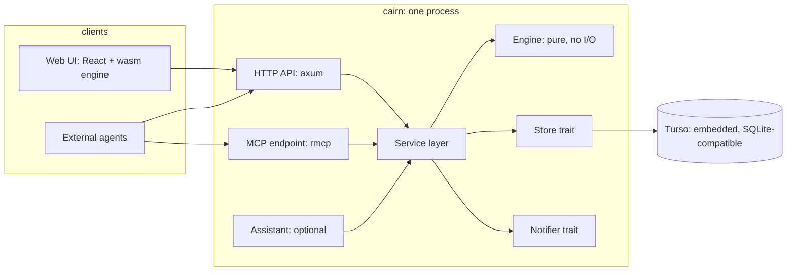
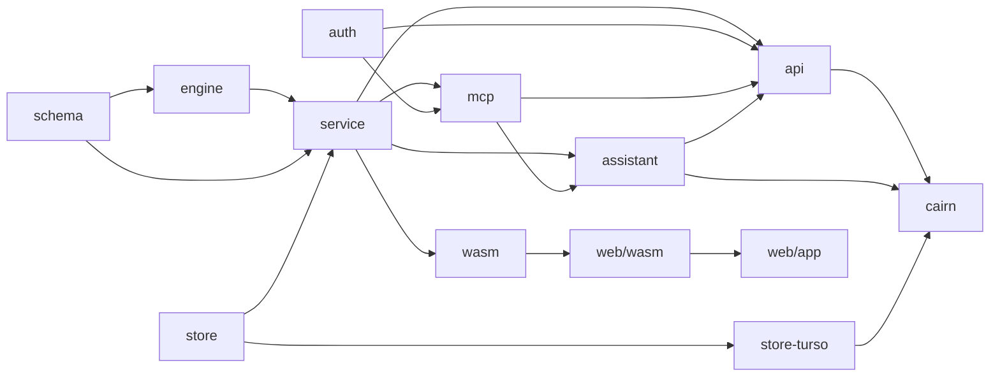
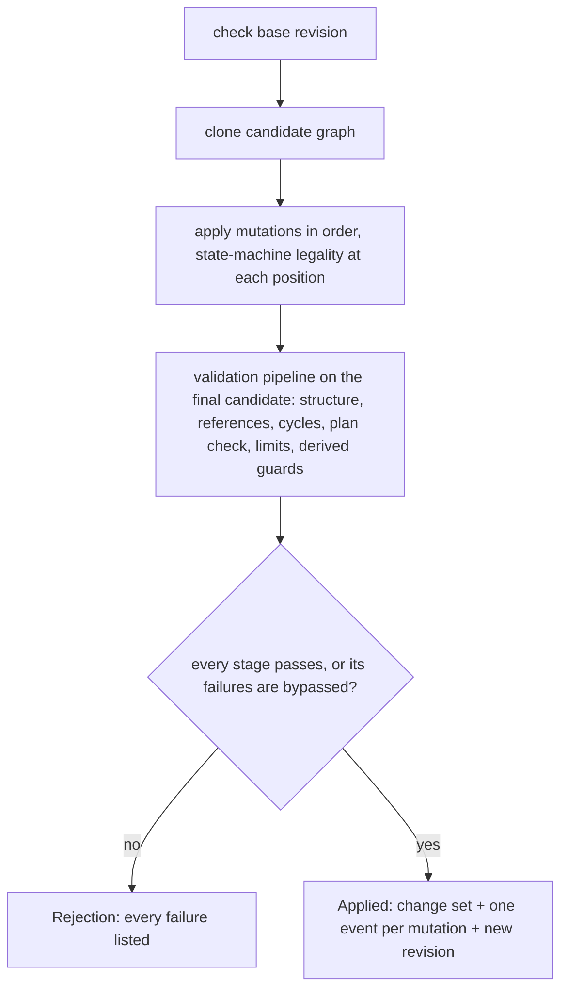

# Cairn: Architecture

Read `PRD.md` first. This document decides *how* the PRD is built and nothing about *what* is built. Where a PRD requirement forces a design choice, the requirement id is cited so the link is checkable.

## Summary

Cairn is one Rust binary around a pure engine. The **engine** holds every rule the PRD states - graph model, patches, invariants, derived state, the date network, projections, upgrade merge, and the file format - as I/O-free functions over in-memory graphs. The **shell** wraps it with storage, an HTTP API, an MCP endpoint, auth, the optional assistant, and the embedded web UI. The same engine compiles to wasm, so the browser holds a full journey and runs zoom, trace, filters, and proposal previews locally, and the UI can run entirely in-browser against an in-memory store for development, demos, and end-to-end tests.



The decisions that shape everything else:

1. **Engine is pure, shell is plumbing.** No storage, HTTP, or clock inside the engine; today, timezone, rank constants, and the viewer are inputs (D6, J3).
2. **Whole domain in memory.** Every read loads one journey or route in full and derives once; every write validates a full candidate graph. This rests on journeys being small and is enforced, not assumed (see Assumptions).
3. **State and events, one transaction.** The patch applier is the only writer. It writes row deltas and one event per mutation together, or nothing (A17, J1, J2).
4. **One engine, two hosts.** The server and the browser run the same crate. The browser is a first-class host, not a mock.
5. **Pluggable edges.** Storage, auth, live-update notification, and the assistant provider are traits assembled once in a composition root; deployments and the browser host differ only there.

## Assumptions and limits

- **Journeys are small.** Tens to a few hundred nodes typically, a deployment of thousands of nodes across hundreds of journeys (non-functional requirements), and single-digit megabytes serialized. Consequences: whole-domain load per read, in-memory derive over the whole graph, the full journey sent to the browser in one response, no partial-graph writes, and no pagination on graph reads other than the agent snapshot (I3). Validation rejects a patch that would take a graph past a hard-coded node limit (2,000; see `PRACTICES.md`) so the assumption is a limit, not a hope. Beyond it, the changes would be incremental derive and paged graph reads; nothing in the storage schema would need to change.
- **One deployment is one trust boundary** (H4). No RBAC, no per-journey visibility; every authenticated identity reads and writes everything.
- **One process.** API, MCP, assistant, and UI serve from one binary over one embedded database file. Several instances, and the shared database they would need, are `Later`.
- **Calendar days, deployment timezone** (A9). "Today" is computed once per request in the deployment's timezone and passed into the engine; users see the same slack, overdue, and rank. Timestamps on events render in the viewer's local zone; the day model does not.

## Terms

Architecture-scope terms, in addition to the PRD glossary. PRD terms keep their PRD meaning.

| Term | Definition |
|---|---|
| **Engine** | The pure crate: graph model, patch applier, invariants, derive, date network, projections, upgrade merge, file format. No I/O. |
| **Shell** | Everything around the engine: store, service layer, HTTP, MCP, auth, assistant, embedded UI. |
| **Domain** | A patch target as in A17 (a journey, a route with its draft, or the deployment; a segment is a route of kind `segment`), loaded and revision-checked as one unit. A route's published versions are immutable graphs, loaded one at a time by id and never part of its domain load; inserting or upgrading a segment (B13, B14) reads the one or two segment versions it names as inputs, as an upgrade reads its target route version. |
| **Derive** | The one engine pass that computes every D3 field for a loaded journey from stored state and derive inputs. |
| **Derive inputs** | Today, the deployment timezone, the rank constants, the viewer's entities, if any (resolved by the host from the viewer's verified emails, H3; normally one), and the deployment context: the entities with their emails and the entity aliases at a deployment revision, which ownership, "mine", and the owner factor resolve through (E4, E6). Supplied by the host, never read by the engine. |
| **Projection** | A read-only view over a derived journey: snapshot, aggregation level, trace, decision view, timeline, status summary, next list, mine. |
| **Domain document** | A journey's full graph and state, with the derive inputs to derive it (including the deployment context and its revision) and the engine version. Nothing derived is in it: the browser derives it with the wasm engine and runs every projection locally. Proposals are not part of it. |
| **Snapshot** | The I3 projection: a bounded, scoped, paginated view of a journey for agents. Cut from the same derived journey as the domain document. |
| **Change set** | The persistence-neutral result of an accepted patch: entities put and removed by key, the events, the patch id, and the next revision. A `schema` type, so the store depends on `schema` and not the engine; in production only the engine's `apply` produces one, inside `Applied`. Each store maps it to its own rows or records. |
| **Store** | The trait the service layer uses to load a domain, commit a patch result, and run index queries. Backends: Turso and memory. |
| **Notifier** | The trait that announces "domain X is now at revision N" to subscribers. In-process in both hosts. |
| **Composition root** | The one function per host that picks a store, a notifier, auth providers, and an assistant provider and assembles the service. |
| **Capabilities document** | `GET /api/capabilities`: what this host offers (auth providers, assistant, MCP, SSE). The server always serves MCP and SSE; the browser host serves neither. The UI shows and hides features from it. |
| **Host** | Something that assembles the engine with a composition root: the server binary or the browser bundle. |
| **Generated artifacts** | Files derived from Rust types and checked in, only under the generated paths (Generated artifacts): the OpenAPI document, the TypeScript client types, the wasm bindings, the JSON Schema for the file format. |

## Repository layout

One repository, one Cargo workspace plus one npm workspace. Crate and package boundaries are the seams feature briefs cut along.

```
cairn/
  crates/
    engine/        pure domain: model, patch, validate, derive, dates, project, upgrade, format
    wasm/          wasm-bindgen surface for the browser: engine projections and preview for every host; service over the memory store for the in-browser host
    schema/        serde types shared by engine and shell: document, patch, API payloads; JSON Schema export
    store/         Store and Notifier traits; memory backend; the store conformance test suite. No delta types of its own: it persists the change set from schema
    store-turso/   Turso backend (the `turso` crate: Rust, SQLite file format, MVCC)
    service/       service layer: load, call engine, commit; capabilities; composition root types. Runtime-free: no tokio, database driver, or transport dependency, so it builds for wasm32-unknown-unknown
    auth/          AuthProvider trait; dev, oidc, builtin-oauth, tailscale providers; users and identities
    api/           axum endpoints, the generated OpenAPI document, SSE, the Rust client
    mcp/           rmcp server: tools, prompt metadata, instructions
    assistant/     provider trait, tool loop, proposal drafting
    cairn/         the binary: CLI, config, composition root, embedded assets
  web/
    app/           React UI (Vite); React Flow canvas; ELK in a worker
    client/        TypeScript client: generated/ (openapi-typescript + openapi-fetch) plus the hand-written safe-retry and subscription wrapper (H5, H6)
    wasm/          wasm package: generated/ (bindings from crates/wasm) plus the hand-written loader and the derive worker
  instructions/    the shipped agent guide (I4), served by MCP and published as SKILL.md
  fixtures/        2-3 generic seed routes with a journey scenario each (eg: vendor evaluation, hiring loop, product launch), plus one journey with no route
  testbeds/        simulation testbeds (PRACTICES.md, Simulation)
  openapi/         generated OpenAPI document
  schema/          generated JSON Schema for the file format
  decisions/       judgment calls awaiting the user's review, one file each (AGENTS.md)
  docs/            the guide to running a deployment, and the README's pictures
  mise.toml        pinned tools
  mise-tasks/      tasks, one file each: gen, check and its rungs (check/<N>), sim, build, serve
  scripts/         helpers the tasks share: the ladder runner
```



Engineering practices (assertion style, fault injection, simulation testing, the local validation ladder) live in a separate document, `PRACTICES.md`, and are referenced from here where they shape a design choice.

## Engine

### Model

- One `Node` struct holding the fields every kind shares, with a kind-specific payload enum for the rest (A1a), so a field a kind cannot have is unrepresentable. Node kinds, per-kind states, transitions, guard outcomes, relevance (`Relevant | NotRelevant | Undecided`), provenance, override kinds, and attachment scopes are closed enums; matching on them is exhaustive.
- Newtypes for `Key`, `Id`, `Path`, `Revision`, `PatchId`, `EntityKey`. Keys and ids cannot be confused at compile time (Identity and references).
- A `Graph` holds nodes (tree by parent key plus an index by key and by path), explicit edges, roles, participation kinds, resources, and, for a journey, state: node states, answers, role fills, pins, snoozes, overrides, tombstones, attachments. Every graph also keeps the keys it has retired, so no key is ever reused (Invariants); tombstones are the upgrade-facing subset of these. Route versions and drafts are the same `Graph` with empty state. Every graph also holds its insertions (B13): each with its key, the segment version it is on, its parent, its role and kind maps, and its members by key with their segment keys. An insertion's local edits are never stored; they are its members' differences from its version (B14).
- A `Proposal` is separate from every graph: a client-generated id, a destination (a journey, a route, the deployment, or a journey or route the proposal creates), the destination base revision, its own editing revision, status, and its review items (I6, C14). Editing one never changes its destination's document or revision.
- `Deployment` holds entities (with their emails, unique across entities, H3), entity aliases, and the deployment revision. Users and their identities are auth state, not deployment state (Auth).

### Read path: derive

`derive(journey, inputs) -> Derived` runs once per load and is the only place D3 fields are computed. Passes, in dependency order:

1. **Relevance**: three-valued evaluation of each node's condition over answers (Gating), combined with ancestors; force-include applied; each value tagged with the ancestor or decision that produced it (C8), and a not-relevant value tagged with the undecided decisions it is pending on (D8), found by re-evaluating its conditions with those decisions read as unknown.
2. **Effective dependencies**: explicit edges plus implicit gates (containment, inherited requirements, condition gates, stage openings), each tagged with its source. The full structural edge set is kept beside the pruned one (not-relevant branches pruned; undecided kept): invariants and tracing read the full set, execution reads the pruned set. Effective skip (D1a) and kept work resolved here.
   Every node in the effective graph has a start and a finish, the instants the date network uses (a decision or milestone has one instant, so both are it). A container also has an **entry**, the moment its work may begin, distinct from its start, which is when its own work begins after its children (PRD Containment). A requirement on a node waits at its entry if it is a container and at its start otherwise; its dependents wait for its finish. Containment is three edges per child: the child's entry or start waits for the parent's entry, the parent's start waits for the child's finish, and the parent's finish waits for its own start. An ancestor's requirement thus reaches every descendant through the chain of entries instead of being copied onto each one (copying is up to nodes x depth x 64 edges). Entry is internal: it is never shown, and explanations name the ancestor whose requirement applies. Condition gates travel the entry chain apart from explicit and stage requirements and stop at a force-included node, which drops its ancestors' conditions (Gating) but keeps their requirements. Every edge is typed as a gate (it blocks, D1) or date-only (a stage opening with `gates: false`); blocking, the acyclicity invariant, trace, and gravity read gates, and the date network reads both, where a date-only cycle is legal unless its weight is positive. Reaching a container's entry or start never completes it; only its own finish does. A reference test checks the entry chain against the plain expansion that copies each inherited requirement onto every descendant, on generated trees. Blocking, dates, gravity, and unlocks all read this one graph, which stays O(nodes + explicit edges).
3. **Participation**: E2 resolution order per node and kind; `unassigned`; the membership-loss flag (B10).
4. **Date network**: bounds, chains, shortfall (next section).
5. **Auto-reach, blocking, and actionable**: auto-reach (F1) from effective dates; `deps_done` over effective dependencies under D1/D1a; frontier; `snoozed` (B6, from current state); acting frontier; `stalled`; `needs_breakdown`.
6. **Gravity and unlocks**: over the effective dependency graph, with effective weight and owner factor (Priority). Unlocks is computed for every node in the rank normalization set, not only the frontier: one pass over dependents counts, for each unfinished node, how many dependencies remain, and credits a node whose completion would leave none (cascading through derived group completion).
7. **Rank and flags**: rank, overdue, stale (D4, checked against the transition each terminal node used), and last the display state (D8), composed from relevance, stored state, and the flags and blocking above, which it leaves in place.

Each pass reads only the outputs of earlier passes. The types passed between them live in the engine crate.

`Derived` is per node plus journey-level values, and every derived value carries its explanation inputs (contributing nodes, producing chain, producing decision). Nothing in `Derived` is ever stored (D3, J1). Explanations are the "why" behind each derived value on a node: the chain of rules and pins behind a due date, the downstream nodes that make up its gravity, the dependencies that block it. Inside the engine they are complete. The browser derives locally, so it has them all and nothing is sent. Server responses that include them (node detail for agents and the API) carry each list's largest entries up to the limit plus a total, and page the rest.

Hosts may memoize `Derived` per (domain revision, deployment revision, inputs); today is an input, so a cached value expires at date rollover. D6 requires this to be invisible; the engine has no cache of its own.

### Write path: apply

`apply(domain, patch, inputs) -> Result<Applied, Rejection>` is the only way a graph changes (A17).



- Mutations apply in order to a candidate, and state-machine legality is checked at each mutation's position. Nothing else looks at an intermediate candidate, which may legally be invalid (A18 lets a later mutation repair a dangling reference), and derive never runs on one.
- The validation pipeline runs once on the final candidate: structural invariants (Invariants), the plan check, limits, and the guards that need derived state (`deps_done`, relevance, D4), evaluated against one derive of that candidate with the inputs captured for this apply. A bypass records the specific failures present in that candidate. Violations are collected, not short-circuited, and reported by path (A15). Consequence: a guard cannot be satisfied only temporarily, and bulk transitions are accepted in any order.
- `consequences(before, after)` is a pure engine function over two `Derived` values with the same inputs (D7), warnings and the informational half (unlocked, out of scope, into scope) alike, and the two graphs they were derived from, since stale reasons and inherited blockers are listed on demand rather than stored per descendant. The service calls it for every accepted patch and every proposal preview; the result rides in the response and is never stored.
- `Applied` is a value holding the change set: entities put and removed by key, the events (J1), and the next revision. It can only be constructed by the validation pipeline. The pipeline's stage list grows as the engine is built; nothing outside the engine's own tests commits an `Applied` until every stage exists. The host commits it; the engine never touches storage and knows nothing of rows.
- Proposals (I6, C14) are patches with status. `apply` accepts a proposal's mutations the same way; a proposal document may hold unresolved items until apply, where strict validation runs.
- Removing a node computes the cascade (A18) and includes it in the result so review can show it.

### Date network

One constraint model (F2). The engine builds a network on every derive:

- **Instants**: start and finish for each deliverable, action, and group (a group's from its contents and stage bounds), plus an entry for each container (Read path); one instant per decision (when it is decided) and per milestone; one for the journey's `created_at` (F2).
- **Constraints**: `B >= A + k` edges from date rules, dependencies (dependent entry or start after requirement finish), estimates (finish >= start + estimate), containment (child entry or start >= parent entry; child finish <= parent start; parent finish >= parent start + parent estimate), and stage bounds (contents' entries after `opens_at`; the group's finish before `closes_at`). Constraints from not-relevant nodes are dropped; through undecided nodes kept and labeled conditional; effective-skipped work has zero duration. The network may contain cycles: two rules that each place a milestone no earlier than a day before the other are a legal zero- or negative-weight cycle. Only a positive-weight cycle is a contradiction.
- **Pins** fix an instant; a `feeds_milestone` answer is a pin (E3, F5). Pins and actuals are bounds on their own instant, not edges through a shared origin, so they never join otherwise separate components.
- **Plan layer** (F5): the network of pins, rules, estimates, containment, stage bounds, and dependencies, with no actuals and no today. A **contradictory chain** is a positive-weight cycle in it, pinned or not. Two pins with a chain between them that needs more days than they allow are one too, found as an instant whose earliest bound from pins passes its latest. Checked during validation of any patch that changes constraints or pins; the rejection lists the chains found, up to a fixed limit, and says when it was cut short, each with constraints, sources, pins, and the shortfall in days.
- **Execution layer** (F3, F6): what derive solves. Every constraint bounds both of its ends: given `B >= A + k`, a lower bound on A raises B's earliest date, and an upper bound on B lowers A's latest date. Earliest bounds are the longest paths forward over all constraints, seeded by pending pins, actuals, and today for unfinished work that someone does: an undecided decision and an unstarted deliverable or action start no earlier than today; a started one starts on its recorded start date and finishes no earlier than today (F2). Milestones and groups are not seeded with today: unfinished work upstream of them (a decision, deliverable, or action, directly or through other milestones and groups) already carries today to them, and with none upstream a pending milestone is an event whose date is not yet known rather than late work. Effectively skipped work seeds nothing, and not-relevant work is pruned, so a pending `auto_reach` milestone pinned yesterday whose dependencies are done gets no false shortfall, and date solving never waits on blocking; latest bounds are the longest paths backward over all constraints, seeded by pending pins and actuals. An actual is a fixed fact: it seeds both passes and is never moved, and a constraint it violates (against today, another actual, or a pin) is reported as a `shortfall` with its chain, never relaxed through. `shortfall` is also any instant whose earliest bound passes its latest; `overdue` is a due before today. The two passes do not feed each other. Because the plan has no positive cycle and facts are never relaxed, both always terminate with an answer. A derived bound is never treated as a fact. Null when nothing reaches the instant. Every bound carries the chain that produced it.

The network is rebuilt and solved on every derive. Inherited requirements reach it through the chain of container entries (Read path), so it has O(nodes) instants and O(nodes + explicit edges) constraints. Both the plan check and the execution passes decompose the network into strongly connected components, process them in topological order, and run Bellman-Ford inside components that contain a cycle: positive-cycle detection for the plan check (every instant starting at zero, so contradictions with no pin are found), and bound relaxation for the execution passes. The worst case is O(instants x constraints) per pass and the common case is near-linear. Predecessor edges are kept for chains. A cost test at the hard-coded limits in `PRACTICES.md`, measured in operations rather than wall-clock time, is part of the date network's acceptance. Beside it, a benchmark of derive at the limits records elapsed time and peak memory, natively and in the browser's wasm, so the operation budget is checked against responsiveness; it is reported, not gated.

### Projections

All in the engine so every host produces the same views (I1, C2 risk mitigation):

- `document(journey, inputs)`: the domain document the browser holds: graph, state, derive inputs including the deployment context, engine version.
- `snapshot(derived, scope)`: the bounded I3 view with depth and subtree scoping, top-N acting frontier, counts, and keys.
- `level(derived, request)`: C2 aggregation: visible nodes with their display state, edges re-targeted to nearest visible ancestors with duplicates collapsed, roll-up badges and progress, subtree gravity, min child slack, distinct owners. The request carries the step's kinds, the collapsed containers, and the display states shown (not-relevant nodes only when asked for), so a hidden not-relevant node rolls up and re-targets its edges like any other hidden node; the rules for hoisting visible nodes, rolling up hidden ones, re-targeting edges, dropping edges that collapse onto one node, and marking hidden prerequisites are fixed in the engine.
- `trace(derived, key)`: C7 upstream and downstream sets with gravity contributors marked.
- `decision_view`, `timeline`, `status_summary`, `next` (with sort and filter), `list` (C9, with text search over the journey), `mine(viewer)`, `history(events)`, `explanations(derived, key, field, cursor)`, `answer_effects(derived, decision)` (C8: per choice, the nodes it would bring in, drop, or leave decided later, and the pin and role fill, from a three-valued relevance evaluation rather than a derive), and `render_draft` (A10, G3: a message draft with journey context, a marker for whatever has no value).
- Each takes the journey's graph with its `Derived` (a `DerivedJourney`), and its inputs and outputs are schema types, so the API and the wasm host serialize them unchanged.

### Conditions

A structured predicate tree, fixed operator set (A5), no parser:

```yaml
relevant_when:
  all:
    - equals: {decision: testing/who, value: partner}
    - not: {answered: setup/waiver}
```

Operators: `equals`, `not_equals`, `in`, `contains`, `answered`, `all`, `any`, `not`. References resolve to decision keys at import or edit time and are validated for answer-type compatibility and the no-own-subtree rule (Invariants). The referenced set is static, which is what makes implicit gates, the decision view (C12), and explanations possible. Rendering to a sentence is generated for display and never parsed back. Growth beyond this set is a PRD change, not an engine one.

### Upgrade, save-as-route, re-link, and segments

Engine functions that take two graphs and return a proposal (B7, B8, B9): a three-way diff by key over nodes, edges, roles, kinds, conditions, rules, and resources, with per-field local-edit markers deciding merge outcome and conflicts listed with explicit resolutions. Orphans, tombstones, participation mapping, and node exclusion are proposal items the reviewer edits before apply (C14). The upgrade mutation applies the merge's clean outcomes itself, from the two versions it loads, so a proposal stays within the patch limit; the re-link mutation sets lineage, provenance, and markers in one event. `resolve(proposal)` turns the items' choices into ordinary mutations after the drafted ones, and apply refuses a proposal whose items still need a choice; `preview` applies the resolved proposal to a copy of the destination for review.

Insert copies a segment version through a key map minted from the insertion key and each segment key, a pure function, so preview, apply, and upgrade agree. Insertion upgrade translates the base and target segment versions into the graph's keys (members by their segment key, the rest by the same minting; roots under the member root's current parent with its id and title; mapped roles and kinds held at the graph's values), substitutes each member's differences from the translated base for local-edit markers, and runs the same three-way merge. Save as segment cuts the selection's boundary and drafts a segment the way save-as-route drafts a route; linking sets membership and provenance in one mutation, as re-link does.

### File format

YAML on disk, JSON on the wire, one document schema (A13, A14). Files carry paths and ids for readability and keys for identity, plus the route id and the version extended. Export is deterministic (sorted, stable field order) so version-control diffs are clean. Round-trip is tested: parse, export, parse, compare. The JSON Schema for the document is a generated artifact. A route file carries `kind`; insertions are never written.

### Testing the engine

The J3 replay harness and the scenario matrix run against the engine alone with a fixed clock and the memory store. Fixtures under `fixtures/` are shared with the in-browser host and server integration tests, so the same scenarios exercise all three.

## Storage

### Store trait

Small and whole-domain oriented; nothing in it walks the graph.

- `load(target) -> (document, revision)`: one read for every graph, by a typed target: `Journey(id)` (graph and state), `Route(id)` (the route record and its draft), `RouteVersion(id, number)` (one published version, immutable, whose revision never moves), or `Deployment`. Loads and size caps are per graph, so a route's history never weighs on its draft. Derive needs no events; history is a separate, paged query.
- `commit(target, base revision, preconditions, change_set) -> receipt`: one transaction: lock the domain's revision row; recheck the patch receipt (the service already looked it up before loading or applying, so a resubmission never reaches `apply`, H5); verify every revision precondition (the domain's base revision, plus the proposal's revision when applying one, I6, or, for an entity merge, the revisions of the journeys it was checked against and the unchanged set of journeys referencing its entities; for a journey patch writing an entity reference, the deployment revision it was validated against, E6), map the change set to rows, append events with patch id and ordinal, bump the revision. A domain that does not exist yet is at revision 0; its first commit takes base revision 0 and produces revision 1, and there is no separate create call. A hard-deleted journey leaves its id in a deleted-ids record, so a create at that id is rejected (A19). Deployment-scoped mutations riding in a journey patch (entity create, E6) write in the same transaction without a deployment revision check, are rejected if the key is already an entity or alias, and still bump the deployment revision and notify it, so entity views stay current (H6).
- What intervened since a revision: the touched set of the events of every commit that moved it, which a stale commit reports and the service adds to a stale rejection the engine found before committing (the engine sees no history, H5).
- Index and history queries: the journeys referencing an entity (for checking a merge, E6), journey index filters (C16), route detail (C17), events by journey, node, user, type, patch, and time (J5), and text search across journeys over titles, descriptions, notes, and resources (the MCP `search` tool and the journey index; search within one journey is the engine's `list` projection, C9).
- Proposals: their own records keyed by proposal id, with destination and revisions as in Model (H5, I6); edits go through `commit` with the proposal revision as the precondition, and the notifier ticks the proposal.
- Outside any domain, with no events: assistant conversations, login sessions, and transient OAuth state (authorization codes, PKCE verifiers). Which entity a user is follows from entity emails, which are deployment state and change only through deployment patches (J2), because they decide what is "mine". Users, identities, and agent tokens are auth state outside any domain, logged by the auth crate. Agent tokens: a token is shown once when minted and only its hash is stored, so a leaked database does not leak usable tokens; mint and revoke are logged by the auth crate.

The trait is async and names no runtime. The Turso backend runs on tokio; the memory backend runs anywhere, including the browser's event loop.

A conformance suite in `crates/store` runs against every backend.

### Backends

| Backend | Use | Notes |
|---|---|---|
| **Turso** | local and hosted | The `turso` crate: Rust, embedded, SQLite file format. MVCC (`BEGIN CONCURRENT`), so a long write never blocks readers and writes to different domains never queue behind each other: no busy-timeout stalls. STRICT tables, CHECK constraints for enums and non-negative numbers, foreign keys; where Turso lacks one, the backend enforces the same rule inside the commit transaction, the conformance suite tests that enforcement, and the gap is recorded in a file in `decisions/` (the foreign-key gap: [`decisions/2026-10-06-turso-checks-no-foreign-key-against-a-concurrent-transaction.md`](decisions/2026-10-06-turso-checks-no-foreign-key-against-a-concurrent-transaction.md)). |
| **Memory** | tests, fixtures, the in-browser host | The reference implementation the conformance suite is written against. Nothing persists: an in-browser session starts from the fixtures on every load. |

Nothing is answered from a write that may not be on disk. Turso keeps a commit whose log sync failed, so a `COMMIT` that fails other than by a conflict or a constraint leaves the Turso backend's state in doubt: it fails closed (every call errs, `GET /healthz` answers 503) and `cairn serve` exits non-zero, so a supervisor restarts it. Every open first drops the database files' cached pages (Linux), so what it reads comes from disk and not from a cache that may hold an unsynced record ([`decisions/2026-10-09-a-commit-the-store-cannot-settle-fails-it-closed.md`](decisions/2026-10-09-a-commit-the-store-cannot-settle-fails-it-closed.md)).

No sqlx: it has no Turso driver, and Cairn needs little of it. Queries are runtime SQL (Cairn never planned on sqlx's compile-time macros), connections come from a small pool of our own within the limits, and migrations are numbered SQL files embedded in the binary and applied in order inside one transaction. The conformance suite checks the SQL.

Later backends sit behind the same trait and conformance suite: Postgres, for managed backups and several instances; the schema is written to port.

### Schema outline

Relational rows, no graph-as-blob (A14). Structured field values (a condition tree, a date rule, an event delta, a proposal's mutation list) are JSON columns validated by the engine schema before write.

- `routes` (id, name, kind, retired, revision): the route domain row, locked at commit for the route and its draft
- `journeys` (id, revision, name, description, status, lineage route and version, created_at, created_on): the journey domain row, locked at commit; `route_drafts` (route, extends) and `route_versions` (route, version_number, published_at)
- `graphs` (id, kind: route_version | route_draft | journey, journey or route and version, default_owner): the graph every content and state row belongs to; timestamps are timezone-free
- Graph content, keyed by (graph_id, key): `nodes` (parent_key, id, kind, title, description, weight, estimate, flags, condition, date_rule, stage_bounds, decision fields), `edges`, `roles`, `participation_kinds`, `participations` with `participation_entities`, `resources`, `insertions` (graph_id, key, segment, version, parent_key, roles, kinds, nodes), indexed by (segment, version) for segment detail
- Journey state, keyed by (graph_id, key): `node_states` (state, provenance, atomic, recorded dates), `local_edits`, `answers` (value, rationale) with `answer_entities`, `role_fills` with `role_fill_entities`, `pins`, `snoozes`, `overrides`, `tombstones`, `annotations` (notes and links); the entity rows are what the journeys referencing an entity are found by (E6)
- `proposals` (id, destination kind and id, destination base revision, revision, status, items, proposing agent, created_by)
- Deployment: `entities`, `entity_emails` (unique email), `entity_aliases`, `deployment` (revision)
- Outside domains: `conversations` with `conversation_messages`; auth state: `users`, `user_identities` (provider, subject) with `identity_emails`, `sessions`, `oauth_transient`, `agent_tokens` (hash, name, user, created, revoked), and `auth_log`; secrets only as SHA-256 digests
- `patch_receipts` (patch_id, domain, content hash, resulting revision): what a resubmission by patch id is answered from; `retired_keys` (graph_id, key); `deleted_journeys` (id, deleted_at)
- `events` (seq, the log: journey, route, or deployment, patch_id, ordinal, type, actor_user, agent, confirming_user, subject, delta, note, at), with `event_nodes` (seq, node) for the history of one node

Uniqueness: (graph_id, key) on every content and state table; (graph_id, parent_key, id) on nodes and each email on one entity, checked at the end of the commit, since a patch may pass through a duplicate on the way ([`decisions/2026-10-06-uniqueness-a-patch-may-pass-through-is-checked-at-the-end.md`](decisions/2026-10-06-uniqueness-a-patch-may-pass-through-is-checked-at-the-end.md)). Publishing a draft copies its rows into a new `route_version` graph with keys preserved (A11); versions are never updated after.

### Concurrency and notification

- Coarse per-domain optimistic locking (H5): `commit` runs as one MVCC transaction (`BEGIN CONCURRENT`) whose first write is the domain's revision row, so commits to one domain conflict and commits to different domains do not wait on each other. Before it begins, a commit takes its turn, in process, at every revision row it writes and at its patch id (in one order, waiting at most the connection acquire limit), so a commit beside one in flight on the same rows waits for it and then sees what it did: a resubmission meets its original's receipt, and a stale answer names only revisions that exist, with what really intervened. A commit that writes an entity reference (a node, answer, role fill, or participation naming an entity), or creates an entity, also claims the deployment's revision row, so those commits queue behind each other across every journey and route (and beside deployment patches and proposals to the deployment), as they already conflicted there. A write-write conflict Turso still reports (a connection outside those turns) is retried once from the start, then answered by what has moved, or as a failure when nothing has yet. A conflict response carries the touched set of the intervening events. The safe automatic retry is client-side: refetch, compare that touched set with the patch's own, resubmit or show the changes; it only ever moves a patch forward.
- `Notifier` publishes (domain, revision) after every commit, for journeys, routes, proposals, and the deployment. It is an in-process broadcast: with one process, every commit passes through it. An index view subscribes to every domain of a kind (all journeys, all routes) and is told which ones changed. On subscribe or reconnect the current revisions are sent at once, so a commit between a fetch and a subscription is never missed; that first message is complete, so a domain deleted meanwhile shows as absent (or at revision 0 when watched by name). Subscribers compare each tick with the revision they hold, per domain, and refetch only when it is newer (H6).

## Service layer and composition

`crates/service` is the only caller of the engine on the server: look up the patch receipt (a resubmitted patch id is answered from it, H5), load a domain, run `derive` or `apply`, commit, notify. Its functions are the shared vocabulary of the API, MCP, and assistant; those three shape their surfaces separately (next sections) but never bypass it.

The **composition root** in `crates/cairn` builds one `Service` from config:

```
Capabilities {
  store:      Turso(path)
  auth:       [Dev | Oidc(config) | BuiltinOauth(config) | Tailscale(config)]
  assistant:  None | Some(provider config)
  public_url: the deployment's external base URL (links, OAuth redirects, MCP resource metadata)
}
```

Optional subsystems are separate crates that contribute a router and a service to the root; absence is a `None` at the root, not a flag checked inside handlers. The crate that adds an optional subsystem also mounts it in the API and the binary's root. MCP and SSE are not optional on the server: a knob exists only when two deployments need different values, and none needs them off. The browser host has its own root in `crates/wasm`: the same service over the memory store, an in-process notifier, a single local identity, no assistant, no MCP. `GET /api/capabilities` publishes the assembled set so the UI renders from it (I5's "fully usable without the assistant" is this, not a special case).

## HTTP API

axum. Every endpoint is served under `/api`, MCP, metrics, and auth's own routes included; the server also keeps `/.well-known/` (OAuth metadata) and `/healthz` (the deployment's probes), and every other path on the origin is the web app's ([`decisions/2026-10-08-the-api-is-served-under-api-and-the-app-owns-the-rest.md`](decisions/2026-10-08-the-api-is-served-under-api-and-the-app-owns-the-rest.md)). Rust request and response types are the source of truth; the OpenAPI 3.1 document is generated from their JSON Schemas (schemars, which the schema crate already derives) and checked in (`openapi/`) ([`decisions/2026-10-06-the-openapi-document-comes-from-schemars-and-the-rust-client.md`](decisions/2026-10-06-the-openapi-document-comes-from-schemars-and-the-rust-client.md)).

- **Resources**: routes, versions, drafts, journeys, nodes, proposals, entities, users, events. Reads return projections: `GET /api/journeys/{id}/document` (graph and state, which the UI derives locally), `/derived` (that derive, for a client without the wasm engine), `/snapshot` (I3), `/level`, `/trace/{key}`, `/decisions`, `/timeline`, `/summary`, `/next`, `/nodes/{key}` (C8 detail with explanations, including the dependents a node would not yet free and, for a decision, its answer effects).
- **One write verb**: `POST /api/{domain}/patches` with base revision and ordered mutations (A17); returns the new revision or the full rejection. Proposals: `POST /api/{domain}/proposals` with client-generated ids (I6), then by id alone: `GET /api/proposals/{id}`, `PATCH`, and `POST .../preview`, `.../apply`, `.../discard`, `.../refresh` ([`decisions/2026-10-06-a-proposal-is-created-under-its-domain-and-addressed.md`](decisions/2026-10-06-a-proposal-is-created-under-its-domain-and-addressed.md)).
- **Bulk and import**: route import and export (A13), save-as-route, re-link, upgrade preview and apply, entity merge, journey status changes, hard delete (A19). Each is a patch or a proposal underneath.
- **SSE**: `GET /api/events/stream?domain=...` emits revision ticks from the notifier, starting with the current revisions. Clients refetch when a tick is newer than what they hold; no diffs are streamed.
- **Size budgets**: each graph (a journey, a route draft or published version, the deployment record) serializes with its state to at most 16 MiB; the request body limit is larger and fixed, so a domain at its cap still fits an envelope; history is read by page and counts against neither. Explanation lists in responses are capped, say when they are cut short, and can be continued.
- **Capabilities**: `GET /api/capabilities`.
- **Health**: `GET /healthz`, the one endpoint that asks no credential, so a proxy's anonymous probe can reach it; it stays behind the `Host` allowlist. It answers 200 while the store answers and 503 once the store has failed closed, reading the store's state rather than its storage ([`decisions/2026-10-08-the-health-check-asks-no-credential-and-reads-the-stores-state.md`](decisions/2026-10-08-the-health-check-asks-no-credential-and-reads-the-stores-state.md)).
- Errors carry the engine's violation list by path unchanged (A15).

Clients: `web/client`'s types are generated artifacts (openapi-typescript, with openapi-fetch); the Rust client in `crates/api`, for integration tests, the testbeds, and the CLI listed under `Later`, is written over the shared Rust types and the same endpoint table the router serves ([`decisions/2026-10-06-the-openapi-document-comes-from-schemars-and-the-rust-client.md`](decisions/2026-10-06-the-openapi-document-comes-from-schemars-and-the-rust-client.md)).

## MCP endpoint

rmcp, Streamable HTTP at `/api/mcp`, sharing auth with the API (I2): the API mounts it inside its router, behind the auth layer and the request limits, when the capabilities offer MCP. It is stateless, each request one POST answered with one JSON body, so a call is held to the request duration like any other ([`decisions/2026-10-06-the-mcp-endpoint-is-stateless-json-inside-the-apis-router.md`](decisions/2026-10-06-the-mcp-endpoint-is-stateless-json-inside-the-apis-router.md)). The tool set is curated for an agent's loop rather than mirrored from HTTP; it shares the schema types and the service layer, not the surface shape. `ToolSet::call(actor, name, arguments)` runs a tool in process; the server and the assistant both go through it.

Tools, covering at least every I2 capability: `list_routes`, `get_route` (the draft, or a published version by number), `list_journeys`, `get_snapshot` (I3; the first call an agent should make), `get_level` (C2), `get_node` (detail with priority and date explanations, the dependents it would not yet free, and a decision's answer effects), `list_frontier` (with filters for decisions needed, needs breakdown, unassigned, active, blocked, stale, overdue, shortfall, mine), `create_journey`, `open_draft`, `publish_draft`, `answer_decision`, `transition_node`, `snooze`, `unsnooze`, `assign`, `set_date` (pin, unpin, actual date), `override` (force include, keep, guard bypass), `apply_patch`, `create_proposal`, `get_proposal`, `edit_proposal`, `apply_proposal`, `resolve_date_conflict`, `manage_entity` (create, edit including emails, merge), `import_route`, `export_route`, `save_as_route`, `relink`, `upgrade`, `search`, `get_history`. Outputs are bounded and paginated where a list can grow.

The I4 instructions ship in `instructions/` and are served as MCP prompt and instruction metadata and published as `SKILL.md`. Code-mode style execution is not in v1; if wanted, a `run` tool executing Monty against the in-process service is the path.

## Assistant

Optional (I5). Server-side tool loop over the MCP tool set in-process, so the assistant and an external agent are the same thing with a different transport (I7).

The model provider is a trait, vendor-neutral: send a conversation with tool definitions, get back text and tool calls, in Cairn's own types. Each implementation translates to one wire protocol, and a deployment configures one (protocol, endpoint, model, credential). v1 ships three: the Anthropic Messages API; the OpenAI API with an API key; and a generic OpenAI-compatible chat-completions endpoint, which covers OpenRouter and self-hosted models. A deployment-wide API key is configuration and never stored in the database. The assistant runs on the deployment's credential, never a user's: it is part of the environment, like the store.

Structural changes become proposals; state changes the user asks for apply directly and are reported. A direct write is one patch, and the write wrapper every assistant tool passes through checks its touched-node count: past ten (I5), the assistant drafts the whole change as one proposal instead. Each direct write is reported with its consequences (D7). The user can always ask for a proposal. Structural versus state is decided by mutation kind and destination: every write to a route or its draft is structural (PRD, Structural change). Every mutation records the assistant and the user it acts for; applying a proposal also records the confirming user (H2). The limit holds across a turn, however many calls a model splits a change into: what would carry the turn's direct writes past ten is drafted as one proposal. The wrapper reads the patch a write tool would submit without writing it (`ToolSet::drafted_patch`) and drafts a proposal of its mutations against the same destination and revision; applying a proposal and importing a route file are the user's, so the assistant is refused both ([`decisions/2026-10-06-the-write-wrapper-decides-on-the-patch-a-tool-would-submit.md`](decisions/2026-10-06-the-write-wrapper-decides-on-the-patch-a-tool-would-submit.md)).

`crates/assistant` contributes the `Assistant` service; the API serves its two endpoints, `POST /api/journeys/{id}/assistant` and `POST /api/routes/{id}/draft/assistant`, when the root assembled one (`cairn_api::router_with_assistant`), behind the auth layer but outside the request duration, since a turn is held to the provider call and turn limits instead. A turn reads its target fresh (the journey's snapshot, or the route's draft), and its conversation, one per target per user, keeps the dialogue and Cairn's report of each write, not the tool traffic ([`decisions/2026-10-06-conversations-are-one-per-target-per-user-keep-their-newest.md`](decisions/2026-10-06-conversations-are-one-per-target-per-user-keep-their-newest.md)). `GET` on the same two paths reads the caller's conversation back as kept, under the request duration; a direct write's report names the nodes it wrote, which the panel links to ([`decisions/2026-10-08-the-panel-reads-its-conversation-back-from-the-host.md`](decisions/2026-10-08-the-panel-reads-its-conversation-back-from-the-host.md)). The OpenAI protocol is the Responses API; the generic one is chat completions.

## Auth

`AuthProvider` is one trait: given a request, return an `Identity { provider, subject, display, verified_emails }`, the actor a credential Cairn issued itself names (an agent token), nothing, or a refusal; a provider lists only emails its issuer marks verified. Providers are configured independently and can run together: a request is put to its session cookie and to every provider, any refusal refuses it (a failing credential never falls through to another provider), and otherwise the session, then the first provider in configured order with a credential, names the actor ([`decisions/2026-10-06-a-provider-answers-a-verdict-and-every-provider-hears-every.md`](decisions/2026-10-06-a-provider-answers-a-verdict-and-every-provider-hears-every.md)).

| Provider | Mechanism |
|---|---|
| **Dev** | Static token or named dev user (H1). Local only. |
| **OIDC** | Authorization-code login against the configured provider; session cookie for the browser. |
| **Built-in OAuth** | Cairn's own authorization server, federating login to OIDC. Supports dynamic client registration and resource metadata so MCP clients connect with a login click and no IdP setup. Also mints long-lived agent tokens from the UI for scripts. No scopes; a token is an identity. |
| **Tailscale** | Two modes. Direct: the listener is bound to the tailnet interface and the provider asks the local tailscaled socket who the peer is (whois); `Tailscale-*` headers are never read. Proxy: trusted `Tailscale-User-*` identity headers from `tailscale serve` or an authenticating proxy, enabled explicitly. The headers are trusted from this machine when the listener is reachable solely by it (loopback or unix socket), or, when the provider lists the addresses a proxy on another machine connects from (`trusted_proxies`), from those alone on any listener; a request carrying `Tailscale-*` headers from any other peer is refused ([`decisions/2026-10-08-tailscale-proxy-mode-trusts-the-proxies-it-lists.md`](decisions/2026-10-08-tailscale-proxy-mode-trusts-the-proxies-it-lists.md)). In either mode a tagged node signs no one in. |
| **Google Cloud IAP** | Behind Identity-Aware Proxy: every request's signed assertion (`x-goog-iap-jwt-assertion`, ES256) is verified against Google's published key set, the IAP issuer, the configured audience (the protected backend service), and its expiry; the subject is IAP's account id and the Google email is verified. The signature is the credential, so any listener serves ([`decisions/2026-10-08-behind-iap-cairn-verifies-the-signed-assertion.md`](decisions/2026-10-08-behind-iap-cairn-verifies-the-signed-assertion.md)). |

Users and identities: a user owns many identities keyed by (provider, subject). Linking happens while signed in (sign in with the other provider to attach it); auto-link on a matching verified email is part of a provider's configuration, as are Tailscale proxy mode and the dev provider's off-loopback override: each is a security choice about that provider, not a behavior switch. Creating a user on first sign-in, linking an identity, and minting or revoking a token are auth operations, logged in the auth log, not domain patches. Merging two existing users is `Later` (PRD): linking a second identity while signed in covers the common case. A user is matched to an entity by verified email (H3); setting an entity's emails is a deployment patch.

## Web UI

React (Vite) with the wasm engine.

- **Drafts survive a reload**: text being typed and forms not yet sent are kept per tab in session storage, so a reload or a crash loses nothing; anything sent is already committed on the server.
- **Data flow**: one call fetches the domain document; the browser derives it and runs every projection locally (level, drill-in, trace, decision view, list filters and sorts, prioritize-for-me). Writes go to the API. A tick newer than the held revision triggers a refetch, as does a deployment tick (which refetches the deployment context; owners and entities feed rank) and date rollover. Derive and projections run in a web worker beside ELK's, so a dense journey never blocks input: the page keeps each document's text as fetched and posts it to the worker once per revision, and the worker derives it once and answers projections (node detail's message drafts rendered with journey context among them), previews, and local applies over that derivation as JSON text. Answer effects and the draft preview behind a decision's form run in the worker too, on demand for the open node only; node detail's answer effects and the dependents a node would not yet free are also fields of the API's and MCP's node detail, so an agent reads the numbers a person sees. Node detail is composed in the tab from the document and its derive; only history, which is not in the document, is read from the host ([`decisions/2026-10-07-node-detail-is-composed-in-the-tab-and-the-two-reads.md`](decisions/2026-10-07-node-detail-is-composed-in-the-tab-and-the-two-reads.md)). Query cache keyed by (domain revision, deployment revision, today). Any number of tabs stay live this way (H6).
- **Previews**: the browser applies a draft patch or proposal to its in-memory graph with the engine's `apply`, re-derives with the document's inputs, and shows the diff and the resulting frontier before sending (C14). A route draft's patch is applied the same way to the route as read, and an insertion's preview (B13) is passed the segment's header and the version it names, which the engine reads like any inputs; authoring previews every edit so a form shows each violation at its field before it is sent ([`decisions/2026-10-07-authorings-unit-tests-check-the-editors-rules-against.md`](decisions/2026-10-07-authorings-unit-tests-check-the-editors-rules-against.md)). Committed state always comes from the server.
- **Version skew**: the UI is embedded in the binary, so a fresh load always matches the server, but a tab open across a deployment keeps its old wasm engine. The domain document carries the engine version; when it differs from the tab's, the tab stops deriving, previewing, writing, and retrying automatically (the old engine's touched sets may be wrong) and asks for a reload, keeping unsent edits. Skew, like a view that has fallen behind an announced revision, is shown by the sync chip in the frame's status strip, not by a banner. Screens and the graph are loaded when first opened, so a tab open across a deployment may find a screen's file gone: the frame stays and the screen asks for a reload.
- **Canvas**: React Flow for pan, zoom, nested containers, custom cards, and dotted implicit edges (C1). Two-finger scroll pans and a pinch zooms; the wheel alone never zooms. Collapse and the display states shown are part of the level request (Projections), never a filter in the tab. Layout by ELK's layered algorithm in a web worker, with the view's previous positions as hints (semi-interactive crossing minimization) so small edits move few nodes (C15); its orthogonal edge sections are drawn as computed, so a line uses the space the layout reserved for it. Positions are cached in the browser per domain and view, keyed by what the layout reads, never stored ([`decisions/2026-10-07-the-layout-is-hinted-by-the-views-last-positions-a-fresh.md`](decisions/2026-10-07-the-layout-is-hinted-by-the-views-last-positions-a-fresh.md)).
- **Screens**: a journey has two pages: the Next page (its list and cards projections: C10, C11, the decision walkthrough as cards with the decisions filter) and the Plan page (graph, list, and timeline projections: C1 to C9, C12, C13). Node detail (C8) is the frame's detail column on every screen, and with nothing selected it holds the journey card, which opens to the Summary page (C16, C18). Beside them: proposal review (C14: the proposed graph or its list in the workspace, the item editor in the inspector), a route's draft authored in the same frame (A11, A12: the Graph and the List, the draft card and a node's form in the inspector), the journey index and the cross-journey "mine" list (C16), journey creation, the Library of routes and their detail (C17; segments join it, C19), entities (E6), the caller's identities and entities (H3), and the assistant (I5) as a tab of the detail column when the capabilities offer it. Triage `pass` is client state only.
- **Addresses**: the UI routes by path (`/journeys/<id>`, `/routes/<id>`, a route's draft at `/routes/<id>/draft`, a proposal at `/proposals/<id>`), beside the API under `/api` on the same origin; the binary answers every path the server does not keep with the page, so a deep link or a reload opens its screen ([`decisions/2026-10-08-the-api-is-served-under-api-and-the-app-owns-the-rest.md`](decisions/2026-10-08-the-api-is-served-under-api-and-the-app-owns-the-rest.md)). Each page and projection has its own address (`/journeys/<id>/next/list`, `/journeys/<id>/plan/graph`, and so on), and so does the Summary page; a node's detail opens at that address plus `/nodes/<key>`, so the panel's links and its close stay on the screen it was opened from. A bare node address opens the node where it can be acted on, and every earlier address redirects to its new page.
- **In-browser host**: the same app over the wasm service, the memory store, and a local identity runs with no server: UI development with hot reload, a static demo site (its host answering every path with the page), and Playwright end-to-end tests against real semantics. Fixtures seed it on every load, all of them into one deployment in UTC ([`decisions/2026-10-06-the-in-browser-root-seeds-every-fixture-into-one-deployment.md`](decisions/2026-10-06-the-in-browser-root-seeds-every-fixture-into-one-deployment.md)); nothing persists and each tab is independent. The build fixes which host the app runs on, and nothing in the app switches between them: the binary's embedded build and a dev server proxying to a running binary run the server host, and the demo build (`mise run build:demo`) and a dev server with no binary run the in-browser host. Its answers are the API's JSON, proposals and their upgrade, save-as-route, and re-link drafts included, so one data layer reads either host.

## Generated artifacts

Rust types are the source of truth for the OpenAPI document, the TypeScript client types, the wasm bindings, and the file-format JSON Schema. They are the only generated files, and they live only in the generated paths: `openapi/`, `schema/`, `web/client/generated/`, and `web/wasm/generated/`. Every generated file carries a header saying so. The compiled `.wasm` binary and the web build are build outputs, never checked in, because they are not guaranteed to rebuild byte for byte. `mise run gen` regenerates the generated paths; the ladder's generation rung records every file path and content under them, regenerates, and fails if any file changed, appeared, or disappeared, which works the same in a jj working copy and in CI. A source change and its generated outputs land in the same commit.

## Build, run, deploy

- `cairn serve` runs the API, MCP, assistant (if configured), SSE, and the embedded UI on one port with its database file at a configured path. No container is required.
- `cairn demo` runs the same server over a memory store seeded with the fixtures, signed in by the dev provider, with a stub OIDC issuer and a scripted assistant under `/demo/` on the same port (the sign-in and assistant tests run against them); it needs no configuration, saves nothing, and refuses a listen address that is not loopback ([`decisions/2026-10-09-the-binary-has-a-demo-mode-with-stub-sign-in-and-assistant.md`](decisions/2026-10-09-the-binary-has-a-demo-mode-with-stub-sign-in-and-assistant.md)).
- Configuration is a file plus environment overrides; deployment-specific values have no defaults so a missing one fails at startup.
- The listener sets `TCP_USER_TIMEOUT` to the SSE write stall, with keepalive, so a peer that stops taking writes is disconnected at the socket, and a `Host` allowlist (the public URL's name, plus loopback names on a loopback listener) sits in front of the whole router, before auth, against DNS rebinding ([`decisions/2026-10-06-where-the-sse-write-stall-is-enforced.md`](decisions/2026-10-06-where-the-sse-write-stall-is-enforced.md), [`decisions/2026-10-06-dns-rebinding-protection-is-a-host-allowlist-in-front.md`](decisions/2026-10-06-dns-rebinding-protection-is-a-host-allowlist-in-front.md)). TLS termination, supervision, and containers are a proxy's and the host's.
- Web assets and the wasm package are built by a mise task before `cargo build` and embedded with `rust-embed`. Dev loop: Vite serves the UI with hot reload, answering every app path with the page, and proxies `/api/`, `/.well-known/`, and `/healthz` to a running binary, or runs the in-browser host with no binary.
- Small cloud footprint: one binary on one VM with its database file on a volume.

## Observability

Structured logs (tracing) on the API, MCP, and assistant surfaces with request ids and patch ids; basic metrics (request counts and latencies per endpoint and tool, patch accept and reject counts, engine panic count, derive duration, store commit duration). No derived-state metrics are stored anywhere.

## Naming in code

The process-template concept is `route` everywhere: engine, store, API, MCP tools, UI. Where code needs a framework's HTTP or navigation route, it is qualified or uses the framework's type name, so a bare `route` always means the template. No lint rule unless drift appears.

The domain-free rule is the PRD's (Non-functional requirements). Enforced by review, not tooling.

## Requirement map

Where each PRD section lands, for cutting feature briefs.

| PRD | Component |
|---|---|
| Core concepts, Identity, Containment, Gating, Priority | `engine` model and derive |
| A1 to A10, A14 to A18 | `engine` model, validate, apply; `schema` |
| A11 to A13, A19 | `engine` format and versioning; `service`; `api` import/export |
| A20 | `engine` notices; `service` import and publish; `api`; authoring UI |
| A21, B13 to B15 | `engine` model, validate, apply, upgrade, format; `store` route kind and insertions; `service`; `api`; `mcp`; segment screens in `web/app` |
| B1 to B6, B10, B11 | `engine` apply; `api`; UI |
| B7 to B9 | `engine` upgrade; proposal review UI |
| C1 to C19 | `engine` projections; `web/app` |
| D1 to D8 | `engine` state machines, derive, display state, and consequences |
| E1 to E6 | `engine` participation; deployment patches in `service` and `store` |
| F1 to F7 | `engine` date network |
| G1 to G4 | `engine` attachments and guards; UI |
| H1 to H6 | `auth`; `store` revisions; notifier and SSE in `api`; client retry and refetch in `web/app` |
| I1 to I7 | `api`, `mcp`, `assistant`, `instructions` |
| J1 to J5 | `engine` events; `store` events table; replay harness |

## Open questions

- Rank constants are configuration (per the PRD); their defaults are tuned against the seed fixtures. Limits are hard-coded and listed in `PRACTICES.md`.
- Monty for code-mode tools and later scripted hooks: not in v1; the Rust stack keeps it cheap.

## Related

- `PRD.md` - product requirements, the source of truth
- `PRACTICES.md` - engineering practices, limits, and the validation ladder
