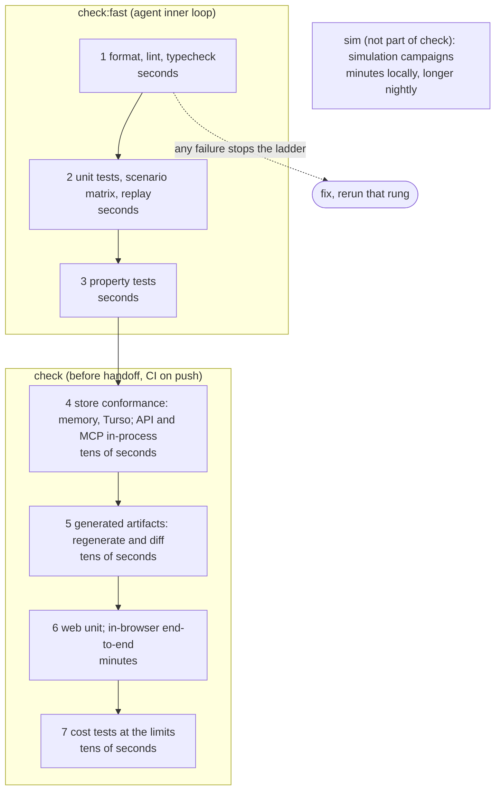

# Cairn: Engineering practices

Companion to `ARCHITECTURE.md`; read that first. This document says how code is written and verified, not what it does.

## Summary

Three ideas carry the rest:

1. **Assert everything you believe, bound everything you allocate.** Types check structure; assertions check logic; explicit limits turn "should never happen" into "cannot happen past this number". Assertions stay on in release. The engine is where most of both live.
2. **Programmer error panics, user error returns.** A patch that violates an invariant is a `Rejection` value with every violation listed (A15). A derive pass that produces a node with two parents is a bug and fails the request; a panic outside the engine stops the process. The two are never confused.
3. **A check either fails loudly or proves it ran.** No silent skips, no vacuous green: a simulation with no fired fault sites, a property test with no generated cases, and a missing tool in CI are all failures.

## Terms

| Term | Definition |
|---|---|
| **Invariant** | A property that holds between every pair of operations. Graph invariants are in the PRD; code invariants are the assertions below. |
| **Limit** | A named, hard-coded maximum on a count, size, depth, or duration. Every loop, buffer, and collection has one. Limits are not configuration. |
| **Rejection** | The engine's value-typed answer to an invalid patch: every violation, by path. Expected, tested, never a panic. |
| **Assertion** | A runtime check of a code invariant (`assert!`). Failure is a bug and aborts the operation or process. On in every build. |
| **Oracle** | A check that decides whether a simulated run passed: an `always!` invariant, a `sometimes!` coverage site, a `verdict`, or a replay comparison. |
| **Fault site** | A `buggify!` point where simulation may take a rare path on a seed-chosen run. Inert outside simulation. |
| **Seed** | The single input a deterministic run is a function of. A failure is a seed; a seed is a reproduction. |
| **Testbed** | A small program that assembles Cairn crates into a world with actors and invariants, run under simulation. |
| **Rung** | One step of the validation ladder: a named check with a fixed position in the fast-to-slow order. |

## Rules

### Bounds and assertions

- **Explicit limits.** Put a limit on everything because everything has a limit. Limits are named constants in one module per crate (`limits.rs`), used by validation, by loops, and by tests, and hard-coded: a limit that is hit in practice is a design signal to revisit in `ARCHITECTURE.md`, not a knob. Design for the worst case within them: a pass is costed and tested at the limits, not at typical size. See the table below.
- **Assertions, positive and negative space, on in release.** Assert what you expect and what you do not: arguments, returns, and invariants. Engine functions carry at least two assertions on average; the applier and derive carry more. Assert the breach as well as the contract: after `apply`, assert the revision advanced by exactly one and the event count equals the mutation count (J2 as an assertion, not only a test). Whole-graph re-verification after `apply` (running the full invariant check on the committed graph) is also on in release; at the node limit it is milliseconds per write and it is the check most worth paying for. Relationships between constants are checked at compile time with `const` assertions (mutations per patch from the node limit).
- **Bounded load.** Bound concurrency and queues, and run background work on fixed intervals rather than per event: SSE ticks coalesce per domain. Requests are handled as they arrive, bounded by the in-flight limit.
- **No recursion.** Containment is a tree of arbitrary depth (A2) and wasm stacks are small; every traversal is iterative with an explicit stack bounded by `containment_depth_max`. No lint catches recursion in general, so review enforces it, and engine tests run at the depth limit in the wasm build.
- **Fixed-width integers.** Counts, offsets, weights, and revisions are `u32` or `i32` (`i64` where day arithmetic multiplies). `usize` appears only at the boundary with slices. Serialized types never carry `usize`.

### Code shape

- **Functions of at most 70 lines.** A hard limit, enforced by `clippy::too_many_lines` at 70. Long functions are split by phase, and the phase names become the function names.
- **Big-endian names, no abbreviations, units in the name.** `node_count_max`, `offset_days`, `commit_duration_ms`, `revision_base`. Paired names share length where practical (`source` and `target`). Abbreviations are limited to those the PRD already uses (`id`, `key`, `api`, `mcp`).
- **Declare near use.** Variables are declared where they are first needed and scoped as tightly as the borrow checker allows; no "declare everything at the top" blocks.
- **Dimensionality.** Keep signatures narrow so callers branch less; a branch at a call site spreads to every caller above it. Return the fewest outcomes that are true: `()` over `bool` over a value over `Option` over `Result`, and handle a case inside the function when it has what it needs rather than handing it back. Take the narrowest input: a resolved key is a `Key`, not an `Option<Key>` or a path. The PRD's closed sets (kinds, states, relevance, provenance) are enums, and every engine `match` is exhaustive with no wildcard arm.
- **Logical interfaces.** Minimize surface area. Hide physical, non-deterministic interfaces behind logical, deterministic ones: the clock, timezone, and viewer are derive inputs, never read by the engine. Each seam declares its fault model (the fault sites simulation exercises). Push control flow up and data flow down: decisions about I/O, retries, and time live in the shell, which is what makes the engine simulable.

### Scope and dependencies

- **No configuration by default.** A knob exists only when two real deployments need different values. database file path, listen address, public base URL, auth providers (each with its own security settings: email auto-link, Tailscale proxy mode, the dev provider's off-loopback override), assistant provider and its credential, deployment timezone, and the rank constants (which the PRD makes configurable) are the configuration surface; limits and behavior switches are not.
- **Do it right while it is hot.** No `TODO` without an owner and a reason in the same line; no "later" that is not in `ARCHITECTURE.md`'s open questions or the PRD's `Later`.
- **Back-of-the-envelope first.** Every change that adds a pass over the graph states its cost at `node_count_max` before code, in compute and memory, and storage or network where the pass touches them (solving the whole date network once per read, not a lookup per node, is the PRD's own example).
- **Dependencies are deliberate, not zero.** The engine crate depends on `serde` and a date type and nothing that touches the OS, so it compiles to wasm and runs under any simulator. Shell crates take what they need (axum, turso, rmcp, openidconnect), and the commit that adds a dependency says why in one line. The test for a new dependency is whether it would take longer to maintain our own version than to audit upgrades of theirs; for a small service the answer is usually to take it. A dependency that pulls a runtime or the OS into the engine is rejected regardless. Tools are dependencies too: each tool in `mise.toml` is pinned and earns its place the same way.

### Not adopted

Rules from Tiger Style and the Power of Ten that Cairn does not follow, and why. Work that finds a reason to adopt one raises it.

- **Static memory allocation.** Cairn loads a domain, works on it, and drops it; allocation per request is the natural shape and the limits bound it. Static allocation would buy predictability the workload does not need at the cost of every collection becoming a fixed array.
- **Zero-copy data plane.** There is no data plane. A journey is a few megabytes handled a few times per second.
- **Line length 100.** rustfmt's default.
- **No `else if` chains, split compound conditions.** Rust's `match` covers most of the motivation; a rule on `if` shape is noise.
- **No dynamic dispatch.** The store, notifier, and auth provider are trait objects by design; the cost is irrelevant at this scale and the seams are the point.

## Errors, panics, and rejections

- **User and agent errors are values.** Invalid patches, stale revisions, guard failures, contradictory chains, and unknown keys are `Rejection` or typed error enums (`thiserror`), returned, serialized unchanged through the API and MCP, and tested. They never panic.
- **Programmer errors panic.** A violated code invariant (two parents, a derived field about to be stored, an event without a patch id) is `assert!` or `unreachable!`. In the server, the service layer catches a panic from an engine call inside a request: the engine works on a private candidate and nothing commits, so the request fails with a 500 carrying the request id, the panic is logged with the domain and request id, and the engine panic count metric is incremented. A panic anywhere else (shared shell state, background tasks, startup) aborts the process, because shared state may be left inconsistent. In the browser any panic aborts the wasm module. Under test or simulation, a panic is the finding.
- **No `unwrap` or `expect` outside tests** (`clippy::unwrap_used`, `clippy::expect_used` denied). Where a value is known present, the reason is an assertion with a message, not an `unwrap`.
- **`#[must_use]` on every result-bearing engine function.** Ignoring a `Rejection` is a compile error in practice.
- **Rejections are complete.** Validation collects every violation before returning (A15). A test asserts that a patch with three independent violations reports three.

### `assert!` versus `always!`

They answer different questions and are not interchangeable.

- `assert!` is the correctness check. It is on in every build, including release and wasm, and a failure is a panic with a message.
- `patina_dst::always!(cond, "label")` is a simulation oracle. Under `patina` a violation is a labeled, structured verdict that the campaign classifier, deduplicator, and minimizer read; outside `patina` it compiles to a `debug_assert!`, which is off in release. So it never replaces an `assert!`.

Rule: production crates use `assert!` for invariants, plus `sometimes!` coverage oracles and `buggify!` fault sites where simulation needs them. Testbeds use `always!`, `sometimes!`, and `verdict` because a labeled verdict is what makes a campaign's output triageable. A production crate may add an `always!` next to an `assert!` at a seam where the label helps triage (the commit path, the retry path); the `assert!` stays. Every site's label is a kebab-case string literal, which rung 1 checks: a campaign reads every label declared in a binary, and one holding a space breaks all of them ([`decisions/2026-10-06-patina-a-site-label-holding-a-space-breaks-every-campaign.md`](decisions/2026-10-06-patina-a-site-label-holding-a-space-breaks-every-campaign.md)).

## Explicit limits

Hard-coded named constants; validation rejects a patch that would exceed one, and loops use the same constant as their bound. Sized for human-authored processes, not for what the machine could hold. Every list a person or agent writes has a count limit and every string a byte limit; the few values that take another row's limit, and why it fits them, are in [`decisions/2026-10-06-values-the-limits-table-does-not-name-take-the-nearest-named.md`](decisions/2026-10-06-values-the-limits-table-does-not-name-take-the-nearest-named.md).

| Limit | Value | Why this value |
|---|---|---|
| nodes per graph | 2,000 | The PRD sizes a deployment at thousands of nodes across hundreds of journeys; a route is typically tens to low hundreds. 2,000 leaves 10x headroom over a large journey. |
| containment depth | 16 | Convention is group > deliverable > action, occasionally deeper; 16 is far past anything readable on a canvas. |
| explicit edges per node, in plus out | 64 | A milestone that gates a whole stage does so through one implicit edge, not 64 explicit ones. Past this the canvas is unreadable and the author should restructure. |
| mutations per patch | 8,000 | An import of a full graph is roughly four mutations per node (node, edges, participations, resources); 4 x the node limit, enforced by a `const` assertion. |
| roles, participation kinds per graph | 32 each | A process with more than a couple dozen distinct roles is several processes. A node has at most one participation per kind, so this bounds a node's participations too. |
| choices per decision | 32 | A single-choice question with more options is a text or entity answer in disguise. |
| entities per role fill, entity-list answer, or explicit participation; values per `in` clause | 100 | A stakeholder list; past 100 it is a team, which the PRD does not model. An `in` clause compares against such a list. |
| emails per entity | 16 | Work, personal, and a few former addresses, with room for a merge to join two people's lists. |
| aliases per entity | 32 | Each merge of a duplicate adds one; a person imported from several sources gathers a handful. |
| entities per deployment | 5,000 | Hundreds of journeys naming tens of people each, mostly shared; past this the deployment is a staff directory, which the PRD does not model. |
| journeys named by one entity merge | 1,000 | A merge names every journey referencing either entity, and the PRD sizes a deployment at hundreds of journeys. |
| resources per node | 16 | A tip, a template, an example or two; past 16 it is a reading list, which belongs in one linked document. |
| notes per node, or on the journey | 100 | A running log of status notes over a long piece of work; past 100 the discussion belongs in a linked conversation. |
| links per node, or on the journey | 32 | The artifacts, references, and conversations of one piece of work; past 32 they belong in a folder behind one link. |
| condition tree depth, clauses | 8, 16 | Conditions are meant to be one or two clauses; this allows a complicated one and still fits in a form editor. |
| id slug or key, title or label | 64, 256 bytes | Ids and keys are paths and short references; titles, names, and choice labels are card labels. |
| description, prompt, help, note, tip, message draft, text answer | 64 KiB | A long tip or template; larger content lives in a linked document. |
| link (URL) | 4 KiB | Practical URLs stay under about 2 KiB; twice that admits long signed links and stays under the 8 KiB request line common servers accept. |
| email address | 254 bytes | RFC 5321 caps an address path at 256 octets, angle brackets included. |
| reason for a skip, override, or bypass | 4 KiB | A sentence or a short paragraph; a longer account belongs in a note. |
| date offset, estimate | 365 days | A year. "Two weeks before the meeting" is the typical case; a multi-year offset is a modeling error. |
| weight | 1,000 | The PRD's examples are 1, 5, and 10. Gravity sums weights over up to 2,000 nodes, so the sum fits comfortably in a `u32`. |
| snapshot frontier top-N, history page | 200 per request | A bounded agent view; the remainder is counts and keys. Callers page. |
| graph, serialized with its state | 16 MiB | One journey, one route draft or published version, or the deployment record, at the limits above, with room. A route's versions are separate graphs, each under its own cap, so publishing never fills a route up. Events and history are excluded and read by page, so an old journey never outgrows its cap by being used. |
| request body | 24 MiB | The domain cap plus envelope, so a domain at its cap still fits one request. |
| contradictory chains per rejection | 16 | Enough to see every distinct conflict a person would fix in one sitting; the rejection says when there were more. |
| explanation entries per value in a server response | 50 | The calculation uses everything and the browser, which derives locally, sees everything; a server response carries the largest entries and a total and pages the rest. |
| SSE subscribers per process | 256 | Tens of users with a few tabs each. |
| nodes touched by one direct assistant write | 10 | "Mark these three done" applies at once; past ten a misheard request is expensive to undo, so the whole change becomes one proposal. |
| assistant tool-loop iterations per turn | 32 | A runaway stop, not a budget. Structuring a journey is a few reads, one proposal, and a report; 32 is several times that. If a turn hits it, the tool set is wrong, not the number. |
| request duration, API and MCP (not SSE or the assistant) | 5 s | Typical requests take tens of milliseconds; the heaviest, an import at the mutation limit, about a second. Past five seconds something is stuck. |
| assistant provider call | 120 s | One non-streamed model response, including a long proposal; past this the provider is down and the turn reports it. |
| assistant turn | 10 min | The iteration limit at typical provider latency, with room. |
| store connection acquire | 5 s | Commits take milliseconds; five seconds of waiting is contention, which at this scale is a bug. |
| outbound identity call (OIDC, Tailscale whois, IAP key set) | 10 s | An identity provider that slow is down; the login fails. |
| IAP key set refetch on an unknown key id | once per 60 s | Google rotates IAP's keys rarely; a stream of forged key ids must not fetch on every request. |
| IAP assertion clock skew | 30 s | IAP's assertions last ten minutes and NTP keeps clocks well inside this. |
| SSE coalescing interval | 250 ms | Feels live; at most four ticks a second per domain. |
| SSE write stall | 15 s | A subscriber holds the latest revision per domain, not a queue, so a slow one never accumulates ticks; one that cannot take a write this long is disconnected and reconnects with current revisions (H6). |
| requests in flight per process | 128 | Tens of users with a few tabs and agents; past this a client is looping. Overflow is a 503 with `Retry-After`. |
| store connections per process | 16 | Each in-flight request borrows one for its load or commit. |
| assistant turns in flight per process | 32 | Each turn is an open request waiting on the provider; the provider's rate limit binds well before this. |

## Code conventions

- **Rust**: stable toolchain pinned by mise; `rustfmt` default; `clippy` with `pedantic` as warnings and a denied set (`unwrap_used`, `expect_used`, `panic` in shell handlers, `indexing_slicing` in the engine, `too_many_lines` at 70, `missing_docs` on public engine items); `#![forbid(unsafe_code)]` in every crate. Warnings are errors in CI.
- **Deterministic by construction.** The engine uses `BTreeMap`, `IndexMap`, or sorted `Vec`s wherever iteration order reaches an output; `HashMap` is denied in the engine crate. A property test asserts that two derives of the same input serialize identically, and it runs both under `patina` (where hashing is seeded and would hide the bug) and plain.
- **Errors carry context.** Every error type implements `Display` with the path or key involved; shell errors wrap engine errors without flattening them.
- **Comments say why.** What the code does is the code; the comment is for the invariant it protects, the PRD id it implements, or the reason a limit has its value.
- **PRD ids in code.** A function that implements a numbered requirement names it in its doc comment (`/// D1a skip cascade.`). Scenario tests name the ids they cover. This is how a reviewer checks coverage.
- **TypeScript**: strict mode, `eslint` with the type-aware rules and `max-lines-per-function` at 70, no `any` outside generated code. Generated files live only in the generated paths (ARCHITECTURE, Generated artifacts), are never edited by hand, and are marked as such.

## Testing

### Engine: examples, properties, replay

- **Scenario matrix** (J3): every scenario the PRD lists, as example-based tests at a fixed clock over the shared fixtures, asserting derived bounds, blocking, shortfalls, and ranking, not only replay equality.
- **Replay harness** (J3): after every scenario, rebuild the graph from its events and compare field by field to the stored state. Drift fails the build. A separate test asserts that every mutation type emits an event (J2).
- **Property tests** with `proptest` through `patina-dst-proptest`: generated graphs within the limits and generated operation sequences, with properties such as: apply then replay equals apply; a rejected patch leaves the graph unchanged; derive is a pure function of (graph, inputs); gravity never decreases upstream along a dependency between in-scope nodes; no accepted graph contains a contradictory chain; every implicit edge names its source.
- **Round trips**: file import and export, JSON and YAML, proposal edit and apply.

#### Property tests

`patina-dst-proptest` is a drop-in for `proptest`'s prelude that seeds cases from `patina_dst::rng()`. Under plain `cargo test` it runs from a fixed seed, in the core ladder; under a campaign the run seed sweeps the cases and a failure replays byte for byte. If plain `proptest` does something better, use it there and record the gap in a new file in `decisions/`, tagged `[patina]` in its title, so patina can be improved.

The shape of an engine property test, in Cairn's terms:

```rust
use patina_dst_proptest::prelude::*;
use cairn_engine::{apply, derive, replay, DeriveInputs, Graph, Patch};
use cairn_engine::testing::{arb_graph, arb_ops, Op};

proptest! {
    #[test]
    fn apply_then_replay_matches(initial in arb_graph(), ops in prop::collection::vec(arb_ops(), 1..64)) {
        let inputs = DeriveInputs::fixed_clock();
        let mut graph = initial.clone();
        let mut events = Vec::new();
        for op in ops {
            // Ops carry indices, resolved against the graph as it is now, so a
            // generated sequence stays meaningful as the graph changes.
            let patch: Patch = op.resolve(&graph);
            match apply(&graph, &patch, &inputs) {
                Ok(applied) => {
                    prop_assert_eq!(applied.events.len(), patch.mutations.len());
                    prop_assert_eq!(applied.graph.revision, graph.revision + 1);
                    events.extend(applied.events);
                    graph = applied.graph;
                }
                Err(rejection) => prop_assert!(!rejection.violations.is_empty()),
            }
        }
        prop_assert_eq!(replay(&initial, &events), graph);
        prop_assert_eq!(derive(&graph, &inputs), derive(&graph, &inputs));
    }
}
```

`arb_graph` and `arb_ops` are the engine's own test strategies (generic content only), generating within the limits table. `Op` is a small enum (add child under node i, add edge i to j, answer decision i with choice k, transition node i, pin milestone i, remove node i) whose `resolve` maps indices modulo the current node count.

### Shell: conformance and integration

- **Store conformance suite** in `crates/store`, run against memory and Turso. It covers revision checks, atomic commit (a failure after state rows and before events leaves nothing), alias resolution, and index queries.
- **Persisted types are mapped exhaustively, in every backend.** A codec that splits a persisted schema value into columns destructures it with no `..` and builds the value it loads as a struct literal with no `..` or `Default`; a match over a persisted enum names every variant, with no catch-all arm and no guessing from its serde shape. A field or variant added to the schema then does not compile until each backend maps it. What the compiler cannot see, a column written wrong or a name read back to no variant, the suite's every-field and every-variant cases catch (`cairn_store::build::every`, `cairn_store::conformance::every`): each persisted type with every optional field filled and every variant held, a cleared value put over it, and every record removed, compared with what each backend loads. Their builders follow the same rule, so the cases grow with the type. A schema change and its store mapping land in one change; the randomized round trip (rung 3) covers combinations, never alone.
- **API and MCP tests** run in-process against the memory store: every endpoint and every tool at least once, every rejection shape once, capability gating (a root without the assistant serves no assistant endpoints).
- **In-browser end-to-end** with Playwright against the wasm host and the fixtures: the success criteria as scripts (open a journey, answer decisions in the walkthrough, break down a placeholder, hit a date conflict, resolve it, upgrade).

### Simulation with `patina` (exploratory, not a gate)

`patina` runs ordinary `std` programs under a seeded virtual OS: clock, entropy, filesystem, network, and thread scheduling are pure functions of the seed, faults are injected from outside, and a run can be recorded and replayed byte for byte. Only the campaigns are kept off the critical path: no brief depends on the testbed briefs (1.3, 6.1, 6.2), and `cargo patina campaign` runs as `mise run sim`, locally and nightly in CI, never inside `mise run check`. Everything else patina offers is used throughout the core crates: assertions, `always!` and `sometimes!` oracles, `buggify!` fault sites, seeded property tests, and point tests, all of which run under plain `cargo test`. What a campaign finds becomes an ordinary deterministic test in the core ladder, then a fix. It works in three ways.

1. **SDK instrumentation in shell crates** (`patina_dst`, inert outside simulation), added with the code they instrument: `sometimes!` coverage oracles so a green campaign proves the interesting paths ran (a revision conflict was retried, a contradictory chain was rejected, an SSE tick was coalesced, a midnight rollover happened during a request), and `buggify!` fault sites for what the runtime cannot inject from outside (an assistant provider timeout, a Tailscale whois failure, a notifier delay, a clock read straddling the deployment's midnight). `always!` next to an `assert!` only at seams where a labeled verdict helps triage.
2. **Testbeds** (the `patina-dst-harness` mode): small programs under `testbeds/` that assemble real Cairn crates into a world with virtual actors and invariants, built and swept with `cargo patina campaign`. They are ordinary Rust: a `main` that builds a `Service` from the composition root, spawns `std::thread`s for virtual clients that talk over plain `std::net` or call the service in-process, and checks invariants at the end. A testbed that runs the real HTTP server (axum on tokio) or a generated HTTP client depends on tokio running under the native shim; the spike (1.3) found that it does on one current-thread runtime, with the conditions in [`decisions/2026-10-06-6-1-drives-the-real-http-server-on-one-current-thread.md`](decisions/2026-10-06-6-1-drives-the-real-http-server-on-one-current-thread.md) and the patina gaps in `testbeds/spike/README.md` and the `[patina]` files in `decisions/`, and a testbed calls the service in-process where it does not. The `patina`-specific surface is a ten-line `run_with` wrapper that sets the fault configuration, the SDK macros, and a `verdict` call per invariant. `patina`'s own `workq` testbed is the reference shape: about 1,800 lines of plain Rust with two dependencies.
   - `multiplayer`: one server on the simulated network, N clients issuing patches to the same journey with drops, latency, and jitter, using the real retry logic (H5). Invariants: every acknowledged patch is visible in the next snapshot; no patch is applied twice; revisions are gap-free; replay equals state at the end; a patch resubmitted on its own lands only over commits that do not touch what it touches; every view catches up after writes stop (the full list: `testbeds/multiplayer/README.md`).
   - `durability`: the server on Turso under filesystem faults (EIO, short writes, crash-restart with torn writes). Invariants: after restart, state equals the replayed log and no acknowledged commit is missing. Turso is pure Rust and runs under the shim, so the testbed targets the real store.
3. **Point tests** with `#[patina_dst::test]` for a single timing-sensitive test (SSE coalescing, retry backoff), swept over seeds under plain `cargo test`, in the core ladder.

Rules that keep simulation honest: a campaign fails when a declared `sometimes!` site never fired; fault knobs are recorded so a failure replays flag-free; a failing seed is minimized to the one or two faults that matter, then rewritten as an ordinary deterministic test that sets up that situation explicitly (the faults, the interleaving, the inputs). A seed only reproduces against the exact code it ran on, so it is never the regression test itself.

Tooling: `cargo-patina` is not on crates.io. mise installs it through its cargo backend from the git repository at a pinned revision (`"cargo:https://github.com/JacobHayes/patina" = { version = "rev:...", crate = "cargo-patina" }`), which is a normal tool entry in `mise.toml`; cargo builds it from source under the hood, once. The SDK crates (`patina-dst`, `patina-dst-proptest`, `patina-dst-harness`) are git dependencies in `Cargo.toml` at the same revision. `mise run sim` fails, and never skips, when it is missing; the core ladder never needs it.

## The validation ladder

One command, `mise run check`, runs the rungs in order and stops at the first failure. Each rung is also its own task (`mise run check:2`) so an implementer or agent can run the one they just broke. Fast rungs first; the slowest rung is minutes, and nothing is skipped silently.



| Rung | Check | Typical time |
|---|---|---|
| 1 | `rustfmt`, `clippy` (deny), kebab-case patina site labels, TypeScript typecheck, `eslint`, the CSS lint (`mise run lint:css`: one scroller per region, tokens for colour and radius), the `wasm32-unknown-unknown` build of the runtime-free crates (the service and what it stands on) | seconds |
| 2 | unit tests for every Rust crate, engine scenario matrix, replay harness (memory store) | seconds |
| 3 | property tests, bounded case count locally (more in CI) | seconds |
| 4 | store conformance on memory and Turso; API and MCP tests in-process | tens of seconds |
| 5 | generated artifacts: regenerate the generated paths and fail if any file in them changed, appeared, or disappeared | tens of seconds |
| 6 | web unit tests; in-browser end-to-end against the wasm host | minutes |
| 7 | cost tests at the limits, budgeted in operations, not wall-clock time (`decisions/2026-10-09-cost-tests-run-in-the-full-check-only.md`) | tens of seconds |

`mise run check:fast` is rungs 1 to 3: the inner loop for an agent after every change. It leaves out the Rust rungs (2 and 3) when the current change touches no Rust input (`scripts/changed`: the files of `jj diff -r @ --name-only`, or of `@-` when the working copy is empty; any failure to diff runs everything), and says so in one line; rung 1 always runs whole, since a Rust change can break the web app through the API and the generated types. The full `mise run check` and CI never skip, and only they run the cost tests (rung 7), which are structurally slow. The full ladder runs before handing work off and in CI on every push; CI adds a nightly run with a larger property case count, and runs `mise run sim` nightly, outside the gate.

A rung that runs zero tests fails. Every rung's command reports how many tests each of its suites ran, and the rung fails if any suite it lists ran none, so one suite vanishing cannot hide behind another's count. Rung 1 runs tools, not tests: it fails if any tool is missing or reports nothing checked. Outside CI it first applies what its tools can fix themselves (`cargo fmt`, `cargo clippy --fix` for machine-applicable suggestions, `eslint --fix`) and prints `rung 1 fixed: N files`, so only what needs a person fails; with `CI` set it only verifies (`decisions/2026-10-09-local-checks-fix-and-ci-verifies.md`).

Each crate's integration tests are one test binary, `tests/integration/main.rs`, with one module per file beside it, so the crate's dependencies are linked once rather than once per file. A new test file goes in `tests/integration/` and is declared in `main.rs` as `mod <file>;`. Rungs pick tests by module path, not by file: `mod property` in `property_*.rs` for rung 3, `mod conformance` and `mod in_process` for rung 4, `mod binary` in the binary's `binary.rs` for rung 6, `mod cost` in `cost_*.rs` for rung 7, and the rest in rung 2.

Two commands cover the work, so nobody needs a cargo, vitest, or playwright incantation:

- `mise run check:fast [filter...]` while coding and after a change, before review. With no filter, rungs 1 to 3, as above. With filters, only what matches, built as the ladder builds it so nothing is compiled twice: the Rust tests whose names contain a filter (any rung's), the Vitest files whose path contains one (or, where none does, the tests whose name does), and the Playwright spec in Chromium that a filter names (`canvas`) or whose test titles contain one (only those tests; its `@server` tests too), with the module and the programs built only if stale. It fails when nothing matches.
- `mise run check`, the full ladder, never skipping: the gate before landing.

Both are quiet (`scripts/ladder-lib.sh`). Everything a rung runs goes to one log, `dist/ladder/last.log`, whose path the last line prints. A passing rung prints one line (`rung 2: passed, 683 tests, 17s`) and the run one summary line. A failure prints only what a person acts on: the compiler errors or lint lines, a failing test's name and output (each tool's own terse reporter; the passing tests are left out), and the command that reruns it (`mise run check:fast <test name>`, or `mise run check:N` for the rung).

The full `mise run check` is the gate before landing. `mise run gen` runs its generators side by side and rebinds the wasm module only when cargo rebuilt it.

The ladder's Rust tests run in one pass: `scripts/ladder-tests` builds every test binary once (before rung 2, when the full ladder runs) and runs them in parallel, and each rung counts its suites by test name from that run, so a suite keeps its name and count whichever rung owns it. The tests of the engine, schema, service, store, and wasm crates are built at opt-level 2 in the `test` profile (`[profile.test.package.<crate>]`, debug assertions on; `dev` and `wasm-dev` are untouched so the module's bindings do not change), and `scripts/built` uses that profile so the programs the browser tests start are the same units. Doc tests run in rung 4 only. In rung 1 eslint caches per file, and in rung 6 `cairn-wasm-cases` is reused while the crates it links and the fixtures are unchanged (`web/wasm/dist/cases.hash`). The Playwright servers of web/app start side by side (`scripts/e2e-servers`). The call is in `decisions/2026-10-09-the-ladder-runs-its-tests-in-parallel-from-an-optimized-test-profile.md`.

### Growing the ladder

The table above is the finished ladder, and every rung in it now exists. It was built incrementally, `mise run check` meaning every rung that existed at the time: the first brief to have tests for a rung added that rung to `check`, at its fixed position, in the same change as those tests (rung 1 existed from the scaffold). Before that the rung did not exist, rather than existing and passing on nothing, so `check` never depended on a tool or service nothing used yet, and once a rung exists a suite that silently stops running fails it.

## For implementers and agents

- Run `check:fast <filter>` while coding, `check:fast` after every change, and `mise run check` (every rung that exists) before declaring work done. A rung that fails is the next thing to fix, not a note in the handoff.
- A new pass over the graph comes with its cost at `node_count_max` and a property test.
- A bug found by simulation or a property test becomes an example-based scenario test, then is fixed.
- Adding or changing a limit needs the user's sign-off first. Then it goes in the table above and in the crate's `limits.rs` in the same commit, with its "why".
- A fault site or oracle may land before any campaign exercises it; under `mise run sim`, a declared oracle that never fires fails the campaign.

## Open questions

- Property case counts and campaign seed counts for CI and nightly; start small and raise until run time is the constraint.
- Whether to run the engine's property tests in the browser too (the wasm build under a fixed seed) or trust that the same crate compiled twice behaves the same. Cheap to add later.

## Related

- `ARCHITECTURE.md` - what the system is
- `PRD.md` - what it must do
- Tiger Style: https://tigerstyle.dev - TigerBeetle's coding discipline, descended from NASA's Power of Ten; the source of most of the Rules
- `patina`: https://github.com/JacobHayes/patina (`README.md`, `USAGE-MODES.md`, `docs/skills/patina-dst.md`, `testbeds/workq`)
