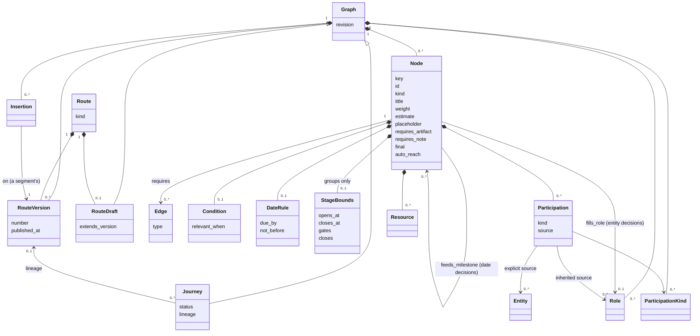
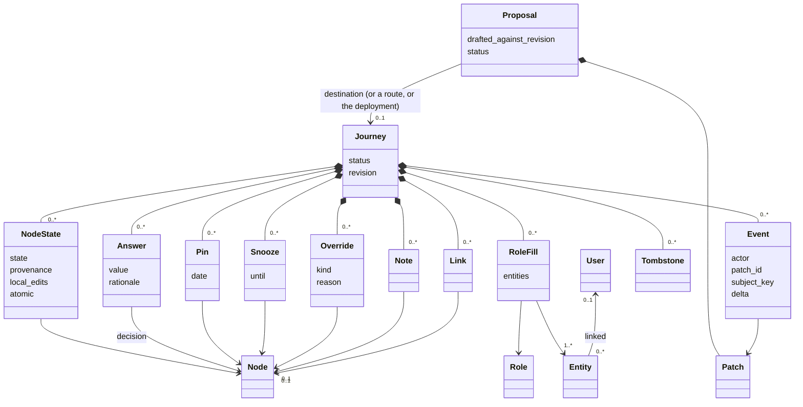
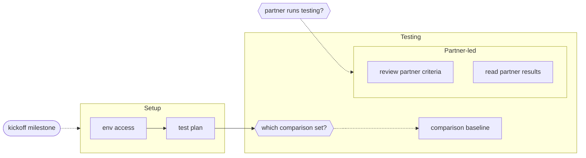
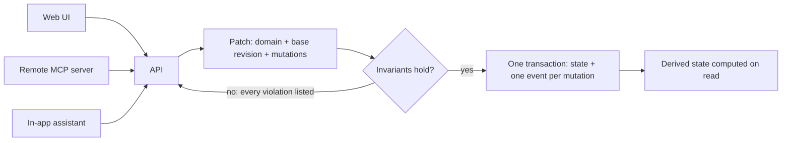

# Cairn: PRD

## Summary

Cairn is a general-purpose, config-driven system for structuring a process as a single graph of **nodes** that must be *decided* or *done*: decisions (typed questions whose answers describe the situation), deliverables (outputs), actions (steps toward them), milestones (points in time), and groups (aggregation). Nodes nest for zooming and depend on each other for ordering and gating. Answers to decisions filter which nodes are relevant, who is involved in them, and when they are due. Decisions can be asked up front or gated behind earlier work, so "decide this once we reach that phase" is the same mechanism as "decide this before starting".

A **route** is a versioned, stateless graph: the template for a process. A **journey** is a live graph with state: answers, progress, people, dates, notes, links, and history. A journey usually starts as a copy of a route version and remembers its lineage (so route improvements can be applied later), but it can also start empty and be structured as you go, by hand or with an AI assistant. A journey that worked can be saved as a new route.

Every change to a graph, whether one field or a whole imported route, is a validated, atomic **patch**. Imports, route upgrades, manual edits, and AI-proposed breakdowns all go through the same primitive.

Cairn ranks the frontier. Every node carries an intrinsic weight; **gravity** accumulates the weight of the node and everything downstream of it; **slack** comes from the date constraints against pinned dates; **leverage** measures what completing it unblocks right now, especially work owned by other people. Together they answer "what should I do next?" without the user picking at random.

The framework is domain-agnostic. Nothing in Cairn's code, schema, or shipped docs references any specific domain; domain content lives entirely in routes, segments, and journeys. This PRD uses generic examples only.

Humans use Cairn through a web UI centered on a pannable, zoomable flowchart with semantic zoom (a detail ladder from stages down to every node, with roll-ups), plus a ranked "next" list and a card-based triage flow for acting. AI agents use it through an authenticated, hosted HTTP API and MCP server with the *same* capabilities, so a coding agent, a chat assistant, or the in-app assistant can start or structure a journey, author a route, walk the open decisions, update state, annotate, and answer "what's next?" on equal footing with a person. Conversation with an assistant is expected to be the primary way routes and ad-hoc journeys get authored; the canvas and file import are the other two paths, and all three produce the same patches.

## Problem

Multi-step processes with many outputs and several owners are hard to hold in your head:

- Ordering and dependencies are fuzzy. It's unclear what blocks what, and what is upstream of the thing due Thursday.
- Picking the next thing is guesswork. Nothing says which of the twelve open items unblocks the most, or which one is quietly on the critical path.
- Involvement varies per instance of the process and hand-offs are informal, so "who is holding the pen" is often unclear.
- Requirements surface late. The typical failure is a message from a colleague: "I need this doc by Thursday" - and only then realizing it was obviously needed all along.
- Decisions get made implicitly, too early, or never. Some choices are known at the start; others only make sense once earlier work has landed, and nothing prompts for them at the right moment.
- Hard-won lessons get relearned (eg: always establish a baseline; decide up front what questions the work needs to answer) because there is no place to attach them to the step they apply to.
- Reusable artifacts (sample request messages, template docs, worked examples) get rewritten from scratch each time.
- Ad-hoc work has no home. Work that doesn't match a known process still needs decisions, dates, and dependencies, and the tool for that is usually a scratch doc.
- Checklists don't solve this. The need is to find "I am here" on a map, trace backward (what did I forget?) and forward (what does this feed?), and see what is blocked vs. unblocked *right now*.

## Goals

1. Encode a process once as a route: decisions, deliverables, steps, dependencies, gates, conditions, involvement rules, relative deadlines, weights, tips, and resources - all as data, not code, authored in conversation with an assistant, on the canvas, or as a file.
2. Instantiate a route as a journey and drive it: make decisions when they become actionable, see the filtered graph, mark progress, attach notes/links, add nodes, and always be able to answer "where am I, what's next, what needs deciding, what's blocked, what did I forget?".
3. Rank the frontier: combine downstream gravity, deadline slack, and unblock leverage into a concrete "do this next", with the trade-off visible rather than hidden in a score.
4. Support ad-hoc work: a journey can start with no route and be structured incrementally, by a person or by an assistant, using the same graph, and can later become a route.
5. Make involvement explicit and general: roles are filled by decisions, nodes inherit participation from roles, and any node can override.
6. Be multiplayer: multiple authenticated users work on the same journeys; every change is attributed and logged.
7. Be AI-native: everything a human can do in the UI is available to an agent through an authenticated, hosted API/MCP surface reachable with no local install; the system ships an in-app assistant that uses the same surface; the current state of a journey is the primary thing an agent inspects.
8. Stay general: reusable for other processes and other deployments without code changes.

## Non-goals (for now)

- Modeling every edge case of any specific process. Route *content* should start narrow (the 80% path) and grow; the framework should be ambitious.
- Role-based access control. All authenticated users can read and write everything in a deployment. (Punted, not rejected.)
- Being a project management suite (capacity planning, sprints, resource leveling). Dates are relative and milestone-driven, feasibility is checked but never auto-scheduled, and priority is graph-driven. A Gantt-style view is welcome later; the timeline view (C13) is the v1 form.
- Replacing where artifacts live. Docs, videos, and spreadsheets stay in their systems; Cairn stores links and metadata.
- Automating the work itself (sending messages, creating docs). Cairn provides templates and drafts; sending is manual or delegated to an agent outside the system.
- Custom state machines. Cairn ships fixed per-kind state machines with per-node guard flags; authorable machines are listed under `Later`.
- Review and sign-off workflow. No participation can be required to approve before `done`; the need is real and is listed under `Later`.
- Recurring items and per-member fan-out. A node that repeats on a cadence, or that materializes one copy per member of a role, is not built in; both are listed under `Later`. The role-member case is covered for now by an assisted breakdown that creates ordinary children.
- Automatic sync between route files and the database. Import and export are explicit, user-initiated operations.
- Tolerating invalid structure. Cairn rejects patches that would violate its invariants (see `Invariants`) rather than storing them and warning later.
- Learning priorities from behavior. Weights are authored; the ranking is a documented formula, not a model.

## Users

- **Participants** (primary): people executing a journey. Want "I am here", what's next, what needs deciding, what's mine, what's overdue, and the tips/templates for the step in front of them.
- **Route authors**: people encoding and iterating a process. Usually work by describing the process to the assistant and reviewing what it proposes, then adjusting on the canvas; sometimes by editing a file. Want to add or reshape nodes, decisions, and rules cheaply, without breaking in-flight journeys.
- **Ad-hoc structurers**: people starting work that has no route yet. Want to sketch decisions, deliverables, dates, and people quickly, often in conversation with an assistant, and refine as they go.
- **Observers**: people who need status on a journey without executing it.
- **AI agents**: coding agents, chat assistants, and the in-app assistant, acting on behalf of a user. Same needs as participants and authors, plus structured, queryable state, a way to propose multi-node changes for review, and instructions for how to use the system.

People *referenced* by a journey (owners, reviewers, informed parties) are frequently not users of the system. The model distinguishes "a person we refer to" from "a login".

## Core concepts

This table is the glossary: one canonical definition per term, with the synonyms to avoid. Behavior is specified in the sections that follow (Containment, Gating, Priority, and the lettered requirements); this table only says what each term *is*.

| Term | Definition |
|---|---|
| **Deployment** | One installation of Cairn: its users, entities, routes, and journeys. One deployment is one trust boundary; everything below is scoped to it. |
| **Graph** | The shared structure of routes, segments, and journeys: nodes, edges, roles, participation kinds, conditions, date rules, weights, and resources. A route version is a graph without state; a journey is a graph with state. |
| **Route** | A named template graph. Has zero or more immutable, numbered **versions** and at most one mutable **draft**. Pure data, no state. Its **kind**, fixed when it is created, is `process` (journeys start from it) or `segment` (it is only inserted, A21). Where this PRD says route without a kind, it means either, except that journeys, lineage, save as route, and re-link concern process routes only. |
| **Route version** | An immutable numbered snapshot of a route's graph. Journeys are created from, and upgraded to, versions. |
| **Route draft** | The single mutable graph of a route. Patches target it; publishing it creates the next version. |
| **Segment** | A reusable piece of a process: a route of kind `segment`, with exactly one root node, inserted into a route draft or a journey instead of being started (A21). Avoid: template, snippet, module, sub-route. |
| **Insertion** | One placement of a segment version into a graph: its key, the version it is on, the parent it went under, its role and kind mapping, and its members (the graph's nodes it copied, each with its key in the segment). Its local edits are its members' differences from that version (B13, B14). |
| **Journey** | A live graph for a real situation: its own nodes (each marked copied from a route, copied from a segment, or journey-local), plus answers, node state, participations, pins, snoozes, notes, links, and audit history. May record **lineage**. Has a status: `active`, `completed`, `archived`. |
| **Lineage** | A journey's link to the route version it was created from or last upgraded to. A journey may have none (started empty). |
| **Node** | The single unit of the graph. One recursive type with a `kind`. Has an id, a stable key, a title, a weight, and kind-appropriate fields (see A1a). |
| **Node kind** | One of: `decision`, `deliverable`, `action`, `milestone`, `group`. Fixed set. |
| **Decision** | A node kind: a typed question. Answer types: boolean, single choice, multi choice, text, date, entity, entity list. May fill a role (entity answer) or pin a milestone (date answer). A leaf (no children). |
| **Deliverable** | A node kind: work that produces an output. May require an artifact link before `done`. May contain child actions. |
| **Action** | A node kind: a step of work, no distinct output of its own. May contain children. |
| **Milestone** | A node kind: a point-in-time marker, possibly externally owned, with a date and a `reached` state. A leaf. |
| **Group** | A node kind: a pure container with no work of its own. Never actionable; its display state is derived from its children and dependencies (D8), or explicitly skipped. The "section" or "phase" concept. |
| **Container** | Not a kind: any node that has children. A group is usually a container, but a deliverable or action with children is one too. |
| **Parent / child** | The containment relationship. Every node has at most one parent; any deliverable, action, or group may be a parent. Containment is a tree. |
| **Answer** | A journey's submitted value for a decision. May change over time; changes are logged and re-evaluate the graph. Submitted empty text or an empty list is answered; no submission is unanswered. May carry a **rationale**: why it was given (B2). |
| **Edge** | A hard dependency between nodes: `requires` (blocks). Edges may connect any two non-ancestor/non-descendant nodes at any depth. (Soft ordering edges are `Later`.) |
| **Condition** | A declarative predicate over answers that sets whether a node is relevant (`relevant_when`). Referencing a decision creates an implicit gate on it. |
| **Role** | A named slot on a graph (single or multi valued), filled per journey with entities. Filled by at most one decision (its filling decision), or directly. |
| **Filling decision** | The one decision, if any, whose answer fills a given role. |
| **Participation kind** | How an entity relates to a node. `owner` is built in (single). A graph may declare more (eg `reviewer`, `informed`), each single or `multi`. Informational: they drive "mine", drafts, and display. |
| **Participation** | A node's involvement list: `{kind -> source}`, source being an inherited role reference or explicit entities. |
| **Owner** | The single built-in participation. For a decision, the decider. Not required for a node to be actionable. |
| **Entity** | A person or team a journey refers to. Deployment-scoped, so one person is one entity across journeys. May carry emails; a user is the entity holding one of their verified sign-in emails. |
| **User** | An authenticated account. Attributed on every change. Agents act on behalf of a user. |
| **Pin** | An explicit journey-level date on a node. Everything not pinned is derived. |
| **Date rule (`due_by`, `not_before`)** | An authored constraint: the node finishes by, or starts no sooner than, a milestone, a date answer, or `created_at`, by an offset (A8). |
| **Due** | A node's derived deadline: the latest finish the constraints and pins allow (F3). Null when nothing bounds it. |
| **Actual date** | The recorded date a milestone was reached. A fact, not a pin. |
| **Effective date** | For a milestone: its actual date if reached, else its pin, else its derived due (F1). What other constraints see when they reference it. |
| **Weight** | A node's authored intrinsic value (default 1; groups default 0). Overridable per journey. |
| **Gravity** | Derived: the effective weight of the node plus that of everything transitively downstream of it, where an undecided node counts at half. "How much rides on this." |
| **Slack** | Derived: latest start minus today (F3). Negative is late; null is "no deadline". |
| **Constraint** | The one shape every date relationship takes: "B is at least k days after A" (F2). Rules, dependencies, estimates, containment, and stages all reduce to it; a pin fixes a date. Together they form one network that bounds and consistency are read from. |
| **Earliest start / latest start** | Derived bounds on when a node can and must start, implied by the constraints and pins (F3). Due is the latest bound on its finish. |
| **Contradictory chain** | A chain of plan constraints that requires a date to precede itself. The one thing the date model rejects (F5). |
| **Shortfall** | Derived: the plan can no longer be met given today or an actual date. A warning with its chain, never a rejection (F6). |
| **Leverage** | Derived: the weight of non-group nodes whose remaining dependencies completing this would satisfy, including through derived group completion, counting unblocks that land on other owners more. The UI shows it as "Unblocks": a count of the nodes it frees, with its weighted value. |
| **Rank** | Derived: the documented blend of urgency, gravity, and leverage that orders the frontier. |
| **Frontier** | The set of actionable nodes. By construction it has no actionable descendants. |
| **Acting frontier** | The frontier minus snoozed nodes (snoozed themselves or through a container) and minus `auto_reach` milestones whose date is still ahead: what someone can act on now. It drives the next list, triage, the agent snapshot, and `stalled`. |
| **Undecided** | A relevance value, not a decision state: a node whose condition (its own or an ancestor's) depends on a decision nobody has answered yet. The open decision itself is relevant; the nodes waiting on its answer are undecided. Displayed as conditional (D8). |
| **Stalled** | Derived, journey-level: the acting frontier is empty while in-scope unfinished nodes remain. Nothing can be acted on until a date arrives, a snooze lifts, or a blocker clears (D5). |
| **Actionable** | Relevant, not blocked, and in a non-terminal state. Groups are never actionable. |
| **Blocked** | Off the frontier because a relevant or undecided hard dependency is not satisfied; its completing transition is guarded. |
| **Display state** | Derived: the one state every surface shows for a node, composed from relevance, stored state, effective skip, auto-reach, blocking, and snooze (D8). Stored state is what transitions act on; display state is what people and agents read. Values: ready, active, blocked, conditional, scheduled, snoozed, done, skipped, not relevant. A not-relevant node whose value rests on a decision that cannot be answered yet displays as conditional. |
| **Terminal** | `done`, `skipped`, `decided`, or `reached`. Terminal nodes satisfy dependencies, except skipped containers wait for explicitly kept work (D1a). |
| **Started early** | A deliverable or action moved to `active` while still blocked; allowed and labeled. |
| **Guard** | A per-transition precondition (`deps_done`, `has_artifact`, `has_note`, `broken_down`), checked only when the transition is attempted. Overridable with a reason (a guard bypass). |
| **Stale** | Derived: a terminal node whose completing guards would now fail (an open dependency, a missing artifact or note, a lost breakdown). Visible, not blocking. |
| **Snooze** | A journey-level "not now" on an actionable node or on a container, until a date or until one named node completes. Hides it, and a container's descendants, from the next list and triage; it still blocks and counts for gravity. Whether it holds is derived from current state, and any transition on the snoozed node clears it (B6). |
| **Skip** | A terminal transition, reason required, meaning "not doing this". On any container it cascades an effective skip to descendants (overridable per node). |
| **Placeholder** | A deliverable or action the route expects each journey to break down. Cannot be completed until it has children or is marked `atomic`. |
| **Condition gate / implicit edge** | A dependency derived rather than authored: from a condition, from containment, from an inherited requirement, or from a stage opening. Drawn dotted; behaves like a `requires` edge. |
| **Touched set** | Everything a patch or event writes or removes, by key and field, including a removed node's subtree and every incident edge. Two changes are safe to reorder when their touched sets do not overlap (H5). |
| **Upgrade available** | A journey whose lineage route has a published version newer than the version the journey is on, or an insertion whose segment has a published version newer than the one it is on. Retiring a route hides it from new-journey creation only; its journeys still see upgrades. A fact about versions only; what the upgrade would change is the upgrade proposal (B7). |
| **Structural change** | A change to what the graph is, as opposed to what has happened in it: adding, removing, moving, or redefining nodes; edges; roles and participation kinds; conditions; date rules; stage bounds; resources; and route, upgrade, re-link, and entity-merge operations. Everything else (transitions, answers, participations, journey weight overrides, pins, actual dates, snoozes, notes, links, overrides) is a state change. A route has no state, so every change to a route or its draft is structural. |
| **Consequences** | What an accepted patch newly caused in derived state: warnings (stale, shortfall, overdue, stalled) and, informationally, the nodes it unlocked and moved into or out of scope; reported with the result and never stored (D7). |
| **Override** | A journey-level, reasoned departure: force-include (relevance), keep (exemption from inherited skip), or guard bypass. Distinct from a local edit. |
| **Keep** | The override that exempts a node and its subtree from an ancestor's skip (D1a). |
| **Local edit** | A per-field marker that a journey has changed a route-copied field, so upgrades leave it alone. UI may call it "detoured from the route". Carries no reason. Not used for insertions: an insertion's local edits are derived from the segment version it is on (B14). |
| **Provenance** | A node's origin in a journey: `from_route`, `from_segment`, `local`, or `orphaned`. |
| **Node tombstone** | A journey record that a route-copied node was removed, so an upgrade does not re-add it. Journey-scoped. Not used for insertions (B14). |
| **Patch** | An ordered set of graph mutations applied atomically after validation against a declared base revision. The only write primitive. |
| **Mutation** | One change within a patch (add/update/remove a node, edge, answer, pin, etc). Emits one event. |
| **Revision** | A monotonic version number on each patch domain (route including its draft, journey, deployment) and each proposal for optimistic concurrency. |
| **Proposal** | A patch drafted but not applied; reviewable, editable, then applied or discarded. A patch with a status. |
| **Resource** | Route-authored guidance attached to a node: a typed attachment (tip, template, example, reference, message draft). |
| **Note / Link** | Journey-authored annotation on any node or the journey: a typed attachment (note, artifact, reference, conversation). Editable and deletable. |
| **Attachment** | The shared model behind resources and notes/links: content with a scope (route guidance or journey annotation) and a type. |
| **Artifact** | A link designated as a deliverable's output, optionally required before `done` (`requires_artifact`). |
| **Required note** | A journey note a deliverable or action must carry before `done` (`requires_note`, G4), for work whose output is what someone writes down. |
| **Notice** | An advisory finding about a route graph, reported on import, on publish, and while authoring; never a rejection (A20). |
| **Event** | An append-only audit record of one mutation: actor, time, subject key, after-state delta. |

### The three relationships

Cairn has exactly three ways nodes relate, and they are independent:

1. **Containment** (parent/child) is a tree. Every node has at most one parent; any deliverable, action, or group can be a parent. Decisions and milestones are leaves. Containment is a property every node has, not something done through group nodes; a deliverable can contain its own actions.
2. **Dependency** (`requires`) is a directed acyclic graph, laid over the tree. Any node can require any other non-ancestor, non-descendant node, at any depth.
3. **Relevance** (`relevant_when` conditions) filters which nodes apply, based on answers.

The tree feeds the dependency graph in one place only: a parent implicitly requires its relevant or undecided children, and children inherit the parent's dependencies (see Containment). Everything else keeps the three separate.

### How the pieces fit

The graph structure is shared by route versions, route drafts, and journeys (a segment is a route). A journey adds state on top of it.



Journey state attaches to nodes by key and to the journey as a whole. Nothing here exists on a route. A proposal is not journey state: it names its destination domain (which may not exist yet, for a proposal that creates one) and has its own revision.



### Identity and references

- Every node, role, and participation kind has an **id** that is a slug unique among its siblings (for nodes: among children of the same parent, and among the roots; for roles/kinds: within the graph).
- Nodes are addressed by **path**: the slash-joined ids from the root (eg: `testing/report`, `setup/access`). Paths are how files and humans refer to nodes; the kind is not part of the reference.
- Every node, role, and participation kind has a stable opaque **key** (eg: `n_7q4m2k`, `r_owner`), assigned when it is first created and preserved through renames, moves, copies into journeys, and exports. Inserting a segment is the one copy that mints new keys: each copied node's, role's, kind's, and resource's key is derived from the insertion's key and its key in the segment, so one segment can be inserted more than once, and an upgrade adds a new segment node under the key the same derivation gives (B13, B14).
- **References are stored by key; paths and ids are the serialization and display form.** Edges, conditions, date rules, stage bounds, snooze targets, `fills_role`, `feeds_milestone`, participation sources, and message-draft placeholders all resolve to keys at import or edit time. Renaming or moving a node, or renaming a role, changes what is displayed and exported and breaks nothing, because every reference still points at the key. Journey state and lineage matching between a route version and a journey are by key.
- Files carry both: paths and ids for readability, keys for identity, plus the route id and the version they extend. On import, a node without a key is matched by path against that base version and inherits its key; if there is no match, a new key is minted. Keys must be unique within the imported graph. An occurrence is identified by `(graph, key)`; copies in other graphs may share the key. A key absent from the base version adds a new node; an existing base key identifies that node through renames or moves. Export emits current paths, ids, and keys.

### Containment: what the tree means

The containment tree is not just for zooming. It carries dependency in both directions, so the tree has completion semantics and the priority and date signals flow between levels:

- **A parent implicitly `requires` each of its relevant or undecided children.** A parent's completing transition (`done` for deliverables and actions) is guarded by `deps_done`, which covers those implicit child edges: every in-scope child must satisfy dependencies (including D1a's kept-work exception). Once its children and other dependencies are satisfied, a relevant non-terminal deliverable or action is itself on the frontier for its own completion; until then its actionable children are the frontier items and the parent is context.
- **Children inherit the parent's dependencies.** Every explicit `requires` edge into a node is also an implicit gate on each of its descendants. So "test plan requires env access" blocks the plan and its child actions alike. A stage's opening gate is the same mechanism: the stage `requires` its `opens_at` milestone (unless it declares `gates: false`), and everything inside inherits that edge.
- An edge into a parent waits for the parent's own completion or skip, subject to D1a's kept-work exception. Completing children alone does not complete a deliverable or action.
- Because the parent is a dependent of each child, a child's gravity includes the parent's weight and everything downstream of the parent, and a child's derived due is bounded by the parent's latest start.
- A parent's duration estimate covers its own work after its children are done.
- Implicit edges (containment, inherited requirements, condition gates, stage openings) are derived on read, drawn dotted, and participate in blocking, tracing, gravity, and cycle checks exactly like explicit edges. Each names its source (parent, ancestor's requirement, decision, or stage) in explanations and validation messages. A group is `done` for edge purposes when all its relevant or undecided children and its own hard dependencies are satisfied. Empty groups still wait for their dependencies, including opening gates. A skipped group follows D1a.

### Gating: how decisions sit in the graph

Decisions are ordinary nodes, so the same mechanisms cover "decide up front", "decide when we get there", and "this work depends on that choice":

1. **Decision with no open dependencies**: actionable from the start. The set of these, wherever they sit in the tree, is the up-front pass.
2. **Gated decision** (`requires` other nodes): not actionable until those are done. "Decide which comparison set once the test plan is written." A gated decision may fill a role or pin a milestone, so involvement and dates can be settled late too. ("Gated" is structural; a personal "I'll decide later" is a snooze.)
3. **Node gated by a decision**: a node that `requires` a decision, or whose `relevant_when` references it, is not actionable until the decision is answered. Use `requires` for a plain prerequisite and `relevant_when` for conditional inclusion; a condition already creates the gate, so an explicit `requires` edge that only duplicates a condition reference is rejected.

**Relevance** is three-valued: `relevant`, `not_relevant`, or `undecided`. A node's effective relevance combines its own condition with its ancestors': `not_relevant` anywhere dominates, then `undecided`, then `relevant`. A node with no condition inherits its parent's. Node detail names the ancestor or decision that produced the value.

Conditions evaluate three-valued (Kleene) over answers. A decision that is `open` and relevant contributes `undecided`; a decision that is `skipped`, `not_relevant`, or itself undecided is **unanswered**: `is answered` is false, value operators (`equals`, `not equals`, `in`, `contains`) are false, and `not` / `and` / `or` compose normally. So `not (make_offer equals yes)` is true when the offer decision is skipped, which is how you model the other branch, and nothing stays `undecided` forever because of a decision nobody will make. `undecided` arises only from a decision that is still open and relevant.

**Blocked** means two things: off the frontier (not in the next list or triage, though still counted for gravity and shown in traces), and its completing transition is guarded by `deps_done`. A node is blocked when a relevant or undecided hard dependency (explicit, inherited, containment, condition gate, or stage opening) is not satisfied; an undecided dependency blocks like an open one and stops blocking when its decision resolves it to not relevant. Everything else stays open on a blocked node: notes, links, participations, pins, snoozes, weight, breakdown, and starting early. Moving a blocked deliverable or action to `active` is allowed (the node need only be relevant or undecided) and shown as "started early". An undecided node's condition gates keep it off the frontier but do not guard its completing transition: finishing undecided work is accepted with a warning (D4).

**Force include** is the one relevance override: treat a node as relevant, with a reason, despite its own condition, an ancestor's condition, or an unanswered decision. It replaces the node's own condition and ancestor chain with `relevant` and drops the implicit gates those conditions created; explicit `requires` edges still apply. Descendants inherit `relevant` as their ancestor value but still evaluate their own conditions. There is no "force skip": a node the journey does not need is `skipped` through its state machine, with a reason.

**The frontier** is every actionable node, and by construction it has no actionable descendants: a parent with an actionable child is blocked on that child, so only the child is on the frontier. Groups never appear. Acting surfaces (the next list, triage, the agent snapshot) show the frontier and carry each item's ancestors as context.

An illustration, using the example route from later. Solid edges are explicit `requires`; dotted edges are implicit gates:



Here `which comparison set?` is a gated decision (it requires the test plan), `comparison baseline` is undecided until it is answered, and everything under `Partner-led` is undecided until `partner runs testing?` is answered. The kickoff milestone gates the Setup stage, and everything inside Setup inherits that gate.

### Priority: weight, gravity, slack, leverage

The goal is a concrete "do this next", with the reasoning inspectable. The formulas are normative; the constants are defaults, configurable per deployment and always displayed.

- **Weight** is authored: a number on each node (default 1, groups default 0), set on the route and overridable per journey. Terminal outputs and milestones typically carry more.
- **Gravity** is derived and includes the node's own weight: `effective_weight(d) = weight(d) * (0.5 if d is undecided else 1)` and `gravity(n) = effective_weight(n) + sum over d in downstream(n) of effective_weight(d)`. The discount is per node, on that node's own relevance: work that is relevant whatever a decision's answer counts in full even when it sits behind undecided work. `downstream(n)` is every transitive dependent of `n` through explicit `requires` edges, inherited and implicit gates, and containment, counting each node once, pruning not-relevant branches, and excluding terminal weight while traversing terminal intermediates to reach unfinished dependents. Own weight and downstream weight are the same currency, so a heavy standalone task and a light task with heavy downstream are compared on one number. A container displays one number, its **subtree gravity**: the same sum taken over its whole area, `effective_weight(d)` for each `d` in `S` or `downstream(S)`, counted once, where `S` is the container and its open, in-scope descendants (the same pruning and terminal rules). It is at least every member's gravity and never counts a shared dependent twice; a container whose work is all done shows 0. The container's own `gravity` is unchanged and still orders it.
- **Slack** is derived from the date constraints (F3): `slack = latest_start - today`. Null when nothing bounds the node's latest start (F3). Zero slack is "start due today"; negative slack is "start overdue".
- **Leverage** is derived: `leverage(n) = sum over d in immediate_unblock(n) of weight(d) * owner_factor(d) * (0.5 if d undecided else 1)`, where `immediate_unblock(n)` is the set of in-scope, non-terminal, non-group nodes whose remaining hard dependencies would be satisfied by completing `n`, including cascading derived group completion. Hold current relevance fixed for this calculation; undecided nodes receive the discount shown above. Count each target once. `owner_factor` is `2` when `d`'s owner differs from `n`'s owner (or `d` is owned by no one and `n` is owned) and `1` otherwise. Leverage is "what finishing this frees up right now", weighted toward unblocking other people's work. Node detail shows the split ("unblocks 3 tasks, 2 owned by others"). A node with high leverage but low gravity is a small gate in front of parallel work, often others', and is worth doing early.
- **Rank** orders the frontier: `urgency = clamp((14 - slack_days) / 14, 0, 1)`, plus a `late = clamp(-slack_days / 14, 0, 1)` term so lateness keeps separating past-due items rather than saturating; `gravity_norm` and `leverage_norm` normalize to the maximum among relevant or undecided, non-terminal, non-group nodes in the journey (0 when that maximum is 0); `rank = 0.40 * urgency + 0.15 * late + 0.25 * gravity_norm + 0.20 * leverage_norm`. Null slack gives `urgency = 0` and `late = 0`. Ties break by smaller slack (null last), then greater gravity, then key. `overdue` and the due-badge color key off `due`; urgency and slack key off `latest_start`; both are shown. **Rank is global** (owner_factor relative to the node's owner), so the shared canvas shows one rank and badge; a per-viewer "rank for me" sort recomputes `owner_factor` relative to the current user without changing the shared rank. The UI always lets you re-sort by any single signal so the trade-off is visible instead of buried.
- **Effort-adjusted** ordering (gravity per estimated duration) is available as an alternate sort when estimates exist; nodes with a zero or missing estimate sort last.

All signals are computed on read and shown on node detail with their inputs (which downstream nodes contributed gravity, which pin produced the slack, which nodes this would unblock and who owns them), so "why is this first?" is always answerable. Null slack displays as "no deadline".

## Functional requirements

Numbered so feature briefs can reference them. Everything here is in scope; deferred items live under `Later`.

### A. Graph definition (routes, segments, and journeys share this)

- **A1** A graph is expressible entirely as data (a schema-validated document) with: nodes of every kind, edges, roles, participation kinds, conditions, participations, date rules, stage bounds, weights, duration estimates, guard flags, placeholders, and resources. Adding a node, edge, decision, tip, or rule never requires a code change.
- **A1a** Node fields, with kind restrictions and defaults: `key` (all, minted once), `id` (all, sibling-unique slug), `kind` (all), `title` (all), `description` (all; markdown, optional), `weight` (all; default 1, group 0), `estimate` (deliverable/action; optional, days), `requires_artifact` (deliverable; default false), `requires_note` (deliverable/action; default false), `placeholder` (deliverable/action; default false), `relevant_when` (all; optional), `due_by` and `not_before` (all; optional), `fills_role` (decision with entity/entity-list answer; optional), `feeds_milestone` (date decision; optional), `final` (milestone; at most one per graph), `auto_reach` (milestone; default false), stage bounds `opens_at`/`closes_at`/`gates`/`closes` (group; optional), decision-only `prompt`/`answer_type`/`choices`/`help`, journey-only `atomic` (placeholder). Groups take no estimate. The class diagram mirrors this list.
- **A2** Nodes form a containment tree of arbitrary depth (convention: group > deliverable > action, with decisions and milestones wherever they belong). A group, deliverable, or action may have children of any kind; decisions and milestones are leaves. A parent implicitly requires its relevant or undecided children, and children inherit the parent's dependencies (see Containment).
- **A3** Dependency edges (`requires`, hard) may connect any two nodes regardless of kind or depth, except that an explicit edge cannot connect a node to its own ancestor or descendant (containment already relates those). Soft ordering edges are `Later`.
- **A4** Decisions have a prompt, an answer type (boolean, single choice, multi choice, text, date, entity, entity list), optional choices, and optional help text. Decisions may `require` other nodes (gated decisions) and be referenced by conditions on any node, including other decisions. A decision's owner is single; a panel decision names a facilitator as owner and the panel through another kind.
- **A5** Any node may declare a `relevant_when` condition, declarative and evaluable without code, referencing decisions with a fixed operator set (equals, not equals, in, contains, is answered, and/or/not), evaluated three-valued (see Gating). A condition on a node applies to its descendants.
- **A6** Roles are declared on the graph (single or multi). An entity-typed decision may declare `fills_role`; an entity-list decision may fill only a multi-valued role and a single-entity decision only a single-valued role. A role has at most one filling decision. Nodes declare default participations as `{kind -> role}`. A graph may name a `default_owner` role applied where no ancestor supplies an owner.
- **A7** Participation kinds: `owner` is built in. A graph may declare additional kinds, each with a `multi` flag and a stable key. Single-valued kinds cannot be wired to multi-valued roles. Kinds beyond `owner` are informational (see `Later` for sign-off).
- **A8** A node may declare a date rule `due_by: {before|after: <source(s)>, offset: <days>}`, offset defaulting to 0 and applying in either direction (so "two weeks before the meeting" is `{before: meeting, offset: 14}`). Sources are milestones, date-decision answers, and the journey's `created_at` (so "within three days of starting" needs no synthetic milestone); several sources are several constraints, so "earliest of these" needs no competing pins. Decisions may carry a decide-by rule the same way. The same shape with `not_before` gives an earliest start ("no sooner than three days after kickoff"); both are ordinary constraints (F2).
- **A9** A node may declare a weight (default 1, groups 0) and an optional duration estimate. All dates, estimates, and offsets are calendar days; "today" is the deployment's configured timezone.
- **A10** Resources attach to any node: markdown tips, typed external links, and message drafts using journey-context placeholders (`{{journey.name}}`, `{{roles.eval_owner.name}}`, `{{answers.testing/scope}}`; journey fields `name`, `description`, `created_at`, `url`, `status`). A draft whose role is unfilled or whose decision is unanswered renders a visible placeholder marker; rendering never fails. Resources are route-authored guidance; notes and links (G) are journey annotations; both are the same attachment model (a scope plus a type).
- **A11** Routes of both kinds are versioned: immutable numbered versions and at most one draft. Patches target the draft; publishing it creates the next version and clears the draft. A draft always extends the latest published version; opening a draft (by patching a published version, importing an extension, or saving a journey as a route) when one already exists is rejected with the option to discard the existing draft. Journeys record which version they were created from or last upgraded to. Route edits never touch in-flight journeys until an upgrade is confirmed.
- **A12** Routes are authored three ways, all producing patches against the draft: in conversation with the in-app assistant or an external agent (proposals reviewed on the canvas; the expected primary path); on the same canvas and node-detail UI used for journeys; or by importing a file. A journey can be saved as a route (B8). No path is privileged; a route authored conversationally exports to the same file as one written by hand.
- **A13** Routes import from and export to a canonical file format (round-trip safe, tested). A route exports a whole version or draft. Import creates a new route or a new draft extending a route's latest version. Save-as-route (B8) is an in-app operation; journey file import/export and restore are `Later`. Import and export are explicit; Cairn never syncs files and database automatically. Segments use the same file format with `kind: segment`, and import, export, and round-trip the same way. A file carries structure, not lineage: insertions are not written, and the nodes of an insertion are written and imported as ordinary nodes.
- **A14** Graphs are stored as structured data (real fields, relations, and constraints), not opaque document blobs. The file format is a serialization of that structure.
- **A15** Validation is enforced, not advisory: any patch that would violate an invariant is rejected with every violation listed by path. Cairn never stores an invalid graph. Notices (A20) are the only advisory findings and never stand in for a violation.
- **A16** Completion is gated by per-node flags plus containment: `requires_artifact`, `requires_note`, `placeholder` (must be broken down or `atomic` first), and the implicit child requirement. These are the only lifecycle customization.
- **A17** Patches are the only write primitive. A patch targets one domain (a journey, a route including its draft, or the deployment; a segment is a route) or a proposal within that domain, names the target's base revision, and contains an ordered set of mutations. Mutations execute in their declared order, and state-machine legality is checked at each mutation's position. Structural invariants are validated once, on the graph the patch produces, and transition guards that depend on derived state are checked against that same graph (D4); no intermediate graph is ever derived, so mutation order cannot satisfy a guard only temporarily, and a bulk completion of a dependency chain is accepted in any order. The server applies all mutations and their events in one transaction, or none. Creating a journey or a route is the first patch against that new, empty object: its base revision is 0 and it produces revision 1. Entity edits (including emails) and merge target the deployment; entity create may ride in any patch (E6). Other multi-domain operations use separate patches; atomicity is within one domain. Proposals belong to their destination domain, with their own editing revisions; applying a proposal atomically commits its mutations and applied status (I6). Single-field UI edits are one-mutation patches.
- **A18** Removing a node removes its subtree and every incident edge in the same patch. Any remaining reference to a removed node (condition, date rule, stage bound, snooze, `fills_role`, `feeds_milestone`) makes the patch invalid unless the same patch rewrites or removes it; the UI and assistant build the cascade, and proposal review shows cascaded items. A removal names everything it removes (the subtree, incident edges, and everything attached to those nodes, such as notes, links, artifacts, resources, and participations, as its author saw them); if, when it is applied, any of that holds anything it does not name (a child added or moved in, an edge, note, or participation added since), the patch is rejected rather than removing work its author never saw. So a safe retry (H5) can never widen a removal. Removing a role or kind requires that no participation or `fills_role` still references it.
- **A19** Deletion and retirement: an unpublished draft can be discarded; a route can be retired (hidden from new-journey creation) but a route version is never deleted while a journey references it; a journey can be archived (B11) and, when no longer needed, hard-deleted, which removes it and its events; the deployment log keeps one event naming who deleted which journey and when (J1), and a deleted journey's id is never reused, so a late create cannot bring it back. Each is a patch with an event; the archived-journey write ban is exempted for hard delete. A segment is retired like a route (hidden from new insertions), and a segment version is never deleted while an insertion is on it.
- **A20** Notices: importing a route file, publishing a route draft, and the authoring view (A12) report notices about a route graph. A notice never rejects anything and is not stored; it is recomputed from the graph each time. One notice exists: in a graph with a `final` milestone, every non-group node with no chain to or from the final milestone is listed, because neither its priority nor its dates feel that milestone. A chain runs through dependencies, implicit gates included, and through date constraints (date rules, stage bounds, and a `feeds_milestone` pin), with every condition treated as relevant, so a conditional branch is checked as if it applied. A decision that fills a role is exempt, since it acts through participations. Segments have no `final` milestone (A21), so they have no notices; journeys are not checked, and there the signals lens and trace (C6, C7) show the same thing.
- **A21** Segments: a segment is a route of kind `segment` (the kind is fixed at creation): a graph (A1) versioned, drafted, retired, imported, and authored exactly as a route (A11 to A13). Its graph declares no `final` milestone and no `default_owner`, which belong to the graph it is inserted into, and has at most one root node; a version has exactly one, so every insertion is one subtree. Like any graph it references only its own nodes, roles, and kinds (date rules may also use the journey's `created_at`), so it is closed by construction; the boundary is drawn when part of a larger graph is saved as one (B15). Nothing is started from a segment, and no journey's lineage names one; it is inserted (B13).

### B. Starting and shaping a journey

- **B1** Create a journey from a route version or empty. Inputs: a name, an optional description, and (from a route) the version, defaulting to the latest published. From a route, nodes are copied with their keys and lineage is recorded; empty, there is no lineage and roles and kinds are declared directly. Both are the same object afterwards; only whether upgrades apply differs. Initial states: deliverable/action `todo`, decision `open`, milestone `pending`, group derived; these apply on create, copy, and breakdown.
- **B2** Decisions are answered when actionable (relevant, dependencies done, not yet decided). An undecided decision may also be answered, with D4's warning; its answer counts for conditions and role fills once the decision is relevant. Answers may be revised at any time; revisions are logged and re-evaluate the graph (relevance, participations, dates, gates, gravity). Revising never deletes recorded state on nodes that become not-relevant; they gray out with history intact. An answer, and each revision, may carry a rationale (markdown): why it was given. The rationale belongs to that answer, so a revision without one leaves the decision with none, changing only the rationale is a revision, history keeps every earlier answer with its rationale, and reopening clears both. A completed node whose relevant or undecided hard dependency is now unsatisfied stays terminal and carries `stale` when its original transition required that dependency (D4).
- **B3** Filling a role from an answer picks existing entities or creates new ones. Entities are deployment-scoped, created ad hoc (name only) and enriched later, and can be merged (E6); they do not need to be users.
- **B4** Journeys may add, edit, move, and remove nodes of any kind and edges, roles, conditions, weights, and resources, through patches. Route-copied nodes keep a `from_route` marker; journey-created nodes are `local`. Any edit to a route-copied field, edge, participation, condition, rule, or resource sets a per-field local-edit marker (tracked by identity), so upgrades leave it alone; "reset to route" clears the marker. Removing a route-copied node records a tombstone covering the subtree.
- **B5** Journeys may set any node's participations (explicit entities), dates (a pin), and weight as ordinary state; and may override relevance (force include) or bypass a guard, each with a reason. Force include, keep under a skipped ancestor (D1a), and guard bypass are overrides (reasoned, logged); pins, participations, and weights are ordinary journey state tracked by the local-edit marker. All survive role and answer changes and upgrades.
- **B6** Snooze: any actionable node, and any container (group, deliverable, or action) with non-terminal in-scope descendants, can be snoozed until a date or until a named node completes. A snooze has exactly one target, a date or a node. A node snooze whose target is the snoozed node or in its subtree, or transitively depends on the snoozed node or anything in its subtree, is rejected. A container's snooze holds over its subtree: while it holds, every descendant is snoozed through it and names it as the reason, and a descendant's own snooze is independent of it. Unsnoozing a descendant that is snoozed only through its container is refused, naming the container to unsnooze instead. Whether a snooze holds is derived from current state on every read, with no timer and nothing stored: a date snooze holds while today is before its date; a node snooze holds while its target neither satisfies dependencies (D1, D1a) nor is not relevant, so it holds again if the target reopens or an auto-reach reverses. Any state transition on the snoozed node clears the snooze, recorded in that transition's event; a transition on a descendant does not clear its container's snooze, while one on the container itself does, starting a container deliverable or action included. An explicit unsnooze is always available. Snoozed nodes stay actionable in the model (still block, still count for gravity) but leave the next list and triage. Snoozes are logged.
- **B7** Upgrade: a journey with lineage can be upgraded to a newer route version. Cairn diffs the journey's current route version against the target by key (nodes, edges, roles, kinds, conditions, rules, resources) and merges per field: not locally edited -> the target value applies; locally edited and unchanged in the target -> the journey keeps its value, listed as informational; locally edited and changed in the target -> a conflict the reviewer resolves. New nodes are added; removed nodes are retained as `orphaned`, keeping their parent, edges, and state, active with a keep-or-remove choice per orphan (default keep; removing an orphan cascades to its journey-local descendants, shown in the review); A retained orphan also keeps the roles, kinds, and resources it still references (shown in review with keep/remap/remove; one a segment insertion maps onto is only kept or removed, and removing a role gives the segment's nodes whoever filled it, directly) so nothing dangles; tombstoned nodes are not re-added. Schema and state conflicts (a removed choice, an answer-type change, a role-cardinality change, a kind change) offer explicit resolutions: map old to new, keep the local definition as an override, accept the target and clear the now-invalid state (downstream shown), or reopen. The result is a proposal, applied only on confirmation; invariant violations surface as unresolved conflicts, not a silent apply.
- **B8** Save as route: a journey's structure (nodes, edges, roles, conditions, rules, weights, resources; no state, pins, answers, or notes) becomes a new route draft or a new draft of its lineage route. The review includes a participation-mapping step for each explicit entity (drop, map to an existing role, create a new role, or set the graph `default_owner`), so a successful ad-hoc journey does not become an unowned route. The reviewer can exclude nodes; children created by breaking down a placeholder default to excluded. Keys are preserved.
- **B9** Re-link: after a save-as-route draft is published, the originating journey can be re-linked through a reviewed proposal. Match included nodes by key against the new version, clearing local-edit markers only on matching fields; retain differing journey values as local edits unless the reviewer chooses the route value. Excluded nodes remain journey-local. Preserve the old lineage until apply, then atomically set the new lineage and markers. Re-link establishes the base for subsequent B7 upgrades.
- **B10** Breakdown: any non-group node that is not itself a leaf-only kind can be expanded into children by a patch (deliverables and actions; not decisions or milestones), by hand or via an assistant proposal (I6), including the assisted "one child per member of a role" pattern that stands in for fan-out. A route may mark a deliverable or action a `placeholder`; placeholders surface as "needs breakdown" and cannot be completed until they have children or are marked `atomic` (a stored per-journey flag that survives upgrades); once a placeholder has children or is atomic, its triage card reverts to ordinary controls. The assisted "one child per member of a role" pattern writes explicit per-member participations, and a child whose seeding entity later leaves the role is flagged; otherwise breakdown writes no participation on children, so they inherit live (E2).
- **B11** Journey status: `active`, `completed`, `archived`. Completion is a user action, suggested when every relevant or undecided node satisfies dependencies or the graph's `final` milestone is reached. A completed journey stays patchable and can return to `active`, but leaves "mine" and cross-journey lists. Archived journeys accept only un-archiving (returning them to `completed`) or hard deletion (A19).
- **B12** Reserved: journey file import/export and restore are deferred to `Later`.
- **B13** Insert a segment: a patch to a journey, or to the draft of a route of either kind, inserts a published, unretired segment version under a chosen parent (a group, deliverable, or action) or at the top level. The insertion has a client-minted key. It copies the version's nodes, edges, conditions, rules, participations, and resources, minting each key from the insertion's key and the segment key (a minted key the graph already holds or retired rejects the insert). The root takes the segment root's id, or the smallest free numeric suffix (`review-2`), and title unless the insertion gives others. Each of the segment's roles and participation kinds maps to one the graph already has with the same cardinality or is added; an unmapped one defaults to the graph's with the same id and cardinality, else it is added, and an added one whose id is taken gets the smallest free numeric suffix. The insertion may leave out segment nodes with their subtrees, so a role mapped onto one the graph already fills keeps a single filling decision by leaving out the segment's (the invariant rejects two). The same mutation adds edges between segment nodes and graph nodes, so the segment is wired in as it arrives. Copied nodes are the insertion's members: in a journey their provenance is `from_segment` and they start in their initial states (B1). A route version carries its insertions; a journey created from it sees their nodes as `from_route` and records no insertion, so only the route's insertion is upgraded (B14) and reaches the journey by route upgrade. A segment's own insertions are not recorded where it is inserted. Members move, change, and are removed like any node; removing the last one removes the insertion, and removing a role or participation kind drops the insertions' maps onto it. The result is validated like any patch, and from the assistant or an agent it arrives as a proposal (I6).
- **B14** Insertion upgrade: an insertion whose segment has a newer published version can be upgraded on its own, through a proposal applied only on confirmation. Its local edits are not marked: they are each member's differences from its version, read in the graph's keys, ignoring the root's parent, id, and title and edges to non-members. Cairn diffs the version against the target by segment key and merges exactly as B7 does (per-field local edits, new nodes added under their minted keys unless their parent was removed here, nodes the target removed kept as orphans with a keep-or-remove choice and leaving the insertion, schema and state conflicts resolved explicitly). Roles and kinds already mapped are never changed or removed; a role or kind new in the target is mapped or added as in B13. An upgrade in a route draft reaches journeys through that route's own upgrades (B7). A route upgrade never changes a journey's `from_segment` nodes.
- **B15** Save as segment: a selection of a route's or journey's nodes, with their descendants, becomes a new segment draft with B8's review (participation mapping without a default owner, excluded nodes, no state), keys preserved. One top-most selected node becomes the root; several are put under a new group root. Nothing reaching outside the selection is carried, and each cut is listed: a crossing edge is dropped; a condition naming an outside decision is cleared; an outside date-rule source is dropped (the rule with it when none remain); an outside stage bound or fed milestone is cleared; an outside answer placeholder becomes the decision's title; an inherited participation from outside is written onto the root; `final` is not carried. The reviewer brings something inside by widening the selection. Once the draft is published, the nodes it came from can be linked to that version through a reviewed proposal (when the top-most nodes share a parent; a wrapper root is added around them), after which they are an insertion of that version whose differences are its local edits; a linked `from_route` node leaves its route's lineage.

### C. Graph, navigation, and views

- **C1** A canvas view renders a journey's graph with pan and zoom. Each node card shows its kind, title, and display state (D8), and a foot line with its single most actionable date and, where it matters, its owner (the viewer's own, or "unassigned"); a decided decision shows its answer, not its prompt, which stays in node detail. Edges show direction; implicit gates are dotted, an end marker tells a condition gate from a stage opening, and every edge names its kind and whether it still waits in a sentence on hover. Not-relevant nodes are hidden by default and conditional nodes (undecided, D8) are shown ghosted; each has a toggle, and the count of hidden not-relevant nodes is always shown, so hiding never hides a problem.
- **C2** Semantic zoom: a detail ladder of four steps sets which node kinds the canvas draws: Stages (top-level groups and top-level milestones), Decisions (adds decisions, nested groups, and nested milestones), Work (adds deliverables, with their child actions rolled up into their cards, C4), and All (every kind); a graph with no top-level groups has no Stages step. Each container can also be collapsed or expanded on its own (C4); that choice holds until a step is picked again. Picking out one kind is a filter that fades the others and never changes what is laid out. The roll-up rules are fixed system behavior, not authored. "Visible" is decidable per node: a node is visible when its kind is in the step's set, its display state is shown (C1), and no ancestor is collapsed. A visible node whose ancestors are hidden is drawn under its nearest visible ancestor, or at the top level; a hidden node rolls up into its nearest visible ancestor (a hidden action becomes progress on its deliverable, C4). An edge whose endpoint is hidden is drawn to that endpoint's nearest visible ancestor, with duplicates collapsed, and is left off the canvas (still traceable, C7) when there is none; a visible node with a hidden, unsatisfied prerequisite that has no visible stand-in shows a "hidden prerequisites" marker that opens the trace, so hiding a node, by step, collapse, or display state, never makes blocked work look free. An edge whose two ends land on the same visible node is not drawn. Roll-ups are display only; stored state stays on each node. Every node shows its display state (D8); a container that is ready to finish says so. A container also shows its progress (done of in scope), a "children active" badge, an `all_blocked` badge (every not-done relevant child blocked), a "decision needed" badge (any child decision actionable), and a "needs breakdown" badge; it displays its subtree gravity (Priority), the min of its children's slack, and the distinct owners of its children.
- **C3** At the All step with every display state shown, the whole graph is viewable in one canvas (all nodes, pan and zoom), not only via drill-down.
- **C4** Drill in and out by expanding a container in place, one step at a time, and collapsing it again; there is no separate sub-canvas. Child actions of a deliverable render as a progress roll-up inside its card at the Work step (listed on hover and in node detail) and as nodes at the All step: same data, two renderings.
- **C5** "I am here": the canvas outlines the frontier (relevant, actionable now, decisions included) and `active` nodes (started early marked) more strongly than the rest, and the viewer's own items say so. At the Stages step the current stages, those holding an acting-frontier or active node, open by default and are labeled current. The top-ranked few carry a numbered rank tag. When the acting frontier is empty, the surface shows what the journey is waiting on and why (the `stalled` diagnostic, D5).
- **C6** Priority is visible but quiet: the due date carries a small urgency color, with words; latest start and slack are shown separately; the top-ranked few on the acting frontier carry rank tags (C5); a signals lens shows one signal (rank, gravity, leverage as "unblocks", or slack) as a labeled number on each card. No border weight or opacity encodes a signal. Nothing animates or flashes.
- **C7** Trace: selecting a node traces it, highlighting everything upstream (transitive dependencies, including gating decisions and stage openings) and downstream (transitive dependents, including ancestors and nodes whose relevance it determines), across levels and including terminal and not-relevant nodes. Upstream and downstream are drawn distinctly and each traced node says in words which it is; the nodes that contributed its gravity are marked within the downstream set. Traced nodes the ladder, a collapse, or the not-relevant default hides are counted and revealed on request. Edges can be hovered, for a sentence naming the edge and whether it still waits, and selected, showing both ends with a way to go to each.
- **C8** Node detail: display state (D8) with the recorded state when they differ, and a plain sentence saying what it means for this node; description; resources and journey notes/links; for decisions the prompt, the answer as an editable form, the rationale (rendered as markdown), and history, and for each choice the effect answering it would have (nodes brought in, dropped, or decided later; the milestone pinned and the role filled); children with their progress; participations; dates (pin, actual, or derived, each with its chain; earliest start, latest start, slack, shortfall); priority signals with contributing nodes (including the leverage split by owner, and the dependents it would not yet free, with what else each waits on); relevance with the ancestor or decision that produced it, including a not-relevant value pending on a decision that cannot be answered yet (D8); derived flags (`blocked`, `unassigned`, `stale` with reasons, `overdue`, `snoozed`, `needs_breakdown`); snooze; provenance (from route / from segment / local / orphaned) and, for a copied segment node, its insertion and local edits; history.
- **C9** List view (the Plan page's list): the same data as a table, grouped by container as a tree by default and flattened when sorted, with filters (mine, unassigned, next up, decisions needed, needs breakdown, active, blocked, overdue, stale, snoozed, snoozed-and-overdue, shortfall, by group, by owner, by display state (D8), by kind), sortable by rank, slack, gravity, leverage, or due, with text search over title, description, notes, and resources, and multi-select for bulk transition, assign, snooze, and skip (one patch, one event per node; a guard failure on any fails the patch and reports which).
- **C10** Next list (the Next page's list): the acting frontier in one shared order (rank by default, re-sortable by any single signal), each item showing its title, display state, and one reason in words (why it ranks where it does, or the date that matters), with its nearest container, full ancestor path, owner, and the rest one hover or one click away in node detail, and its primary action inline. The viewer's own items are marked and a filter shows only mine; it is also filterable by kind. Unassigned items show an inline "assign owner". This is the "what do I do now" screen and the agent snapshot (I3) in list form.
- **C11** Triage (the Next page's cards): a card flow over the same acting frontier, one focus card at a time in rank order, for "act, or move on". A card is the node's inspector panel (C8) at a readable width, so assigning an owner is the panel's; `pass` (client-side reorder for this pass, no event) sits on the card frame's edge, apart from the node's own actions. Per kind:
  - `decision`: answer (inline), skip (with reason), snooze
  - `deliverable` / `action`: start (to `active`), done (subject to guards, with an inline artifact link or note when one is required), snooze, skip (with reason), break down (opens a proposal), open on canvas
  - `milestone`: mark reached (when dependencies are done), skip (with reason), snooze, open on canvas
  - placeholder: break down, mark atomic, snooze; no done
  Cards for `group` nodes never appear. Filterable to "only mine" and by kind. The decisions filter turns it into a named mode, the **decision walkthrough**: starting a journey opens it on the decisions actionable at that moment, and it can be launched any time; when none is actionable it shows the milestones and dependencies that would unblock the earliest ones. Triage always reads the current frontier, so an answer that unblocks new nodes surfaces them in the same pass. After any action on a card, or in a node's detail opened from the card, the nodes it brought onto the acting frontier (the patch's consequences name them, D7) come next, ahead of the cards already waiting, in rank order among themselves and labeled with the card that unlocked them, so a pass follows a line of work before moving to the next. This is pass order, client state like `pass`; the shared rank (Priority) is unchanged.
- **C12** Decision view (the Plan page with the decisions filter): on the graph, decisions and their gating edges at full strength with everything else faded, where selecting a decision traces the nodes it affects; on the list, every decision with its answer, its rationale, and the nodes each answer affected. A projection, not a separate structure.
- **C13** Timeline view: milestones, pinned dates, and derived due dates on a time axis, rows following the containment tree, with overdue and shortfall marked and the `final` milestone as the end anchor. Nodes with no date are collected in their own list beside the axis; with no final milestone, or one with no date yet, the axis ends after the latest date and says there is no end anchor.
- **C14** Proposal review: a pending patch shown as a diff over the canvas and as a list (nodes to add/change/remove including cascaded removals, edges, pins, answers, conflicts, orphan keep/remove choices, participation mappings), editable item by item, then applied or discarded. Used by upgrades, save-as-route, re-link, and assistant proposals alike. A proposal document may hold unresolved conflicts and temporarily dangling edits; structural validation and transition guards run on the final candidate graph (A17, D4); strict validation is enforced at apply.
- **C15** Layout is automatic (layered DAG), deterministic for the same graph; small edits move few nodes. Pinned positions per route are `Later`.
- **C16** Journey index: a screen listing journeys, filterable by status, lineage route, version, "mine", and "upgrade available". Journey overview: a journey card in the detail column whenever no node is selected (status, progress, what is next, upcoming milestones, open decisions; description, journey-level notes and links, and lineage and version one click away), which opens to a full page; the entry points for upgrade, save-as-route, re-link, complete, and archive sit in the journey header. A cross-journey "mine" list is the unranked union of per-journey "mine" (cross-journey ranking is `Later`).
- **C17** Route detail: a screen listing a route's versions with the journeys on each, so an author can see which in-flight journeys have an upgrade available. Upgrades are initiated one journey at a time.
- **C18** Journey status summary (for observers and reporting): counts by display state (D8), in-scope nodes remaining, overdue, shortfall, and stale items, upcoming milestones with effective dates, and open decisions with owners. Its full page is the report and print view.
- **C19** Segment screens: segments sit in the Library beside routes (one table, a type filter); a segment detail lists its versions and every insertion on each (journeys, route drafts, routes' latest versions), so an author can see which insertions have an upgrade available, as C17 does for routes. Insert a segment from a journey, a container, or a draft canvas through three steps (choose the segment, place it with what it starts after and comes before, map its roles and kinds when it declares any), then review it as a proposal (C14), its incoming nodes outlined as one insertion. Node detail shows a member's segment and version and when a newer one exists. Upgrade an insertion from node detail or segment detail, and start save as segment from a selection on the canvas.

### D. Node state and lifecycle

- **D1** Non-group nodes have an explicit stored state from a fixed machine for their kind. Terminal states satisfy dependencies, subject to D1a's kept-work exception.

  `deliverable` / `action`:

  | From | To | Transition | Guards |
  |---|---|---|---|
  | `todo` | `active` | start | node is relevant or undecided (allowed while blocked; shown as started early) |
  | `active` | `todo` | stop | none |
  | `todo`, `active` | `done` | complete | in scope (undecided warns, D4), `deps_done`, `has_artifact`, `broken_down` |
  | `todo`, `active` | `skipped` | skip | reason required; cascades to descendants (D1a) |
  | `done`, `skipped` | `todo` | reopen | none |

  `decision`:

  | From | To | Transition | Guards |
  |---|---|---|---|
  | `open` | `decided` | answer | in scope (undecided warns, D4), `deps_done` (the answer must match the type: an invariant, not a guard, D4) |
  | `decided` | `decided` | revise | none (the answer must match the type) |
  | `open` | `skipped` | skip | reason required |
  | `decided`, `skipped` | `open` | reopen | clears the answer and its rationale (and any role fill or milestone pin it produced) |

  `milestone`:

  | From | To | Transition | Guards |
  |---|---|---|---|
  | `pending` | `reached` | reach | in scope (undecided warns, D4), `deps_done`; sets the actual date (defaults to today, editable) |
  | `pending` | `skipped` | skip | reason required |
  | `reached`, `skipped` | `pending` | reopen | clears the actual date |

  `group`:

  | From | To | Transition | Guards |
  |---|---|---|---|
  | (derived) | `skipped` | skip | reason required; descendants inherit skipped (overridable per node) |
  | `skipped` | (derived) | reopen | none |

  A group has no performed state; its display state is derived (D8). It is done when its relevant or undecided children and its own dependencies are satisfied; an empty group still waits for its gates. It can also be explicitly `skipped` (D1a). Terminal states: `done`, `skipped`, `decided`, `reached`. Reopening is always allowed and logged.

- **D1a** Skip cascade: skipping any container (group, deliverable, action) gives its non-terminal in-scope descendants an *effective* skipped state; stored states are untouched. Skip propagates through containment only: skipping optional interviews can unblock a dependent report without skipping the report. A separate per-node `keep` override (reason required, logged) exempts a child and its subtree from skips inherited from above that child. Their own relevance, dependencies, and explicit skips still apply. Skipped containers, including effective-skipped intermediate containers, satisfy downstream dependencies only once all explicitly kept in-scope work beneath them satisfies dependencies; they display "skipped, kept work pending" until then. Skipped nodes remain off the frontier. One event records the container skip; reopening restores inherited-skipped descendants while preserving their own explicit skips and keep overrides.

  ```mermaid
  stateDiagram-v2
      direction LR
      state deliverable_action {
          [*] --> todo
          todo --> active : start
          active --> todo : stop
          todo --> done : complete
          active --> done : complete
          todo --> skipped : skip
          active --> skipped : skip
          done --> todo : reopen
          skipped --> todo : reopen
      }
      state decision {
          [*] --> open
          open --> decided : answer
          decided --> decided : revise
          open --> skipped_d : skip
          decided --> open : reopen
          skipped_d --> open : reopen
      }
      state milestone {
          [*] --> pending
          pending --> reached : reach
          pending --> skipped_m : skip
          reached --> pending : reopen
          skipped_m --> pending : reopen
      }
  ```

- **D2** Actionable, per kind: relevant, not blocked, non-terminal state (`decision` `open`; `deliverable`/`action` `todo`/`active`; `milestone` `pending`; `group` never). Owner is not part of actionable: an unowned node is actionable and flagged `unassigned`. Snooze does not change actionability; a snoozed node stays on the frontier and leaves the acting frontier.
- **D3** Derived, computed on read and never stored: `relevance`, `blocked`, `actionable`, `unassigned`, `stale`, `overdue` (non-terminal with `due` before today), `due`, `earliest_start`, `latest_start`, `slack`, `shortfall`, `gravity`, a container's `subtree_gravity`, `leverage`, `rank`, `snoozed`, `needs_breakdown`, `display_state` (D8: a composite read from the others, which all stay), and the journey-level `stalled`.
- **D4** Transition guards are evaluated only for transitions a patch attempts, never as standing invariants, so a late answer change or an upgrade that inserts a dependency never invalidates existing state; it produces `stale` instead. A guard is evaluated against the graph its patch produces: a patch that completes a node and, in the same patch, gives it an unfinished dependency or makes it not relevant is rejected, with a violation saying so. Recording a completion under an earlier plan and then changing the plan is two patches; deliberately completing past an unmet dependency is a bypass. Guards: `deps_done` (every relevant or undecided hard dependency, including inherited and containment edges, satisfies dependencies under D1/D1a), `has_artifact` (when `requires_artifact`), `has_note` (when `requires_note`, G4), `broken_down` (a placeholder has children or is `atomic`), and relevance on completing transitions: a node that is not relevant is refused (force include is the escape hatch); an undecided node is accepted with a non-blocking warning that it may not apply, naming the unanswered decisions its relevance reads. It stays undecided and is never forced into scope: if the answer later makes it not relevant, it is finished work that does not apply. For an undecided node, `deps_done` leaves out its condition gates, which its relevance answers for; every other dependency still holds it. Answer-type validity is a non-bypassable invariant, not a guard. `deps_done`, `has_artifact`, `has_note`, and `broken_down` can be bypassed with a reason (logged); relevance is overridden through force include; a bypass records the specific failures present, so a later distinct failure still produces `stale`. `stale` is the derived complement, checked against the transition the node actually used (so a `skipped` node is never stale for a dependency or artifact its skip never required): a terminal node whose completing guards would now fail, reasons listed (open dependency, missing artifact, missing note, unexpanded placeholder).
- **D5** Blocking is per node. A journey is `stalled` when the acting frontier is empty but in-scope, effectively unfinished nodes remain. The diagnostic names what it waits on (a gating node, a snooze and its target, including a container's snooze over its subtree, or an `auto_reach` date) and offers unsnooze or "confirm reached" where allowed; it shows "blocked" only when every in-scope non-terminal node is blocked.
- **D6** Derived values are recomputed on every read from stored state; no cached derived state can go stale. Caching, if any, is an architecture concern and must be invisible.
- **D7** Consequences. Every accepted patch, and every proposal preview, reports what it newly caused in derived state: nodes that became `stale` or gained a stale reason, new or larger shortfalls, newly `overdue` nodes, finished work newly undecided (D4's warning, with the unanswered decisions), and the journey becoming `stalled`, each with its explanation. Both sides are derived with the same today, so the passing of midnight is never blamed on a patch. Beside these warnings, consequences report as information, never as a warning, the nodes newly on the acting frontier (`unlocked`), newly not relevant (`out_of_scope`), and newly relevant or undecided (`into_scope`). Consequences are computed for the response and never stored; the UI shows the warnings at the moment of the edit and agents receive both halves with the result.

- **D8** Display state. Every node has one derived display state: what every surface, the API, the snapshot, and MCP show as its status, beside its stored state, which stays as secondary detail and as the subject of transitions. It is composed from relevance, stored state, effective skip, auto-reach, blocking, and snooze, and replaces none of the D3 flags. The first matching row wins:

  | Value | When |
  |---|---|
  | `not_relevant` | relevance is `not_relevant` and settled (not pending, below) |
  | `skipped` | stored `skipped`, or effectively skipped (D1a) |
  | `done` | stored `done`, `decided`, or `reached`; auto-reached (F1); or a group that satisfies dependencies |
  | `snoozed` | a snooze holds over it, its own or a container's (B6) |
  | `active` | stored `active` (started early included), or a container whose only unsatisfied waits are its own children and beneath which work has started |
  | `conditional` | unfinished, and undecided or pending |
  | `blocked` | in scope, unfinished, and its own or an inherited gate is unsatisfied; for a container only its own gates count, never its children |
  | `scheduled` | an `auto_reach` milestone, not blocked, whose effective date is ahead |
  | `ready` | everything else: actionable nodes, a container waiting only on its own children with nothing started, and a container ready to finish |

  Not relevant comes before done, so finished work that stopped applying says so, with its recorded state shown as secondary (B2 keeps it). A container whose only unsatisfied waits are its own children is not blocked for display: it is active when work beneath it has started, else ready. **Pending:** a not-relevant node is pending on the undecided decisions its conditions (or its ancestors') read when its value would be `undecided` were those decisions read as not yet known instead of unanswered (Gating); it displays as conditional, naming the decision it waits on, and its relevance, and so its priority, blocking, and guards, is unchanged. Each value carries its secondary detail: the recorded state and cause for not relevant, the reason for skipped ("kept work pending" under D1a), stale reasons and "may not apply" for done (D4), the target and holding container for snoozed, "started early" for active, the condition and, when pending, the decision it waits on for conditional, the first blocker for blocked, and the date for scheduled.

### E. Roles and participation

- **E1** `owner` is the only built-in kind: single entity, the decider for a decision. Not required for actionability; unowned non-group nodes that are in scope (relevant or undecided) and unfinished are flagged `unassigned`, and every acting surface offers inline assignment. Graphs declare additional kinds (A7); kinds are per graph.
- **E2** Effective participation resolves in one order: explicit entities on the node, then the node's own role reference, then the nearest ancestor's effective value (live, not copied), then `default_owner` (owner only), then none. Multi-valued kinds replace at the nearest declaring level; they do not union. An explicit empty participation means unassigned/none and stops inheritance; removing the declaration restores inheritance. Journeys fill roles via answers or directly; overrides are visible.
- **E3** Role filling has one authority per role: a role with a filling decision is filled only through it, and "fill directly" on such a role answers the decision; reopening, skipping, or the decision leaving scope empties the role, and its returning to relevant-and-decided restores it. A role without a filling decision is filled directly. A milestone pin from a `feeds_milestone` date decision follows the same rule: at most one feeding decision, and a direct pin edit or an inline `unpin` routes through the decision.
- **E4** "Mine" is computable: nodes where the current user's entity (H3) holds any participation, filterable by kind. A node is "mine" only through that entity; team membership is not modeled.
- **E5** Changing a role's entities re-derives inherited participations while preserving explicit overrides.
- **E6** Entities are deployment-scoped. Entity create, edit (including its emails), and merge are deployment patches. A merge retains old keys as aliases to the surviving entity; reads resolve references through those aliases without rewriting journeys or their history, including archived journeys. Aliases must resolve to one existing entity without cycles. Because answers resolve through aliases, a merge can change what a condition comparing entities evaluates to, so a merge is checked against every journey that references either entity: each is derived as it would be after the merge, and the merge is rejected, naming each journey and its violations, if any would break an invariant (a contradictory chain made relevant, say). The merge names those journeys' revisions and rechecks the set of referencing journeys when it commits, so a journey edited or newly referencing either entity in the meantime makes it stale; a journey patch that writes an entity reference likewise names the deployment revision it was validated against (H5). Creating an entity needs no deployment revision check, so a journey patch may include an entity-create mutation and reference the new entity in the same transaction, with no deployment revision check; "answer this decision with a new person" is one patch. A create whose key is already an entity or an alias is rejected, apart from the same patch resubmitted by its patch id (H5). A milestone's external owner is still an entity.

### F. Dates, milestones, and stages

- **F1** Milestones are nodes: dependencies, an optional pin, an actual date once reached, an owner (possibly external), and a `reached` state. A milestone's **effective date** is its actual date if reached, else its pin, else its derived due (F3). A pending, relevant milestone with `auto_reach` reads as reached when its effective date is today or earlier and its hard dependencies are satisfied. This is derived, with no transition or event; moving the date later or reopening a dependency makes it pending again, and stored `reached` or `skipped` takes precedence. This fits calendar-driven gates (a kickoff or embargo date that opens a stage without anyone acting). A one-click "confirm reached" records an attributed reach; a plain pinned milestone still requires a manual reach to open gates.
- **F2** One constraint model. Every deliverable and action has a start and a finish; starting one (`todo` to `active`) records its start date, editable like an actual date, and stopping clears it; a group has a start and a finish set by its contents and stage bounds, with no estimate of its own; a decision has one instant, the moment it is decided (so a decide-by rule and dependencies through a decision carry dates; a date decision's answer is separately a rule source); a milestone and the journey's `created_at` have one instant. Everything that says when things happen is a **constraint** of one shape, "B is at least k days after A" (k may be zero or negative): a date rule (`due_by` before or after a milestone, a date answer, or `created_at`, by an offset; several sources are several constraints); a dependency (the dependent starts at or after the requirement finishes, implicit and inherited edges included); an estimate (a node finishes at least its estimate after it starts; zero without one); containment (a child finishes before its parent's own work starts, and the parent's estimate is its own work after its children); and a stage (contents start at or after `opens_at`, the group finishes by `closes_at`). A pin fixes an instant. Constraints from not-relevant nodes are dropped; constraints through undecided nodes are kept and labeled conditional. Effective-skipped work has zero duration. All of these constraints together form one network of dates, and everything in F3, F5, and F6 is read off that same network: the chain that explains a due date and the chain that makes a plan impossible are the same kind of thing.
- **F3** Derived bounds. For every instant the constraints and pins imply a **latest** date (a node's **due** for its finish, its **latest start** for its start) and an **earliest** date (its **earliest start**). Every constraint bounds both of its ends: earliest bounds are read forward over all constraints from pins, actuals, and today for unfinished decisions, deliverables, and actions (unstarted work starts no earlier than today; started work keeps its recorded start date and finishes no earlier than today; a milestone or group is held back by its unfinished dependencies and children, not by today directly), and latest bounds backward over all constraints from pins and actuals. So "the report is due 14 days before the meeting" also means an unpinned meeting can be no earlier than 14 days after the report's earliest finish. A bound is null when no pin, actual, or today reaches the instant through any chain. `slack = latest_start - today`; null slack is "no deadline". A pinned node's due is its pin. Every bound is the tightest the constraints allow, and it carries the chain of constraints from a pin that produced it, so "why is this due Tuesday?" is answered by the chain ("decision meeting Oct 10, final review closes 14 days before, report takes 3 days").
- **F4** Stages: a group may name `opens_at` and/or `closes_at` milestones that sit outside it. Both are ordinary milestones with pins, actuals, and rules; "closes five days after it opens" is `closes_at` with `due_by: {after: opens_at, offset: 5}`. By default the stage requires its opening milestone and its contents inherit that gate (`gates: false` removes it); the closing milestone bounds the group's finish, which flows to its contents (`closes: false` removes it). A stage with neither end anchored has no deadline (null latest bounds); its earliest bounds still come from its unfinished contents.
- **F5** Plan consistency is an invariant. The plan's constraints (pins, rules, estimates, containment, stage bounds, dependencies) must contain no **contradictory chain**: a chain that requires a date to precede itself, such as a five-day window holding seven days of sequential work. In the network this is a loop whose offsets add up to more time than the loop allows, so whether a plan is consistent has a definite answer and every rejection points at a real loop. A contradictory chain needs no pin: two rules that each place a milestone before the other are one. A patch that would create one is rejected. The error lists the conflicting chains, up to a fixed number, and says when there are more; each shows its constraints and their sources, the pins on it, and the shortfall in days. Nothing is stored in conflict. Answering a date decision that feeds a milestone is a pin and is rejected the same way. Resolution is an ordinary patch: `shift <delta>`, `repin <date>`, or `unpin` a listed pin, adjust a rule's offset, revise an estimate, or restructure (drop a dependency, split work, run it in parallel). The UI and agents present resolution inline against the rejected patch; nothing shifts automatically. A milestone pinned by a decision is edited only through that decision (E3).
- **F6** Reality is never rejected. Actual dates and today form a second layer over a consistent plan. An actual date is a fixed fact: it replaces the milestone's pin wherever it is referenced, bounds move with it (work due three days after a kickoff follows the kickoff's actual date), and a constraint two facts violate is reported as a shortfall, not ignored. In this layer earliest and latest bounds are computed separately (F3) and never reconciled, so recording a late actual or letting a latest start pass never invalidates the plan or blocks a write; where a node's earliest bound passes its latest, that gap is the shortfall. They produce derived flags instead: `overdue` (a non-terminal node whose due is before today) and **`shortfall`** (the plan can no longer be met: a latest start before today on work not yet started (started work is judged by its finish), or an actual date later than a chain allows, including a reopened prerequisite reached after its dependent). Each carries its chain and the same resolution moves as F5, so the user is nudged to reconcile (shift downstream pins, revise estimates, communicate the change) rather than blocked.
- **F7** Explanations everywhere: node detail, the list view, the timeline, and the API distinguish pin, actual, and derived dates; show earliest start, latest start, due, slack, and shortfall, each with its chain (conditional links labeled); and name the pin or rule to edit to change a bound. Dates, estimates, and offsets are calendar days with no capacity or resource leveling.

### G. Notes, links, and artifacts

- **G1** Any node (and the journey itself) accepts free-text notes (markdown) and typed links (artifact, reference, conversation), on nodes of any relevance or state. Both are attributed, timestamped, editable, and deletable, with events. They share the attachment model with resources (A10), distinguished by scope (journey annotation vs route guidance).
- **G2** A deliverable can designate one or more links as its artifact(s); `requires_artifact` makes "has artifact" a guard for `done`, for outputs that should be linked rather than merely declared done. An artifact link on a node satisfies only that node's guard, not a parent's. Removing the artifact after completion leaves the node terminal and sets `stale` with "missing artifact".
- **G3** Message drafts render with journey context (including answers) and can be copied; sending is out of scope.
- **G4** A deliverable or action with `requires_note` needs at least one journey note (G1) on the node itself before `done`: `has_note` is a guard (D4), for work whose output is what someone writes down rather than a link. A link does not count, and neither does a note on a child or the journey. Removing the last note after completion leaves the node terminal and sets `stale` with "missing note".

### H. Multiplayer and identity

- **H1** Users authenticate via a pluggable auth layer. Production: OAuth/OIDC against a registered provider. Local/dev: a simple mode (static token or named dev user).
- **H2** Every mutation records its actor: a user, or an agent acting for a user. Proposal application also records the confirming user.
- **H3** An entity may carry emails, each held by at most one entity (a merge moves them to the survivor). A signed-in user is the entity holding one of their verified sign-in emails, so "mine" works with no separate link step; unverified emails never match, and emails compare case-insensitively after trimming. Entities without users are first-class. If a user's verified emails match two entities, they are duplicates of one person: "mine" covers both, and the UI offers to merge them.
- **H4** No RBAC: all authenticated users read/write everything in a deployment. One deployment is one trust boundary.
- **H5** Concurrency is coarse per-domain optimistic locking: a patch is rejected if its journey, route (including draft), or deployment revision has advanced since its base revision. A stale patch is retried automatically when that is safe: the rejection carries the touched set of the intervening events, and the client refetches and resubmits if that set does not overlap the patch's own touched set; otherwise the intervening changes are shown and the user retries. Guards are evaluated at apply either way. Proposals have separate editing revisions checked on every edit; drafting/editing one does not advance the destination domain revision. Apply checks both the reviewed proposal revision and destination revision (I6). Every patch carries a client-generated patch id, so a client that loses a response can resubmit safely: resubmitting a committed patch id with the same content is answered from its receipt (the revision it produced, marked as already applied, with no consequences, which are reported only the first time, D7), and reusing it with different content is rejected. The receipt is checked before the base revision, so a resubmission is never mistaken for a stale patch. Fine-grained object-scoped acceptance is `Later`.
- **H6** Views stay current. One user may have any number of tabs or devices open at once, on the same journey or on different ones, and several users may work together; every open view, including indexes, route screens, and proposals, refreshes when the data it shows changes, with no reload, no switching of sessions, and nothing out of sync beyond a brief delay or a network fault. The server announces each new revision of a journey, route, proposal, or the deployment, and a view refetches only when the announced revision is newer than the one it holds. Writes from different views meet through H5.

### I. AI / agent access

- **I1** A complete API: everything the UI can do is available through it. The UI is a client of the same API.
- **I2** A hosted, remote MCP server (HTTP transport, an OAuth resource server sharing the pluggable auth), usable by cloud agents with no local install. Tool surface includes at least: list/get routes and journeys; create a journey (from route or empty); create/edit a route draft and publish it; get the graph at an aggregation level; get the ranked frontier, decisions needed, needs breakdown, unassigned, active, blocked, stale, overdue, shortfall, and "mine"; get node detail with priority and date explanations; answer decisions; transition nodes; snooze/unsnooze; assign participations; apply a patch; draft/get/edit proposals; pin/unpin dates and resolve conflicts; force-include, keep under skipped ancestors, and bypass guards; manage entities (create, link, merge); route import/export; save as route; re-link; upgrade; segments through the route tools (filtered by kind), insert a segment, upgrade an insertion, save as segment, and link an insertion; search.
- **I3** State is the primary agent surface: one call returns a bounded snapshot of a journey (answers; in-scope nodes with display state (D8) and stored state, participations, dates, blocking, and priority; counts by display state beside counts by stored state; the ranked acting frontier top N with the rest as counts plus keys; open decisions by rank; placeholders needing breakdown; unassigned items; shortfalls) with depth/subtree scoping and pagination. The audit log is secondary.
- **I4** Agent instructions ship with the system and version with the API: a `SKILL.md`-style guide (author a route or structure a journey conversationally, walk the open decisions, propose breakdowns as patches, record answers, summarize the frontier), surfaced through MCP prompt/instruction metadata so any connected agent gets it without setup.
- **I5** In-app assistant: a conversational panel that uses the same API and instructions as external agents. It reads a journey or draft, discusses it, and drafts proposals (patches) for authoring, structuring, breakdown, decisions, entities, dates, and dependencies. Structural changes go through proposal review (C14); state changes the user asks for in conversation (transitions, answers, notes, assignments, pins, snoozes) it applies directly and reports, unless one change would touch more than ten nodes, which goes to review as one proposal so a misheard bulk request is seen whole before it lands. Every direct write is reported with its consequences (D7). The user can always ask for a proposal instead. The model provider is deployment-configurable and not tied to one vendor; the assistant is optional and the system is fully usable without it.
- **I6** Proposals are first-class: an agent can create one against any patch domain, including creating a new journey/route at revision 0; any user can review, edit, apply, or discard it. It records its destination base revision and has its own editing revision. Applying checks both revisions (H5), validates the ordered patch, and atomically commits its mutations, events, and applied status. On a stale base, show intervening changes; refresh the proposal against the new base and require renewed review. Record the proposing agent and confirming user. Proposal ids are client-generated, so an agent that loses a response can fetch or resubmit by id instead of guessing whether it saved.
- **I7** Every agent, external or in-app, has the same capabilities as its user: it may write directly or draft a proposal. Agents act as their user and are reviewed wherever that user reviews their agent's work; an agent applying an upgrade goes through the same confirmation as anyone. The in-app assistant defaults to proposals for anything structural (I5) because review there is one click.



### J. Audit log

- **J1** Append-only events for every mutation: route created/retired/draft opened/published, journey created/status changed/deleted (the deletion event lives in the deployment log), node added/changed/removed, skip cascade, edge changed, answer set/changed, node state transition, participation changed, weight changed, date pinned/unpinned/resolved, milestone reached (including confirmed auto-reach), snooze set/unsnoozed, note/link added/edited/removed, override applied, guard bypassed, entity created/edited/merged, proposal created/applied/discarded, route version imported, journey upgraded, saved as route, re-linked, segment inserted, insertion upgraded, saved as segment, insertion linked (route lifecycle events carry the route's kind, so a segment needs none of its own). Each carries actor (and agent if any), time, subject key, the after-state delta needed to replay it, and optional note; mutations from one patch share a patch id and order. Events never store derived fields.
- **J2** State and log stay consistent by construction: a single write path (the patch applier) writes state and events atomically in one transaction. No direct database writes outside it. A test asserts every mutation type emits an event.
- **J3** Consistency is tested: an event replay harness rebuilds a graph's state from its log and compares it field-by-field to stored state, under a scenario matrix (answers changed after progress, gated decisions answered out of order, role changes with overrides, local nodes and tombstones, removal cascades, contradictory chains and each resolution move, late actual dates and shortfalls, relative stage windows with sequential and parallel estimates, date decisions that pin, upgrades with orphans/overrides/tombstones, save-as-route and re-link round trip, guard bypasses, stale flags, a snooze lifting and then holding again after its target reopens or an auto-reach reverses, a snooze cleared by a transition, entity merges, proposals rejected after intervening edits, duplicate proposal submission/apply, route import/export round trip, segment insertion twice into one graph, insertion upgrade with orphans and local edits, save-as-segment and link round trip, a journey created from a route holding an insertion, a container snooze holding over its subtree and clearing, group skip cascade with kept subtrees and waiting dependents, empty groups with open gates, concurrent patches with revision conflicts). Drift fails the build. Scenario tests also assert derived bounds, shortfalls, blocking, and ranking at a fixed clock; replay equality alone does not verify those results.
- **J4** History is viewable per node and per journey, grouped by patch.
- **J5** Events are queryable through the API (filter by journey, node, user, type, patch, time range).

## Invariants

Enforced on every patch. A patch that would violate any is rejected with the full list of violations; nothing is stored. Overdue, blocked, stale, unassigned, undecided, snoozed, needs-breakdown, and shortfall are derived flags, not violations; transition guards (D4) are checked only on the transition.

Graph (structural):

- Ids are slugs unique among siblings; paths resolve; every reference points at something that exists and of the right kind.
- Containment is a tree (one parent, no cycles). Decisions and milestones have no children.
- The dependency graph, including implicit gates from conditions, inherited requirements, containment, and stage openings, is acyclic. An explicit edge cannot connect a node to its own ancestor or descendant; an explicit `requires` that only duplicates a `relevant_when` reference is rejected.
- The date constraints (rules, estimates, containment, stage bounds, dependencies, and in a journey its pins) contain no contradictory chain (F5).
- Conditions use only supported operators and reference decisions of a compatible answer type; a node's `relevant_when` does not reference a decision within that node's own subtree.
- Stage bounds reference milestone nodes; estimates, offsets, and weights are non-negative and finite.
- Participation kinds used on nodes are declared (or `owner`); single-valued kinds are not wired to multi-valued roles; `fills_role` cardinality matches the role; a role has at most one filling decision.
- `placeholder` and `requires_note` are set only on deliverables and actions; `requires_artifact` only on deliverables; `feeds_milestone` only on date decisions pointing at a milestone; `auto_reach` and `final` only on milestones; at most one `final` per graph; a role has at most one filling decision; a milestone has at most one feeding decision.
- A segment graph declares no `final` milestone or `default_owner` and has at most one root (exactly one in a version), and a route's kind never changes (A21). Every insertion is on an existing published version of a segment; a node is a member of at most one insertion; in a journey a node is `from_segment` exactly when it is a member; an insertion has at least one member; its role and kind maps keep cardinality. No journey is created from a segment or names one as lineage.
- Keys (nodes, roles, kinds) are unique within a graph and never reassigned: a graph remembers every key it has retired, so a removed key cannot come back as a new object.

Journey (state):

- Answers match their decision's answer type; entity answers resolve to entities.
- A journey with lineage references exactly one existing route version; one without lineage has none.
- A patch's declared base revision equals its target's current revision (domain or proposal); proposal apply checks both the destination and reviewed proposal revisions (H5).
- An archived journey accepts only un-archiving or hard deletion (A19).

## Non-functional requirements

- **Config-first**: a route author with no code access can add a node in minutes, in conversation or on the canvas. Validation errors are reported with paths, specific enough to fix without reading source.
- **Journey durability**: route edits never touch in-flight journeys until an upgrade is confirmed (A11, B7).
- **Structured storage**: graphs and journeys are stored as structured, queryable data with constraints, whatever the database family (relational or graph is an architecture decision). No opaque JSON blobs standing in for the model.
- **Small-team scale**: tens of users, hundreds of journeys, thousands of nodes per deployment. Graph rendering and derived-state computation over a whole journey should feel instant at these sizes; date bounds and plan consistency are recomputed for the whole journey on each read, over the whole date network at once rather than a lookup per node.
- **Deployable**: a single service with a database, runnable locally with one command and deployable to a small cloud footprint. The in-app assistant is optional at deploy time. Details in `ARCHITECTURE.md`.
- **Portable data**: routes exportable in a documented format; journeys can be saved as routes. Full journey file import/export is deferred.
- **Observable**: structured logs and basic metrics for the API, MCP, and assistant surfaces.
- **Domain-free**: Cairn is general-purpose. Code, schema, fixtures, tests, comments, shipped docs, and agent instructions never refer to a specific use case Cairn is built for, or to the people, teams, or organizations behind one, even when a conversation about Cairn mentions them; examples are invented and generic (the vendor evaluation below, a hiring loop, a product launch). Naming the technologies Cairn uses or integrates with is fine. Examples in this PRD are illustrative and are not shipped.
- **Naming in code**: "route" is the process template; where code needs a framework's HTTP or navigation route, that use is qualified, not the concept renamed.

## Illustrative example (generic)

A "vendor evaluation" route, used only to make the concepts concrete:

- Up-front decisions (no dependencies): purchase or research only (choice); who owns the evaluation (entity, fills `eval_owner`); who to keep informed (entity list, fills `stakeholders`); target decision-meeting date (date, pins the `decision meeting` milestone). Starting a journey opens the decision walkthrough on these four.
- Gated decisions: "which comparison set" requires the test plan, so the baseline is undecided until it is answered; "who reviews the findings" (entity, fills `findings_reviewer`) requires the findings writeup, so that role is filled late.
- Placeholder: "test workload" is a `placeholder`; each journey breaks it into concrete sub-deliverables, typically via the assistant. Where a step needs one copy per stakeholder (say a sign-off), the author uses the assisted "one child per role member" breakdown rather than a built-in fan-out.
- Roles: `eval_owner` (also `default_owner`), `stakeholders`, `findings_reviewer`. Participation kinds: `owner`, `informed`, `reviewer`.
- Groups: Setup, Testing, Reporting. Testing has a "partner-led" subset relevant only when a decision says a partner team runs the testing. Setup is a stage opened by a "kickoff" milestone, so nothing in it is actionable until kickoff is reached.
- Deliverables and actions: environment access, test plan (requires environment access; has two child actions, so the plan reaches the frontier only after both are done), test workload (placeholder), comparison baseline, findings writeup, final report (weight 5). Partner-led adds: review the partner's criteria, read the partner's results.
- Milestone: "decision meeting" (externally owned, pinned by the up-front date decision, weight 10) with a stage "final review" whose `opens_at` has `due_by: {before: decision meeting, offset: 14}` and whose `closes_at` is the meeting. The final report's due derives from the stage close; pinning an earlier report date is allowed; a later one is rejected with the chain (report, final review close, decision meeting). With the meeting pinned, environment access has higher gravity than the plan (the plan and everything downstream of it are downstream of access too, and gravity never decreases upstream along a dependency between in-scope nodes); the plan is separated from other early work by its slack and by what it unblocks, not by gravity.
- Ad-hoc sibling: a second journey with no route, started from the assistant with "structure a two-week bake-off between two options", proposing three decisions, four deliverables, one milestone, and two entities for review.
- Route authoring: a route can be drafted by describing the process to the assistant, reviewed as a proposal on the canvas, adjusted by hand, published as version 1, and exported to a file for version control.
- Resources: a sample access-request message, a link to the report template, links to two prior example test plans.

## Later

Explicitly deferred, so they are not re-litigated as scope creep and the model leaves room for them.

- Review and sign-off: some work needs a named person to approve it before it counts as done. How that is modeled is open; non-owner participation kinds stay informational until then.
- Recurring items: a node that repeats on a cadence.
- Per-member fan-out: a node that materializes one copy per member of a multi-valued role, auto-synced to membership. The assisted breakdown (B10) covers the need for now.
- Soft ordering (`follows`) edges: ordering hints that drive nothing derived.
- A CLI wrapping the API for scripting and coding-agent sessions. API + remote MCP cover agent access for now.
- Route-authorable states, transitions, and transition effects.
- Reminders and notifications (need an outbound channel).
- A markdown export of the journey status summary (C18) for pasting into written updates.
- Presence, live cursors, and simultaneous co-editing of one field. (Views already stay current without reload, H6.)
- Fine-grained object-scoped concurrency (v1 is coarse per-domain).
- Link previews / metadata fetch.
- Journey file import/export and restore, including state/history backups, cross-deployment identity mapping, and export as a single markdown document.
- Pinned canvas positions per route.
- RBAC and per-journey visibility.
- Default answers for decisions. Rejected for now because it hides that a decision is open.
- Cross-journey priority (one person's frontier across all journeys). The per-journey signals make this an aggregation later, not a redesign.
- Learned or historical priority.
- Merging two existing user accounts. Linking a second sign-in identity to one user covers the common case.
- Per-user model credentials for the assistant (each user signing in to their own model provider account). The assistant runs on the deployment's configured credential.
- A shared database (Postgres) and several server instances. v1 is one process over one embedded database file.
- Patch revert (undo a patch as a new reviewable patch). The audit model carries what it needs; deferred to keep the test surface down.
- Binding a segment's decision or milestone to a compatible node of the graph it is inserted into, instead of copying it.
- Saving an insertion's changes back into its segment as the next draft.
- Carrying insertions through save as route.
- Upgrading many insertions of one segment at once.

## Success criteria

- A participant can open a journey and, within a minute, answer: where am I, what's next and why, what needs deciding, what's mine, what's blocked, what's overdue.
- A route author can describe a process to the assistant and get a reviewable route draft in ten minutes, or add a deliverable with a condition, an owner rule, a relative due date, a weight, and a tip, or a gated decision, without touching code; in-flight journeys are unaffected until upgraded.
- Someone with no route can start an empty journey, describe the work to the assistant, review the proposed structure, apply it, and be looking at a ranked frontier within ten minutes.
- An agent connected via the remote MCP can start a journey, answer the open decisions, propose a breakdown for a placeholder, and produce the same frontier the UI shows.
- Late-surprise requests drop: the "I need X by Thursday" case is visible on the map before someone asks, and the decision that makes X relevant is prompted at the right stage rather than remembered too late.

## Risks

- **Over-generalization**: building a workflow engine instead of a useful tool. Mitigation: keep a real seed route and pressure-test every feature against it.
- **Condition language creep**: a mini-language that grows into a programming language. Mitigation: fixed operator set, no user-defined functions.
- **Semantic zoom complexity**: edge and state roll-up is the hardest UI piece. Mitigation: roll-up rules are fixed system behavior (C2) and served by the API before any rendering work.
- **Route/journey drift**: journeys diverge from routes. Mitigation: per-node and per-field provenance, tombstones, key-based diff, three-way merge, and upgrade as a reviewable proposal.
- **Plan strictness**: rejecting a patch because an estimate or pin no longer fits could annoy on routine edits. Mitigation: the rejection shows the chain and the shortfall in days, resolution is inline, and reality (actuals, today) never rejects.
- **Undecided sprawl**: many conditions on late decisions could leave most of the graph ghosted early. Mitigation: authors keep conditions on the nodes that truly depend on the answer, the decision view makes the gating visible, and ghosted nodes can be hidden.
- **Priority theater**: a rank that looks authoritative but rests on default weights. Mitigation: every rank explains itself, single-signal re-sorting is one click, and weights are visible and editable.
- **Assistant over-reach**: proposals that restructure more than intended. Mitigation: proposals are always reviewed as diffs, and every mutation is attributed to both the assistant and the confirming user.
- **Implicit edges everywhere**: containment, inherited requirements, conditions, and stage openings all add derived edges. Mitigation: every implicit edge is drawn distinctly and named by its source in explanations and validation messages.

## Open questions

- Rank constants: the 14-day urgency window, the 0.5 undecided discount, the 2x cross-owner leverage factor, and the 0.40 urgency / 0.15 lateness / 0.25 gravity / 0.20 leverage blend are defaults to tune against the seed route.
- Fixture scope: how much seed-route content belongs in initial fixtures versus later route content.

## Related

- `ARCHITECTURE.md` - technical design
