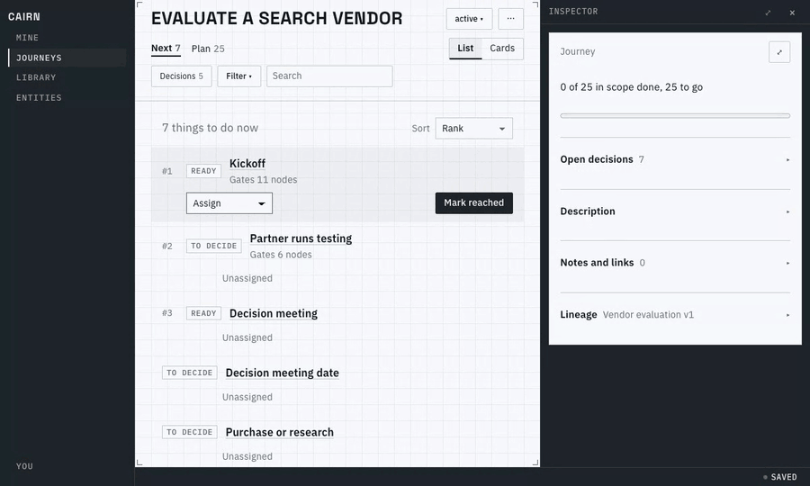
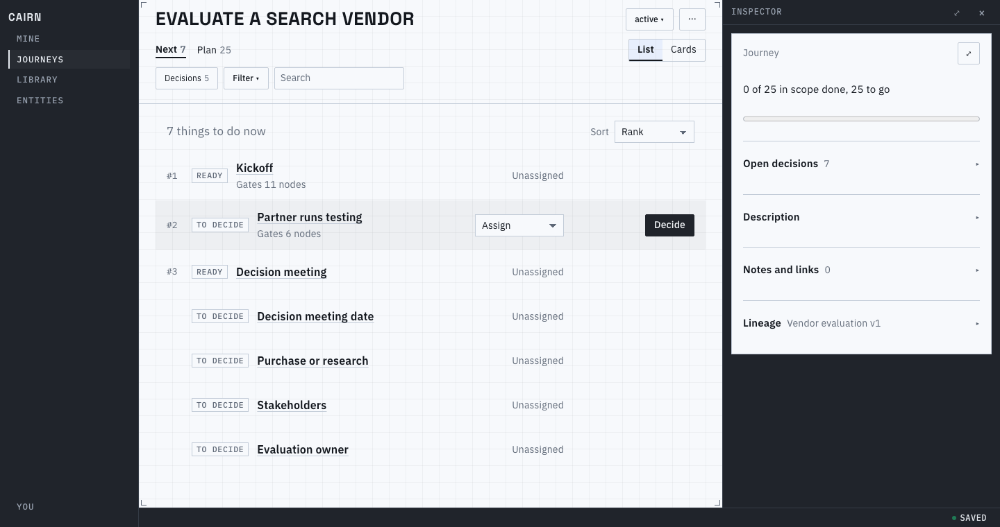
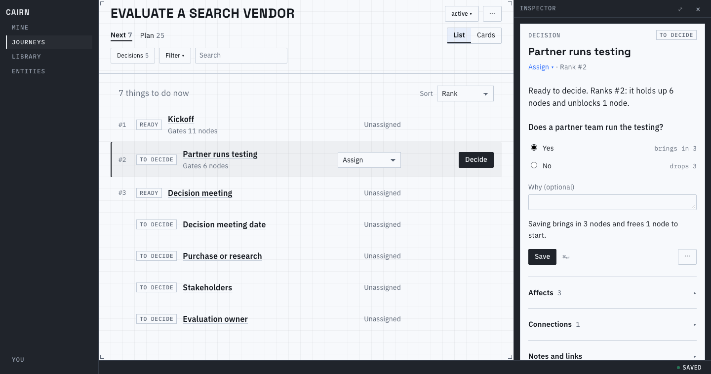
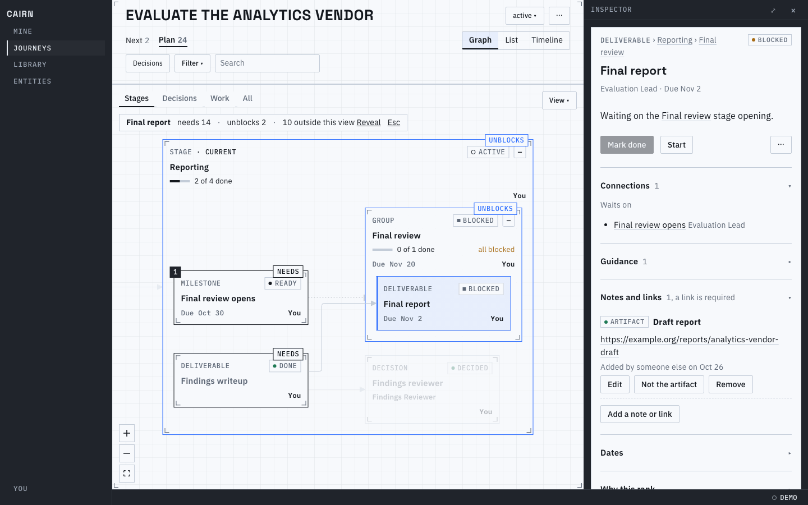
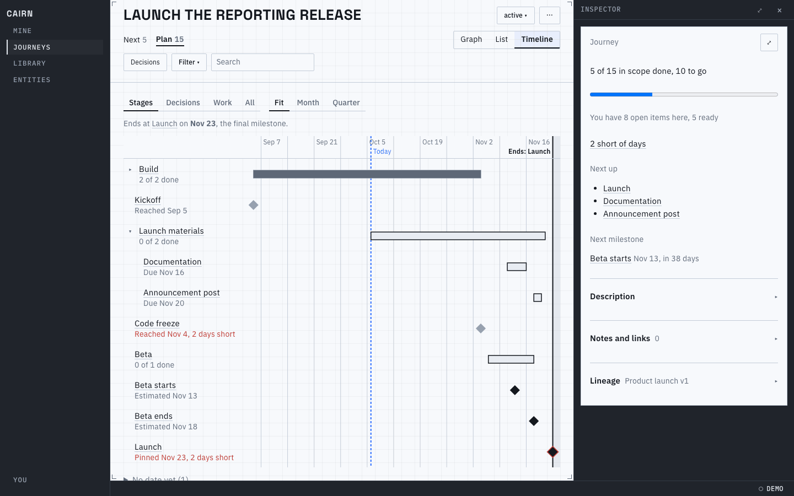
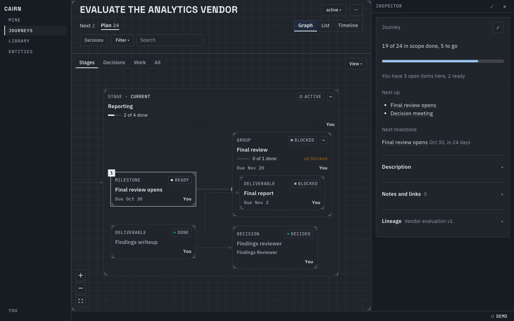

# Cairn

A cairn is a pile of stones that marks a trail. Cairn does the same for work that has many
steps, several people, and choices to make along the way: it shows where you are, what is
waiting on what, and the one thing worth doing next.

It is for anyone who runs the same kind of project more than once (evaluating a vendor,
hiring for a role, launching a product) and keeps finding out too late that something was
needed by Thursday. It also works for one-off projects that have no plan yet.



## How it works

- **A route is your plan, written once.** It lists the steps, the questions to settle, who
  is involved, and the deadlines. You can describe it to an AI assistant, draw it in the
  app, or write it as a file.
- **A journey is one real run of that plan.** "Evaluate a search vendor" is a journey
  started from the vendor evaluation route. It keeps your answers, progress, people,
  dates, and notes. A journey can also start empty and grow as you go.
- **Decisions shape the rest.** Some steps only matter for some projects. Answer "Does a
  partner team run the testing?" with Yes and the partner's steps appear; answer No and
  they drop out. Some questions only open once earlier work is done, so Cairn asks them
  when they make sense.
- **Cairn tells you what to do next.** Of everything you could start now, it puts first
  what has the most riding on it, what is closest to its deadline, and what frees up other
  people's work. It says why, in a sentence.

Several people can work in the same journey at once, and every change is recorded with
who made it and when. AI agents can do everything a person can, by the same rules.

## A look around

### Next: what you can do now

A journey's Next page is a short, ranked list of what is ready, with the decisions that
are waiting on someone. Hover a row to act on it.



### See an answer's effect before you save it

Open a decision and pick an answer. Before you save, Cairn shows what it changes: here,
Yes brings in three steps and frees one to start.



### The graph: what a step needs, and what it unlocks

The Plan page draws the whole journey as a map you can pan and zoom. It opens on the
current stage. Click a step to trace it: Cairn marks what it needs and what it unblocks,
and fades the rest.



### The timeline: will the dates work?

The timeline lays the plan out by date. When a deadline can no longer be met, it says so
plainly, on the dates it affects ("2 days short").



### Light or dark

Cairn follows your system's theme.



## Try it

You need [mise](https://mise.jdx.dev), which installs the rest. From a clone:

```sh
mise install   # the pinned Rust, Node, and build tools
npm ci         # the web app's packages
```

**The demo in your browser.** No server and no account: the app runs in the page with a
few sample journeys (a vendor evaluation, a hiring loop, a product launch). Nothing is
saved, so a reload starts fresh.

```sh
mise run build:wasm
(cd web/app && npx vite)   # then open http://127.0.0.1:5173/
```

**The real thing, on your machine.** This builds Cairn and runs it with a local database,
signed in as a development user.

```sh
mise run serve   # then open http://127.0.0.1:8080/
```

It starts empty. To get going, open Library, choose New, then "Import a file…", and pick
one of the sample routes, such as `fixtures/vendor-evaluation/route.yaml`. Publish the
draft, then start a journey from it.

## Use it with an AI agent

Agents get the same abilities as people, through an HTTP API under `/api/` and an MCP
server at `/api/mcp`. Point a coding agent or chat assistant at a running Cairn and it can
start a journey, walk the open decisions, record progress, and answer "what's next?".
[`instructions/`](instructions/SKILL.md) teaches an agent how. Cairn can also run its own
in-app assistant when one is configured.

## Run your own

Cairn is one binary over one database file. It serves the app, the API, and the MCP
server on one port, and leaves TLS to a proxy in front of it. Sign-in can use your
identity provider (OIDC), Tailscale, or Google Cloud IAP. [`docs/running.md`](docs/running.md)
covers configuration, sign-in, proxies, upgrades, and backups.

## Develop

Tools are pinned in `mise.toml`; tasks live in `mise-tasks/`.

```sh
mise run check        # every rung of the validation ladder
mise run check:fast   # rungs 1 to 3: the inner loop
mise run check:fast dates   # only the Rust tests, Vitest files and Playwright spec matching a filter
mise run check:1      # one rung
mise run gen          # regenerate the generated files
mise run sim          # simulation campaigns under patina; not part of check
mise run build        # the release binary, with the web build embedded
mise run serve        # a local deployment from cairn.dev.toml
```

CI runs `mise run check` on every push and nightly, and `mise run sim` nightly.

More reading:

- [`PRD.md`](PRD.md): what Cairn does, with its glossary.
- [`ARCHITECTURE.md`](ARCHITECTURE.md): how it is built.
- [`PRACTICES.md`](PRACTICES.md): how code is written and checked.
- [`DESIGN.md`](DESIGN.md): the look and feel.
- [`AGENTS.md`](AGENTS.md): where an agent changing Cairn starts.
- [`briefs/`](briefs/README.md): the milestones that built Cairn, with their proofs.
- [`decisions/`](decisions/README.md): judgment calls awaiting review, one file each.

## Built with

[React Flow](https://reactflow.dev) (xyflow, MIT) draws the graph, [ELK](https://eclipse.dev/elk/)
lays it out, and the fonts are Space Grotesk and IBM Plex (SIL OFL 1.1). The graph's
attribution badge is hidden, as React Flow's licence allows; xyflow asks organizations that
hide it in commercial use to subscribe to [React Flow Pro](https://reactflow.dev/pro) or
[sponsor the project](https://github.com/sponsors/xyflow), and a deployment that does is
following its request.

## License

[Apache-2.0](LICENSE).
