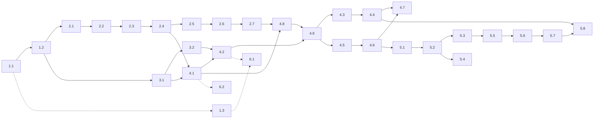

# Cairn: feature briefs

A brief is an implementation milestone: what to build next, in what order, and how to show it works. It points into `PRD.md`, `ARCHITECTURE.md`, and `PRACTICES.md` by requirement id and section heading and does not restate them; where a brief and a document disagree, the document wins (`AGENTS.md`).

Files are named `<phase>.<step>-<slug>.md`. Phases run in order; within a phase, steps run in order unless the table says otherwise. 4.8 and 4.9 finish what 4.1 and 4.2 start once the engine is complete, so they run before 4.3 and 4.5, which depend on them ([`decisions/2026-10-06-the-service-and-api-split-at-the-engines-2-4-boundary.md`](../decisions/2026-10-06-the-service-and-api-split-at-the-engines-2-4-boundary.md)).

## Template

1. **Header**: id, title, crates or packages, depends on.
2. **Goal**: one paragraph.
3. **Governing**: PRD ids; ARCHITECTURE and PRACTICES sections by heading.
4. **Scope**: in, and out where a neighbor could build the same thing.
5. **Acceptance**: behavior by PRD id and scenario; the planted bug; the rungs this brief adds to the ladder, if any (PRACTICES, Growing the ladder); fixtures used. Every brief also leaves `briefs/proof/<id>/` (AGENTS, Leave proof).
6. **Decisions left to the implementer**.
7. **Decision log**: appended by the implementer, for small calls; calls that matter go in `decisions/`, one new file per decision (AGENTS).

## The cut

| Id | Title | Crates or packages | Depends on | Status |
|---|---|---|---|---|
| 1.1 | Workspace, lints, tasks, CI | root, `mise.toml`, `.github/` | - | landed |
| 1.2 | Schema and fixtures | `crates/schema`, `fixtures/`, `schema/` | 1.1 | landed |
| 1.3 | Simulation spike: tokio and axum under the shim | `testbeds/spike` | 1.1 | landed |
| 2.1 | Engine core: model, apply, state machines, events, replay | `crates/engine` | 1.2 | landed |
| 2.2 | Relevance, effective dependencies, effective skip, participation | `crates/engine` | 2.1 | landed |
| 2.3 | Date network | `crates/engine` | 2.2 | landed |
| 2.4 | Auto-reach, blocking, frontier, snooze, stalled, stale, derived guards | `crates/engine` | 2.3 | landed |
| 2.5 | Gravity, leverage, rank | `crates/engine` | 2.4 | landed |
| 2.6 | Projections | `crates/engine` | 2.5 | landed |
| 2.7 | Route files, upgrade, save-as-route, re-link, proposal documents | `crates/engine` | 2.6 | landed |
| 3.1 | Store trait, memory and Turso backends, conformance suite | `crates/store`, `crates/store-turso` | 1.2 (beside phase 2) | landed |
| 3.2 | Auth providers, users, identities, agent tokens | `crates/auth` | 3.1 | landed |
| 4.1 | Service layer, composition root, capabilities, notifier | `crates/service`, `crates/store` (notifier) | 2.4, 3.1 | landed |
| 4.2 | HTTP API, OpenAPI, SSE, TypeScript client | `crates/api`, `openapi/`, `web/client` | 4.1, 3.2 | landed |
| 4.3 | MCP server and shipped instructions | `crates/mcp`, `instructions/` | 4.9 | landed |
| 4.4 | Assistant | `crates/assistant` | 4.3 | landed |
| 4.5 | Wasm host: engine package, derive worker, in-browser root | `crates/wasm`, `web/wasm` | 4.9 | landed |
| 4.6 | Web client and app shell | `web/client`, `web/app` | 4.5 | landed |
| 4.7 | The binary | `crates/cairn` | 4.4, 4.6 | landed |
| 4.8 | Service completion: priority, projections, proposals, route files | `crates/service` | 2.7, 4.1 | landed |
| 4.9 | HTTP API completion: projections, proposals, route files | `crates/api`, `openapi/`, `web/client` | 4.8, 4.2 | landed |
| 5.1 | Node detail and explanations; notes, links, artifacts | `web/app` | 4.6 | landed |
| 5.2 | Canvas, semantic zoom, trace, layout | `web/app` | 5.1 | landed |
| 5.3 | List, next, triage, decision walkthrough | `web/app` | 5.2 | landed |
| 5.4 | Decision view, timeline, status summary | `web/app` | 5.2 (beside 5.3) | landed |
| 5.5 | Journey index and overview, route screens, entities, identity | `web/app` | 5.3 | landed |
| 5.6 | Authoring | `web/app` | 5.5 | landed |
| 5.7 | Proposal review and its flows | `web/app` | 5.6 | landed |
| 5.8 | Assistant panel | `web/app` | 5.7, 4.4 | landed |
| 6.1 | Multiplayer testbed | `testbeds/multiplayer` | 4.2, 1.3 | landed |
| 6.2 | Durability testbed | `testbeds/durability` | 4.1 | landed |

Rule for links between screens: a screen only links to screens that already exist. The brief that builds a screen adds the entry points into it from earlier screens (5.7 adds "break down" to triage and the upgrade, save-as-route, and re-link entries to the overview; 5.8 mounts its panel on earlier screens).

## Order

Dotted: the simulation track (1.3, 6.1, 6.2). It is exploratory and gates nothing (PRACTICES, Simulation): no other brief depends on it, it runs under `mise run sim`, never `mise run check`, and it can be picked up whenever its dependencies exist or skipped if the spike says the shim cannot carry it.

## Coverage

Every PRD requirement id and named section, mapped to the brief that owns its acceptance. Other briefs may touch an id and cite it under Governing.

| PRD | Owner | Also touched by |
|---|---|---|
| Identity and references | 1.2 | 2.1 (import matching, key minting) |
| Containment | 2.2 (effective graph), 2.4 (what it blocks) | 2.1, 2.3, 2.5 |
| Gating | 2.2 (relevance), 2.4 (blocked, frontier) | - |
| Priority | 2.5 | 2.6, 5.2, 5.3 |
| Invariants: graph structural | 2.1 | 2.2 (cycle check over the effective graph), 2.4 (snooze wait cycles) |
| Invariants: date network | 2.3 | 2.1 |
| Invariants: journey state | 2.1 | 3.1 (revision), 4.1 |
| A1, A1a, A14 | 1.2 | 2.1, 3.1 |
| A2, A3, A4, A6, A7 | 2.1 | 2.2 |
| A5 | 2.2 | 1.2, 2.1 |
| A8, A9 | 2.3 | 1.2, 4.7 |
| A10 | 2.6 | 1.2, 5.1 |
| A11 | 4.1 | 2.1, 5.5 |
| A12 | 5.6 | 4.1, 4.3, 4.4 |
| A13 | 2.7 | 2.1 (fixtures load), 4.8, 4.9, 5.5 |
| A15, A16, A17, A18 | 2.1 | 1.2, 4.1, 4.2 |
| A19 | 4.1 | 3.1, 5.5 |
| B1, B2, B3, B5, B10, B11 | 2.1 | 2.2, 4.1, 5.3, 5.5, 5.6 |
| B4 | 2.1 | 5.6, 2.7 |
| B6 | 2.4 | 2.1, 5.3 |
| B7, B8, B9 | 2.7 | 4.8, 4.9, 5.7 |
| B12 | none (reserved) | - |
| C1, C3, C4, C5, C6, C7, C15 | 5.2 | 2.6 |
| C2 | 2.6 (roll-up rules) | 5.2 |
| C8 | 5.1 | 2.6 |
| C9, C10, C11 | 5.3 | 2.6 |
| C12, C13, C18 | 5.4 | 2.6 |
| C14 | 5.7 | 2.7, 4.8, 4.9 |
| C16, C17 | 5.5 | 3.1, 2.6 |
| D1, D1a | 2.1 | 2.2 |
| D2, D4, D5, D7 | 2.4 | 2.1, 4.1, 4.6 |
| D3, D6 | 2.2 (the `Derived` struct) | every engine brief; 4.8 (memoized reads) |
| E1, E2, E5 | 2.2 | - |
| E3 | 2.1 | 5.1 |
| E4 | 2.6 | 2.2 |
| E6 | 2.1 | 3.1, 4.1, 5.5 |
| F1 to F7 | 2.3 | 2.2, 2.4, 5.1, 5.4 |
| G1, G2 | 2.1 | 5.1, 5.5 |
| G3 | 2.6 | 5.1 |
| H1, H4 | 3.2 | 4.1 |
| H3 | 4.1 | 3.2 (verified emails), 2.2, 5.5 |
| H2 | 4.1 (the actor), 4.8 (the confirming user) | 3.2, 4.4 |
| H5 | 3.1 | 1.2, 2.1, 4.1, 4.2, 6.1 |
| H6 | 4.6 | 4.1, 4.2, 4.5, 5.5, 6.1 |
| I1 | 4.2 | 4.9 |
| I2, I4, I7 | 4.3 | 3.2, 4.8 (I7) |
| I3 | 2.6 | 4.8, 4.9, 4.3 |
| I5 | 4.4 | 5.8 |
| I6 | 4.8 | 2.7, 4.9, 5.7 |
| J1, J2, J3 | 2.1 | 3.1, 6.1, 6.2 |
| J4 | 2.6 | 5.1 |
| J5 | 3.1 | 4.2 |
| Non-functional: Config-first | 5.6 | 4.4 |
| Non-functional: Journey durability | 4.1 (publishing never touches journeys), 4.8 (an upgrade only once confirmed) | 2.7 |
| Non-functional: Structured storage | 3.1 | - |
| Non-functional: Small-team scale | 2.3 (cost test at the limits) | every engine brief |
| Non-functional: Deployable, Observable | 4.7 | 4.2 |
| Non-functional: Portable data | 2.7 (route file round trip, save as route) | 4.8 |
| Non-functional: Domain-free, Naming in code | review of every brief | - |
| Illustrative example | 1.2 (fixtures) | every engine brief |
