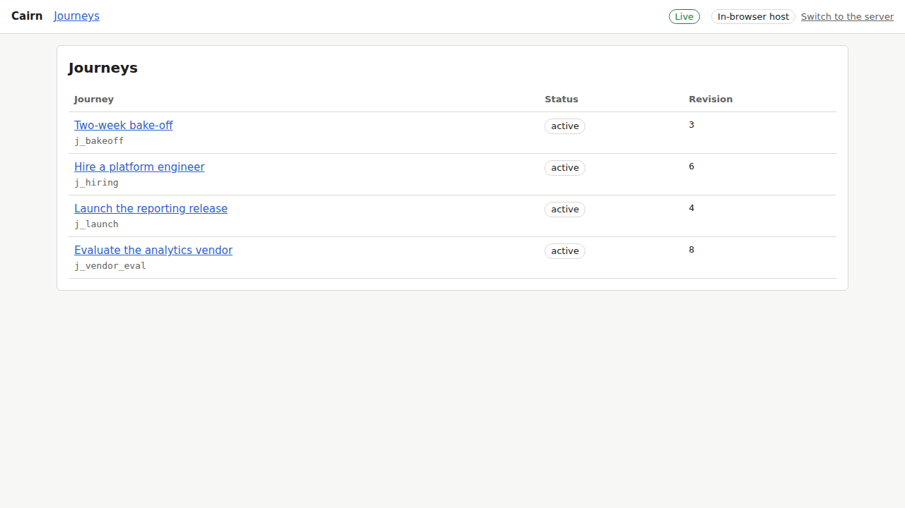
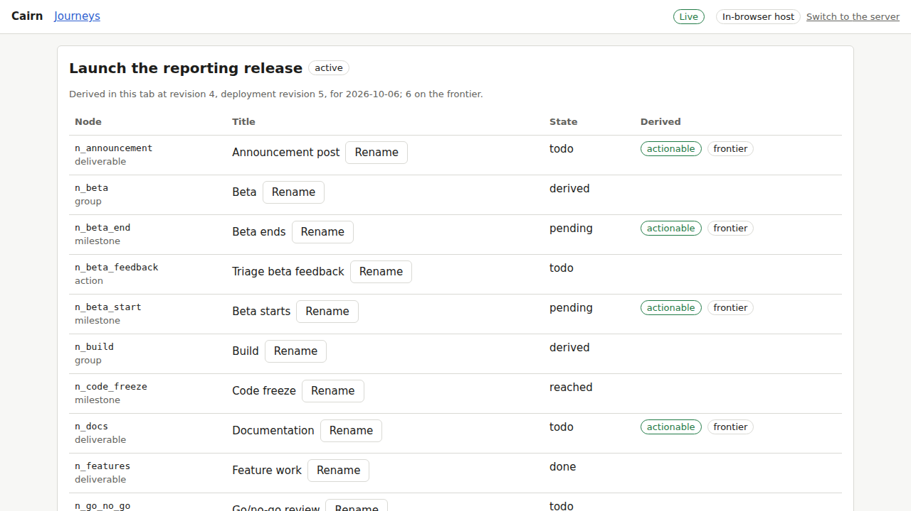
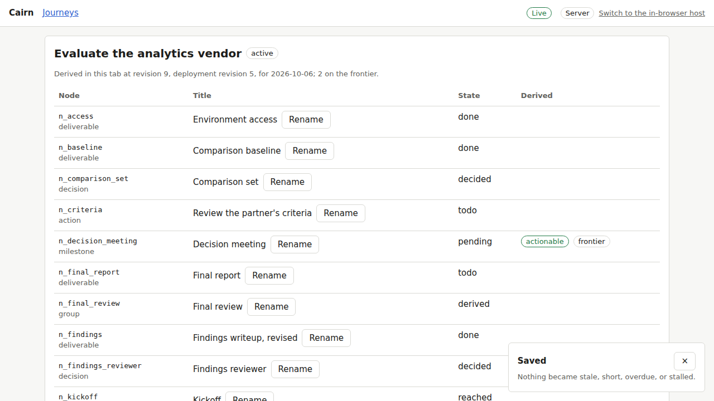
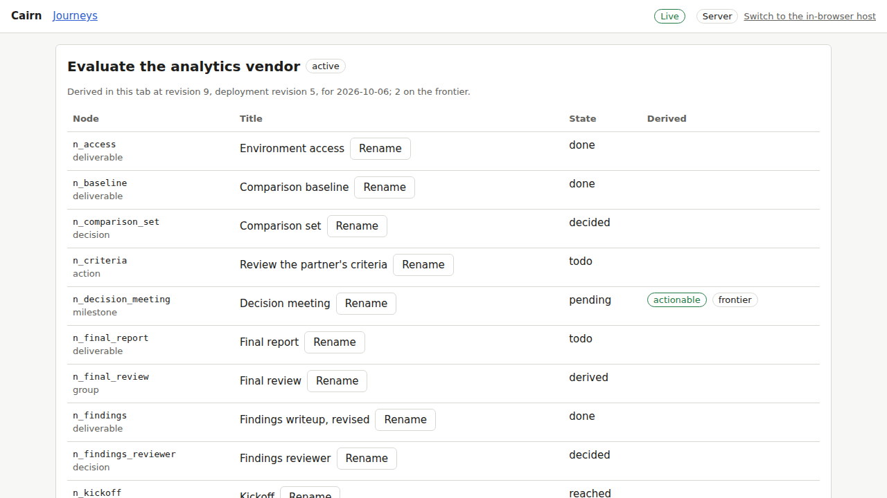
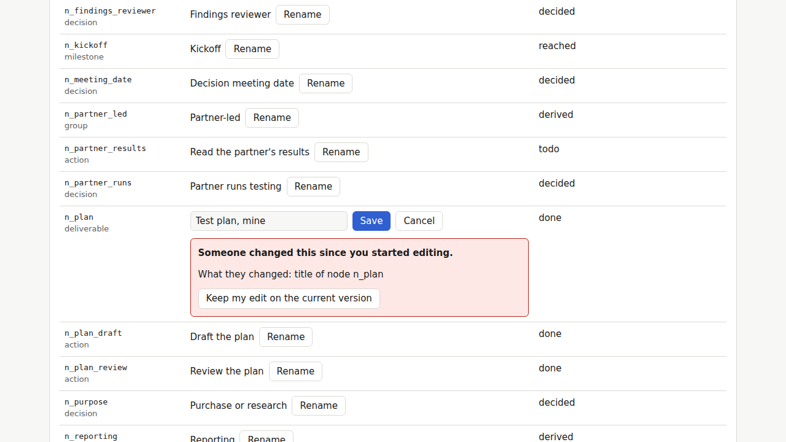
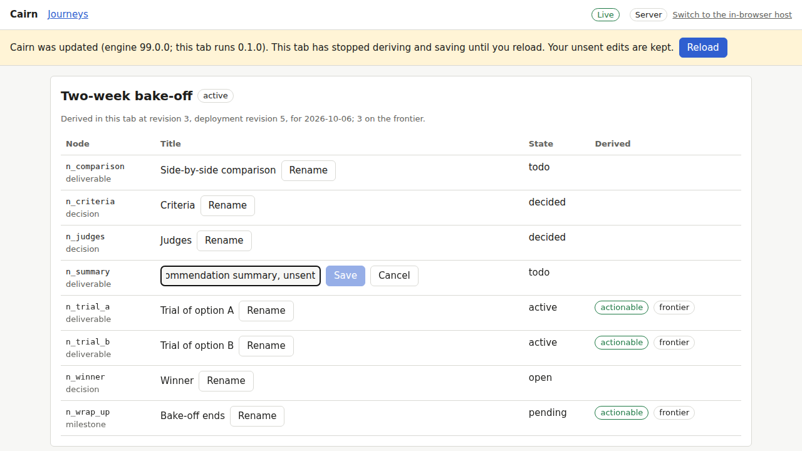
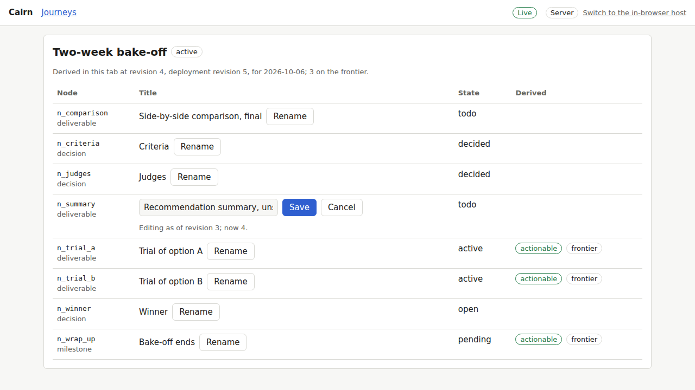

# Proof for brief 4.6: Web client and app shell

Generated by `briefs/proof/4.6/prove.sh`; do not edit by hand. The script fails if any
outcome below differs from the one expected.

Cairn now has a web app. It runs over the server (here the API over the fixtures,
`crates/wasm/examples/fixture_server.rs`, behind Vite's proxy) or over the in-browser host
with no server at all, and one data layer reads either: each journey's domain document is
fetched once per revision and derived in the derive worker, writes go through the client's
safe retry (H5) with their consequences shown (D7), and every open view follows the host's
revision ticks (H6), refetching only what moved. A tab whose engine is older than a document
it fetched stops deriving and writing and asks for a reload, and nothing typed is lost.

## The shell's states

The journey index, seeded from the fixtures, on the in-browser host:



A journey's document derived in the derive worker (the derivation line names the revision,
deployment revision, and today it was derived for):



A rename saved through the write path, with its consequences notice (D7), and the same
journey in another tab, updated with no reload (H6):





Two tabs renaming the same node: the second save is not retried, since what intervened
touched what it touches (H5); the change is shown and the draft kept:



A document from a newer engine (`99.0.0`, as a server deployed meanwhile would send): the
tab stops deriving, saving, and retrying, and asks for a reload:



After the reload, the unsent rename is still there (drafts are kept per tab in session
storage):



The main flow, on the server host: the index, a journey, a rename and its notice, and
another tab's rename arriving live: [main-flow.webm](main-flow.webm).

## The tests

Web unit tests (Vitest, rung 6): the safe retry and the tracker case for case with the Rust
client's, the tick stream's reopening, and the data layer over a fake host.

| Package | Result |
|---|---|
| `web/client` | 27 passed, 0 failed |
| `web/app` | 22 passed, 0 failed |

The app's browser tests (Playwright in Chromium, rung 6), over both hosts:

| File | Test | Result |
|---|---|---|
| browser | the journey index lists every fixture's journey | passed |
| browser | a journey's document is derived in the worker | passed |
| browser | a patch applies through the page's service and the view follows | passed |
| browser | a draft survives a reload | passed |
| server | an edit in one page appears in another | passed |
| server | edits to different nodes both land | passed |
| server | edits to one field surface a conflict | passed |
| server | a later page shows the edit | passed |
| server | a deployment tick refetches the deployment context and re-derives | passed |
| server | version skew stops the tab and asks for a reload, keeping unsent edits | passed |
| server | the server host is chosen when a server answers | passed |

## The planted bug

The tracker comparing each tick with the revision the view fetched first instead of the one
it holds now (`Tracker.fetched` never raising what it holds): the page that comes back to a
journey refetches revisions it already has, and "a later page shows the edit", which counts
the page's document fetches (H6: refetch only when the announced revision is newer), fails:

```text
Expected: 2 Received: 4
```
