# Proof for brief 5.1: Node detail and explanations; notes, links, artifacts

Generated by `briefs/proof/5.1/prove.sh`; do not edit by hand. The script fails if any
outcome below differs from the one expected.

A journey's nodes now open into a detail panel (C8), beside the node list on a wide screen
and above it on a narrow one. Everything it explains comes from the journey's document as
derived in the tab's derive worker, so nothing is fetched to explain a value: why a node is
relevant or not and what decided it, what blocks it and through which ancestor, each date
told apart as pin, actual, or derived with the chain behind it and the pin or rule to edit
(F7), what makes up its gravity and leverage, and who participates and why. Every action is
one patch through the shell's write path, its rejection shown beside it: a pin that
contradicts the plan lists the chain and the moves that resolve it, and any one is sent with
the edit (F5); a milestone pinned by a decision is edited through that decision (E3); a
failed guard can be bypassed with a reason (D4). Notes and typed links are added, edited,
removed, and designated as the node's artifact (G1, G2); message drafts render with the
journey's context and copy (A10, G3); the node's history pages from the host (J4).

All pictures are on the in-browser host, seeded from the fixtures on each load.

## Explanations

Why a node is not relevant, and the ancestor whose condition decided it:

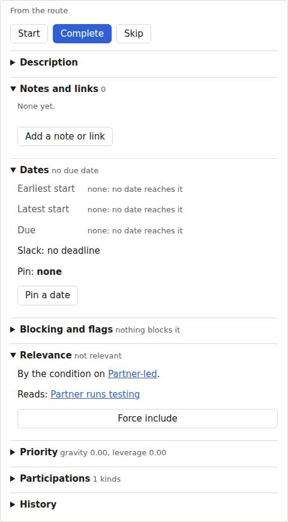

The final report's due date is its pin; its latest start is derived through its estimate,
from that pin. Each says what to edit to move it:

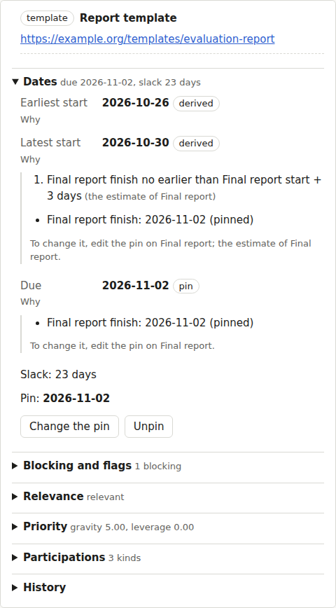

Why it is blocked: through the final review stage, which its opening holds back:

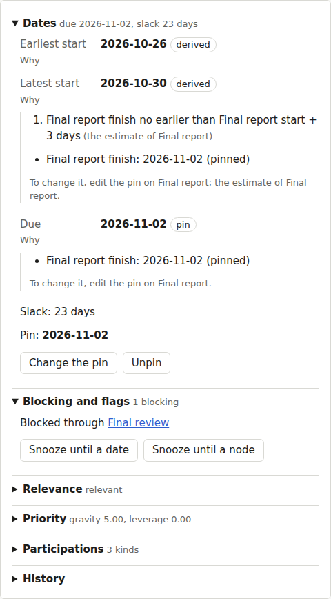

The bake-off's comparison: its gravity and the downstream nodes that make it up, and its
leverage split by owner (completing it frees work someone else owns):

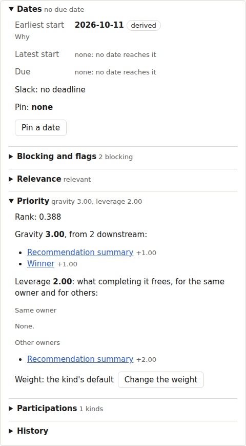

Its participations, each with where it comes from (a role, an ancestor, the default owner):

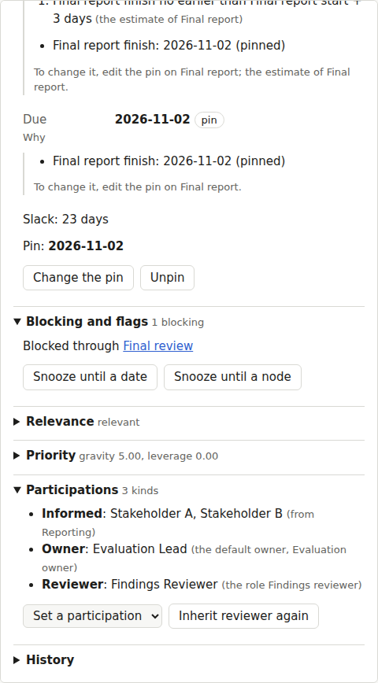

## A pin that contradicts the plan, resolved inline (F5)

Pinning the final report after the decision meeting it must finish before is rejected with
the contradictory chain and the moves that each give it the days it lacks:

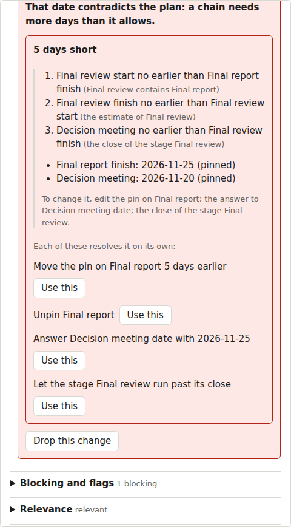

Choosing "move the pin earlier" sends the edit with that move as one patch:

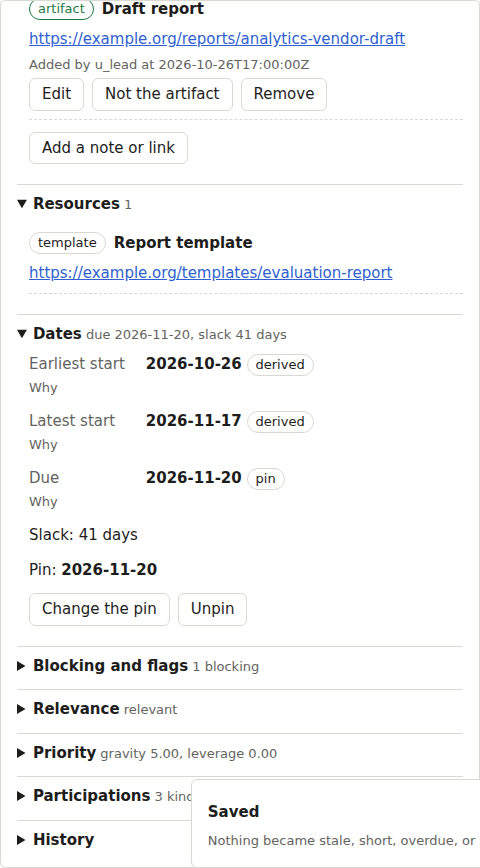

## Notes, links, and artifacts (G1, G2, D4)

A note, in markdown, attributed and timestamped:

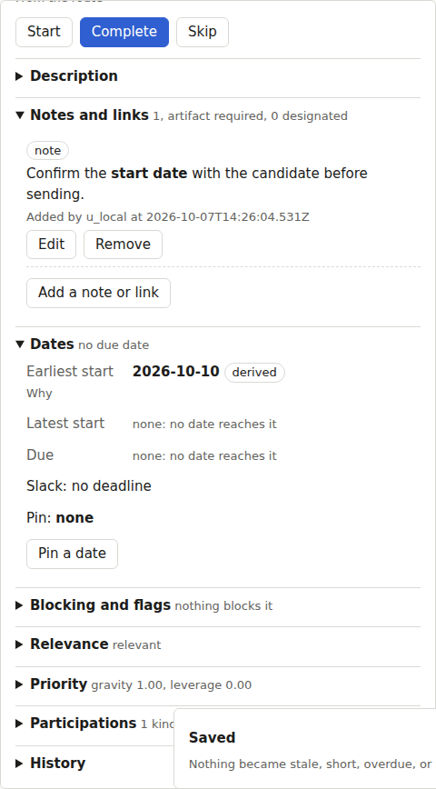

A reference link on the documentation deliverable, which requires an artifact:

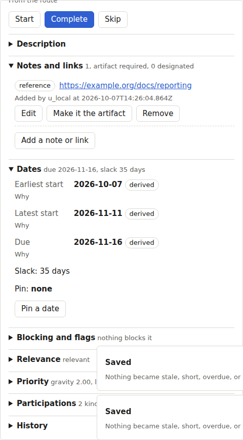

The link designated as the artifact, and the deliverable completed:

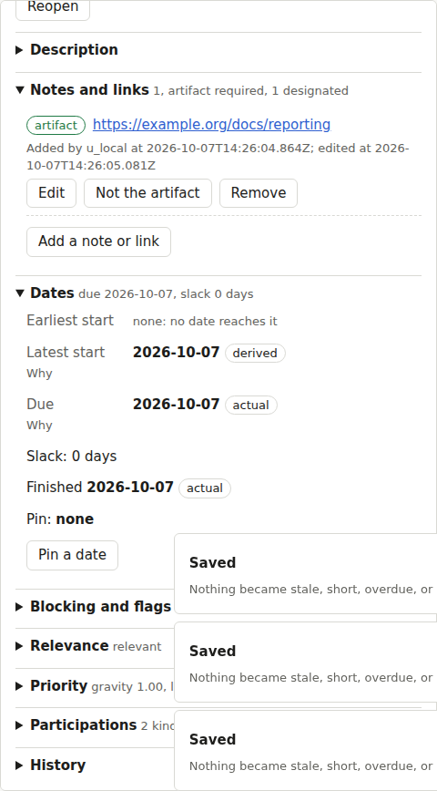

The artifact removed after completion: the deliverable stays done and is `stale` with
"missing artifact", and the notice names what the patch newly caused (D7):

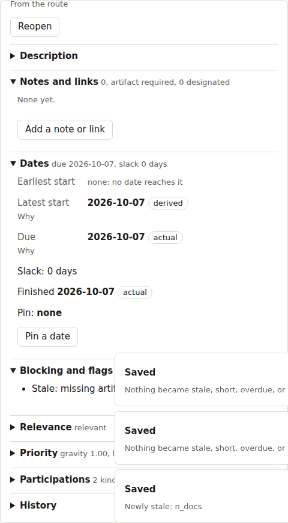

## A message draft (A10, G3)

The access request rendered with the journey's name, the evaluation owner's name, and the
purpose answer, ready to copy:

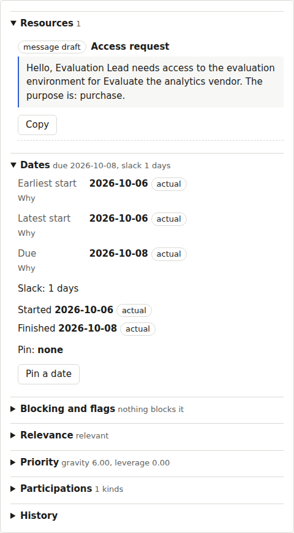

## Themes and a narrow screen

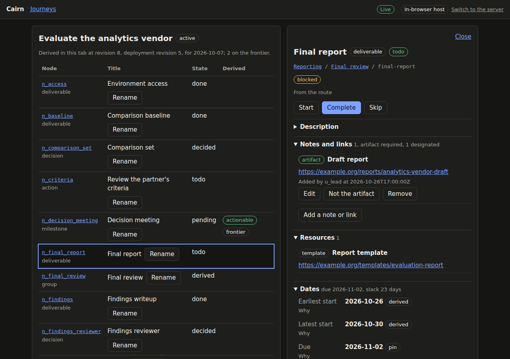

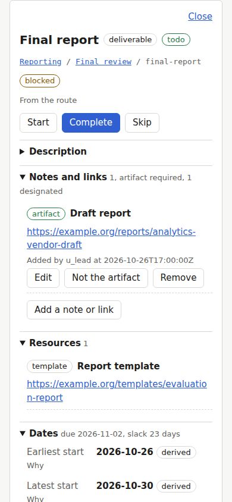

The main flow: the final report's due chain, a later pin rejected and resolved with a move,
and an artifact designated and completed: [main-flow.webm](main-flow.webm).

## The tests

The app's web unit tests for the panel (Vitest, rung 6):

| File | Result |
|---|---|
| `src/detail/DatesSection.test.tsx` | 3 passed, 0 failed |
| `src/detail/actions.test.ts` | 14 passed, 0 failed |
| `src/detail/attachments.test.ts` | 8 passed, 0 failed |
| `src/detail/explain.test.ts` | 6 passed, 0 failed |
| `src/detail/model.test.ts` | 16 passed, 0 failed |
| `src/ui/markdown.test.tsx` | 3 passed, 0 failed |

The panel's browser tests (Playwright in Chromium, rung 6, `web/app/e2e/detail.spec.ts`):

| Test | Result |
|---|---|
| the final report's detail reads its due chain and what to edit (C8, F7) | passed |
| relevance names the decision that produced it (C8, Gating) | passed |
| priority lists gravity's contributors and leverage split by owner (C8, Priority) | passed |
| a later pin is rejected with its chain and resolved with a listed move (F5) | passed |
| a milestone's pin is edited through the decision that feeds it (E3) | passed |
| a designated artifact completes the node; removing it leaves it done and stale (G1, G2, D4) | passed |
| a failed guard is shown and bypassed with a reason (D4) | passed |
| a note is added, edited, and removed, attributed and timestamped (G1) | passed |
| a message draft renders with the journey's context and copies (A10, G3) | passed |
| history pages the node's events, grouped by patch (J4) | passed |
| an unsent note survives a reload | passed |
| an unsent note stays with its node when another node is opened | passed |
| an unsent skip reason survives a reload | passed |
| a rejection and an unsent bypass reason survive a reload (D4) | passed |
| on a narrow screen the panel sits above the list with nothing off the side | passed |
| over the server, a resolution never overwrites a pin someone set meanwhile (F5, H5) | passed |
| over the server, a note added in one page appears in another's panel (H6) | passed |

## The planted bug

Derived dates shown without their chain (the panel keeps the chain only for pins and
actuals): F7's unit test "shows a derived date with its chain" fails:

```text
FAIL  src/detail/DatesSection.test.tsx > DatesSection (F7) > shows a derived date with its chain: every link, the dates fixed on it, and what to edit AssertionError: expected +0 to be 1 // Object.is equality
```
