# Proof for brief 5.2: Canvas, semantic zoom, trace, layout

Generated by `briefs/proof/5.2/prove.sh`; do not edit by hand. The script fails if any
outcome below differs from the one expected.

A journey is now a pannable, zoomable flowchart (C1, C3) in place of 5.1's node list. Each
card shows its kind, title, state, owner (or "unassigned"), and due date; a decision shows its
prompt and answer. Explicit `requires` edges are solid and implicit gates (conditions, stage
openings) dotted, each labeled with its source. Not-relevant nodes are grayed and undecided
ones ghosted, each with a toggle that hides them; each kind shows or hides on its own, with
what is hidden rolled up into its nearest visible container by the engine's level (C2): a
hidden action is a checklist item on its deliverable (C4), and work whose prerequisite has no
visible stand-in carries a "hidden prerequisites" marker that opens the trace. A container
opens as its own canvas and the breadcrumb leads back out (C4). The frontier and active work
are outlined, the viewer's own items marked, and the top-ranked few carry numbered badges; a
journey with nothing to act on shows what it waits on (C5). Due dates carry a quiet urgency
color, latest start and slack sit beside them, gravity weighs each border, and a heat toggle
shows gravity and leverage as numbers (C6). Tracing a node marks its upstream and downstream
across levels, with its gravity contributors, on the canvas as an overlay (C7). ELK lays it out
in a worker, left to right, deterministically, with the previous positions as hints (C15). A
route's graph has its own canvas, with no journey state. A card opens 5.1's node detail beside
the canvas.

All pictures are on the in-browser host, seeded from the fixtures on each load.

## The whole journey and semantic zoom (C1 to C5)

The vendor evaluation with every kind shown: the decision meeting and the final review's
opening are the frontier, ranked 1 and 2; Partner-led is not relevant and grayed; the kickoff's
stage opening and the two conditions are dotted:

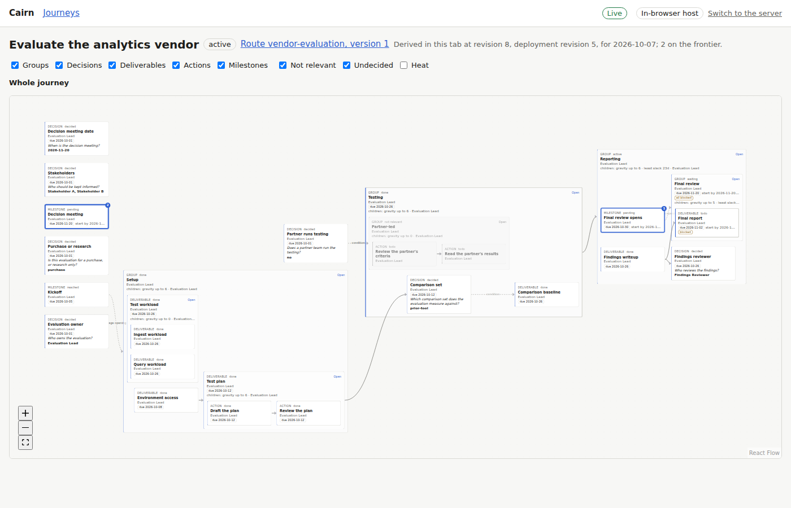

Actions hidden: the test plan's two actions are its checklist:

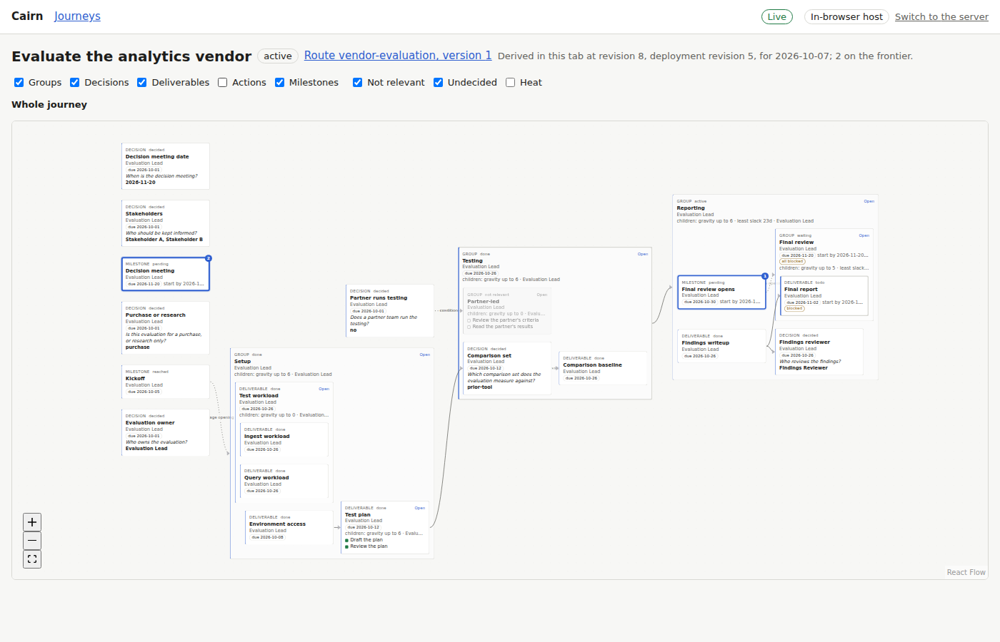

Groups only: everything else rolls up into its group, and the edges into the final review
collapse into one:

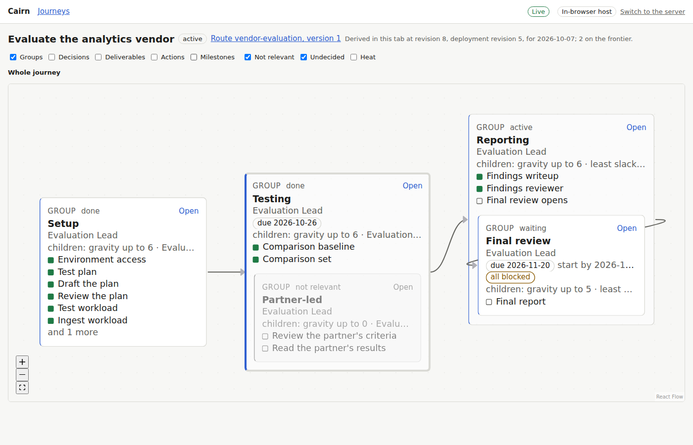

Groups and milestones hidden: the final report waits on the final review's opening, which has
no visible stand-in, so it carries the hidden-prerequisites marker:

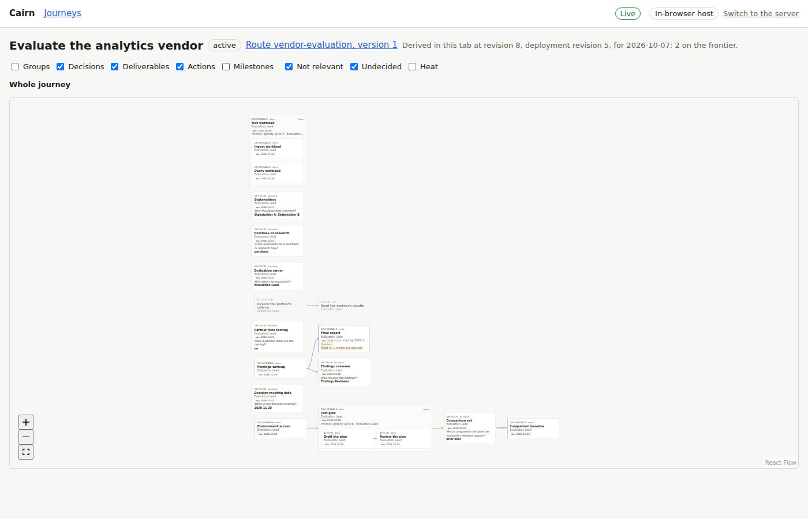

Drilled into Setup, with the breadcrumb back out:

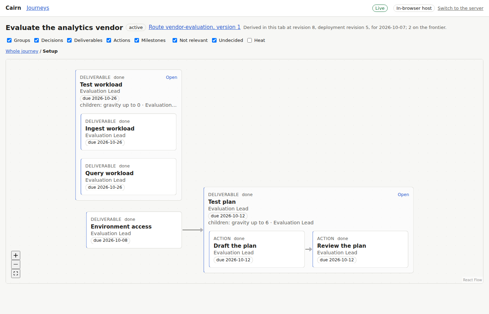

## The trace and the heat overlay (C6, C7)

The test plan traced: its upstream (environment access, its actions, the kickoff), its
downstream through Testing and Reporting, and the two nodes still adding to its gravity:

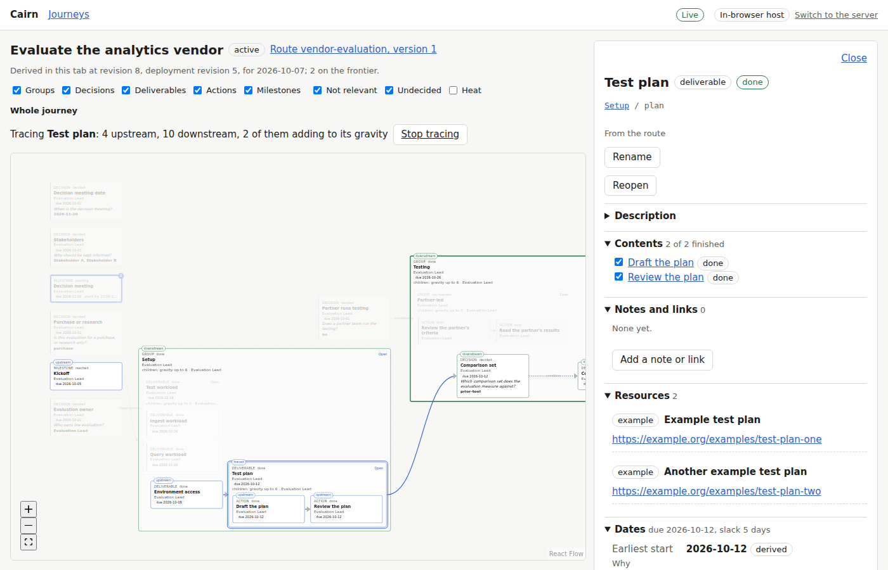

The hiring loop with the heat overlay:

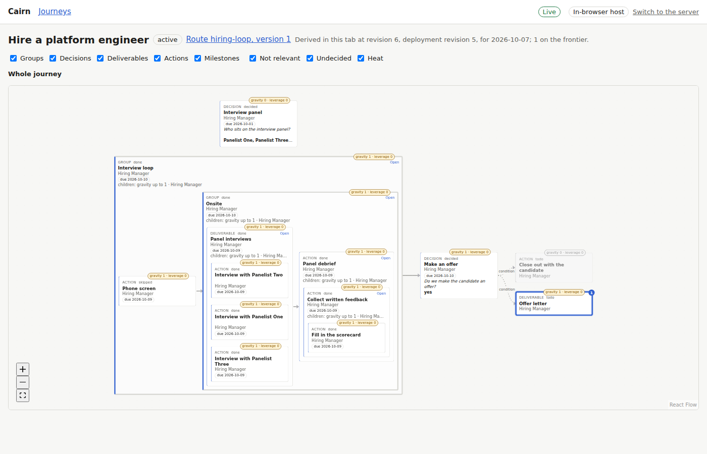

## Undecided work and hidden decisions (C1, C2)

The hiring loop's offer decision reopened: the offer letter and the close-out are undecided,
ghosted:

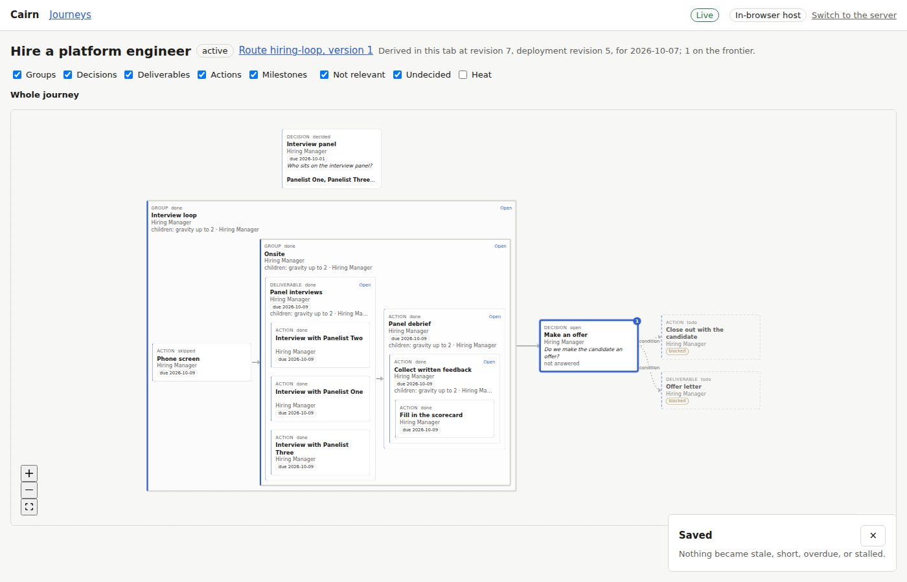

Decisions hidden: both carry the marker for the decision they wait on:

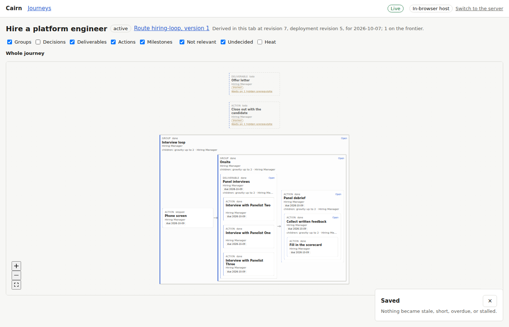

The marker opens the trace, which names the hidden decision:

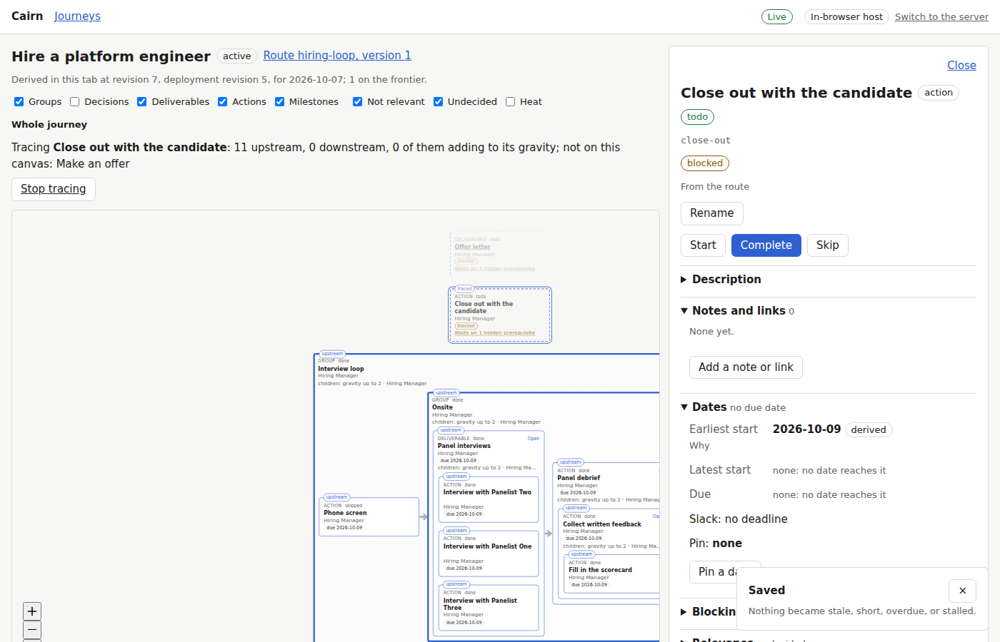

## The stalled surface (C5, D5)

The hiring loop's only acting item snoozed: nothing can be acted on, and the surface says what
the journey waits on:

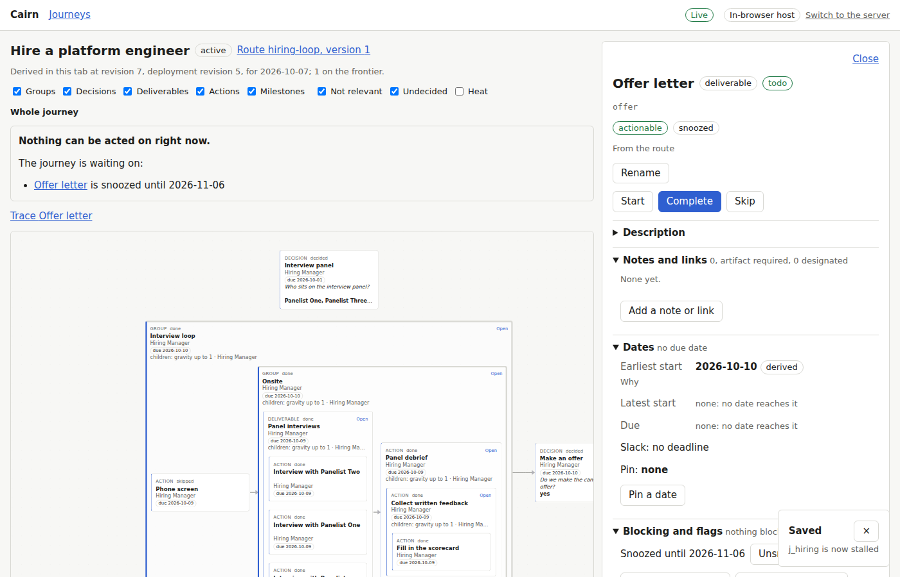

## A route's canvas, a dark theme, a narrow screen

The vendor evaluation's route, version 1, with no journey state:

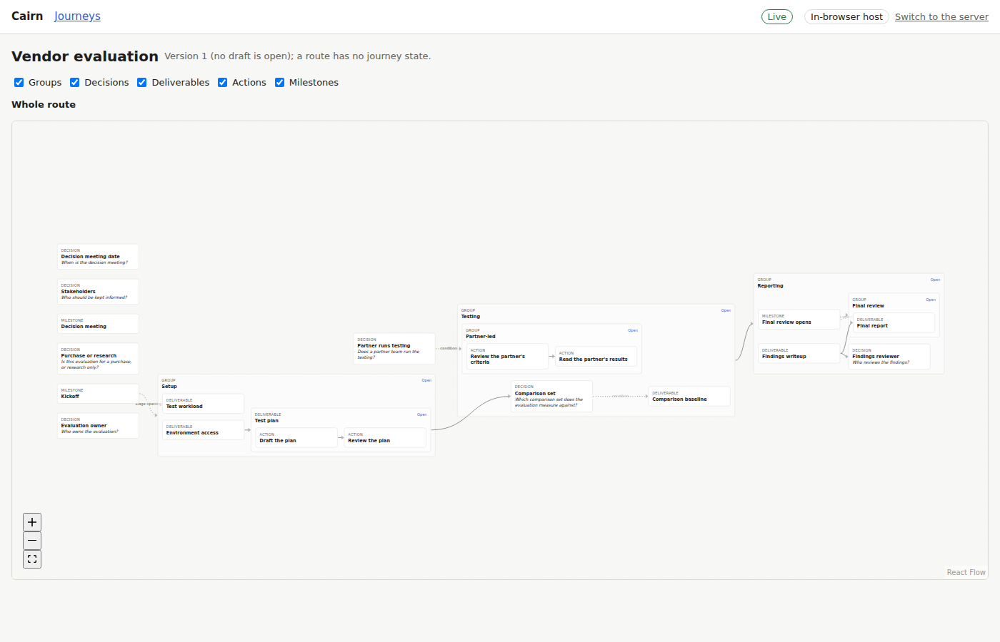

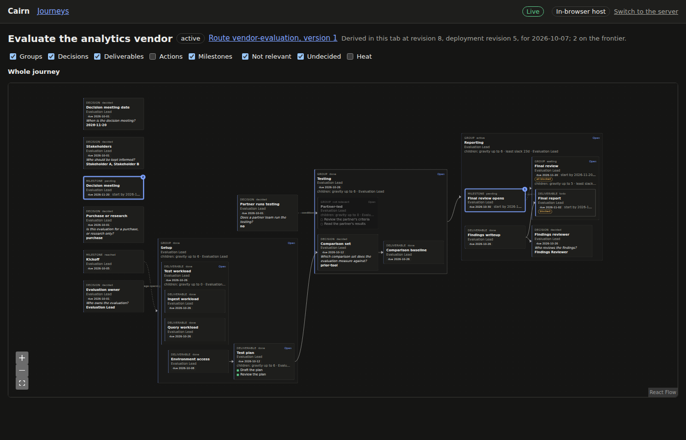

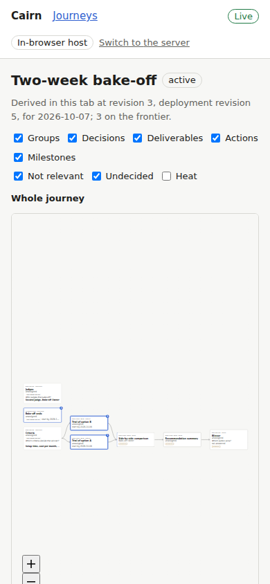

The main flow: kinds hidden and shown again, Setup drilled into and back out, the test plan
opened and traced: [main-flow.webm](main-flow.webm).

## The layout (C15)

Two pages laying out the vendor evaluation: identical positions for all 27 nodes.

One action added under Reporting, requiring the findings (on the server host, the view's
previous positions as hints): 5 of 27 nodes moved within their containers
(`n_reporting`, `n_final_review`, `n_findings`, `n_findings_reviewer`, `n_review_opens`), under the stated bound of a quarter ([`decisions/2026-10-07-the-layout-is-hinted-by-the-views-last-positions-a-fresh.md`](../../../decisions/2026-10-07-the-layout-is-hinted-by-the-views-last-positions-a-fresh.md)).

## The tests

The canvas's web unit tests (Vitest, rung 6):

| File | Result |
|---|---|
| `src/canvas/hooks.test.ts` | 4 passed, 0 failed |
| `src/canvas/layout.test.ts` | 10 passed, 0 failed |
| `src/canvas/model.test.ts` | 27 passed, 0 failed |

The canvas's browser tests (Playwright in Chromium, rung 6, `web/app/e2e/canvas.spec.ts`):

| Test | Result |
|---|---|
| C2: actions hidden renders the level's node set | passed |
| C2: groups only renders the level's node set | passed |
| C2: drilled into Setup, every kind renders the level's node set | passed |
| C2: groups and milestones hidden renders the level's node set | passed |
| C2, C4: hidden actions are their deliverable's checklist, and a hidden prerequisite is marked | passed |
| C4: drill into a container and back out | passed |
| C1: explicit edges solid, implicit gates dotted with their source; not relevant grayed and hideable | passed |
| C5, C6: the frontier is marked with rank badges; gravity weighs borders; heat shows numbers | passed |
| C7: the trace of the test plan marks its upstream, downstream, and gravity contributors | passed |
| C1, C2: hiding decisions marks the work they block, and the marker opens the trace | passed |
| C1: hiding undecided nodes takes them off and leaves the decision | passed |
| C5, D5: the stalled surface names what the journey waits on | passed |
| C15: the same graph lays out identically twice | passed |
| C15: a view toggled to lays out as it does when opened directly | passed |
| a rename started on one node does not follow the panel to another | passed |
| C15: adding one node to the fixture moves fewer than the stated fraction of its nodes | passed |
| a route's canvas draws its graph with no journey state, by the same rules | passed |

## The planted bug

Implicit edges drawn solid (`look.ts` drops the dotted dash): C1's unit tests for the
condition gate and the stage opening fail:

```text
FAIL  src/canvas/model.test.ts > C1: cards and lines > the condition gate edge n_choose->n_option is drawn with the dash its kind gives, named by its source FAIL  src/canvas/model.test.ts > C1: cards and lines > the stage opening edge n_kick->n_stage is drawn with the dash its kind gives, named by its source
```
