# Proof for brief 5.3: List, next, triage, decision walkthrough

A journey now has three acting screens beside its canvas: the next list in rank order with why
each item ranks there, the list as a filterable table whose bulk actions go as one patch, and
triage one card at a time, whose decisions-only mode is the walkthrough a new journey opens on.

## Screens

A fresh vendor evaluation opens the walkthrough on every decision actionable at its start:
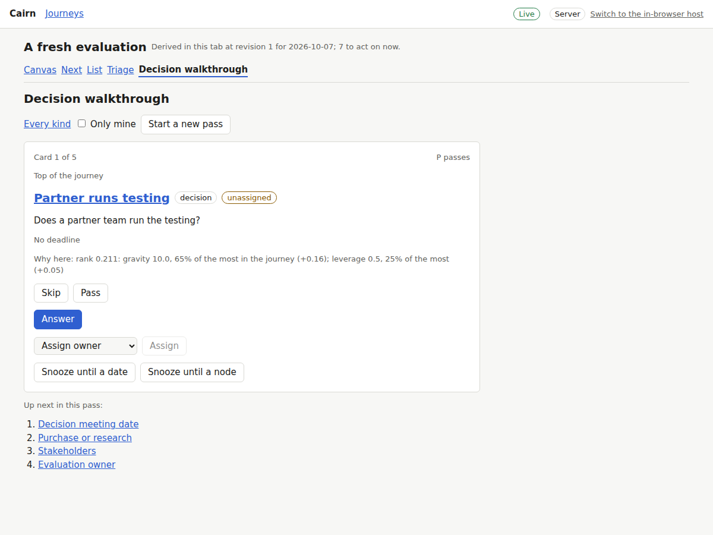

Answering that a partner runs the testing surfaces the partner-led work in the same pass:
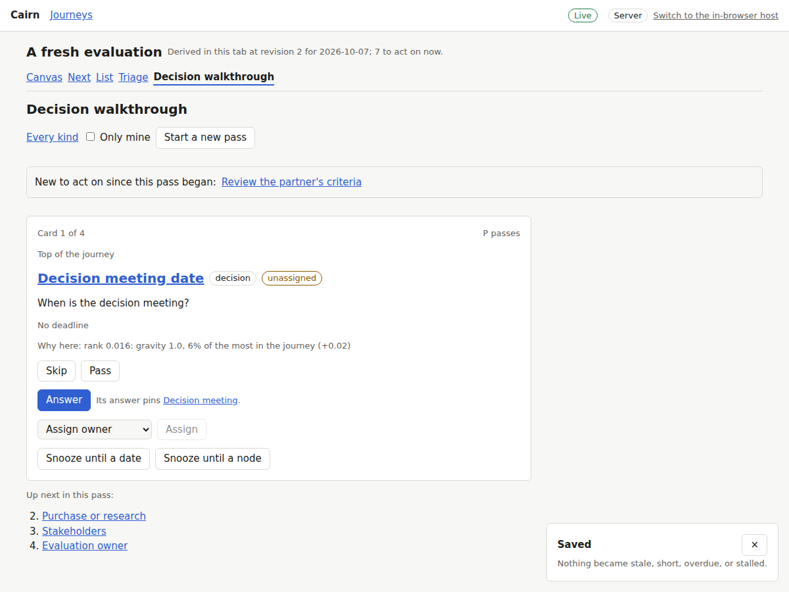

Triage of every kind, one card at a time:
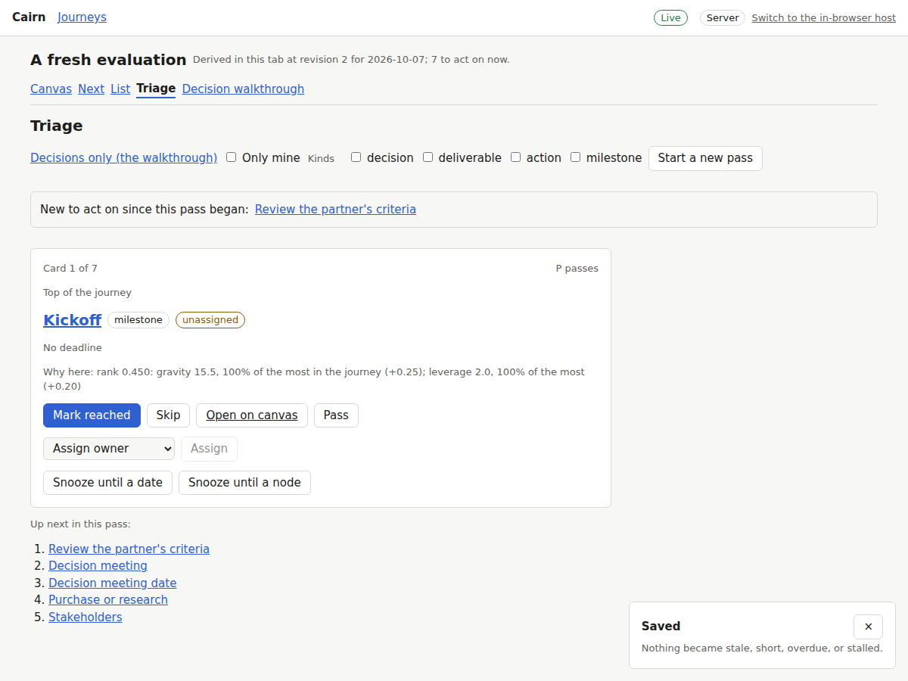

A placeholder's card offers mark atomic and snooze, and no done:
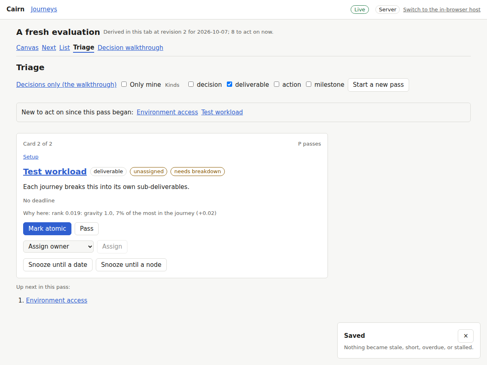

With every decision skipped, the walkthrough shows what would unblock the next ones:
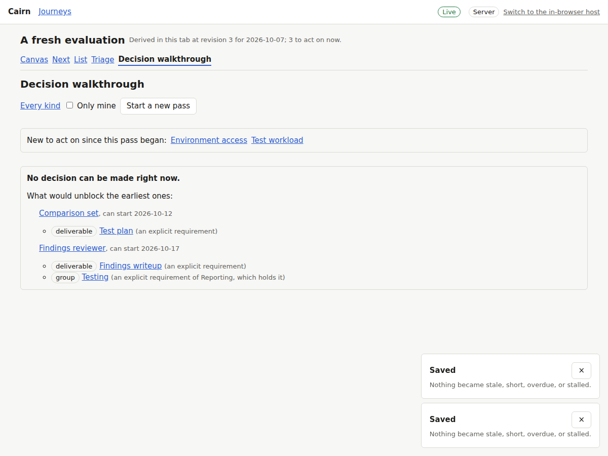

The product launch's next list, each item with its breadcrumb and why it ranks there:
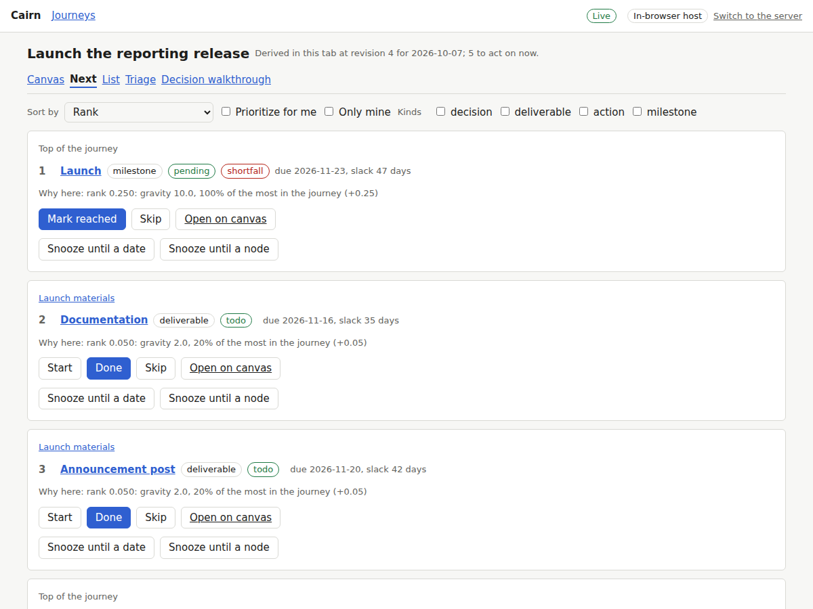

The same list re-sorted by slack:
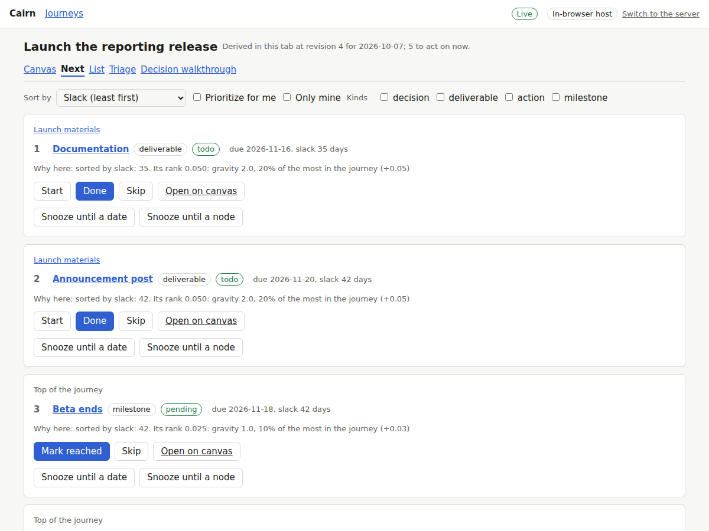

The only acting item snoozed: the journey is stalled, and the panel offers unsnooze:
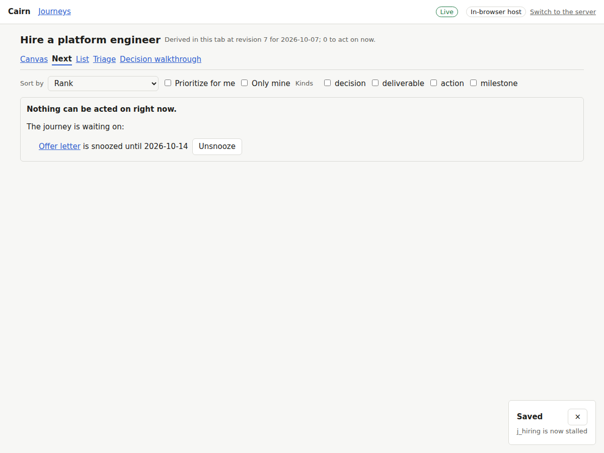

The list filtered to deliverables and actions, grouped by container:
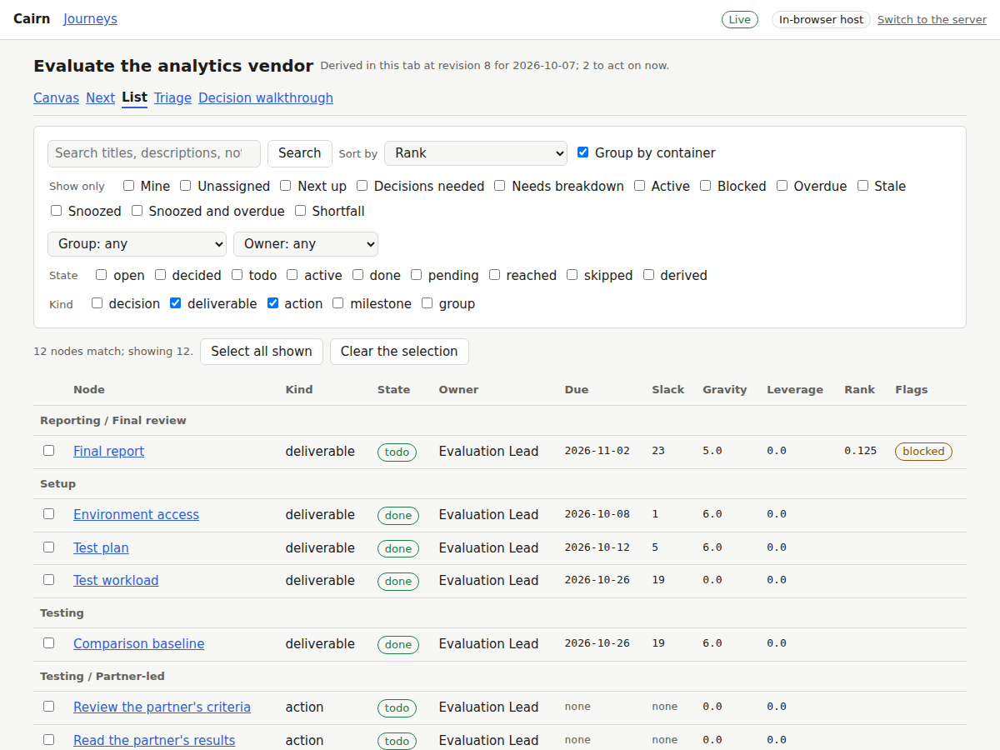

Search reads notes: "environment team" finds the node whose note says it:
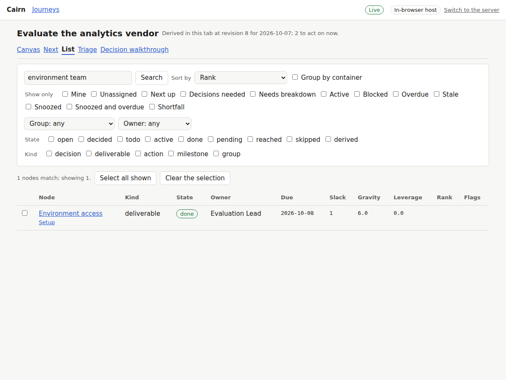

A bulk done where one node fails its guard is rejected whole, naming that node:
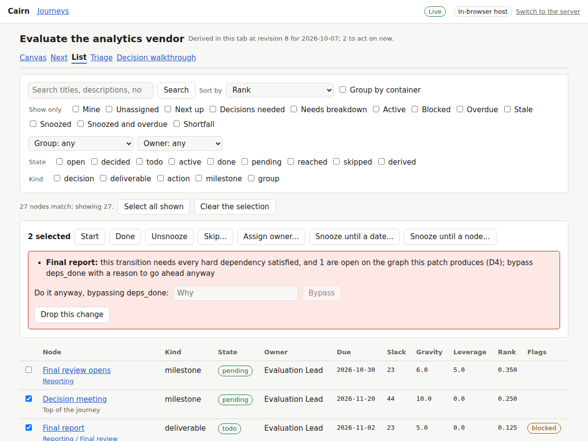

Two nodes snoozed in one patch until the beta ends:
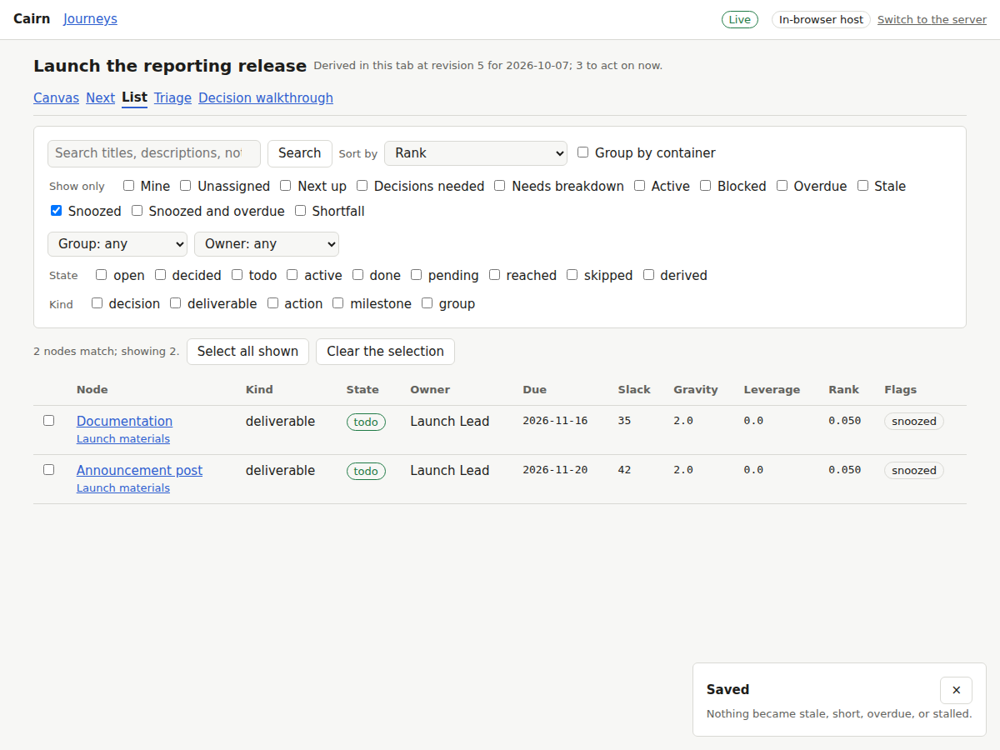

The main flow: the walkthrough, the partner decision answered, a pass, triage, and the next
list: [main-flow.webm](main-flow.webm).

## The next list's order

| By rank | Rank | Slack | By slack | Slack |
|---|---|---|---|---|
| `n_launch` | 0.2500 | 47 | `n_docs` | 35 |
| `n_docs` | 0.0500 | 35 | `n_announcement` | 42 |
| `n_announcement` | 0.0500 | 42 | `n_beta_end` | 42 |
| `n_beta_end` | 0.0250 | 42 | `n_launch` | 47 |
| `n_retro` | 0.0250 | none | `n_retro` | none |
