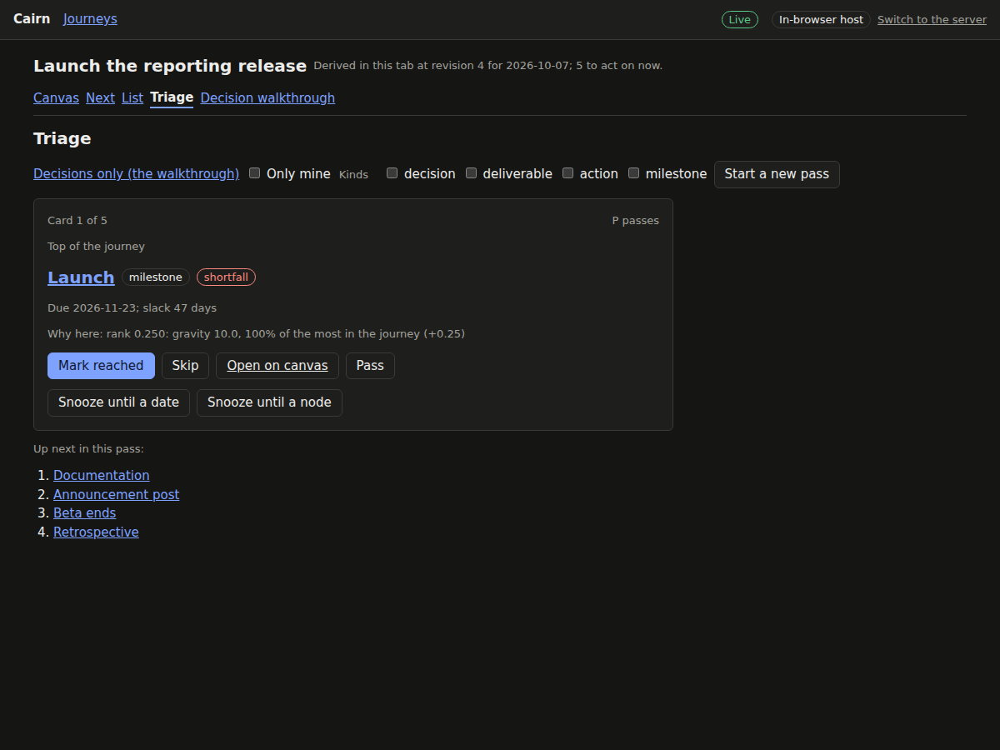
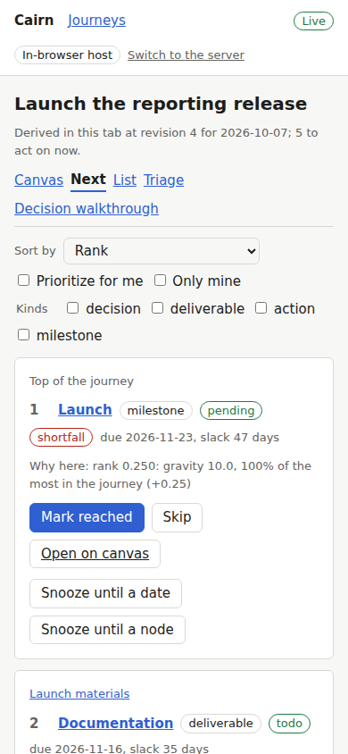

# Proof for brief 5.3: List, next, triage, decision walkthrough

Generated by `briefs/proof/5.3/prove.sh`; do not edit by hand. The script fails if any
outcome below differs from the one expected.

A journey now has three acting screens beside its canvas, linked from a row of journey
screens. The next list (C10) is the acting frontier in rank order, each item with its
breadcrumb, why it ranks where it does (the rank blend's parts), and its kind's actions inline;
it re-sorts by any single signal, ranks for the viewer ("prioritize for me") without touching
the shared rank, filters to only mine and by kind, offers "assign owner" on unassigned items
(D2), and, when nothing can be acted on, shows what the journey waits on with unsnooze (D5).
The list (C9) is the journey as a table with every filter, grouping by container, a sort by
one signal, and text search over titles, descriptions, notes, and resources; its selection's
bulk start, done, skip, assign, snooze, and unsnooze each go as one patch, one event per node,
and a guard failure on any node rejects the whole patch and names it. Triage (C11) is one card
at a time in rank order with each kind's actions and pass, which only reorders this pass and
writes nothing; a placeholder offers mark atomic and snooze and no done (B10). Its
decisions-only mode is the decision walkthrough, where a new journey lands: it names what an
answer surfaced in the same pass, and with no decision to make, what would unblock the next
ones.

The walkthrough's pictures are on the server host, over a journey started from version 1 of
the vendor evaluation's route; the rest are on the in-browser host, seeded from the fixtures
on each load.

## The decision walkthrough (C11)

A fresh evaluation opens on every decision actionable at its start: the four up-front
decisions and the partner decision, which leads on gravity (the partner-led work rides on it):


Answering that a partner runs the testing makes the partner-led work relevant and actionable,
and the walkthrough names it in the same pass:


Triage of every kind, in the same pass, holds it among the cards:


Once kickoff is reached, the test workload placeholder's card offers mark atomic and snooze,
and no done:


With every decision skipped in one bulk patch, nothing can be decided, and the walkthrough
shows what would unblock the next decisions:


## The next list (C10, D5)

The product launch's next list, each item with its breadcrumb and why it ranks there:


Re-sorted by slack:


The hiring loop's only item snoozed: the journey is stalled, and the panel offers unsnooze:


## The list (C9)

Deliverables and actions, grouped by container:


Search reads notes: "environment team" finds the node whose note says it:


A bulk done over the final report and the decision meeting: the final report fails its
`deps_done` guard (its stage has not opened), so the whole patch is rejected and the rejection
names it, with its bypass:


Two nodes snoozed in one patch until the beta ends:


## A dark theme, a narrow screen





The main flow: a fresh journey's walkthrough, the partner decision answered and its work
surfacing, a pass, triage of every kind, and the next list: [main-flow.webm](main-flow.webm).

## The values shown

- The walkthrough at the start, in pass order: `n_partner_runs`, `n_meeting_date`, `n_purpose`, `n_who_informed`, `n_who_owns`.
- Surfaced by answering the partner decision yes: `n_criteria`.
- Triage of every kind in the same pass: `n_kickoff`, `n_criteria`, `n_decision_meeting`, `n_meeting_date`, `n_purpose`, `n_who_informed`, `n_who_owns`.
- With the five decisions skipped, what the walkthrough says would unblock the next ones: `n_comparison_set` (`n_plan`); `n_findings_reviewer` (`n_findings`, `n_testing`).
- A bulk done over the final report and the decision meeting: rejected, revision 8 before and 8 after.
- A bulk snooze of two nodes: revision 4 to 5, one patch.

The product launch's next list, by rank and by slack:

| By rank | Rank | Slack | By slack | Slack |
|---|---|---|---|---|
| `n_launch` | 0.2500 | 47 | `n_docs` | 35 |
| `n_docs` | 0.0500 | 35 | `n_announcement` | 42 |
| `n_announcement` | 0.0500 | 42 | `n_beta_end` | 42 |
| `n_beta_end` | 0.0250 | 42 | `n_launch` | 47 |
| `n_retro` | 0.0250 | none | `n_retro` | none |

## The tests

The acting surfaces' web unit tests (Vitest, rung 6):

| File | Result |
|---|---|
| `src/acting/acts.test.ts` | 19 passed, 0 failed |
| `src/acting/address.test.ts` | 11 passed, 0 failed |
| `src/acting/pass.test.ts` | 5 passed, 0 failed |
| `src/acting/rows.test.ts` | 2 passed, 0 failed |
| `src/acting/waiting.test.ts` | 5 passed, 0 failed |
| `src/acting/why.test.ts` | 11 passed, 0 failed |

The acting surfaces' browser tests (Playwright in Chromium, rung 6, `web/app/e2e/acting.spec.ts`):

| Test | Result |
|---|---|
| C10: the next list ranks the frontier, and re-sorting by slack reorders it | passed |
| C9: filters hold at once, search reads notes, and rows group by container | passed |
| C9: a bulk completion with one node failing its guard is rejected whole, naming it | passed |
| C9, B6: a bulk snooze is one patch; the snoozed leave the next list and an unsnooze returns them | passed |
| B6: a node snoozed from its card leaves, and returns when its target completes | passed |
| D5: an empty acting frontier shows the stalled panel, and unsnooze brings the node back | passed |
| C11: pass writes nothing and sends the card to the back of the pass | passed |
| C11: the walkthrough opens on the decisions at the start; answering the partner decision surfaces its work in the same pass | passed |
| C11, B10: a placeholder's card offers mark atomic and no done until it is atomic | passed |
| C11, C9: with every decision skipped in bulk, the walkthrough shows what would unblock the next ones | passed |
| C11: a walkthrough filtered to only mine says the open decisions are others', not that none can be made | passed |

## The planted bug

A bulk action sent as one patch per node (`acts.ts`'s `runBulk`, through which the list's bulk
bar sends every bulk action, sends each mutation alone): C9's one-patch unit test fails:

```text
FAIL  src/acting/acts.test.ts > C9: bulk actions > sends the whole action as one patch AssertionError: expected [ [ { op: 'snooze', …(2) } ], …(1) ] to have a length of 1 but got 2
```
