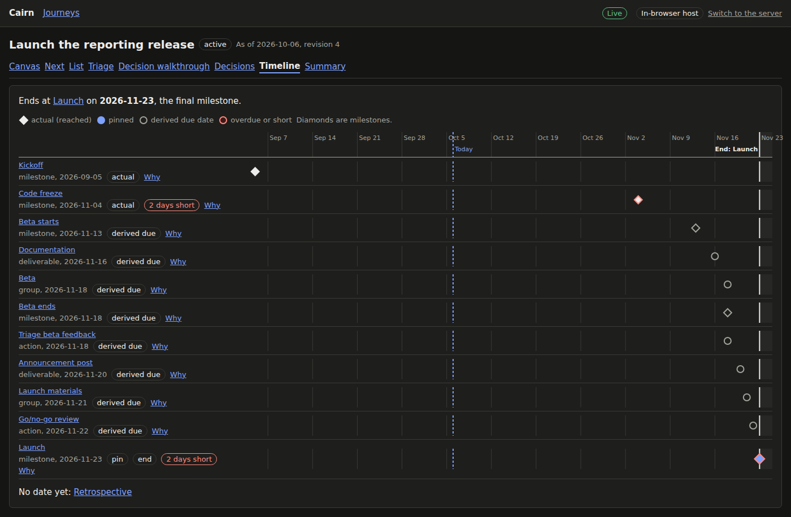
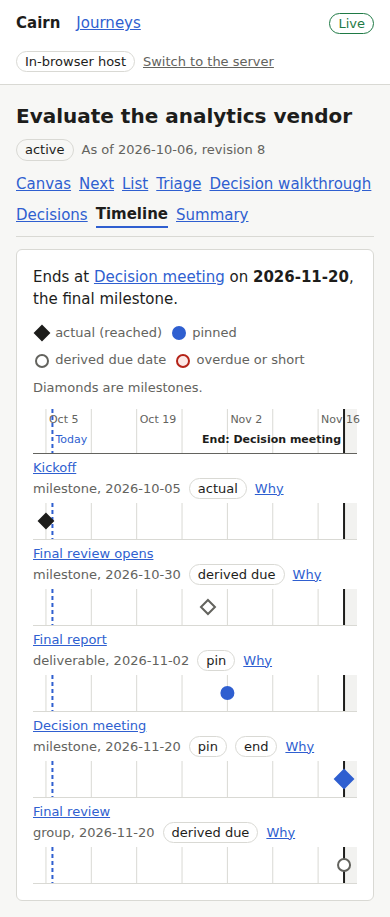

# Proof for brief 5.4: Decision view, timeline, status summary

## What you can do now

Beside a journey's canvas and its acting screens, three read-mostly screens, each a tab of the
journey and each opening a node's detail beside it:

- **Decisions** (C12): the journey's decisions on a canvas with the edges where one gates
  another, and a table of each answer in effect with what it affects: the nodes whose
  relevance it decides (and their relevance now), the milestone it pins, the role it fills.
  Revise an answer from the detail panel and the affected nodes change at once.
- **Timeline** (C13): every in-scope milestone, pin, and due date on one time axis with today
  marked; actual, pinned, and derived dates drawn apart; overdue and shortfall marked; the end
  anchored on the journey's final milestone. Each row's "Why" shows the date's chain and what
  to edit to move it (F7).
- **Summary** (C18): a printable status page for observers: counts by state, what remains,
  what is overdue, short, or stale and why, upcoming milestones with their dates and owners,
  and open decisions with their owners. Printing leaves out navigation, controls, and the
  panel, in black on white whatever the screen's theme.

The pictures are on the in-browser host, seeded from the fixtures, read on 2026-10-06.

## Decisions

The vendor evaluation: answering "no" to whether a partner runs the testing leaves the
partner-led work not relevant; the meeting date pins the decision meeting; three answers fill
roles. No decision here gates another, so the canvas sets them in a grid.

The partner decision revised to "yes" from its detail: the partner-led work is relevant at
once, and the notice names the work that became stale.

## Timeline

The vendor evaluation ends at the decision meeting, its final milestone, pinned on
2026-11-20. Kickoff is an actual date, the final report a pin, the rest derived.

The product launch's code freeze was reached later than the chain from the launch pin
allows: it and the launch are 2 days short. Its "Why" shows the chain and the moves that
would resolve it. The retrospective has no date yet.

The hiring loop has no final milestone. Once the offer letter is pinned it is on the
timeline, with no end anchor.

## Summary

The product launch, with its two shortfalls and three upcoming milestones.

The bake-off's summary printed with a node's detail open.

## Dark theme and a narrow screen

On a phone-sized screen each screen fits its width; the timeline puts each label above its
track.

The main flow, from the canvas through the decisions (an answer revised), the timeline (a
row's chain), and the summary: [main-flow.webm](main-flow.webm).

## Known limits

- No fixture has a decision gated by another, so none of these pictures shows the decision
  canvas's layered layout with edges.
- Without a final milestone the timeline has no named end; it simply ends after its latest
  date (`decisions/2026-10-07-the-timelines-end-anchor-is-the-final-milestone-alone.md`).
- The timeline and the decision view are read-only: a date or an answer changes in the
  node's detail. A markdown export of the summary is Later in the PRD.

Generated by `briefs/proof/5.4/prove.sh`, which also runs the screens' tests.
