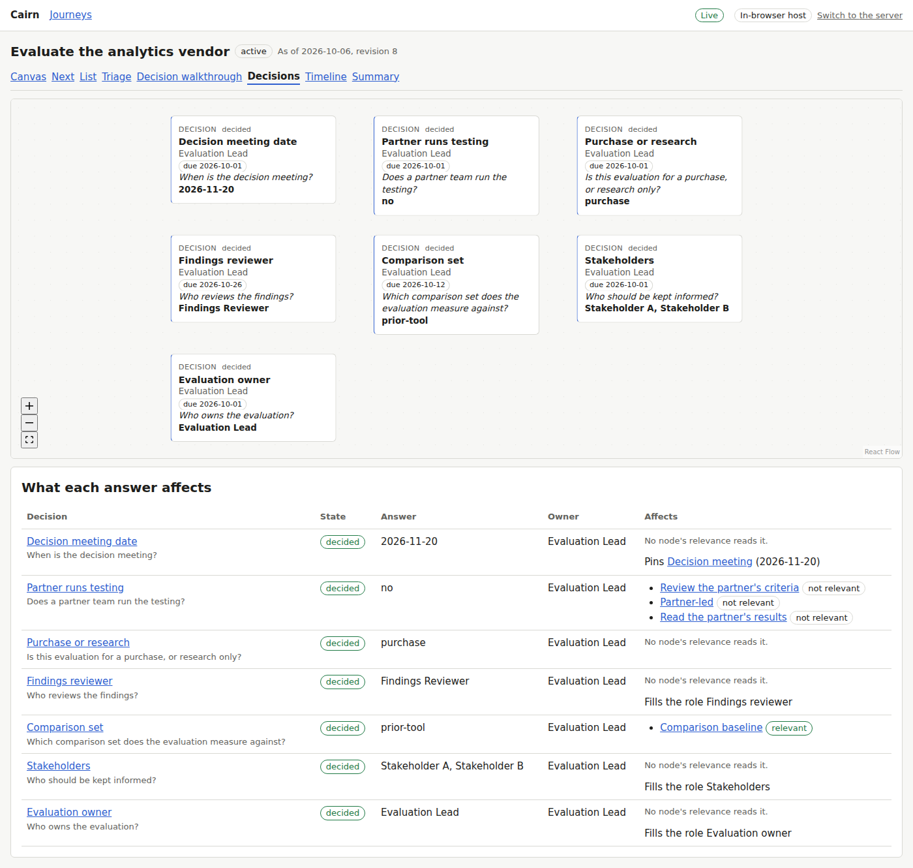
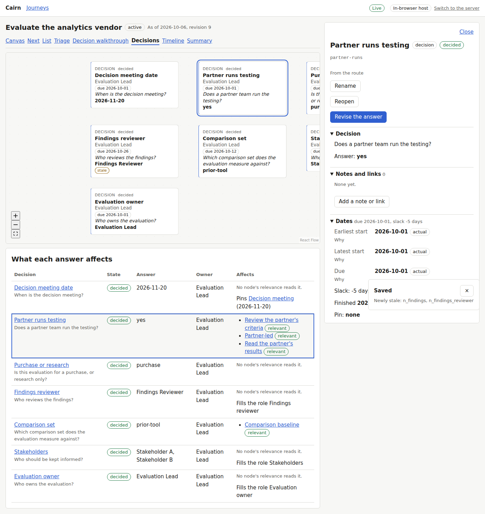
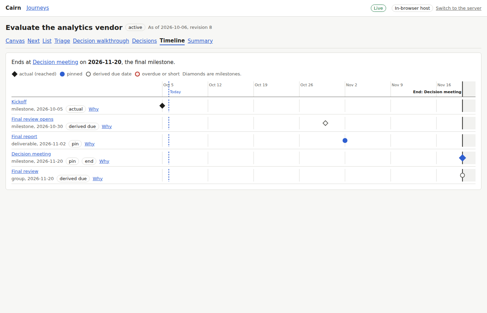
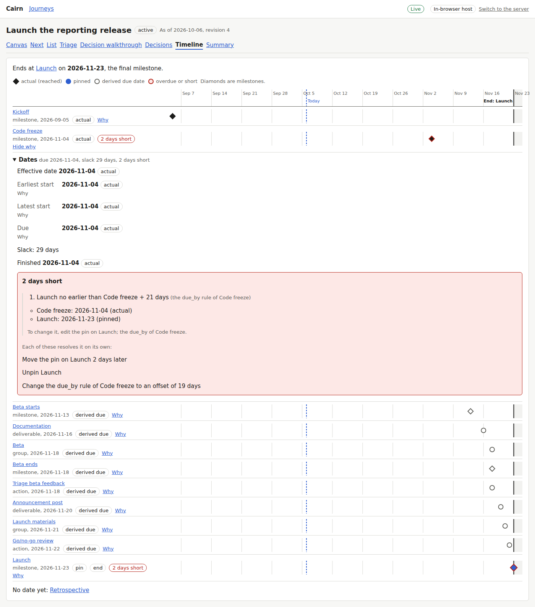
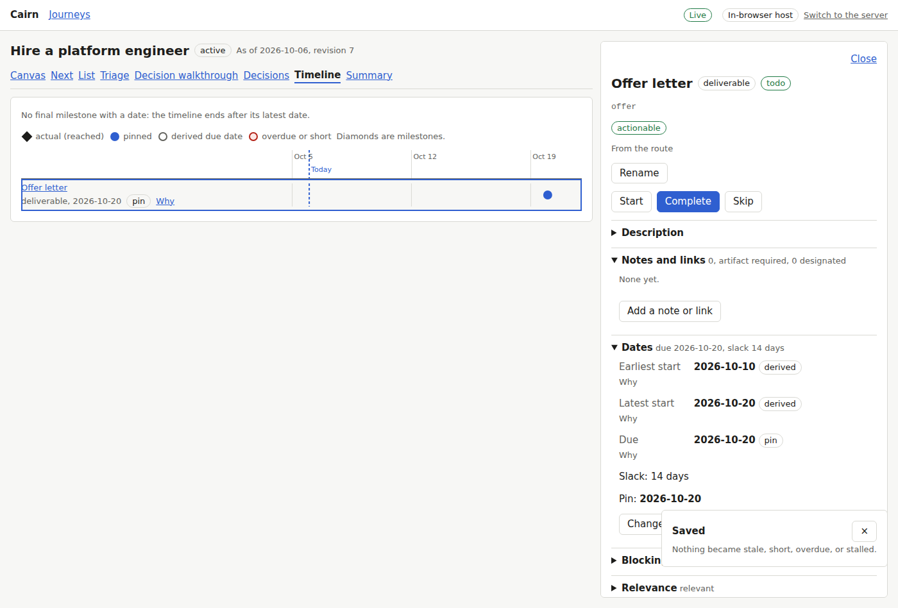
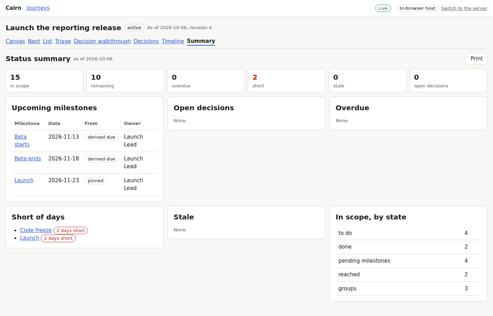
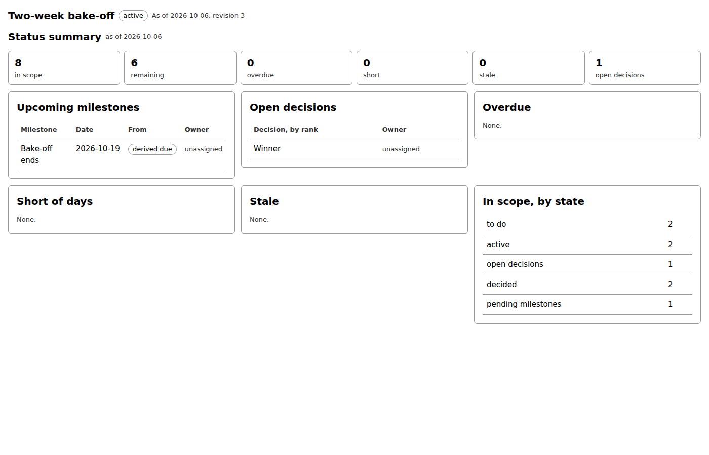

# Proof for brief 5.4: Decision view, timeline, status summary

A journey now has three read-mostly screens beside its canvas: its decisions and what each
answer affects, a timeline of every milestone, pin, and due date with each date's reasons,
and a printable status summary for observers. Each opens a node's detail beside it.

## Screens

The vendor evaluation's decisions, each answer in effect with the nodes, pin, or role it
decides:

The partner decision revised to "yes" from its detail: the partner-led work is relevant at
once, and the notice names the work that became stale:

The vendor evaluation's timeline, ending at its final milestone, the decision meeting pinned
on 2026-11-20; actual, pinned, and derived dates are drawn apart:

The product launch's code freeze was reached late, leaving it and the launch 2 days short;
the row's "Why" shows the chain and the moves that would resolve it:

The hiring loop has no final milestone, so its timeline has no end anchor:

The product launch's summary: counts by state, its two shortfalls, and three upcoming
milestones with their dates and owners:

The summary printed: no navigation, controls, or panel, black on white:

The main flow, from the canvas through the decisions (an answer revised), the timeline (a
row's chain), and the summary: [main-flow.webm](main-flow.webm).

## Known limits

- No fixture has a decision gated by another, so no picture shows the decision canvas's
  layered layout with edges.
- The timeline and the decision view are read-only: a date or an answer changes in the
  node's detail. A markdown export of the summary is Later in the PRD.
