# Proof for brief 5.7: Proposal review and its flows

A proposal can now be reviewed in the browser as a diff over the canvas and as editable
lists, then applied or discarded; upgrades, saves as route, re-links, and breakdowns open one.

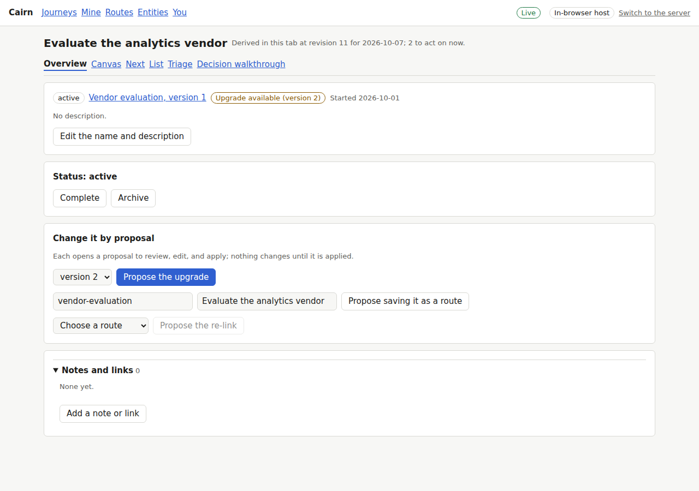
The overview offers the upgrade to version 2, a save as route, and a re-link.

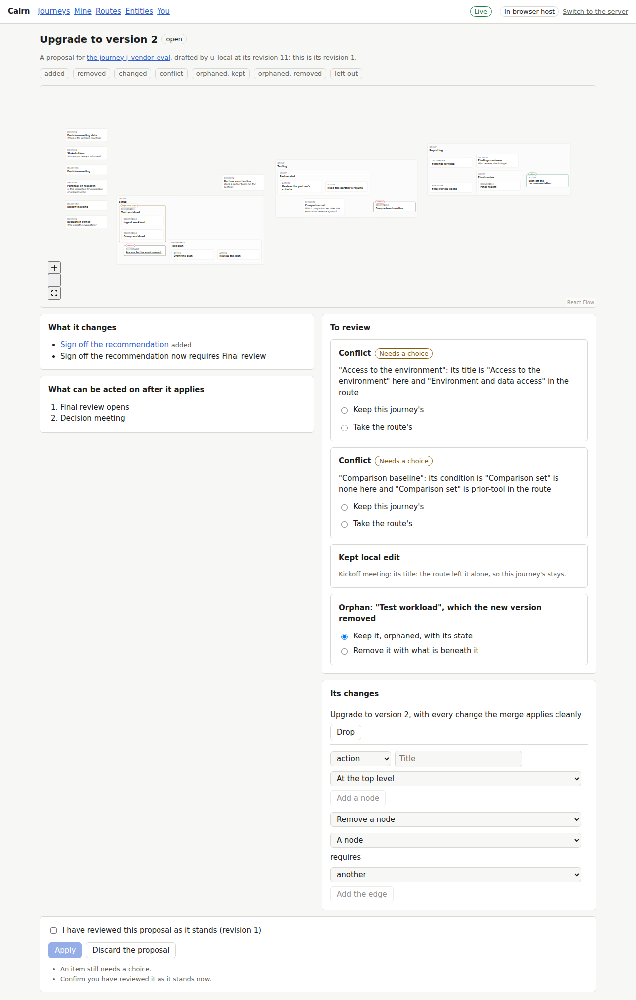
The upgrade on the canvas: the sign-off added, two conflicts, an orphan, and a kept edit.

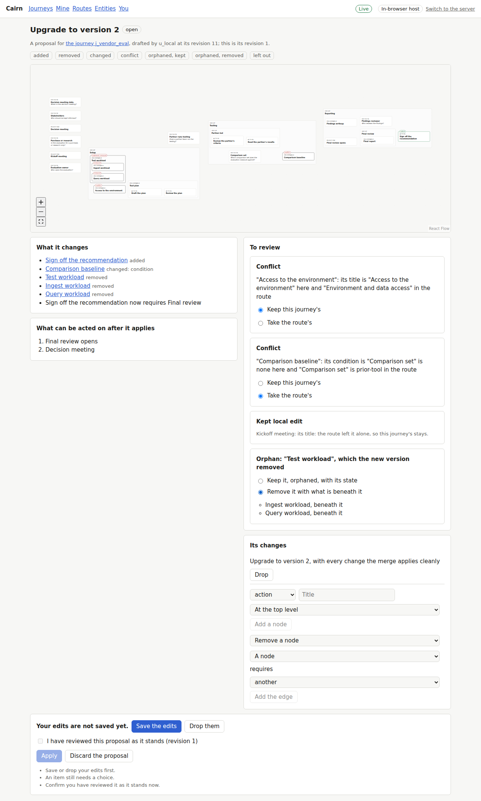
One conflict keeps the journey's title, one takes the route's condition; the orphan goes.

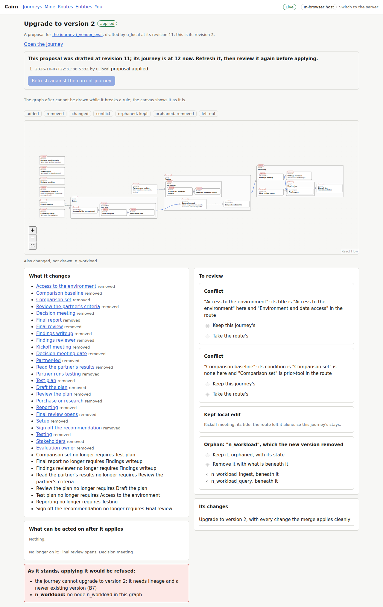
Saved, confirmed as reviewed, and applied.

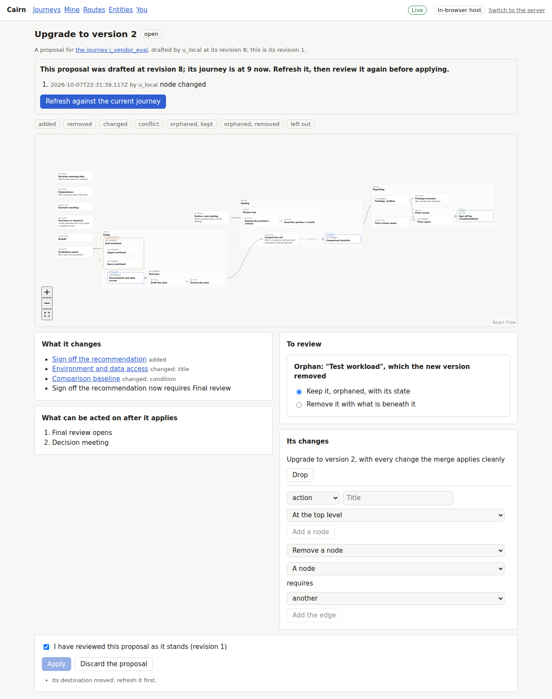
The journey moved after drafting. The proposal lists the change and holds the apply.

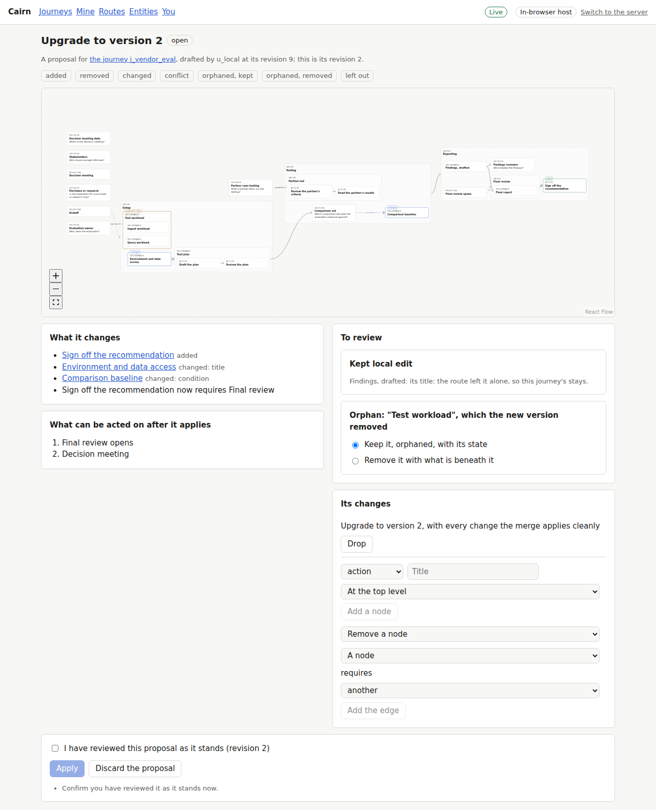
Refreshed against the journey; apply waits for a new review.

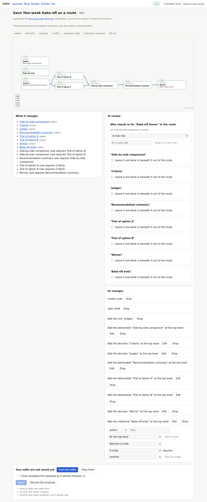
The routeless journey saved as a route, its owner mapped to a new role.

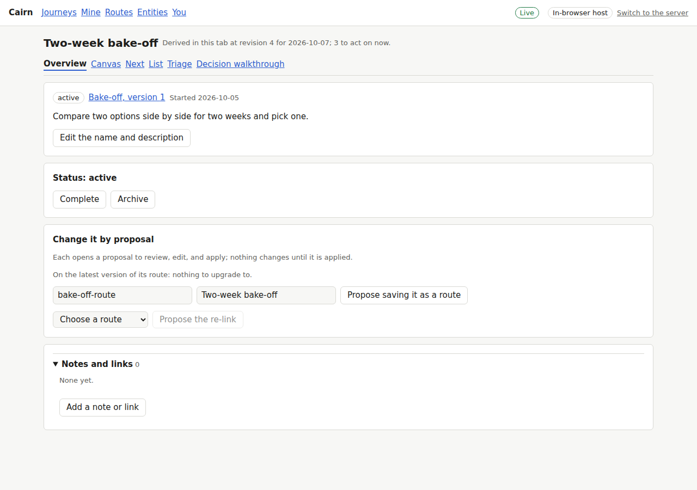
After publishing, the journey is re-linked and follows the new route.

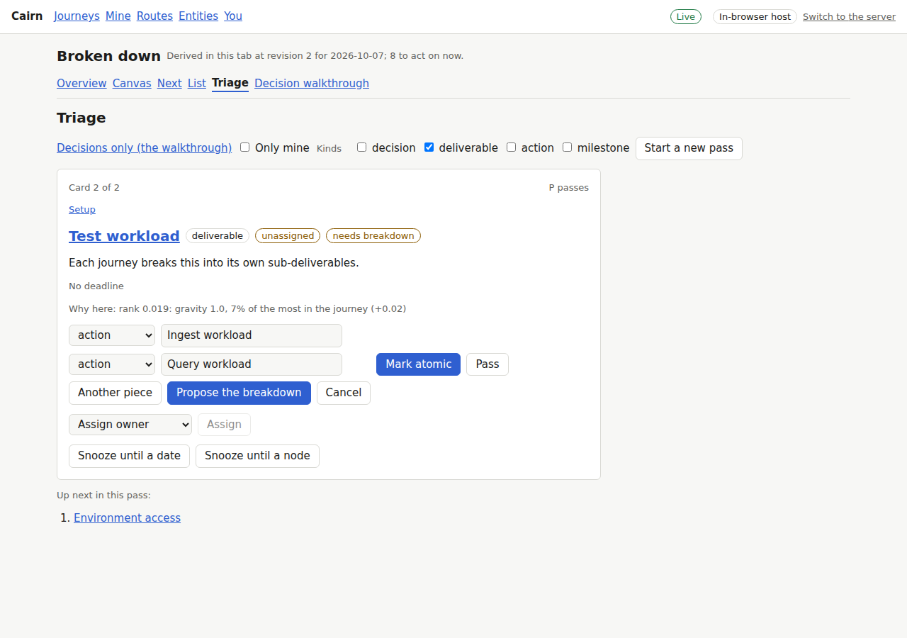
A placeholder's triage card takes two pieces and opens them as a proposal.

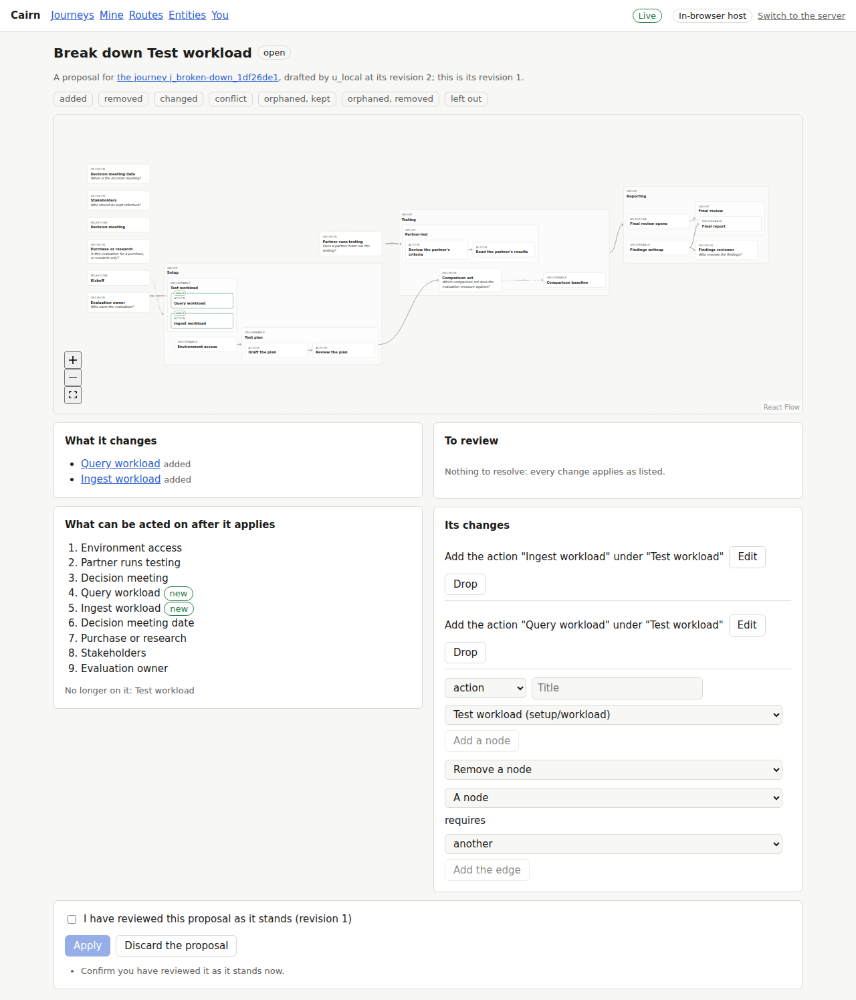
The breakdown's review: two nodes added, both newly on the frontier.

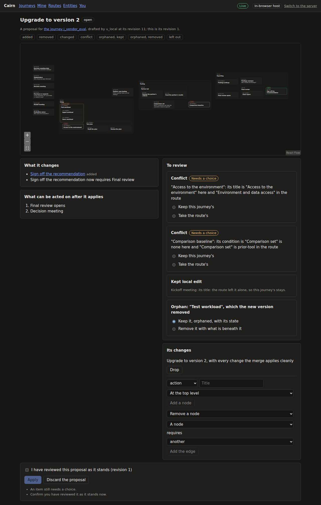 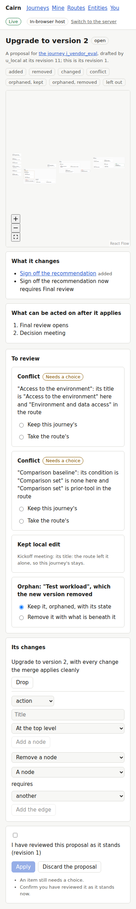
Review in the dark theme and on a narrow screen.

[main-flow.webm](main-flow.webm): the upgrade proposed, its conflicts and orphan resolved,
applied, and the journey opened.

## Known limits

- Proposals have no index: one is reached by its link, which every flow opens.
- Edits to a route or deployment proposal are previewed once saved; a journey's as typed.
- The review confirmation is kept in the tab; version 2 raises only field conflicts and
  orphans, so other conflict kinds are checked in unit tests.
