# Proof for brief 5.8: Assistant panel

A journey's canvas and overview and a route's canvas now open a conversation with the
assistant: changes to state are made and reported with links to their nodes, and changes to
structure come back as proposals to review. Shown on the server host with a scripted model.

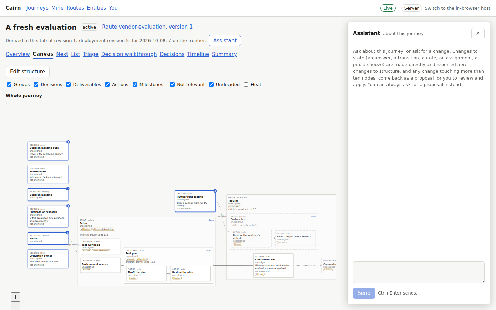
The panel opened on a fresh journey, saying what it can do.

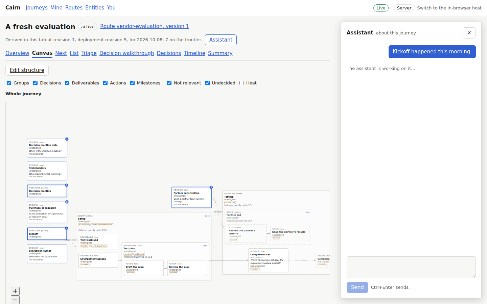
A message sent; the assistant is working.

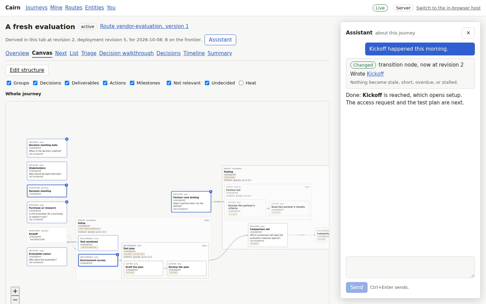
Kickoff reached directly, linked, with nothing newly stale or late.

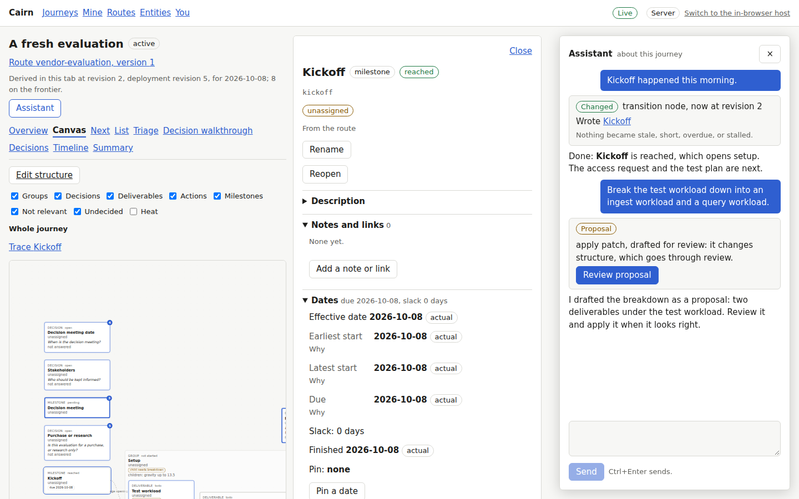
A breakdown asked for comes back as a proposal, since it changes structure.

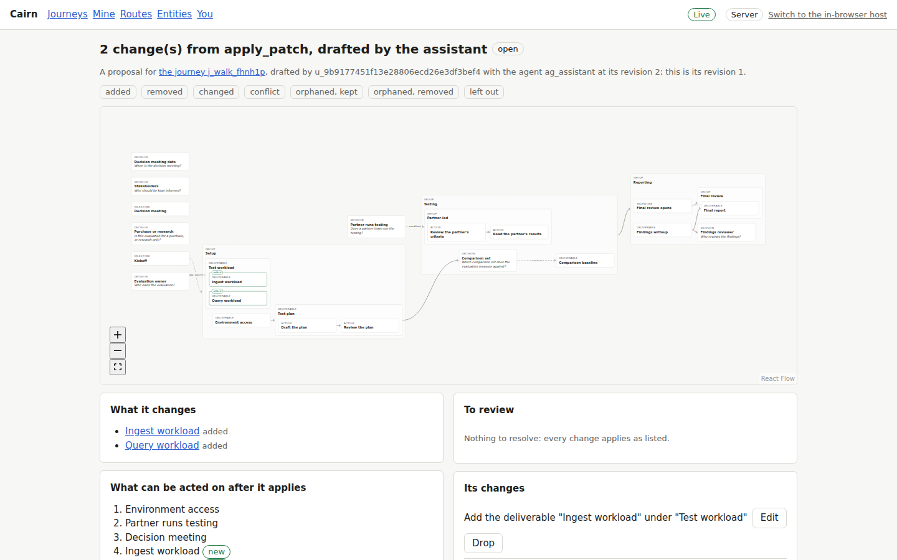
"Review proposal" opens it in proposal review: two deliverables added.

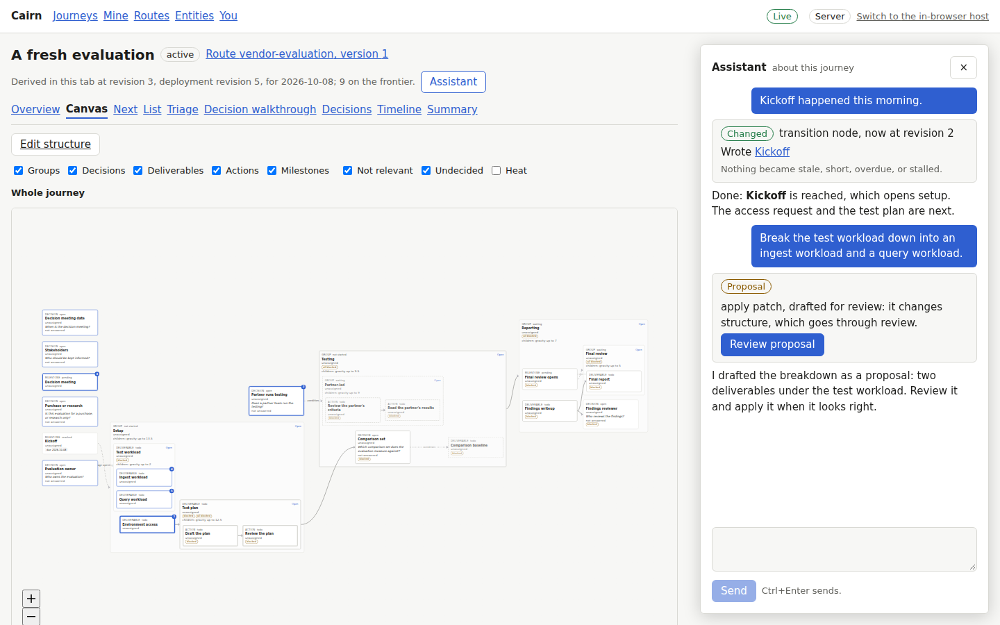
Applied by the user; both pieces on the canvas, both turns still in the panel.

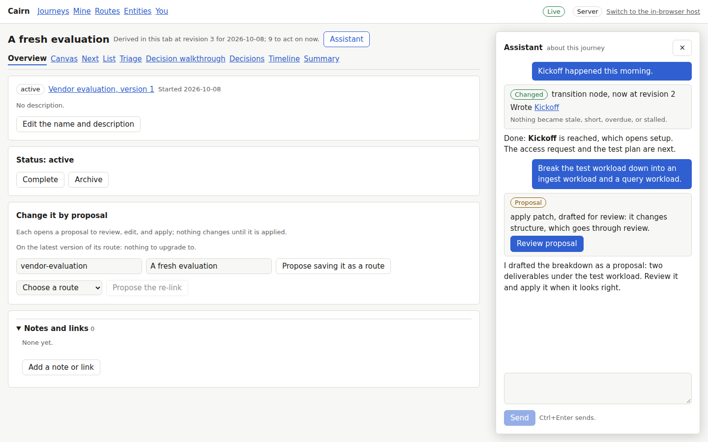
The same conversation on the overview after a reload.

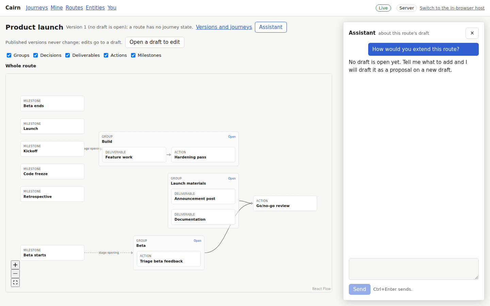
A route has its own conversation, about its draft.

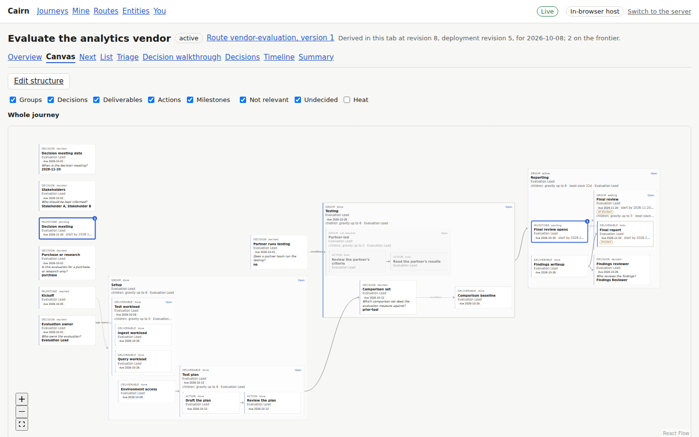
The in-browser host has no assistant, so no Assistant button.

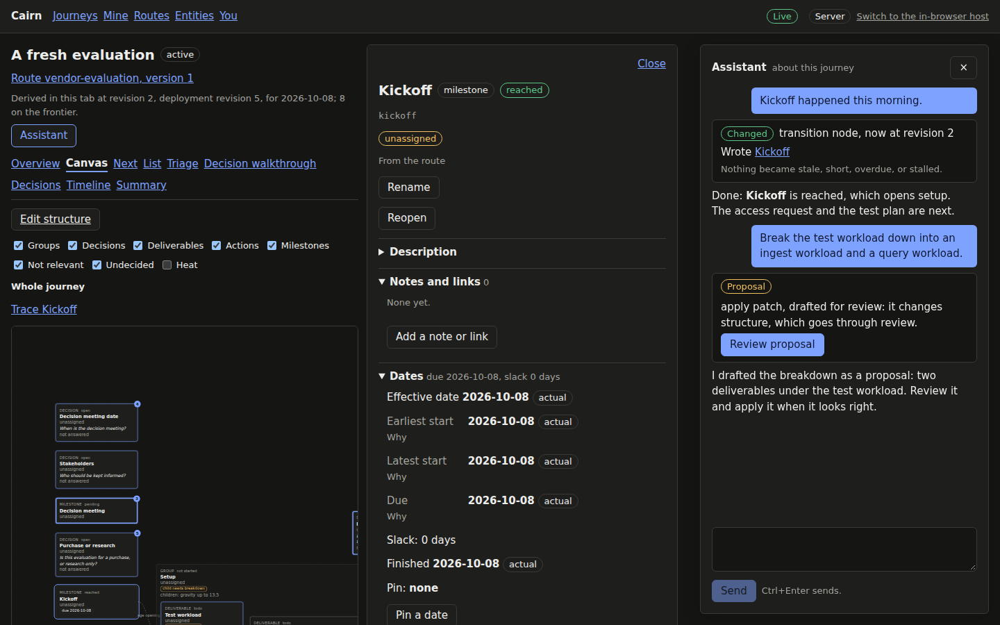 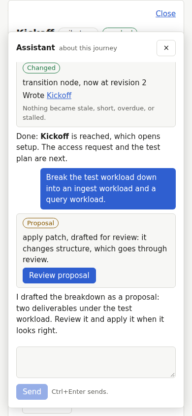
The panel in the dark theme, and over the screen on a narrow window.

[main-flow.webm](main-flow.webm): a direct change, its node opened from the panel, a
breakdown proposed, reviewed, and applied.

## Known limits

- Replies arrive whole, not streamed.
- Links for earlier writes are kept in the tab that sent the turn; elsewhere they show as
  the text the server kept.
- The panel does not show whether a proposal it drafted was later applied.
