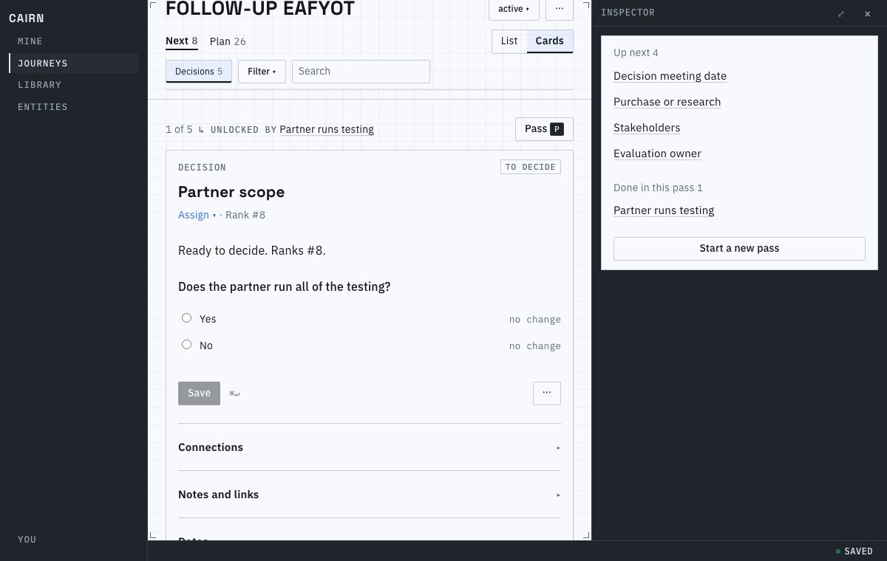
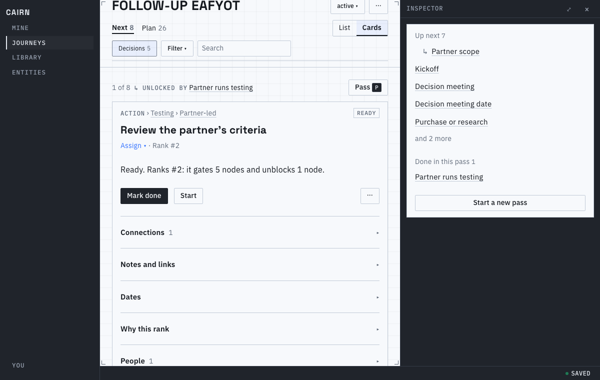
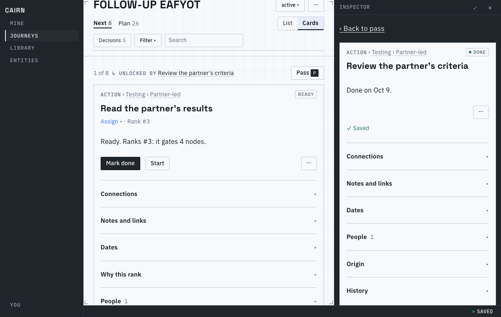

# Proof for brief 7.1: Unlocked nodes first in a pass

In a triage pass, answering or finishing one card now leads straight to what it opened. The nodes
the write brought onto the acting frontier come next, ahead of the cards already waiting, each
labeled with the card that unlocked it. The shared rank, the Next list and the graph are unchanged.

The pictures use a copy of the vendor evaluation with one more decision, relevant only when a
partner runs the testing and ranking below the up-front decisions.

## The walkthrough

Answering "Partner runs testing" opens two nodes. The follow-up decision comes first, though four
up-front decisions outrank it, and its card's band says what unlocked it:

With every kind, the same pass puts the other unlocked node first. The rail shows the one still
waiting indented, ahead of the cards that were already queued:

## From a node's inspector

A node opened from the rail and completed in its inspector counts as an action of the pass. What
it unlocked comes next, labeled with that node:

| Pass order | Before (rank only) | After answering the partner decision |
|---|---|---|
| Walkthrough | the four up-front decisions, follow-up last | follow-up, then the four up-front decisions |
| Next list | rank order | rank order, unchanged |

Passing a card sends it to the back and drops its label for good; Start a new pass returns to
rank order. `prove.sh` regenerates the pictures.

## Known limits

- The pass reads the server's `unlocked` list per write, so a node another person's concurrent change
  brought onto the frontier is never credited to this action.
- Writes made while the pass is closed are not credited, even from this tab.
