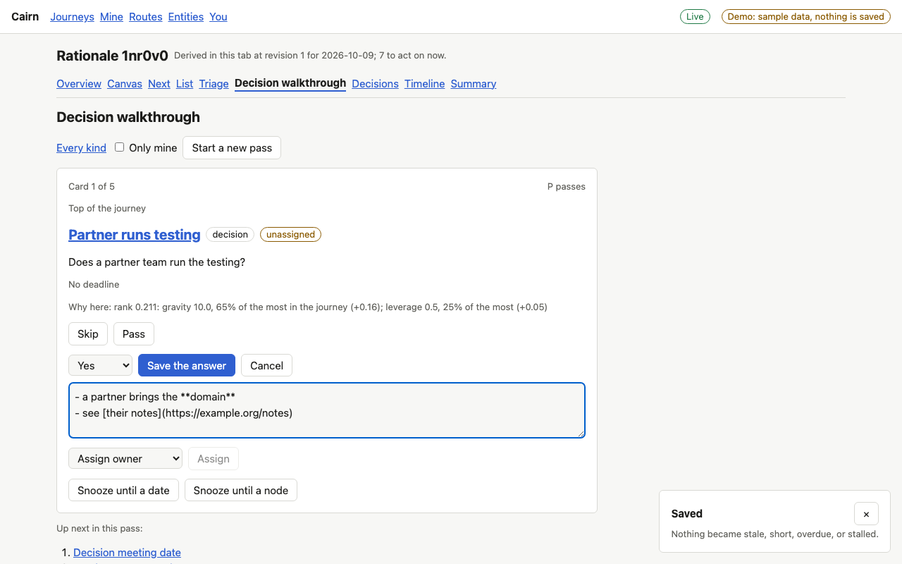
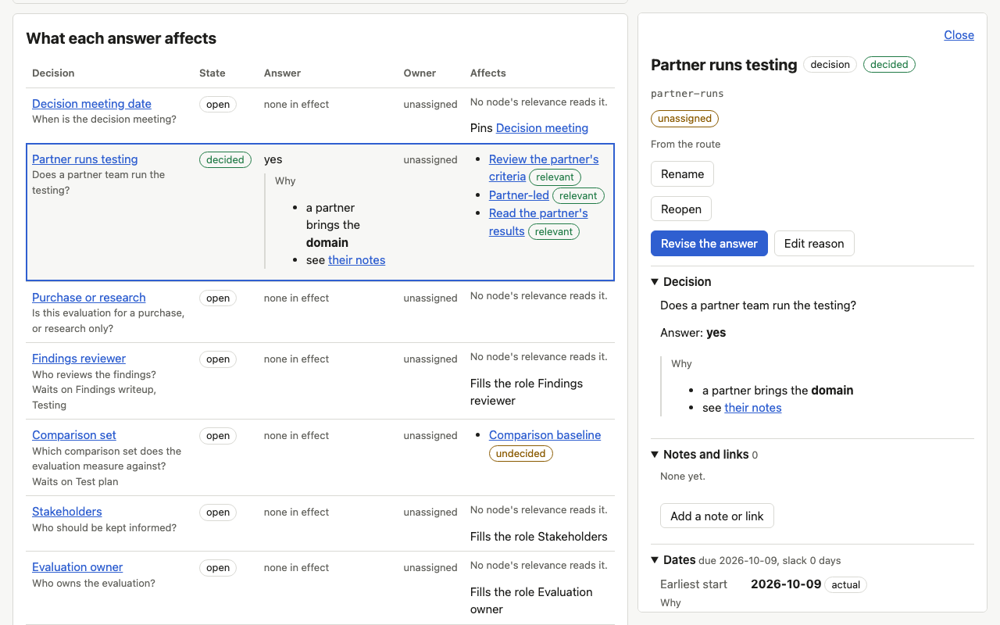
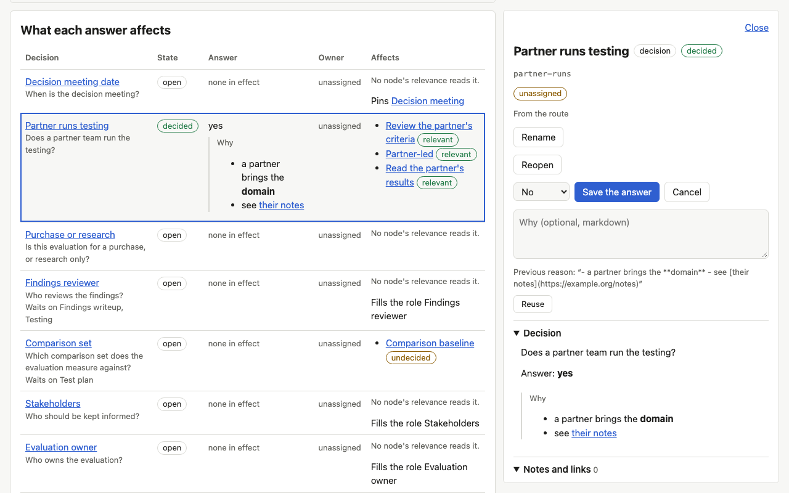
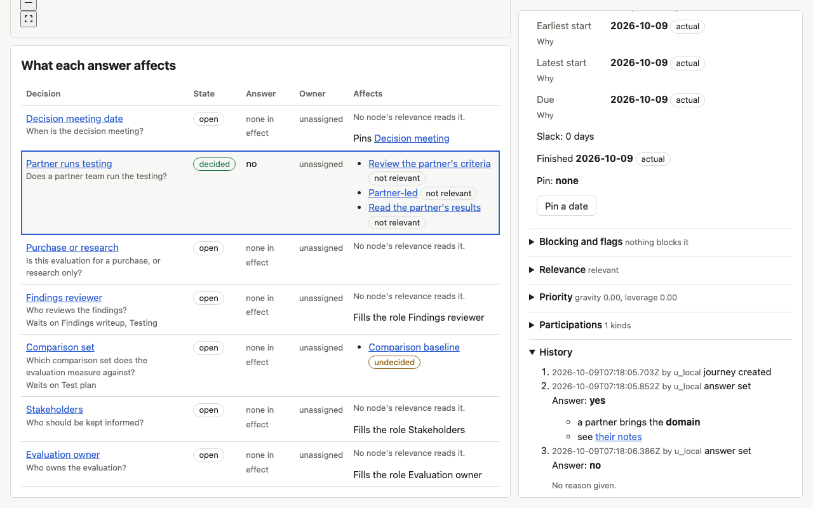

# Proof for brief 7.2: A rationale on answers

An answer can now say why it was given. The reason is markdown, belongs to that one answer,
and shows wherever the answer shows: the answer form, node detail, the decision view, and
each answer in history. A new answer starts with no reason; nothing is carried forward.

## Screens

The partner decision answered from a triage card. The "Why" field sits open under the
input and takes markdown:

Read back in the decision view and in node detail, rendered as markdown (a list and a link):

Revising the answer starts with an empty "Why". The previous reason is offered, and only
a click on Reuse copies it in:

Saved with no reason, the decision has none, and history shows both answers, each with its
own reason or "No reason given.":

## What the journey holds

The hiring loop's offer decision, answered three times, as the engine scenario runs it:

| Step | Answer | Rationale stored | Rationale in the decision view |
|---|---|---|---|
| answer with a reason | yes | "Strong scorecard ..." | the same |
| revise with none | no | none | none |
| revise with another | yes | "On reflection ..." | the second only |

History holds all three answers with their own reasons (the first, none, the second); replay
of the events rebuilds the stored answers and rationales field by field. Reopening clears
the answer and its reason together. `answer_decision` takes the same `rationale`, and
`get_node` and `get_snapshot` return the current one.

An existing database keeps loading: its answers come back with no rationale, and the
migration adds one nullable column.

## Known limits

- The rationale is plain markdown in a textarea with no preview; the quoted short forms
  (a marker on cards, a Why column in the plan list) belong to the screens that are being
  redrawn and are not built here.
- Save is not held back until the draft differs from what is stored; an unchanged answer
  and reason is still a revision.
