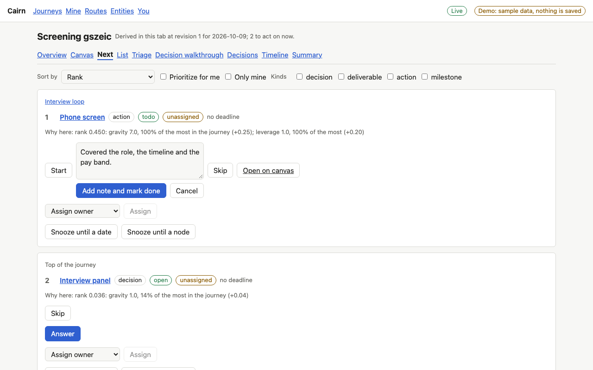
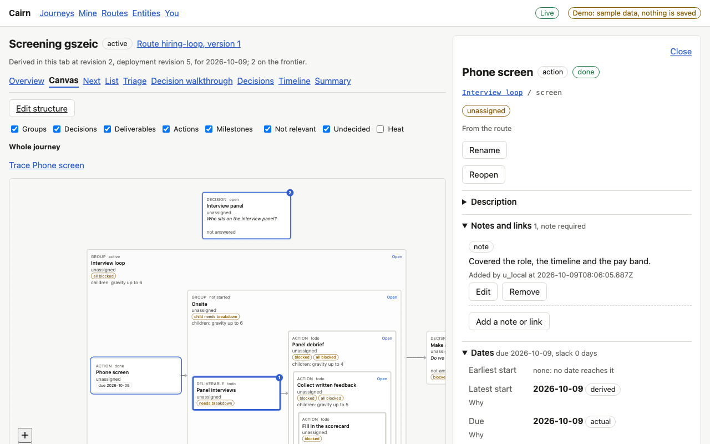
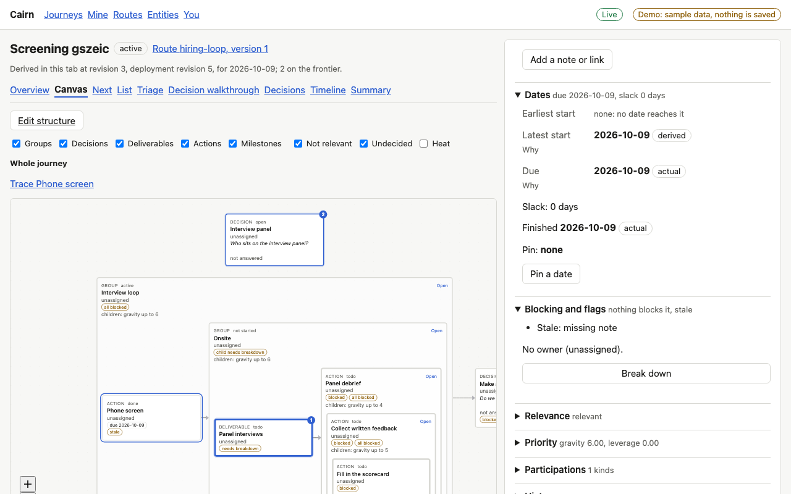

# Proof for brief 7.3: The `requires_note` guard

Work whose output is something written down can now say so. A deliverable or action marked
`requires_note` cannot be marked done until it carries a note of its own; a link, a note on a
child and a note on the journey do not count. Done asks for the note inline and completes in
one patch, and if the last note is removed later the node stays done and shows as stale for a
missing note.

## Screens

On the next list (and the same on a triage card), Done on the phone screen opens a note field.
The button stays off until there is a note:

Sent, the note and the completion are one change (the journey moves one revision). The note
shows under Notes and links, which says a note is required:

Removing that note leaves the node done and flags it stale, with the reason:

## What the journey holds

The product launch with its hardening action marked `requires_note` in the route file, as the
engine scenario runs it:

| Step | Result |
|---|---|
| complete with no note | refused: `has_note` failed (`missing_note`), bypassable |
| complete with a link and a journey note | refused the same way |
| add a note on the node and complete, one patch | accepted, not stale |
| remove the note | still done, stale: `missing_note` |
| add a note again | no longer stale |
| complete with a `has_note` bypass | accepted, the bypass records `missing_note`, not stale |
| upgrade to a version that sets the flag on finished work | stays done, stale: `missing_note` |

An existing database keeps loading: its nodes come back with the flag off, and the migration
adds one nullable column. Agents do the same with one `apply_patch` (`add_annotation`, then
`complete`); the instructions say so.

## Known limits

- Node detail's Complete does not open a note field; it shows the refused guard and its
  bypass, and the note is added in the Notes section first. The redrawn inspector will fold
  this in.
- Bulk done over a selection that includes such a node is refused whole, naming it, as for a
  missing artifact.
