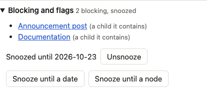
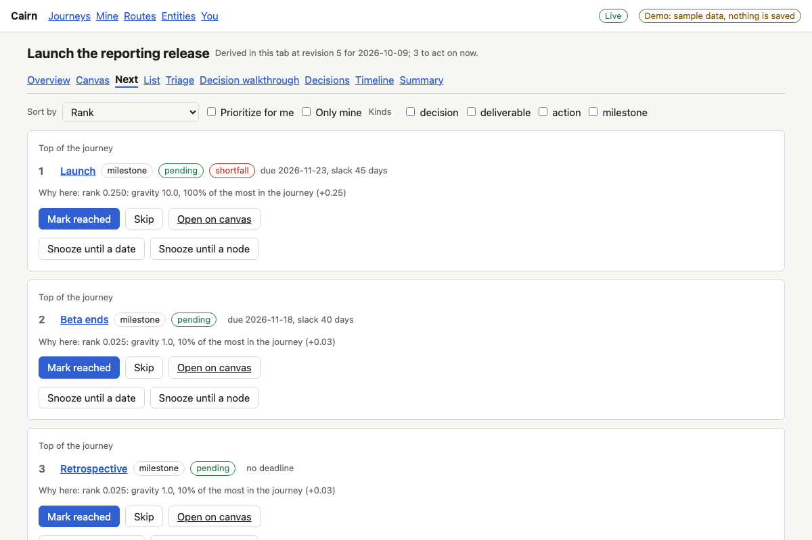
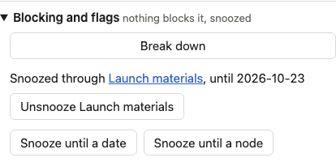

# Proof for brief 7.4: Snoozing a container

A whole branch can now be set aside in one move. Snoozing a group (or a deliverable or action with
children) holds every open descendant off the next list, each naming the container, and nothing
below it needs a snooze of its own. Work that reaches the frontier later is covered too.

## Screens

Launch materials is a group. Snoozing it from its detail, until a date, is the same form every node has:

Its two items leave the next list; the rest stays:

A descendant's detail says it is snoozed through the container and offers to unsnooze that
container, not itself (it has no snooze of its own to lift):

| Next list (product launch) | Items |
|---|---|
| Before | `n_launch`, `n_docs`, `n_announcement`, `n_beta_end`, `n_retro` |
| Launch materials snoozed | `n_launch`, `n_beta_end`, `n_retro` |
| Unsnoozed from a descendant | `n_launch`, `n_docs`, `n_announcement`, `n_beta_end`, `n_retro` |

## What the engine now does

- A snooze on a container holds while its date is ahead or its target node is unfinished. Each
  open node beneath it carries `snoozed` (its own target when it has one that holds, else the
  container's) and `snoozed_via` (the container). Blocking, gravity and the frontier are unchanged.
- A target inside the container, an ancestor, or anything that depends on work in it is rejected
  with the container's path (`snooze_cycle`). A group with nothing open beneath it is rejected.
- A descendant completing leaves the container's snooze in place; starting a container
  deliverable or skipping a group clears it. Unsnoozing a node held only through its container is
  refused, naming the container (`snoozed_through_container`).
- When one container snooze empties the acting frontier, the stalled diagnostic names that
  container once, with its target.
- Vendor evaluation scenario (`a container snooze holding over its subtree and clearing`): Testing
  is snoozed until the decision meeting is reached; answering the partner decision brings the
  partner-led work onto the frontier already snoozed; a descendant with its own later date snooze
  stays hidden after the container's lifts; reopening the meeting holds it again; skipping Testing
  clears it. Replay matches the stored state.

## Known limits

- The inspector shows the container line inside "Blocking and flags" and, beside the container's
  own actions, that moving it on lifts the snooze; the canvas shows the existing `snoozed` chip on
  descendants. The set-aside chooser (snoozing an ancestor from a descendant's card), the graph
  card's `z via <name>` and the next list's snoozed fold belong to the redesigned screens.
- A node snoozed twice with the same target shows only the container's line.
