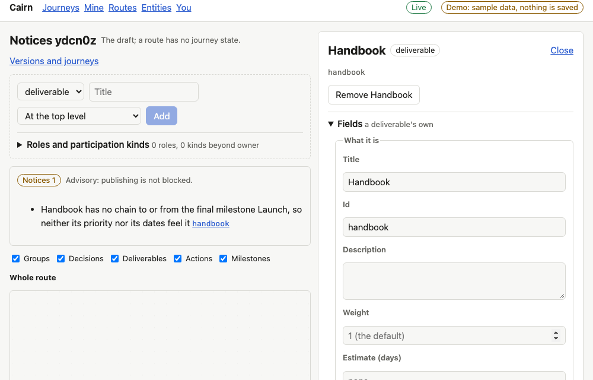
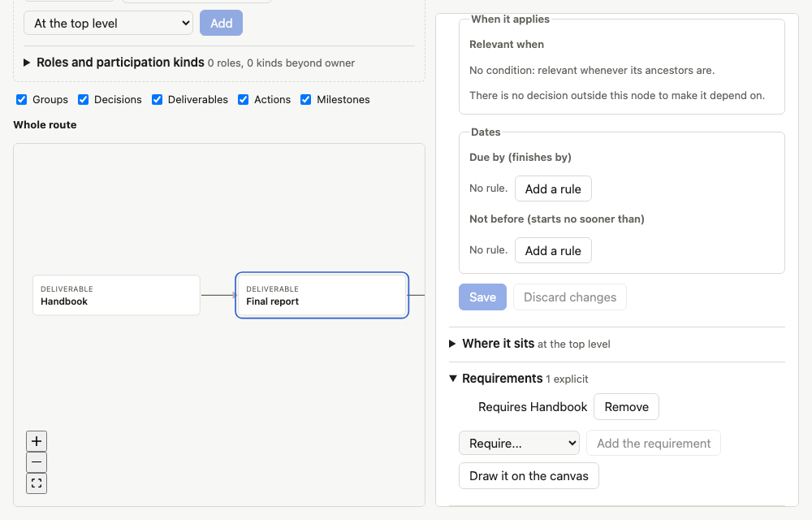
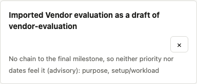

# Proof for brief 7.5: Notices

Cairn now tells an author, without blocking them, about work the final milestone cannot see.
In a route with a `final` milestone, a node with no chain to or from it gets neither gravity nor
dates from it, so it ranks low and carries no deadline in any journey; usually an edge is
missing. Importing a file, publishing a draft, reviewing a proposal on a draft and the authoring
view each list those nodes. Nothing is ever refused for one.

## Screens

A draft whose Handbook nothing links to the final report. The draft lists it, with the path to
open it by:

The Final report now requires the Handbook. The notice is gone without a reload:

Importing the vendor evaluation's file lists what it leaves unanchored, in the saved notice:

## What the engine lists

Notices follow dependencies (implicit gates included) and date constraints (date rules, stage
closes, `feeds_milestone` pins) in both directions from the final milestone, with every
condition treated as relevant. A decision that fills a role is exempt.

| Route graph | Listed |
|---|---|
| Vendor evaluation (fixtures) | `purpose`, `setup/workload` (the final-review work is not: its stage closes at the decision meeting) |
| Vendor evaluation, partner-led branch moved to the top level | its two actions and `partner-runs`, besides the two above |
| Product launch | none |
| Product launch plus a deliverable with no edges | that deliverable |
| Product launch, that deliverable due before the launch | none |
| Hiring loop plus a deliverable (no final milestone) | none |

Where the answers appear: the import and publish results (API, MCP, saved notice), the review
of a proposal on a route draft (`get_proposal` with `review`), and the page's own engine for the
authoring view. An accepted write still lists them (`applied`), and nothing is stored.

## Known limits

- The redesigned inspector, graph and draft card render the panel later; today it is a section
  above the canvas with a link per node, not a trace of the node.
- Journeys and segments list none (segments have no final milestone).
