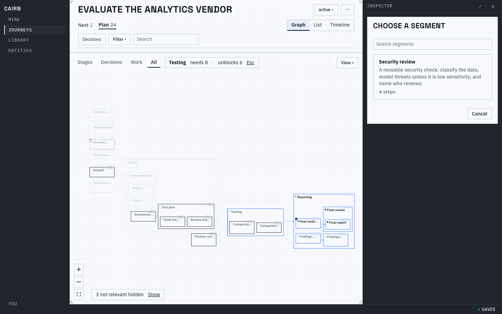
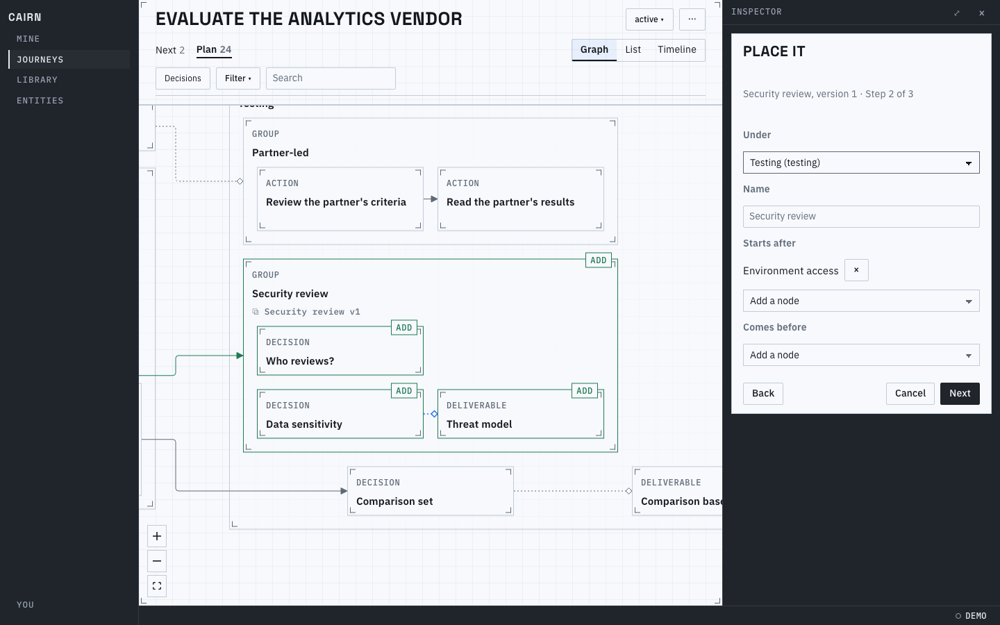
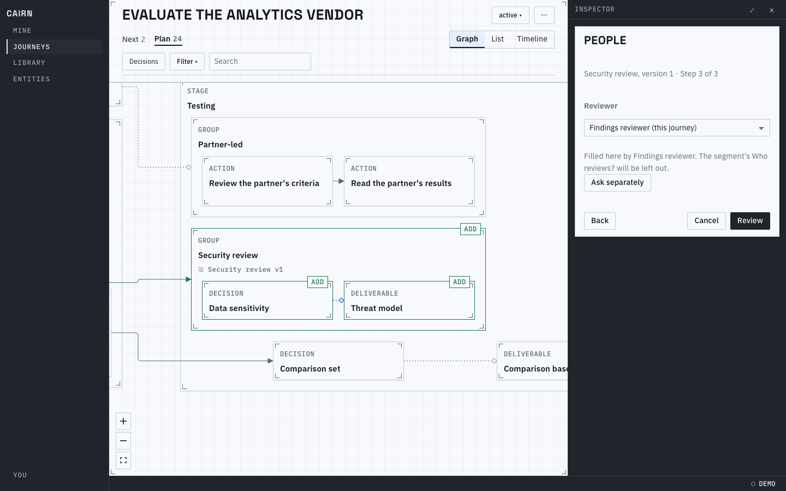
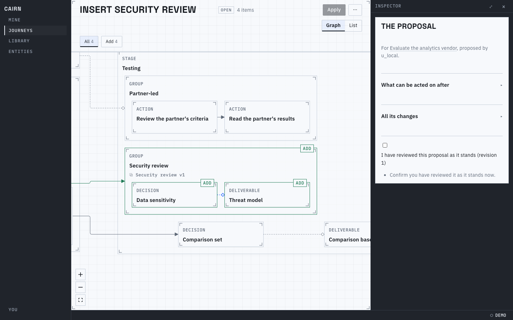
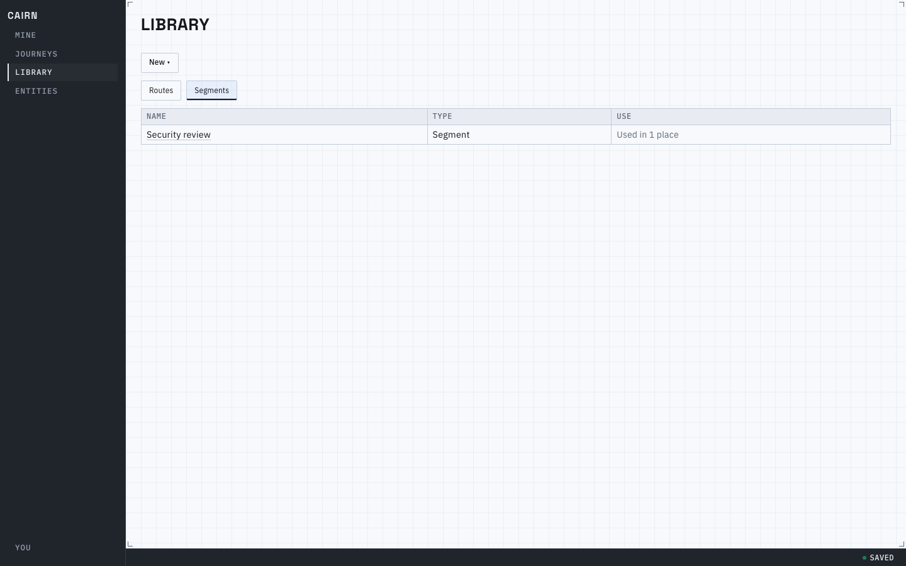
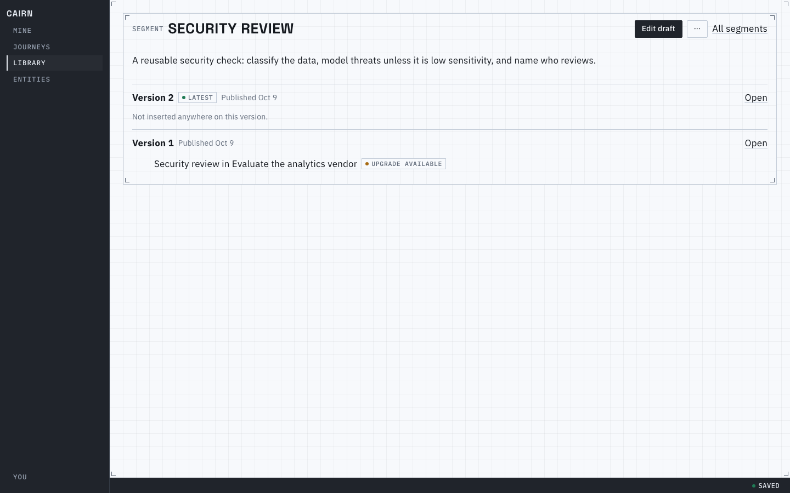
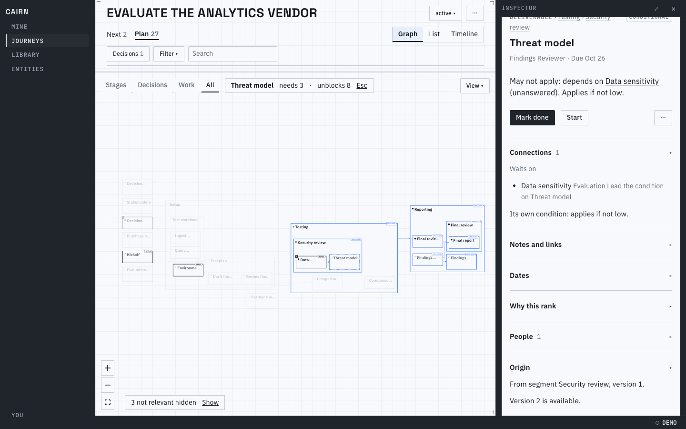

# 7.7: Segment screens

You can now insert a reusable segment into a journey, or into a route or segment draft, in three
short steps, and see exactly what it will add before anything changes. The segment shows up in the
Library, its detail says where each version is used, and a member says which segment and version it
came from. The pictures are the security-review segment inserted into a vendor evaluation's Testing
group. They were taken from the browser test's flow (`web/app/e2e/segments.spec.ts`) at 1440px and are
not regenerated by a script of their own.

## Inserting

From a container's `⋯` (Insert segment here), the journey's `⋯`, or a draft's `+ Add`, the inspector
column opens the stepper. Step one is a searchable list: each segment shows its name, one line of what
it is, and its size.

Step two places it: under which container, what to call it, what it starts after, and what comes
before it. While you choose, the incoming root and its wiring are drawn on the graph in the same
"Add" style review uses, with the segment and version on the root's foot.

Step three appears only when the segment declares roles or kinds. Each one defaults to the graph's
role of the same name. Here the reviewer is mapped onto the journey's findings reviewer, which a
decision already fills, so the segment's own "Who reviews?" is left out; "Ask separately" brings it
back with a new role.

`Review` drafts one proposal and opens proposal review: three nodes come in as Add items outlined as
the segment's version, and the wiring edge is listed beside them. Nothing changes until it is applied.

## Where it is used

The Library lists segments beside routes (the Segments chip keeps to them) with one fact: how many
places use it, or how many of them are behind.

A segment's detail has the route detail's layout, with `Edit draft` as the primary. Each version lists
its insertions and marks the ones whose segment has a newer version.

On a member, the inspector's Origin says where it came from, and when a newer version exists.

Known limits:
- Upgrading an insertion from these screens, saving a selection as a segment, and the Show origins
  lens are not built yet (the next briefs).
- The parent picker is a plain select; a graph with hundreds of containers would want a search.
