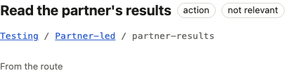
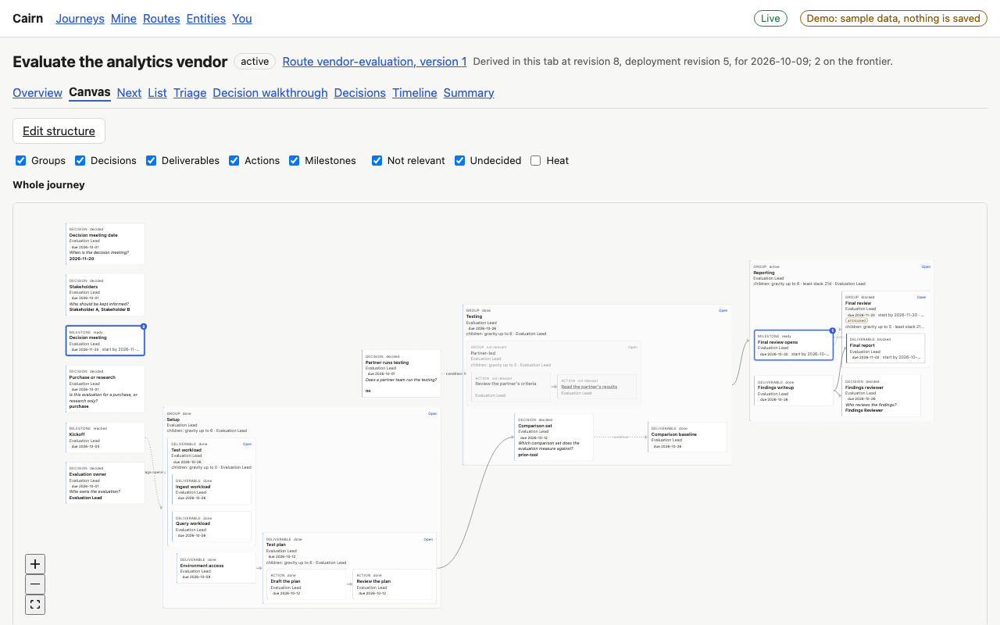

# Proof: one display state for every node (8.1)

Every node now says one state, composed by the engine from relevance, stored state, skips,
auto-reach, blocking and snoozes. A decision an answer ruled out no longer says OPEN, a
stage with work started beneath it no longer says BLOCKED, and a node that rests on a decision
nobody has answered yet says CONDITIONAL instead of being written off. The state travels
beside the stored one (`display_state` next to `state`, `by_display_state` next to
`by_state`), so nothing that reads the old fields changes.

## Before and after

Real values from the fixtures. Before is what the inspector header and list rows printed (the
stored state; a group's chip printed its legacy group state). After is `display_state`.

| Fixture, step | Node | Before | After | Why |
|---|---|---|---|---|
| hiring loop, 6 | `close-out` | todo | not relevant | the offer decision is yes; recorded Todo is kept |
| vendor evaluation, 2 | `testing/partner-led/criteria` | todo | not relevant | the partner decision is no |
| vendor evaluation, 2 | `testing/baseline` | todo | conditional | relevance is undecided until the comparison set is answered |
| vendor evaluation, 2 | `setup` (group) | derived | blocked | it waits for the kickoff that opens it |
| vendor evaluation, 6 | `setup` (group) | derived | active | its access and plan are done, the workload is not |
| hiring loop, 3 | `make-offer` (decision) | open | blocked | it waits for the loop; it says TO DECIDE once it is ready |
| product launch, 2 | `beta-start` (auto-reach) | pending | scheduled | unblocked, its date is ahead |
| product launch, 2 | `build` (group) | derived | active | feature work has started |

Two cases the fixtures do not have, from the scenario tests (`display_state.rs`):

| Test route | Node | Before | After |
|---|---|---|---|
| decision `Branch` gated on `Ask = yes`, `Ask` answered no | `Branch` | open | not relevant (recorded Open) |
| action gated on `Branch = yes`, nothing answered yet | the action | not relevant | conditional, `pending_on` names `Branch`; its relevance, gravity and blocking are unchanged |

The header chip reads the display state (`not relevant`); the stored state stays beneath.

Cards read the same words: kickoff is reached, the partner-led group not relevant, the final
review blocked, the reporting group active.

The summary counts by display state (`by_display_state`); `fixtures/README.md` lists each
fixture's counts, and its `by_state` counts are unchanged.

## Known limits

- The list's "by state" filter still names stored states; filtering by display state needs a
  new list query field.
- Snoozing a container is not built yet, so a snooze shows only on the node it was set on.
- `by_display_state` counts in-scope nodes, so a not-relevant node pending on an undecided
  decision is shown conditional on its card but is not in the counts until it is in scope.
