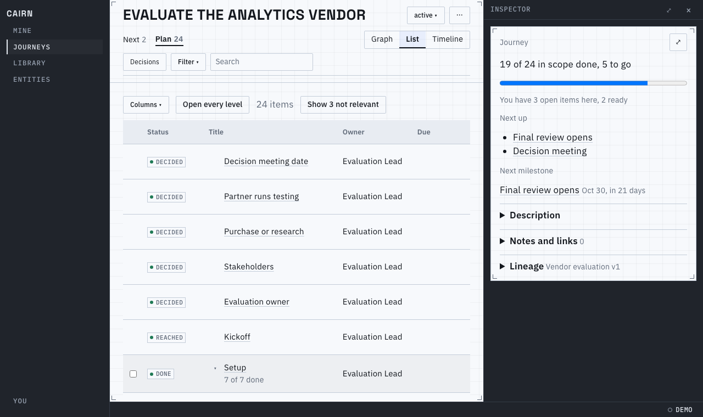
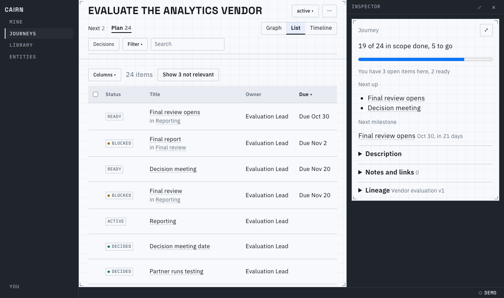
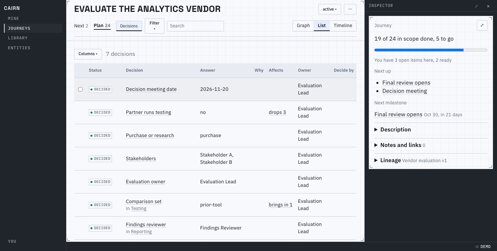
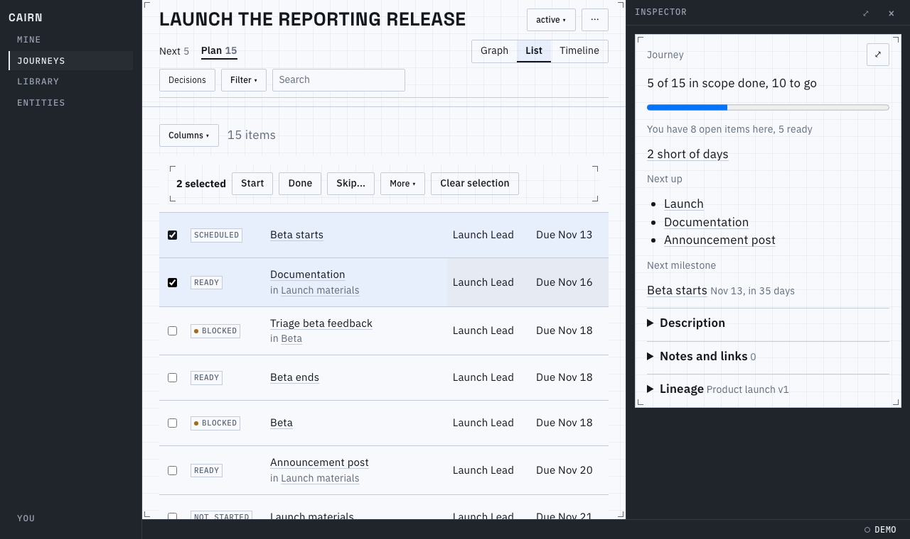
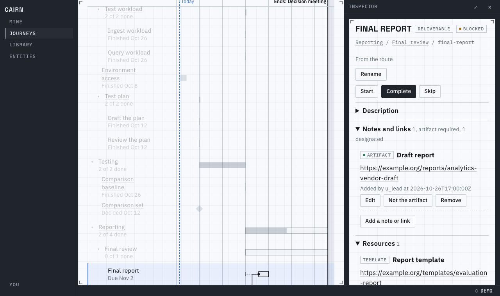
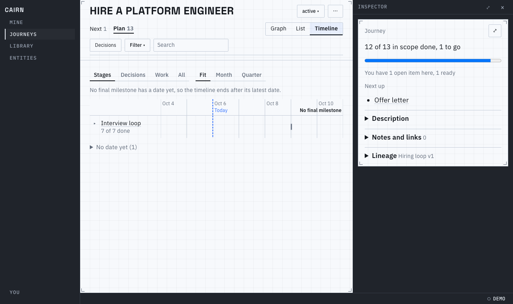

# Proof for brief 8.10: Plan list and timeline

The Plan list is the journey as a tree, folded to its top level, and flat once you sort a
column. The timeline follows the same tree, and fades what a filter or a selection leaves out.
Dates read as words ("Due Nov 20", "3 days late"), and a count that says "not relevant hidden"
means the list and the Plan tab agree.

## The list

The default is plan order: soonest first, a container by the soonest thing beneath it, the final
milestone last. A container shows how far along it is under its title; opening it
shows what it holds. Hovering a row brings up its checkbox, and the columns are Status, Title,
Owner and Due:

Sorting by a column (its header) flattens the tree, and each row says which container it is in
under its title. The not-relevant rows are left out, and the strip says how many and offers
them:

With Decisions on, the rows are the decisions: their answer, why (the rationale's first
paragraph), what the answer affects (a link that selects the decision and traces it on the
graph), owner and decide-by. Columns adds Rank, Start by, Slack, Gravity, Unblocks, Kind,
Answer, Why, Affects and Effort. The table scrolls sideways to them with Status and Title held
at the left, and only the decision's Why gives way when the region is narrow:

Selecting rows turns the header into the bulk actions. A guard failure on any row fails the
patch and names the row:

## The timeline

Rows are the containment tree, folded by the same detail steps as the graph (Stages, Decisions,
Work, All). A stage is one bar from its earliest start to its latest due, filled by what is
done. Selecting a row shows its float (the dotted whisker, earliest to latest start) and its
dependency lines; everything else fades:

A journey with no final milestone ends after its latest date and says so at the right edge. The
Mine chip and the kinds fade rows the same way on this page:

## Known limits

- The timeline's range control (Fit, Month, Quarter) is not remembered per journey.
