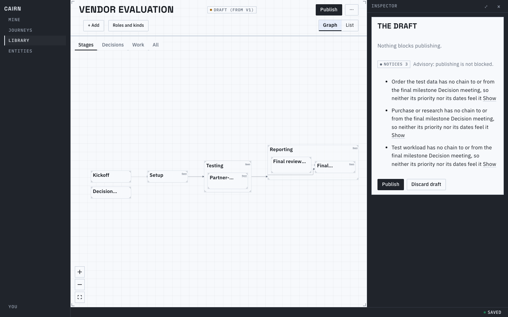
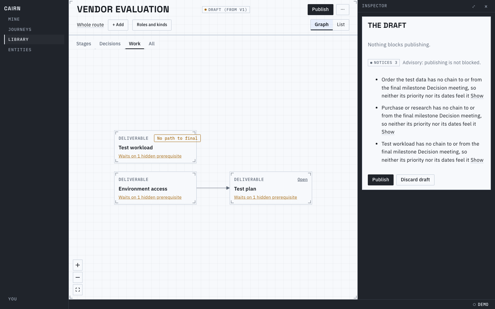
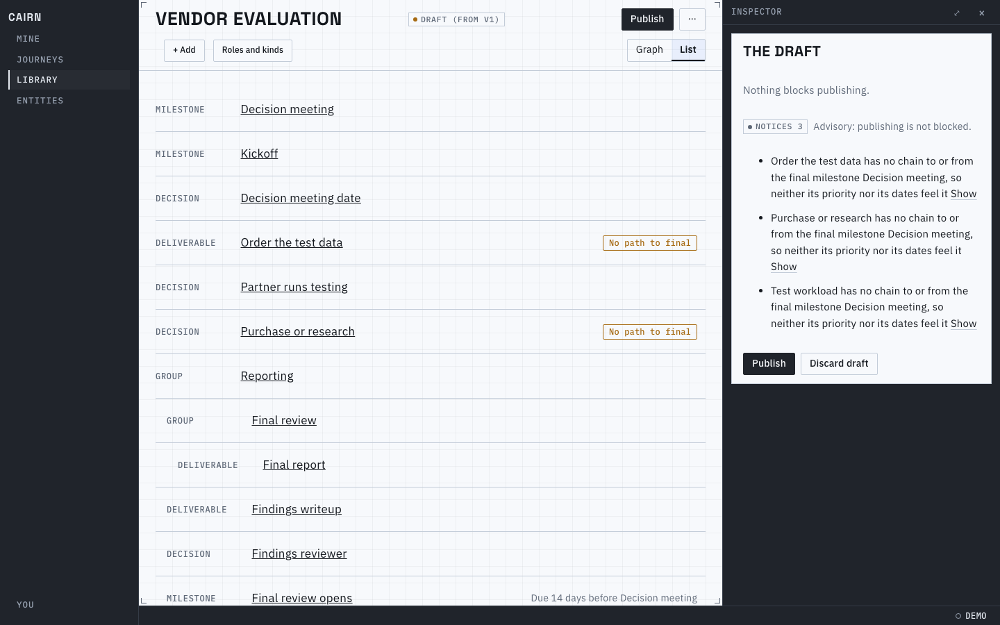
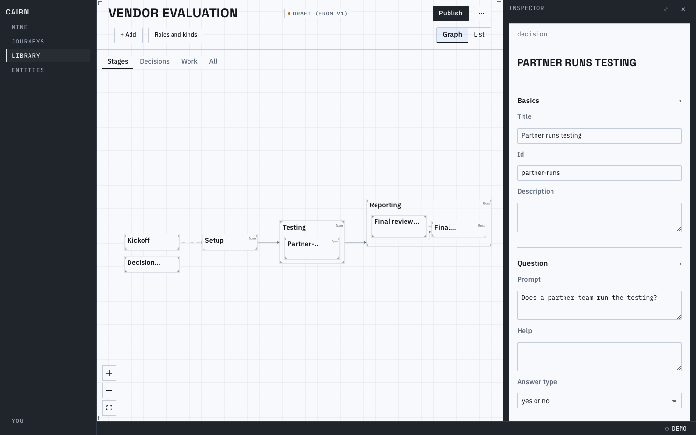
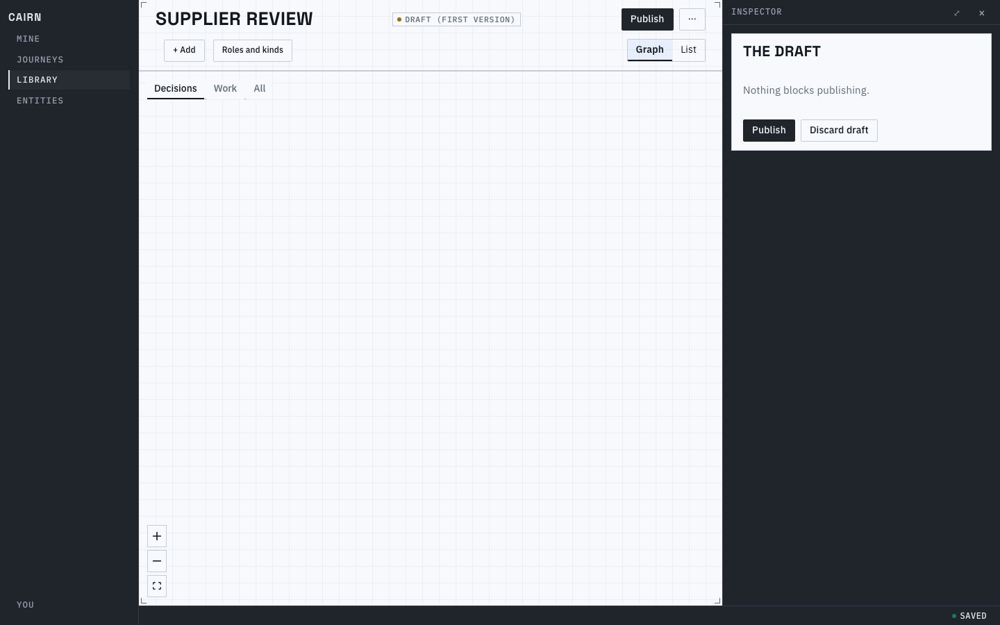
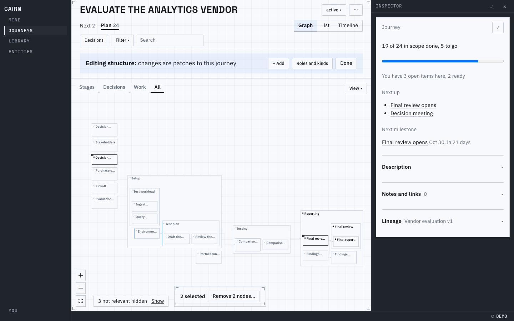
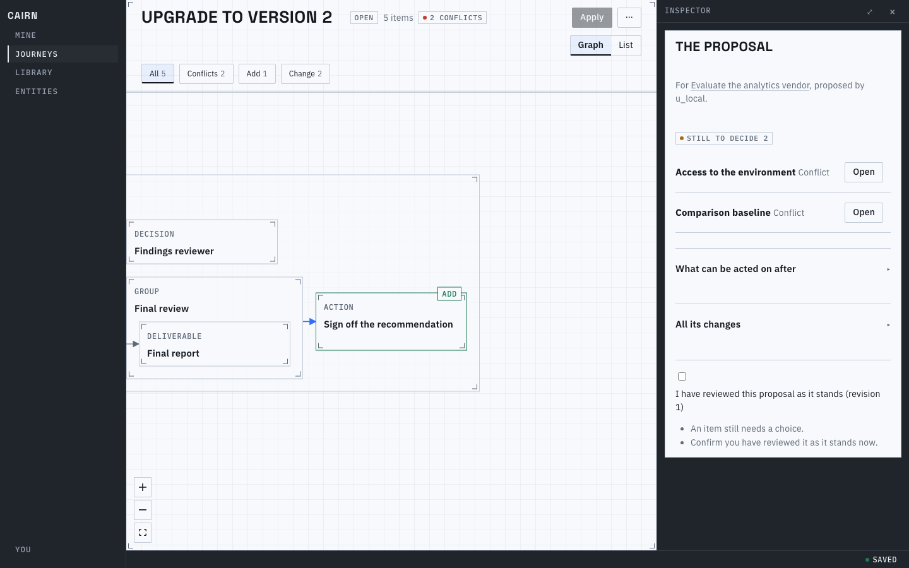
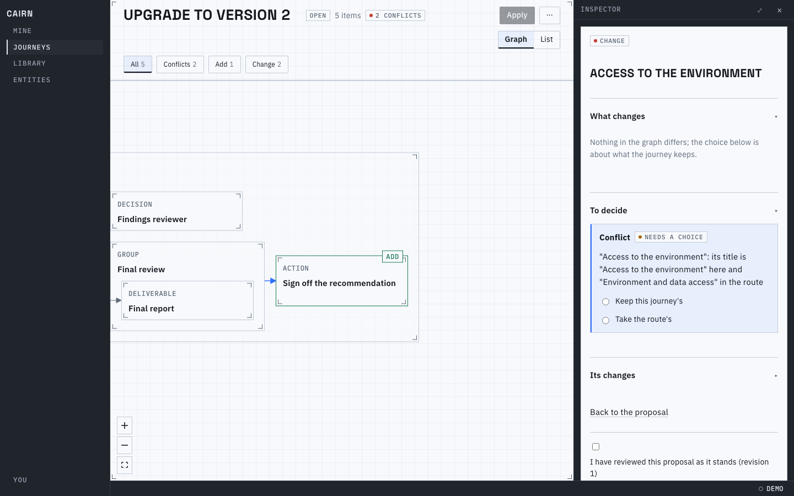
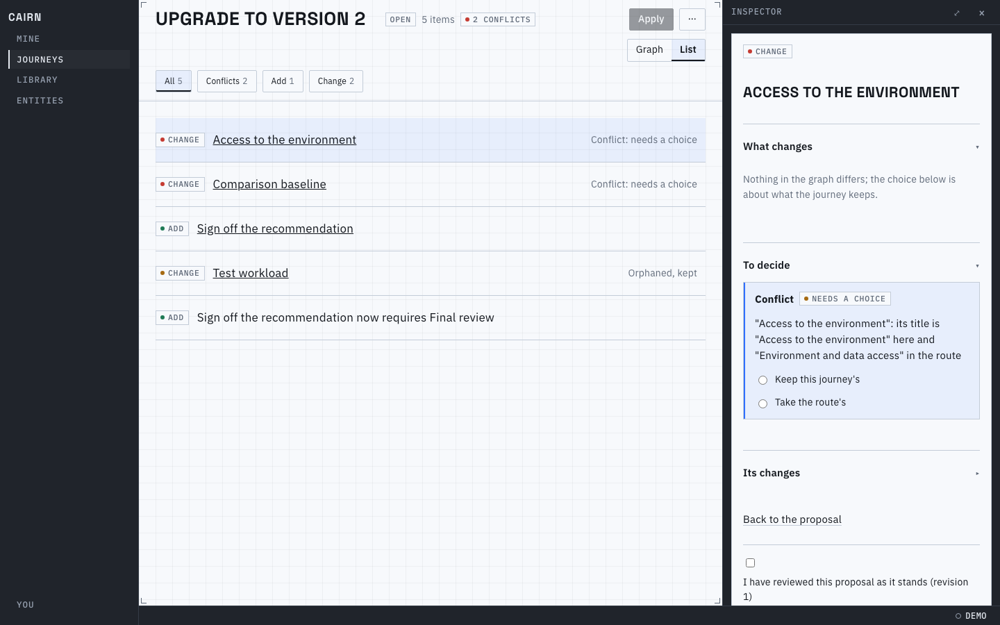

# Proof for brief 8.11: Authoring and proposal review in the frame

A route draft, a journey's Edit structure and a proposal under review now sit in the same frame as
every other screen: a one-line header, a workspace that fills what is left (the Graph, or the
List), and the inspector. Authoring puts a node's form in the inspector, its sections opening by
kind; review puts the item to decide there. Pictures are 1440px, light, the in-browser host.

## A route draft

The header is the route's name, where the draft came from, Publish, and a `...` holding Versions
and journeys, Export, Import into draft and Discard draft. The draft card is what the inspector
shows while no node is open: what blocks publishing (nothing here), and the advisory notices apart
under their own label, each with Show. The ladder opens at Stages, as a version does, and `+ Add` and
`Roles and kinds` sit on the Graph and List row, each opening in a popover:

Drilled into a stage the cards are near: a node no chain links to the final milestone carries a
hollow chip, and a card with a date rule says it in words. The List says the same in rows:

## A node's form

Basics are open for every node and Question for a decision; Relevance, Dates, Completion needs and
Weight and estimate are folded rows that open themselves when one of their fields has a
violation, and People, Guidance, Requirements and Where it sits follow:

A new route's empty draft has nothing to block it:

## Edit structure

From the journey's `...`: a full-width band says the edits are patches to this journey, with `+ Add`
and `Roles and kinds` (each a popover) and Done, and a selection offers Remove, each node confirmed
with its cascade:

## Review

The header names the proposal, its items and its conflicts; Apply is off, saying why on hover,
until nothing blocks it. The view opens on the changes, and cards carry the word for what happens
(Add, Change, Remove) at a size that stays readable however far out the view is; a removal is kept
ghosted and struck where it was, and a conflict or an orphan is said in the list's foot. The chips keep the review to one kind:

Picking a node puts its item editor in the inspector: what changes, the choice it needs, its own
changes. The List is the same review as rows, a cascaded removal beneath its cause:

Known limits:
- A route draft has no trace or Signals lens yet; they need a trace and gravity from the host.
- Remove on a selection confirms one node at a time.
- Regenerate the pictures with `proof/authoring-review.proof.ts`.
