# Proof for brief 8.4: The app frame and the Graticule migration

The app now sits in one frame: a graphite rail, the paper workspace, an inspector column, and a
28px strip, all in Graticule's tokens and fonts, light and dark. Each region scrolls on its own, so
a node's History is always reachable and the page never scrolls behind it. A phone gets a map
preview that leaves swipes to the page, and a full-screen map that owns them.

## Before and after

The canvas with a node open. Before, the detail was a sticky box inside the page; now it is the
inspector column, and the canvas fills the workspace:

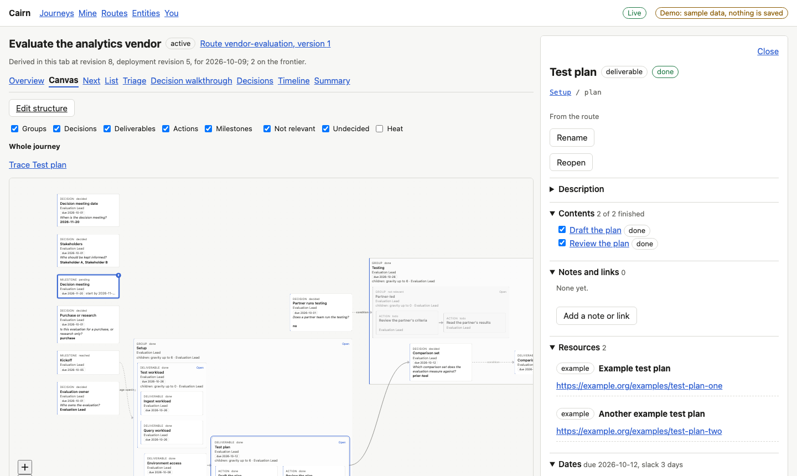
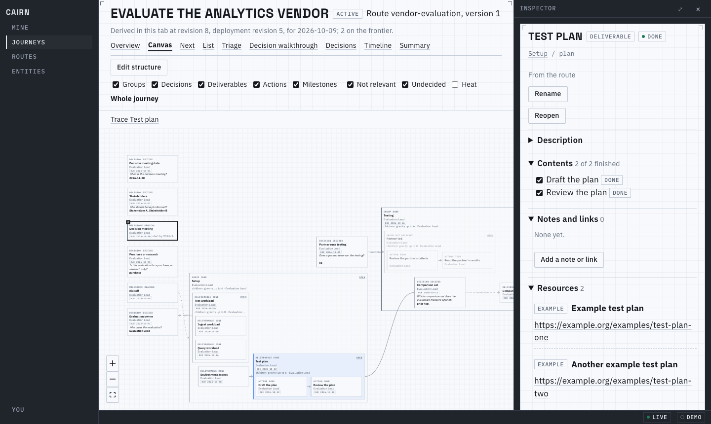

The list. Before, a system-font table in a page column; now a primary table in the workspace, its
band header sticking to the region:

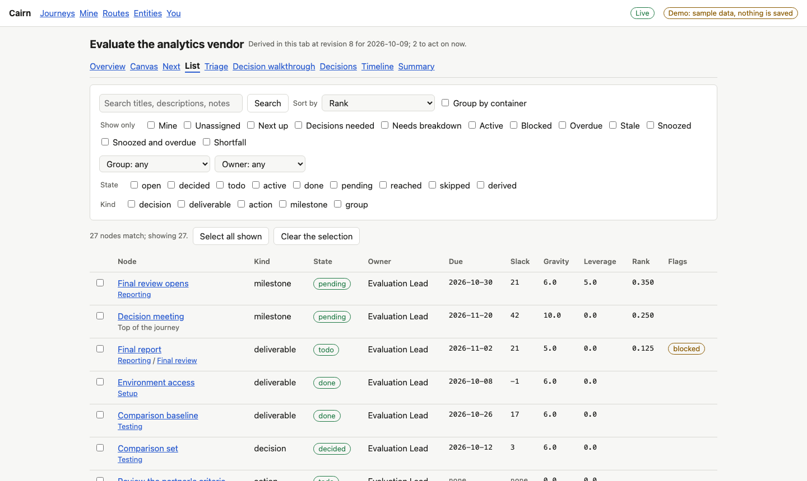
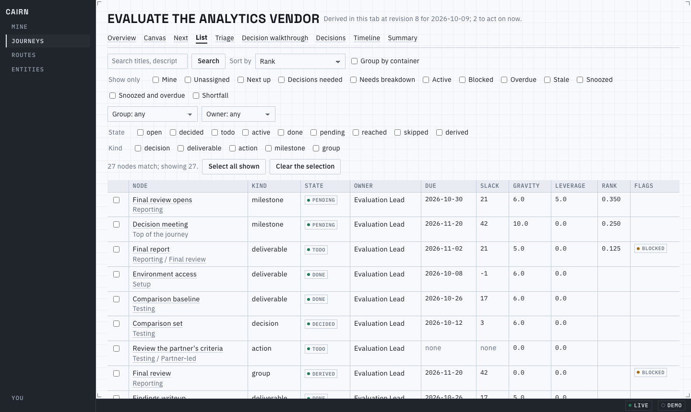

The inspector scrolled to the end. Before, History sat on the window's edge with the page scrolled
behind it; now History is open, inside the window, and the document has not scrolled:

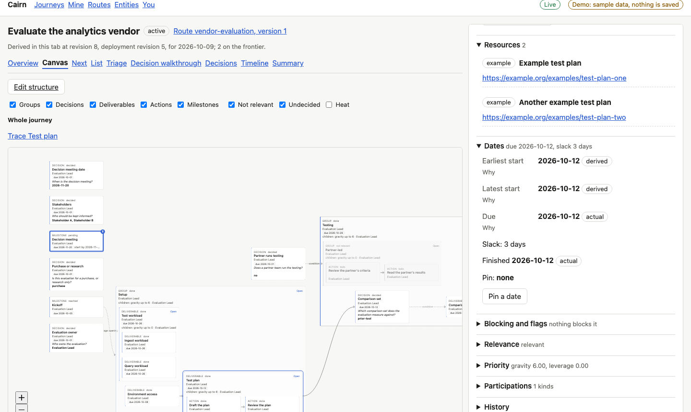
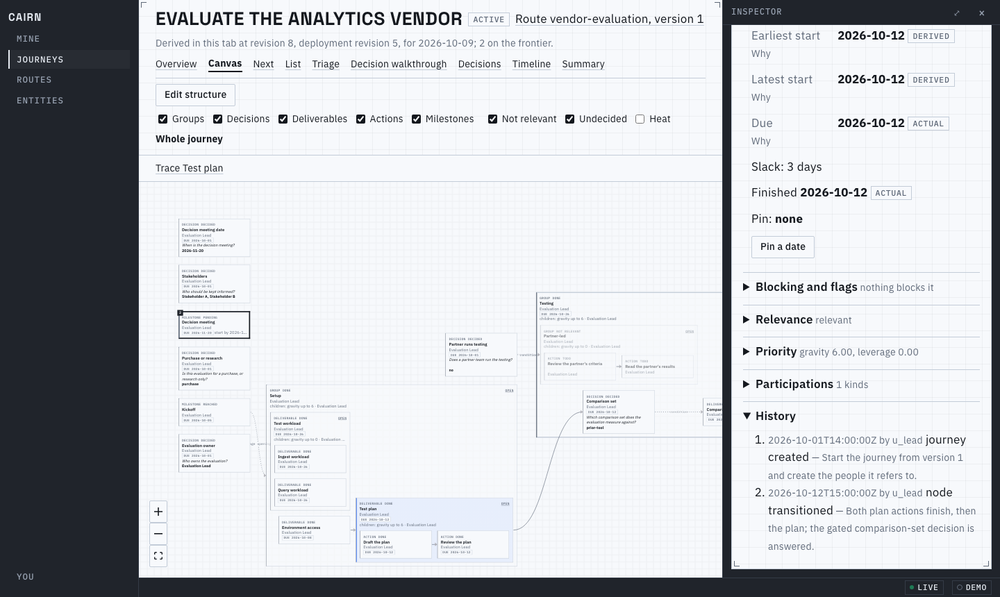

The decision view follows the same rule: one view per page. The graph fills the workspace, and the
table of what each answer affects is the other half of a Graph | Table toggle, so the wheel over the
canvas never lands in a scroller:

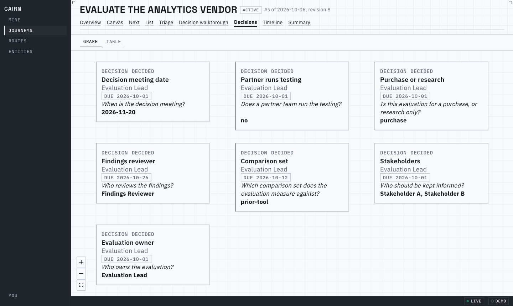

## Dark

The rail, inspector and strip sit on the ground colour, so the paper does not merge with its chrome.
The You page has a System, Light and Dark control that is kept in this browser:

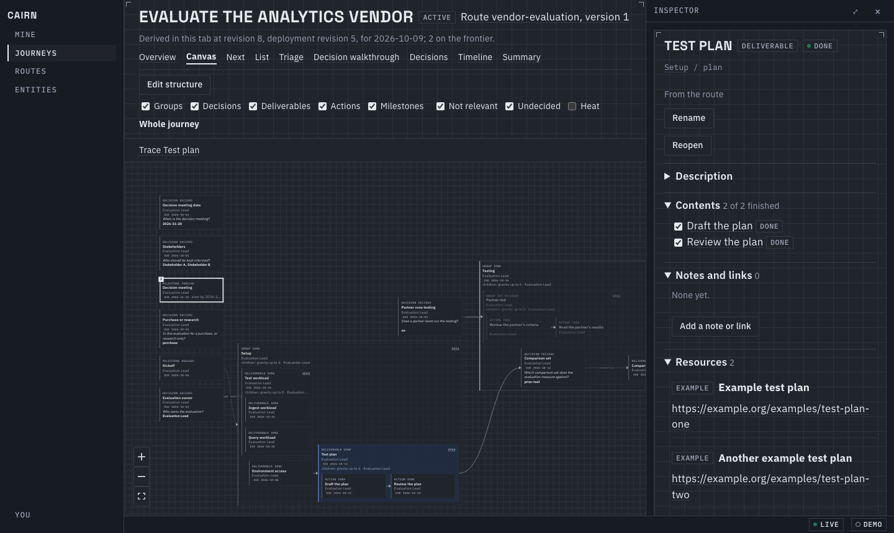
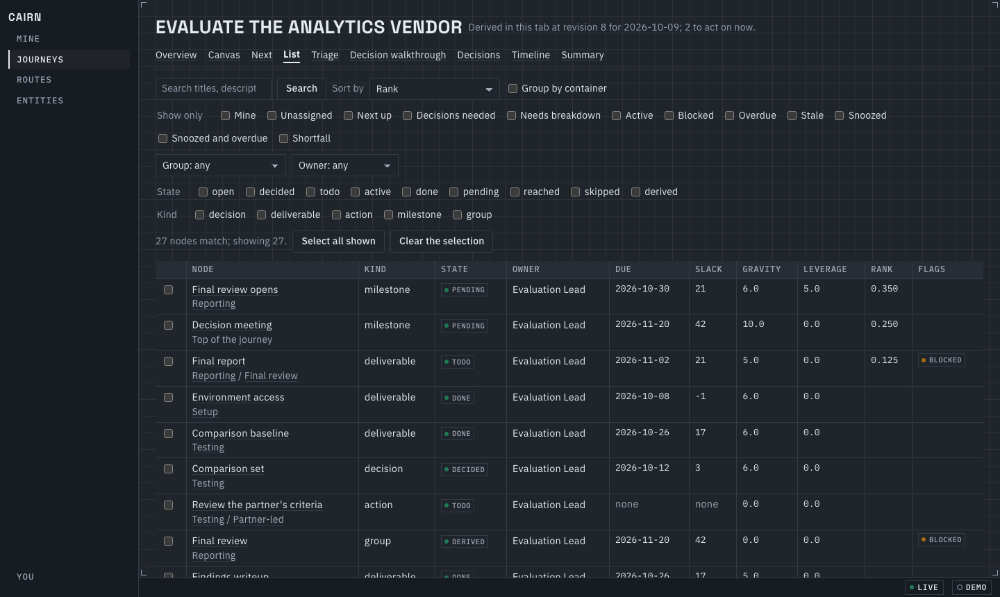
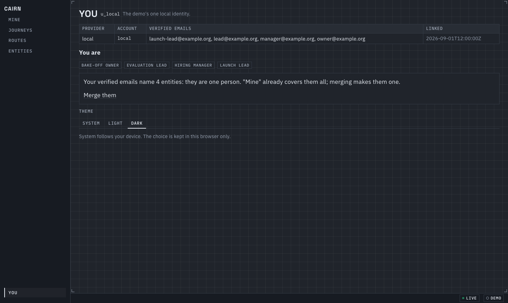

## Tablet and phone

From 720 to 1099px the inspector is a bottom sheet (40dvh or 85dvh) whose grip, tabs and close sit in
one head row. The workspace ends above it, and the picked card is centred in the band it leaves:

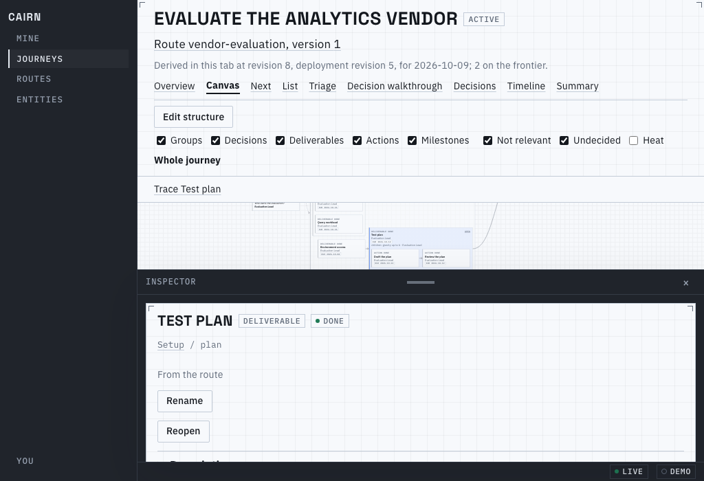

Below 720px the map is an inert preview with one button; Open map is a full-screen layer (`map=1`,
so Back closes it) where a tapped node opens as a sheet over the map:

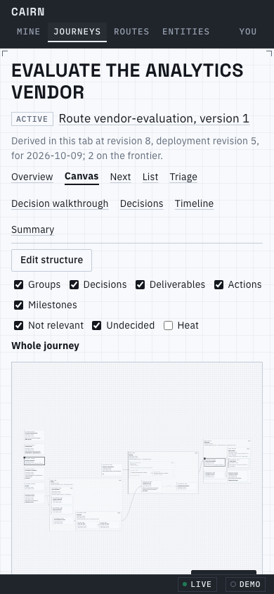
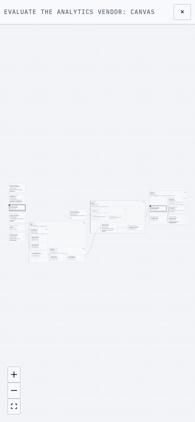
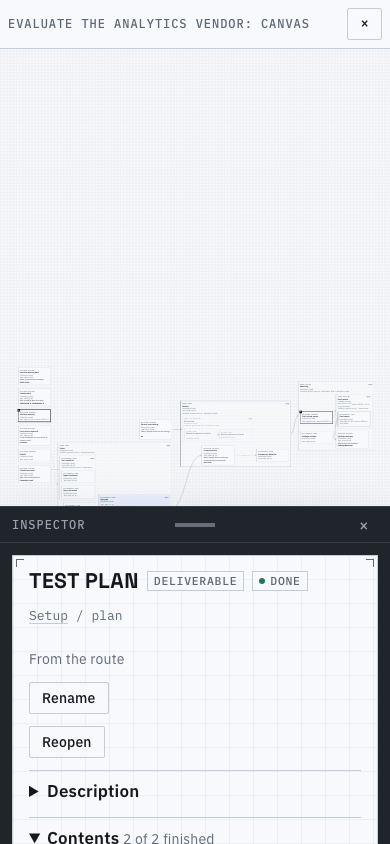

## Guard rails

- `mise run lint:css` (rung 1): one scroller per region, no `vh` heights, tokens for colour and radius.
- `e2e/frame.spec.ts`: History reachable at the end of the inspector (or sheet) on the canvas, decisions,
  timeline and summary at 1440 and 1024px; a tablet's scrolling screens end above the sheet; the
  decision canvas leaves the wheel to itself; the phone's swipe, wheel and map; the theme across a reload.

Known limits:
- The journey head is still several rows (the journey pages brief shrinks it); a taller-than-window head scrolls the region.
- The rail has no Recent list yet, and the strip still carries the old Live badge until the sync chip lands.
