# Proof for brief 8.5: The sync chip

Saving no longer pops a toast. One chip at the strip's right end says whether what you see is what
exists and whether your edits are landing. A save shows a quiet `SAVED` for two seconds, and the
control you used keeps a one-line receipt: "Saved", plus a sentence only when the write has a
warning. Nothing on screen has a close button.

## The colour rule

Green means nothing to do. A steel ring means it is working on it. Amber means it will sort itself
out, or it is safe to wait. Red means your change is not landing until you act. A conflict's mark is
a `!` and the demo's is hollow, so colour is never the only signal.

## In sync, saved, and the receipt

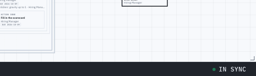
In sync: live, nothing pending, the view shows the latest revision (hover for the sentence).

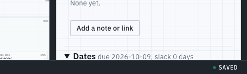
Saved: green for two seconds after a write lands.

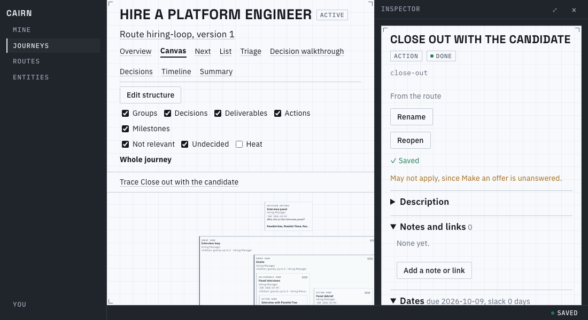
The receipt under Complete: "Saved", and the one warning this write caused.

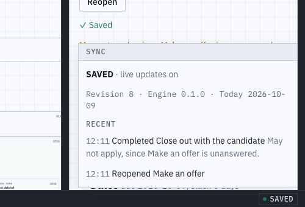
The popover: revision, engine and today (moved out of the page headers), and this tab's recent saves,
each with its warning on its own line.

## Working on it, and amber

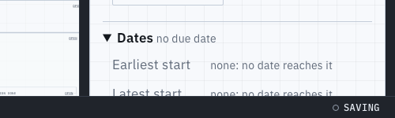
Saving: a write has been out for over 300ms (no flicker for fast ones).

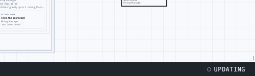
Updating: another tab changed the journey and the refetch is under way.

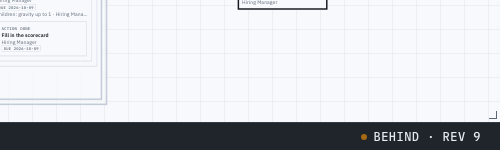
Behind: the refetch failed or took over 5s. The view still shows the older revision; a
click retries now.

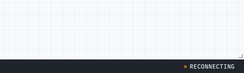
Reconnecting: the live stream dropped, and edits still save.

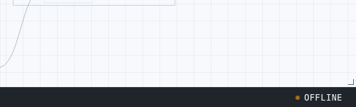
Offline: the network is down.

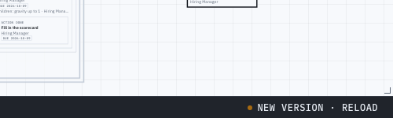
New version: Cairn was updated; a click reloads, and unsent edits are kept.

## Red, and the demo

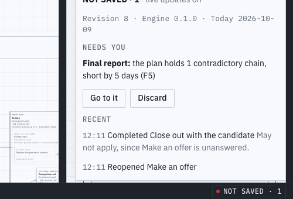
Not saved: a rejected change waits under "Needs you" with Go to it and Discard.

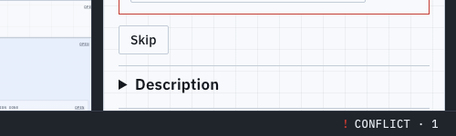
Conflict: someone changed the same field since you started editing.

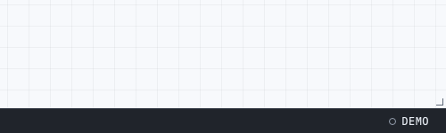
Demo: sample data in this tab, nothing persists.

## Guard rails

- `data/sync.test.ts`: the precedence, each state's colour by the rule, the 300ms, 5s and 2s thresholds.
- `e2e/sync.spec.ts`: saving, updating, behind (a click retries), reconnecting, offline, and a
  rejected change kept under Needs you until discarded.

Known limits:
- Undo, and "N kept" edits while offline, are not built: offline is a state only.
- Receipts show under node-detail sections, the node form and the entity merge; the Next page and the new
  inspector reuse the same component. Recent keeps one warning sentence per save, not a link per node.
- A rejection's Go to it opens the screen it happened on, not the section; Retry stays at the control.
- With several journeys open, BEHIND reports a failed refetch before a slow one (`data/journeys.test.ts`).
