# Proof for brief 8.6: Journey pages, navigation and addresses

A journey now has two pages, NEXT and PLAN, each with its own projections and one switcher
that stays in the same place. The inspector's empty state is the journey card, and the
journey's life (status, structure, proposals) is in its one-line header. Every address the
earlier screens had still opens, on its new page. The window never scrolls: the header and
toolbar stay put, and the projection and the inspector each scroll on their own, so the
inspector's last section is never below the fold.

## Pages

A journey just started opens on the decision walkthrough: NEXT, CARDS, with DECISIONS on.
The counts on the tabs, the chips, and the switcher at the right end are the toolbar:

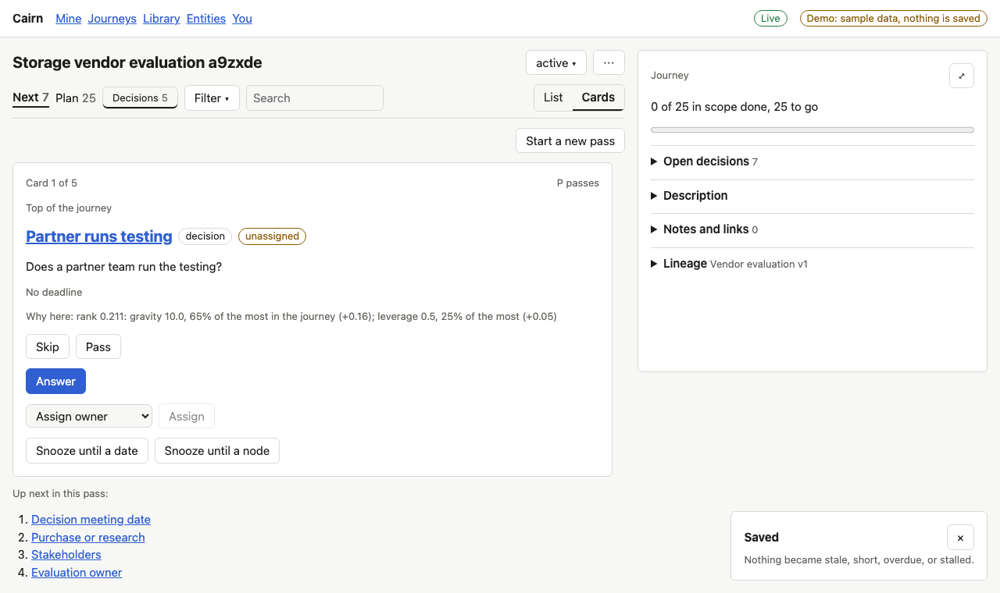

NEXT, LIST beside the journey card: progress, what is the viewer's, the next milestone, and
folds for open decisions (when there are some), the description, notes and links, and the
lineage, named by its route and version:

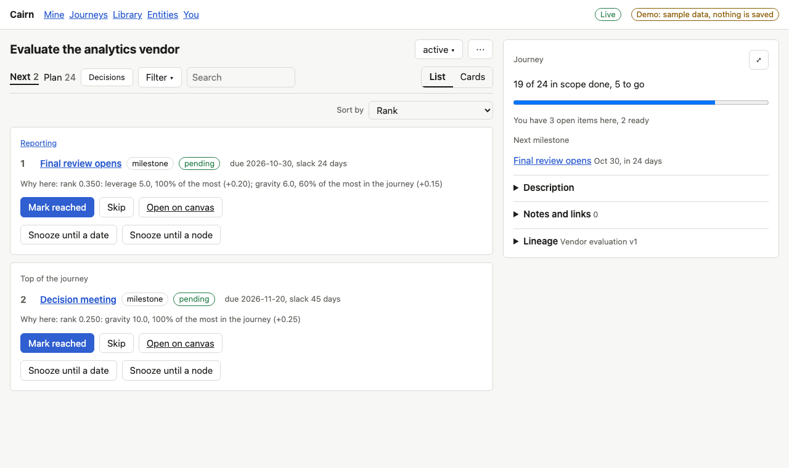

PLAN's three projections, with the switcher's right edge where it was on NEXT:

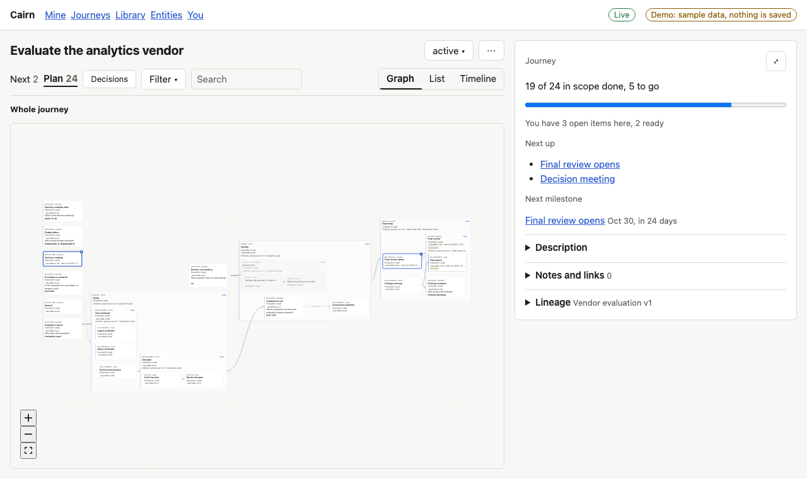
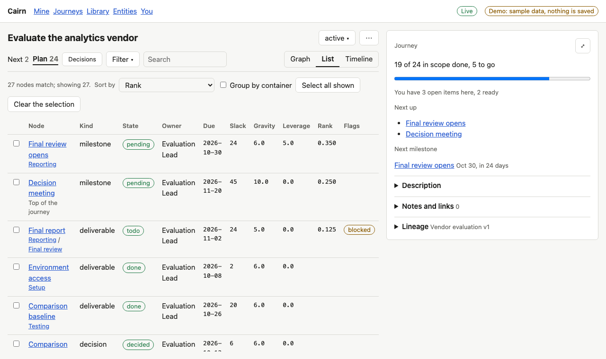
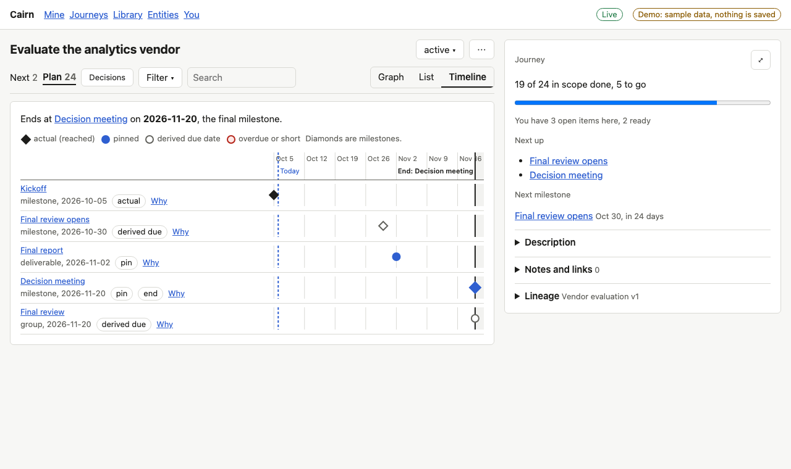

The toolbar has the same chips on every projection; on the timeline DECISIONS, the filter's
kinds and the search narrow its rows. The decision view is PLAN, GRAPH with DECISIONS on;
what a decision's answer affects moved into the decision's own detail, unchanged:

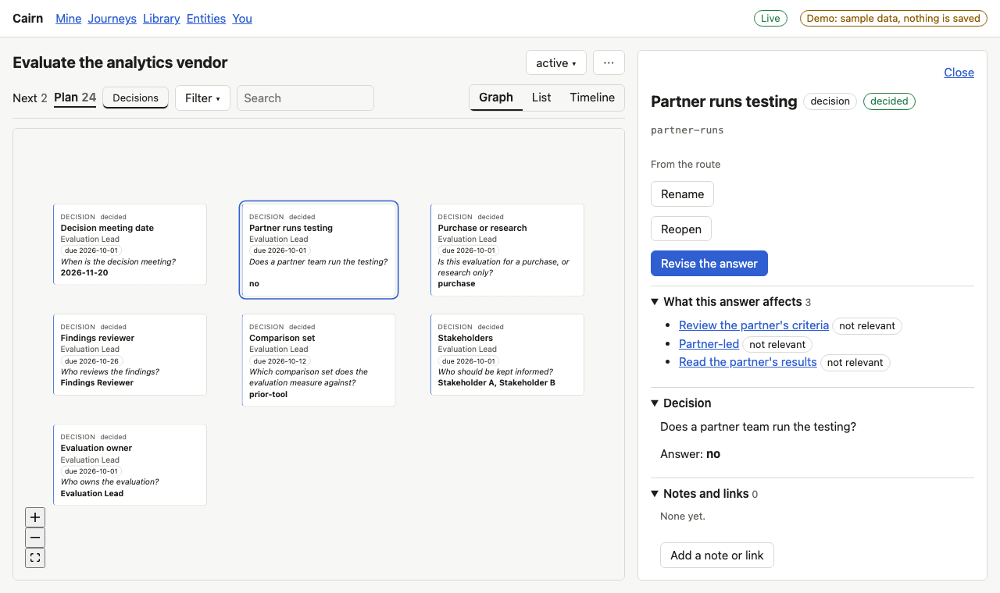

## Filters, menus, Summary

FILTER holds mine, the kinds, the flags and the owner (the list's sort and grouping are in its
header); every active one is a removable chip under the toolbar, and the count shows on the
button. NEXT's filter has the same shape:

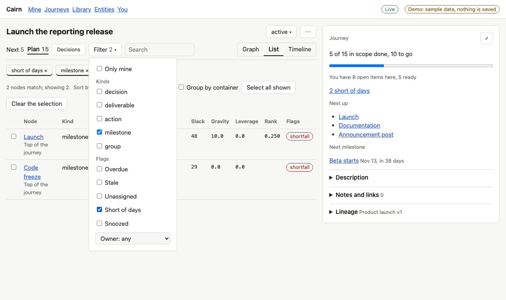
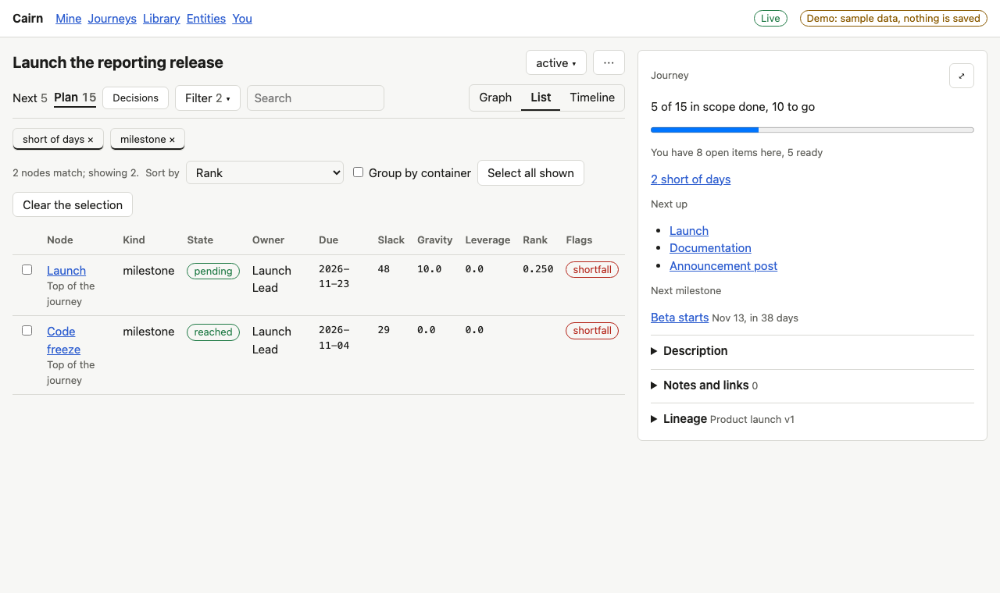

The journey's `...` menu holds what the overview did: edit structure, rename, save as a
route, re-link, upgrade when one is available, the Summary page, the keys, and the link. The
status chip beside it lists only the moves the status allows:

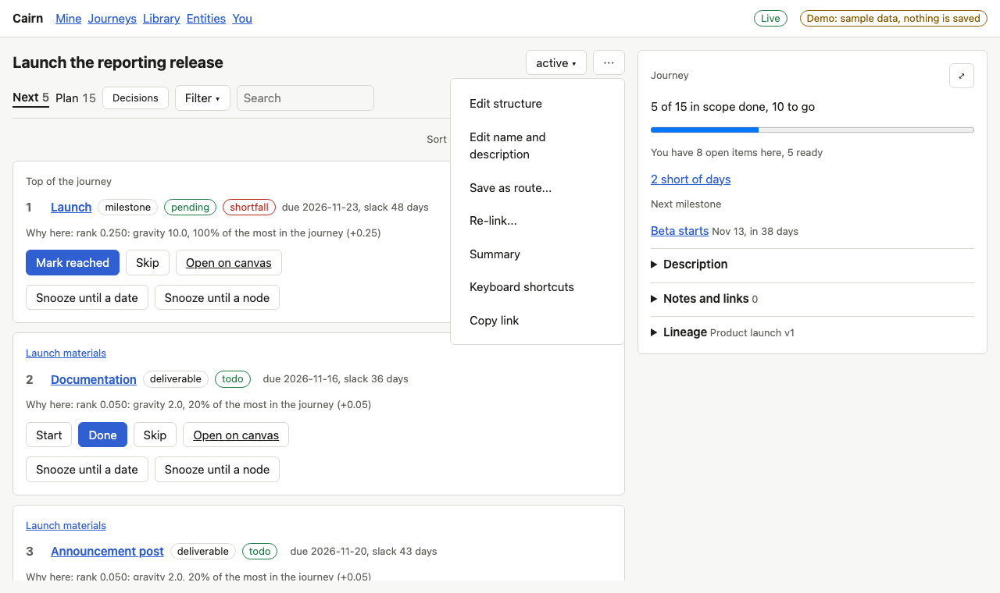

The journey card's expand button opens the Summary page, the same card at full width. A part
with nothing to list is left out, and what needs a look is the card's one sentence:

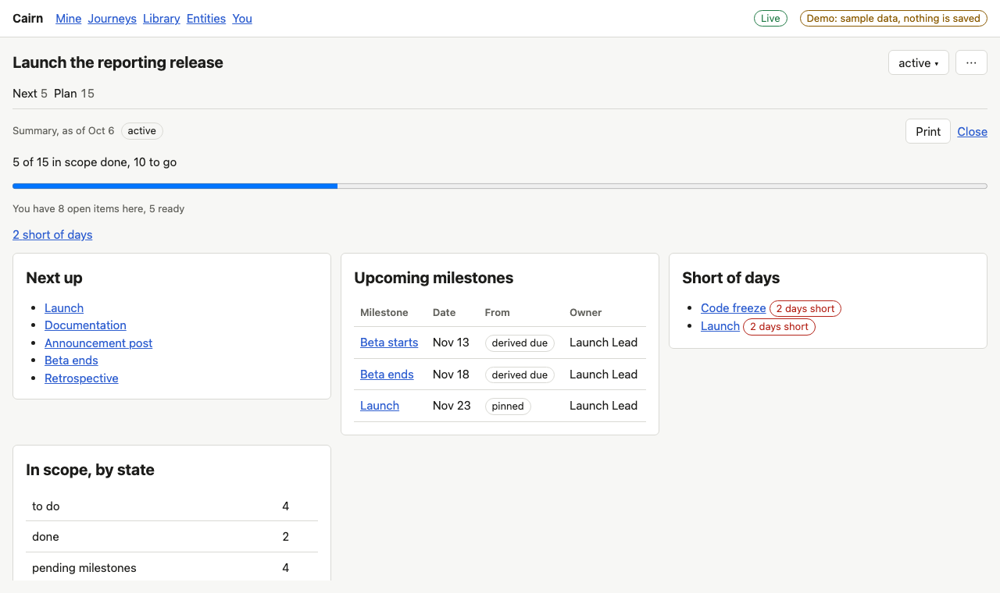

## Narrow windows

A menu that would run past the window's edge slides back inside it, and a tall one scrolls.
Below 45rem the page flows (header, toolbar, a node's detail, the projection). A head narrower
than 48rem puts the tabs and switcher on one row and the chips on the next. From 45rem to 1100px
the projection keeps the whole width, a node's detail is a sheet along the bottom (the journey
card shrinks to one line), and a canvas fills its region instead of scrolling inside it:

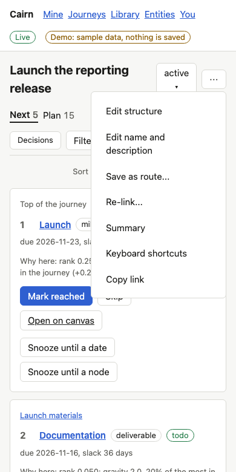
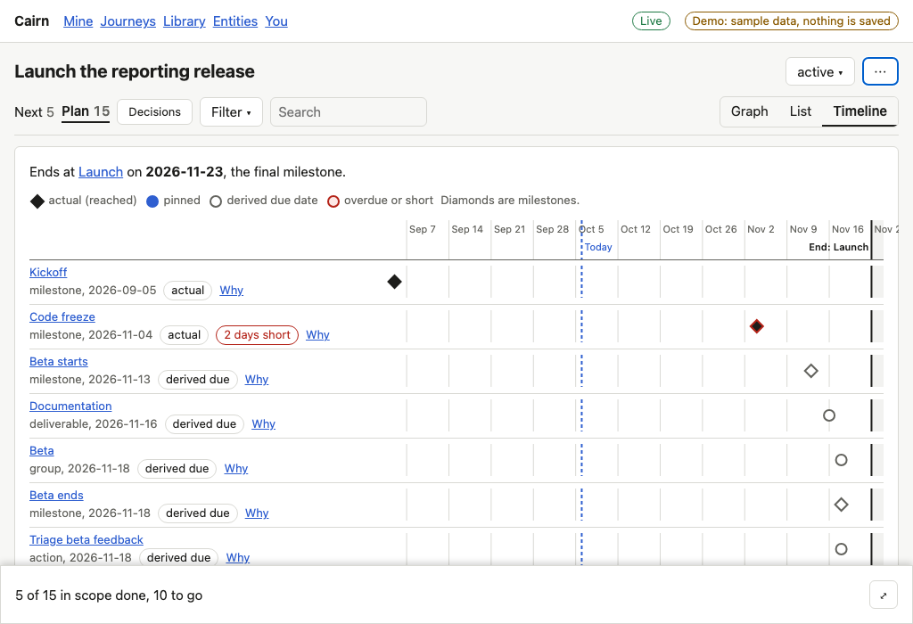
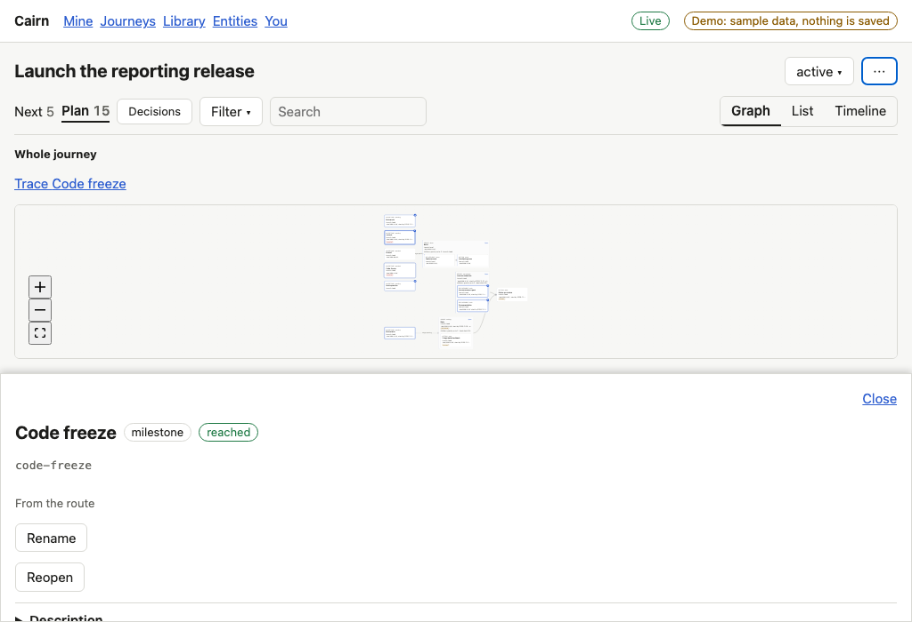

## Known limits

- Deeper per-projection behaviour (the decision view's fading, the Plan list's tree and
  Columns, MINE on the graph) comes with the tracks that redesign each projection. In the
  decision view the filter only says that decisions are all it shows.
- The tablet sheet and the phone's inert map with its full-screen layer belong to the frame
  (8.4), which replaces this unit's interim rules at integration.
- Proposal chips, Insert segment, Select, and the Library's segments are not here: the
  features they open do not exist yet.
