# Proof for brief 8.7: The inspector

A node's detail is now one calm column: its kind and place with its state chip, the title, one
meta line, one plain sentence saying what the state means, and the one thing to do about it. For a
decision that thing is the form itself; there is no Answer button to find first. Everything else
is a folded row showing its name and, at most, a count. Pictures are the column at 1440px, light.

## A decision is the form

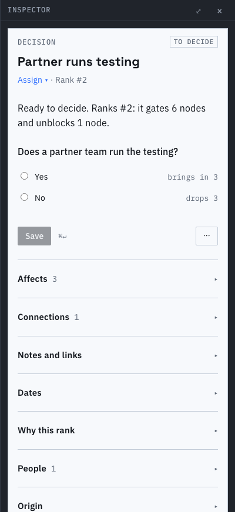
Nothing is preselected and Save is disabled. Each choice says what it would do ("brings in 3").

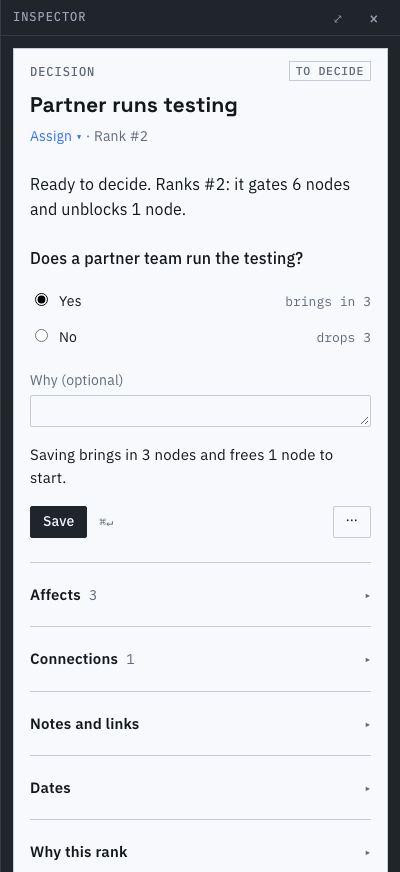
After a pick: the reason field, the preview sentence from the draft, and an enabled Save. The draft
survives a reload and is sent only by Save.

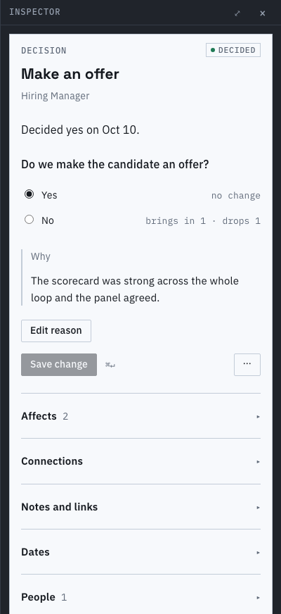
A decided decision shows its answer and reason; "Save change" waits for a difference. Its overflow
menu lists Reopen and the shape of the node, nothing else.

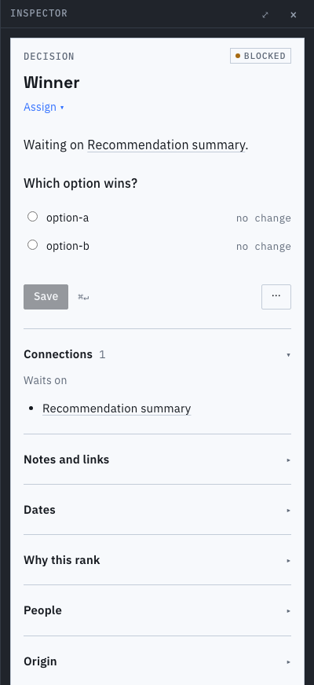
Blocked: the form is read with Save disabled, and the sentence names what it waits on. "Answer
anyway" is in the overflow menu and asks for a reason.

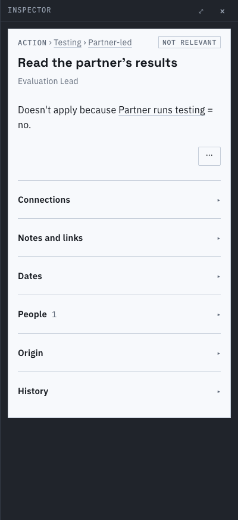
Not relevant: the sentence says which answer ruled it out; there is no form.

## Work: the primary action and what it needs

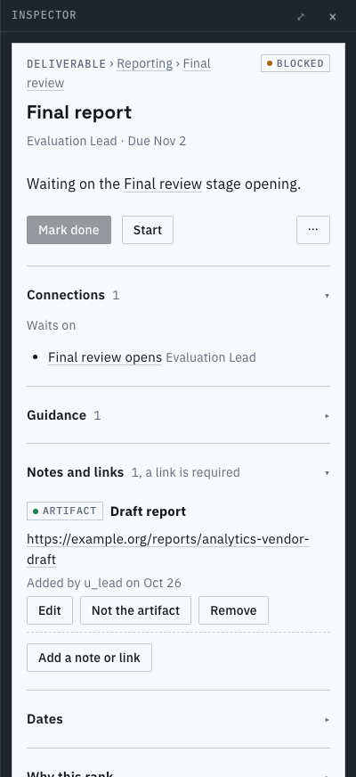
Blocked work: Mark done is disabled and the sentence says why; Connections is open for the same
reason, Notes and links because it holds the artifact.

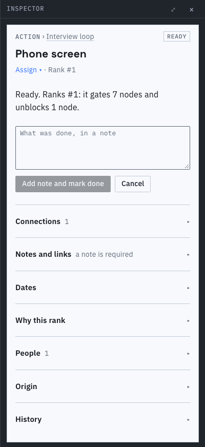
Done... opens the note in place; one patch sends the note and completes it.

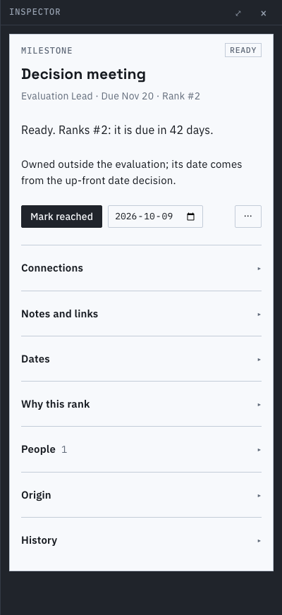
Mark reached, with a date that starts at today.

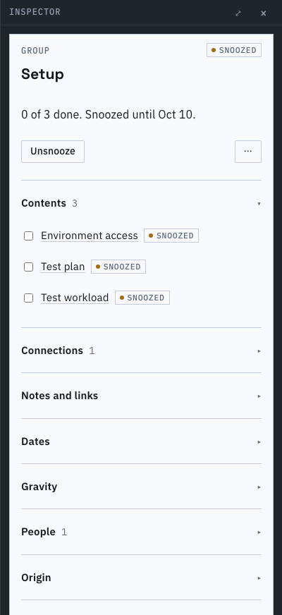
A group holding its own snooze: the sentence and Unsnooze.

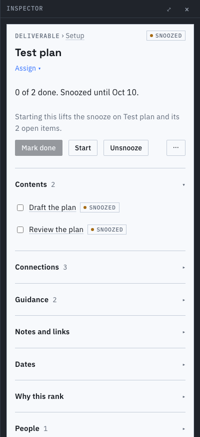
A deliverable under its own snooze: Start stays on offer and says it lifts the snooze.

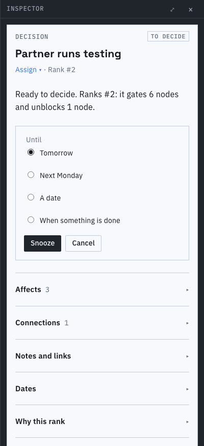
Snooze opens in place of the buttons; under a container it also asks what to set aside.

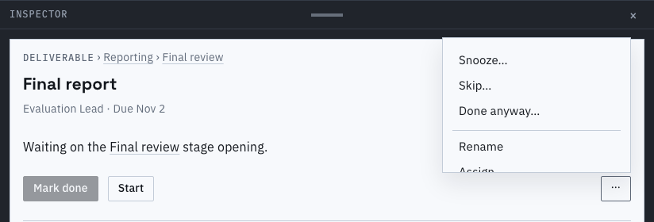
On a tablet the inspector is a bottom sheet; a menu that would be cut off below its button opens
upward and scrolls if it is still too tall.

## Why it ranks where it does, and links

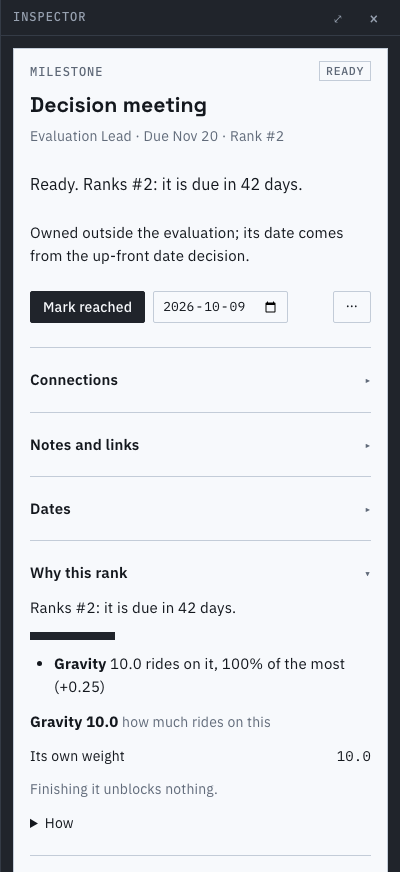
Folded until asked: the terms in words, the gravity, what finishing it unblocks.

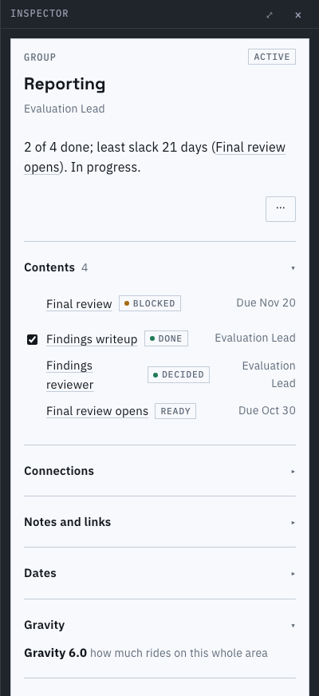
A container shows one gravity number for its whole area, never less than any member's.

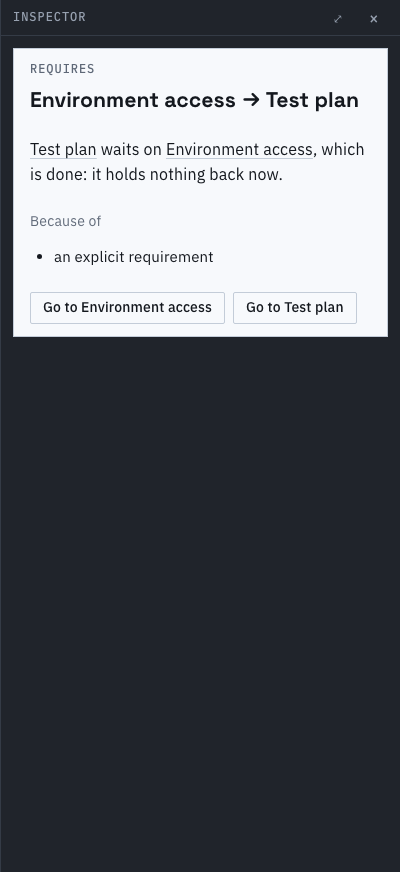
A selected link: both ends as links with Go to each, and what holds.

## Guard rails

- `e2e/detail.spec.ts`: no preselected answer and Save waiting for a pick, the report's chain,
  blockers, rank and history, the bypass, and a draft across a reload.
- `detail/offers.test.ts` (offers, the snooze's set-aside choices, a container's roll-up), `answer.test.ts`, `rank.test.ts`.

Known limits:
- The snooze chooser is a panel in the column, not a floating popover.
- The "answered meanwhile" callout does not name who answered: the document does not carry it.
