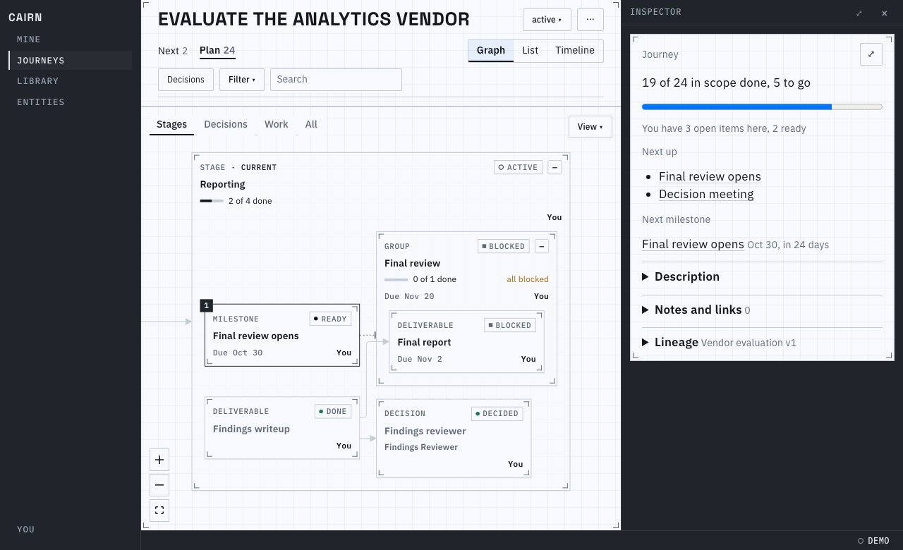
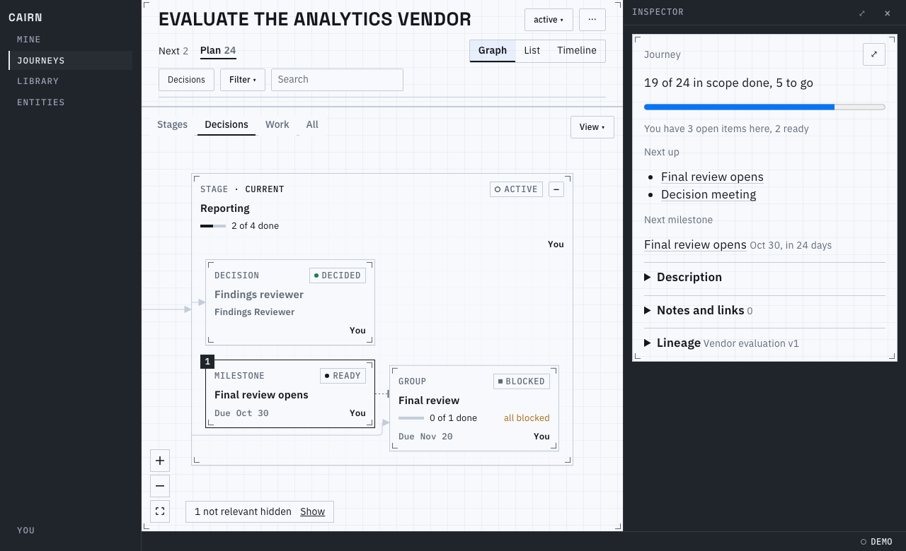
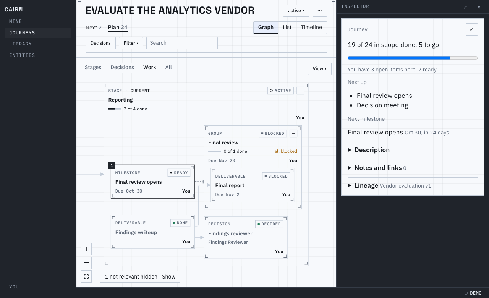
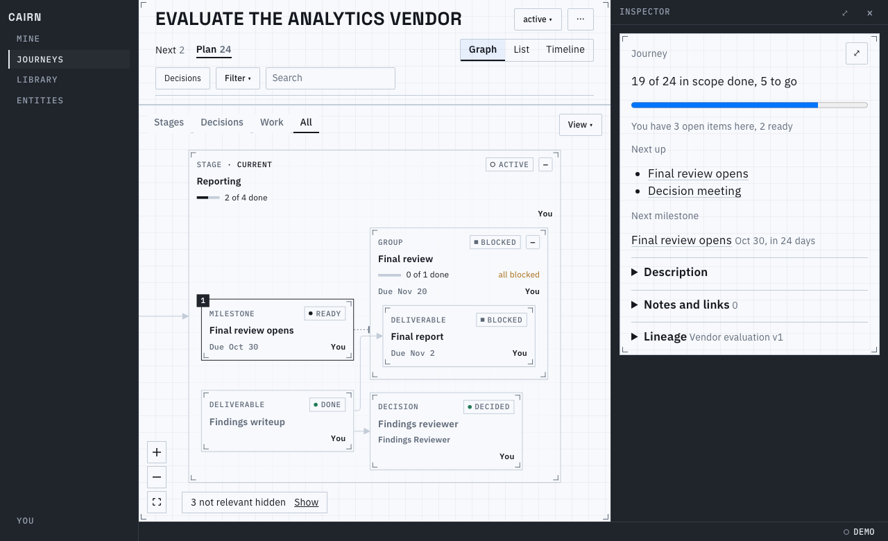
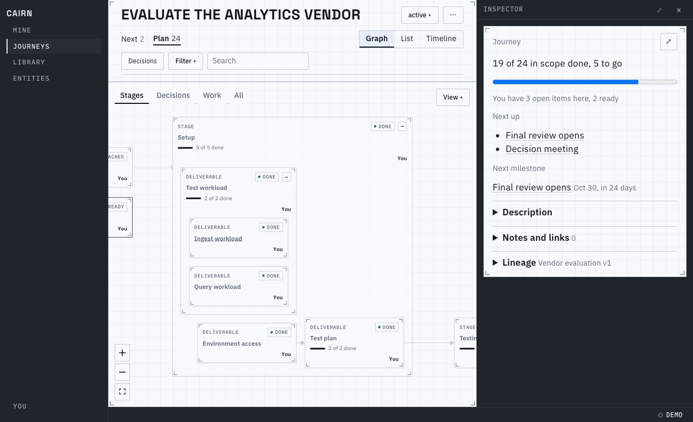
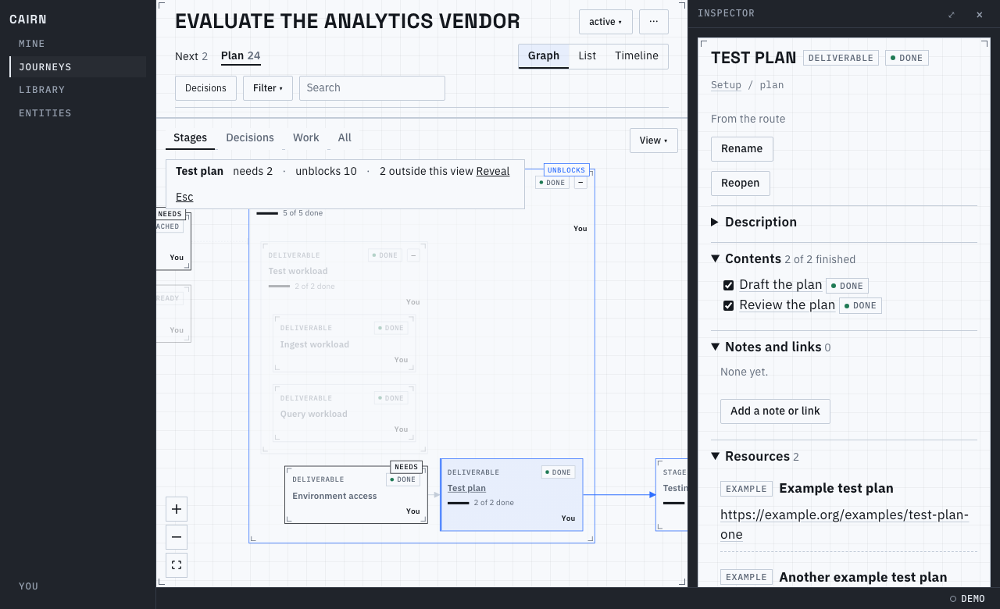
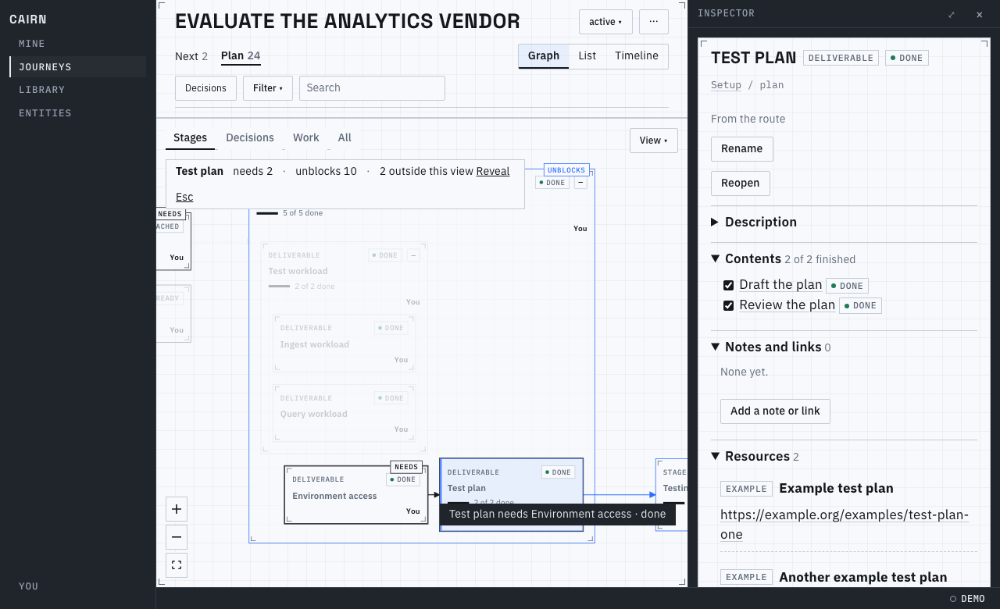
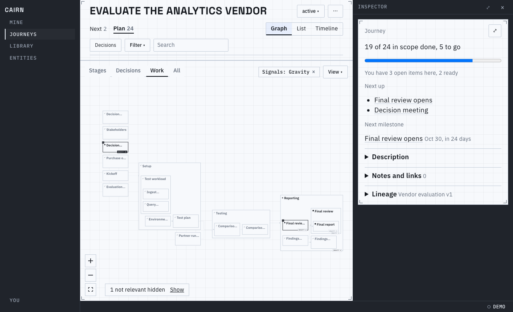
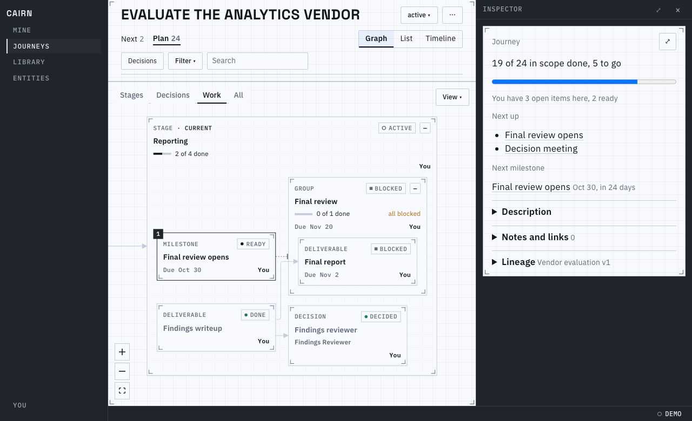
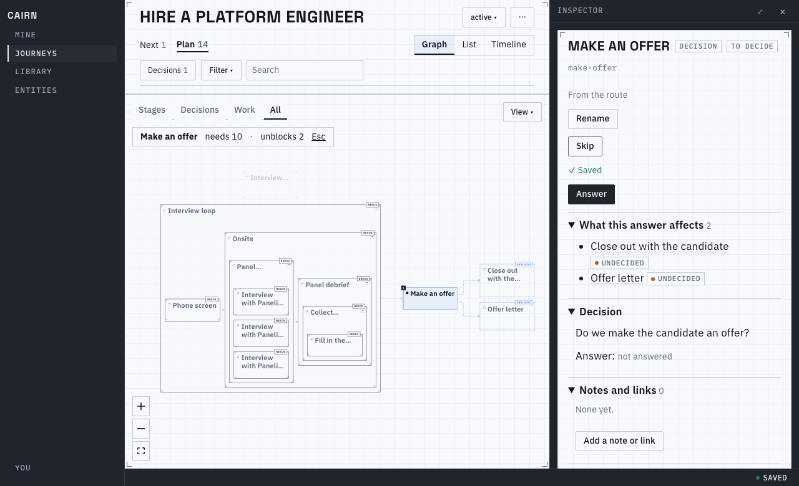

# Proof for brief 8.8: The graph

The Plan page's graph now opens at its stages and is read by drilling in. A four-step ladder
(Stages, Decisions, Work, All; keys 1 to 4) says how much to draw, a stage expands in place, and
selecting a node traces it. Lines are routed where the layout left room for them, so every arrow
is whole, and an end marker tells a requirement from a gate. Cards say a kind, a status, a title
and one line. The run is the vendor evaluation at its fixed day, on the in-browser host.

## The ladder

It opens at Stages: the stage that holds the work is open and labelled current, the others fold
to one card. The other steps open every container to their kinds; the hidden count (bottom left)
says what the view leaves out, and Show brings it back:

## Drill in, trace, follow

The plus on a folded stage expands it in place and the view fits it; the address remembers
(`open=`) until a step is picked. Selecting a node traces it: what it needs in ink, what it
unblocks in the accent, a tag on each, the rest faded, and a short bar says how many:

Hovering a line says what it is and whether it still waits; clicking it opens its card, with a
way to go to either end:

[A short video](main-flow.webm) of the stage expanding and a node traced.

## Signals, and what is not drawn as usual

View, Signals puts one labelled number on each card (here Gravity; a container shows the gravity
of its whole area) with a chip that turns it off. A settled not-relevant node is hollow when it is
shown at all, and a node waiting on an undecided decision is dashed (the offer letter and the
close-out here, after reopening "Make an offer"):

## Pointer and layout

Two-finger scroll pans, a pinch or Ctrl and the wheel zooms, a double-click expands, and a
shift-drag outside the Select mode draws no lasso. Layout of the generated 2,000-node graph
(3,900 edges) took about 2.9 s on this shared machine, reported and never gated; fit-all keeps
every card in the viewport because the least zoom is computed from the laid-out bounds.

Known limits:
- A real trackpad pinch in macOS and iPadOS Safari is unchecked: the `gesture*` listener is covered with synthetic events only.
- The edge card is a plain one (its sentence, "Go to" each end) until the inspector brief's replaces it.
- A view opens on the current stages at a readable size, so the rest of the graph is a pan or the Fit button away.
