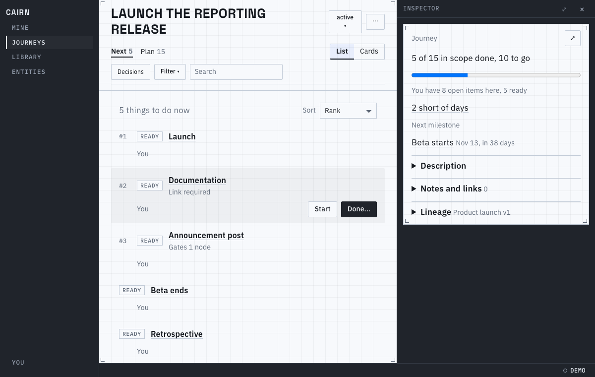
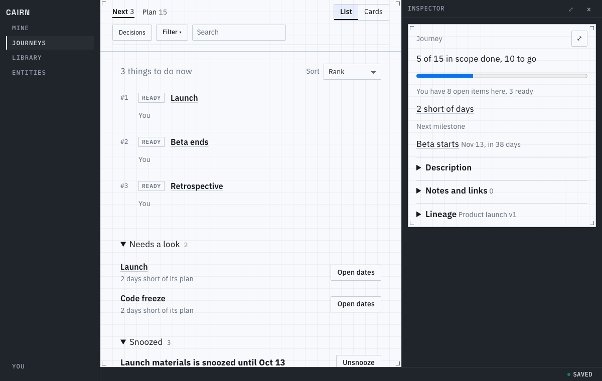
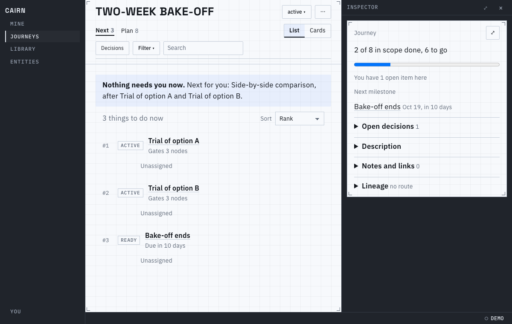
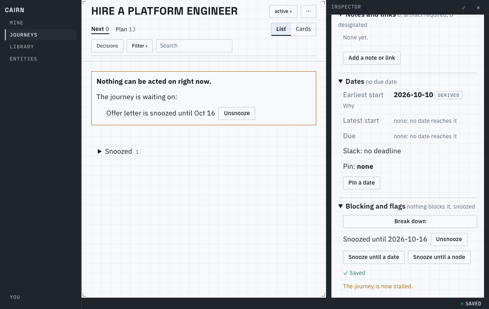
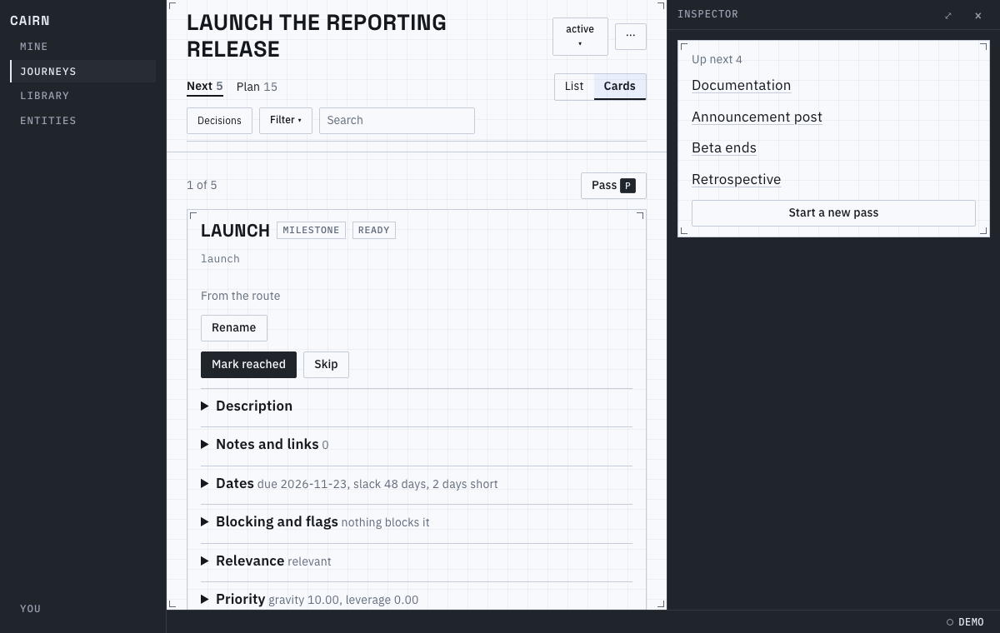
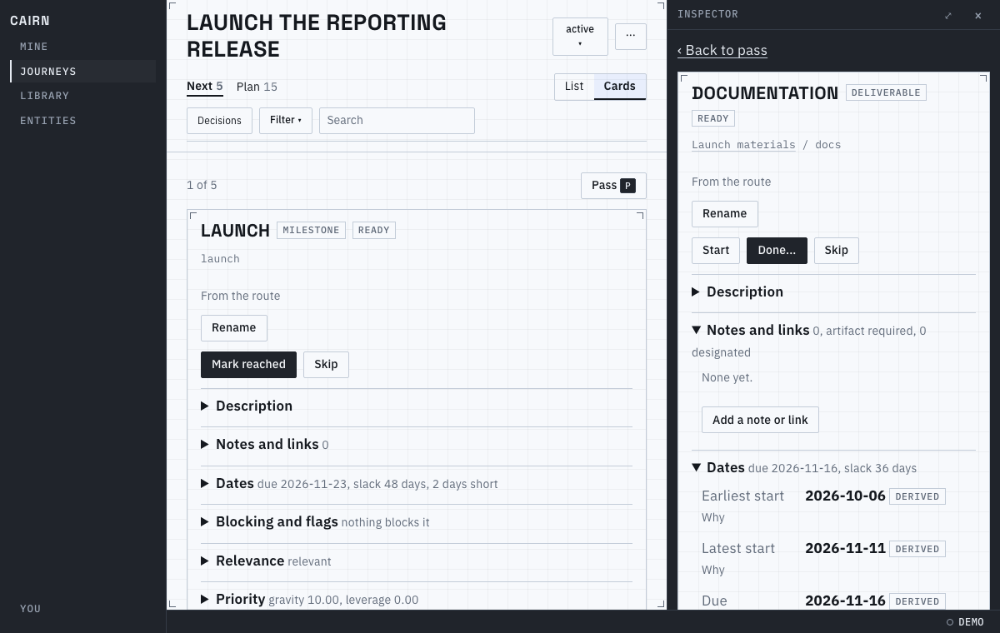
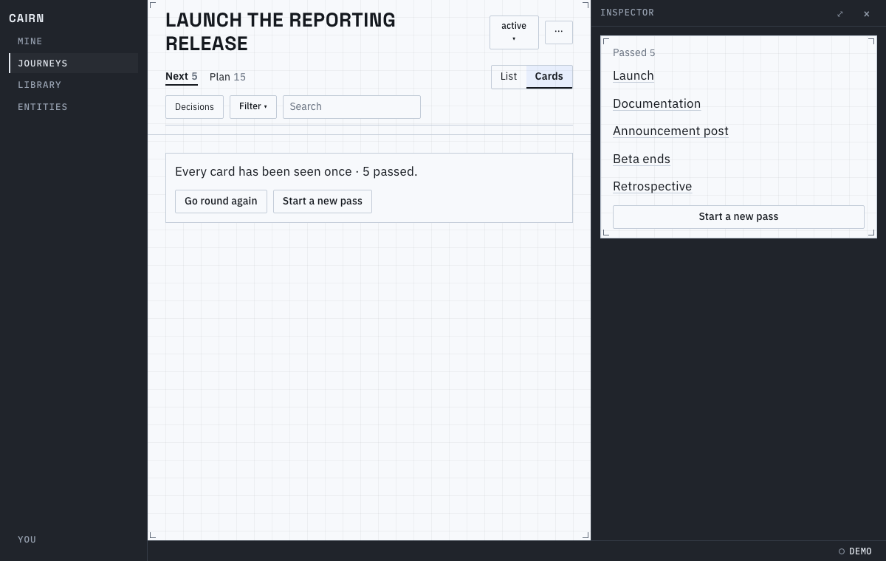
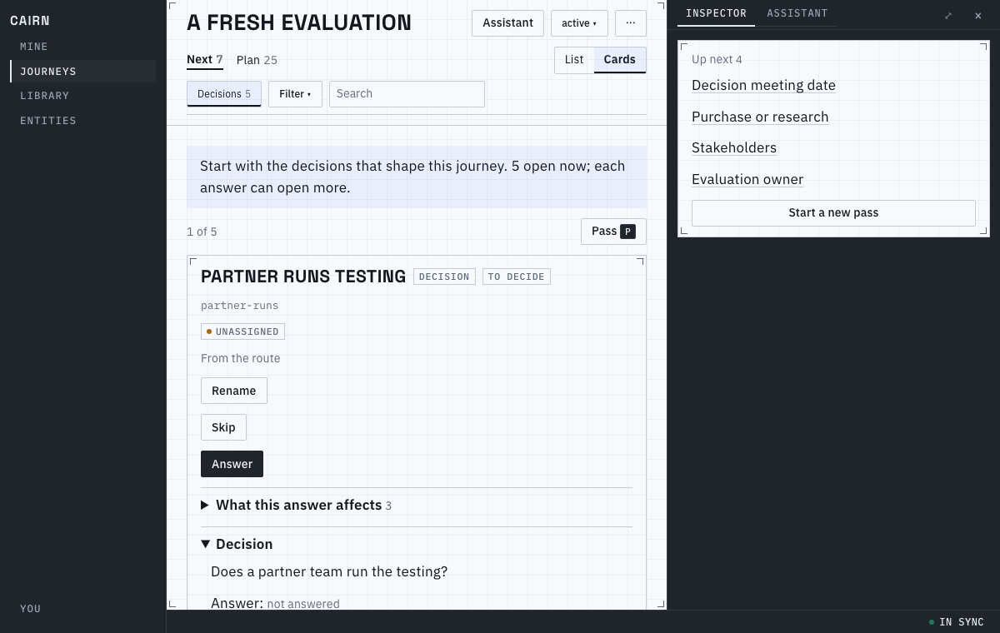
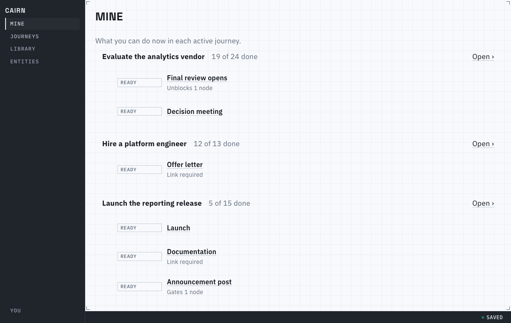

# Proof for brief 8.9: Next page

The Next page is one ranked list where each row says one thing, acts in one click, and opens
the inspector for the rest. Its cards project the node's own panel, one at a time, with a rail
for the pass beside it. Mine reuses the same rows across journeys.

## The list

Each row is a status chip, the title, and one fact in words: why it ranks where it does
("Gates 1 node", "2 days late"), or what it needs ("Link required"); a row that holds nothing
up and has no date says nothing. The top three carry a rank tag. The owner ("You", or a quiet
"Unassigned" that becomes a picker) and the primary action
(Done, or Done... when a note or link is needed first; Start; Mark reached; Decide) show on
hover or selection, and a click or `j` and `k` open the inspector. Hovering never moves a row.

## Folds

Below the list, closed with their counts: what needs a look (each with its fix inline) and
what is snoozed, grouped by the snooze that holds it.

## When nothing is actionable

A viewer whose own work is all waiting gets one line naming what is theirs next and what it
waits on. When the whole frontier is empty, the stalled diagnostic replaces the list, with
Unsnooze.

## Cards and the pass

A card is the node's inspector panel at a readable width with its sections folded; Pass and
the card's place in the pass sit on its top edge, apart from the node's own actions. Work that
needs a note or a link has Done... there too, in place of a Complete the engine would reject. The inspector column holds the
pass rail (a fold above the card on narrow screens); a node opened from it replaces the rail,
with a way back. At the end, the pass says
every card has been seen once and offers to go round again or start a new pass.

## The walkthrough and Mine

A new journey opens on the decisions, with a line saying how many are open. Mine groups the
viewer's rows by journey (alphabetical, each in its own rank) and answers a decision in the
inspector without opening the journey.

A short video of a walkthrough pass: [a-walkthrough-pass.webm](a-walkthrough-pass.webm).

`prove.sh` regenerates every picture and the video.

## Known limits

- Undo on receipts, rows that collapse in place when someone else finishes them, and a
  "new" bar for arriving rows are later, additive work; rows update in place.
- Cards use the current node panel; they pick up the inspector's changes when that lands.
